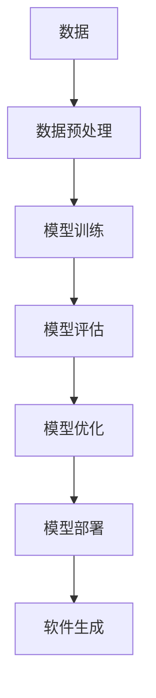

                 

# 软件 2.0 的时代：数据驱动一切

> 关键词：软件2.0, 数据驱动, 机器学习, 深度学习, 自动化, 人工智能

> 摘要：本文旨在探讨软件2.0时代的到来，以及数据驱动在软件开发中的重要性。通过分析软件2.0的核心概念、算法原理、数学模型、实际应用场景、工具资源推荐等方面，帮助读者理解软件2.0的本质，并展望其未来的发展趋势与挑战。

## 1. 背景介绍

### 1.1 软件1.0时代

在软件1.0时代，软件开发主要依赖于程序员手动编写代码，通过逻辑和算法来实现特定的功能。这一过程通常包括需求分析、设计、编码、测试和维护等阶段。软件1.0时代的软件开发模式强调的是代码的可读性、可维护性和可扩展性，而这些特性往往需要大量的时间和人力成本。

### 1.2 软件2.0时代的到来

随着大数据、云计算和人工智能技术的发展，软件开发模式正在经历一场革命。软件2.0时代，软件不再是通过传统的编程语言来实现，而是通过数据驱动的方式，利用机器学习和深度学习等技术，让计算机自动学习和生成代码。这种模式不仅提高了软件开发的效率，还使得软件能够更好地适应复杂多变的环境。

## 2. 核心概念与联系

### 2.1 软件2.0的核心概念

软件2.0的核心概念是数据驱动。在软件2.0时代，软件开发不再依赖于程序员手动编写代码，而是通过大量的数据训练机器学习模型，让模型自动学习和生成代码。这种模式不仅提高了软件开发的效率，还使得软件能够更好地适应复杂多变的环境。

### 2.2 核心概念原理和架构

软件2.0的核心概念原理和架构如下：

- 数据驱动：通过大量的数据训练机器学习模型，让模型自动学习和生成代码。
- 自动化：软件开发过程中的许多步骤可以自动化完成，减少了人工干预。
- 适应性：软件能够更好地适应复杂多变的环境，提高软件的灵活性和适应性。

Mermaid 流程图：



## 3. 核心算法原理 & 具体操作步骤

### 3.1 核心算法原理

软件2.0的核心算法原理是机器学习和深度学习。机器学习是一种让计算机通过学习数据来改进其性能的技术，而深度学习则是机器学习的一种特殊形式，它通过多层神经网络来模拟人脑的工作方式，从而实现更复杂的任务。

### 3.2 具体操作步骤

1. 数据收集：收集大量的数据，这些数据可以是文本、图像、声音等。
2. 数据预处理：对收集到的数据进行清洗、归一化等预处理操作。
3. 模型训练：使用预处理后的数据训练机器学习模型。
4. 模型评估：评估模型的性能，确保模型能够准确地完成任务。
5. 模型优化：根据评估结果优化模型，提高模型的性能。
6. 模型部署：将优化后的模型部署到生产环境中，生成软件。

## 4. 数学模型和公式 & 详细讲解 & 举例说明

### 4.1 数学模型和公式

在软件2.0中，常用的数学模型包括线性回归、逻辑回归、支持向量机、决策树、随机森林、神经网络等。这些模型的数学公式如下：

- 线性回归：$y = \beta_0 + \beta_1x_1 + \beta_2x_2 + ... + \beta_nx_n$
- 逻辑回归：$P(y=1|x) = \frac{1}{1 + e^{-(\beta_0 + \beta_1x_1 + \beta_2x_2 + ... + \beta_nx_n)}}$
- 支持向量机：$y = \sum_{i=1}^{N} \alpha_i y_i K(x_i, x) + b$
- 决策树：$T(x) = \arg\max_{c \in C} P(c|x)$
- 随机森林：$T(x) = \arg\max_{c \in C} \frac{1}{N} \sum_{i=1}^{N} P(c|x_i)$
- 神经网络：$y = f(Wx + b)$

### 4.2 详细讲解

线性回归是一种简单的回归模型，它假设输入和输出之间存在线性关系。逻辑回归是一种分类模型，它假设输入和输出之间存在逻辑关系。支持向量机是一种分类模型，它通过找到一个超平面来将不同类别的数据分开。决策树是一种分类模型，它通过构建一棵树来对数据进行分类。随机森林是一种集成学习模型，它通过构建多棵决策树来提高模型的性能。神经网络是一种复杂的模型，它通过多层神经网络来模拟人脑的工作方式。

### 4.3 举例说明

假设我们有一个数据集，其中包含了一些人的年龄、性别、收入等信息，以及他们是否购买了一款产品。我们可以使用逻辑回归模型来预测一个人是否会购买这款产品。首先，我们需要对数据进行预处理，然后使用逻辑回归模型进行训练，最后使用训练好的模型进行预测。

## 5. 项目实战：代码实际案例和详细解释说明

### 5.1 开发环境搭建

为了进行软件2.0的开发，我们需要搭建一个开发环境。首先，我们需要安装Python和相关的库，如NumPy、Pandas、Scikit-learn等。然后，我们需要安装深度学习框架，如TensorFlow或PyTorch。最后，我们需要安装一些工具，如Jupyter Notebook或VS Code。

### 5.2 源代码详细实现和代码解读

假设我们有一个数据集，其中包含了一些人的年龄、性别、收入等信息，以及他们是否购买了一款产品。我们可以使用逻辑回归模型来预测一个人是否会购买这款产品。以下是源代码的详细实现：

```python
import numpy as np
import pandas as pd
from sklearn.model_selection import train_test_split
from sklearn.linear_model import LogisticRegression
from sklearn.metrics import accuracy_score

# 加载数据集
data = pd.read_csv('data.csv')

# 数据预处理
X = data[['age', 'gender', 'income']]
y = data['purchase']

# 划分训练集和测试集
X_train, X_test, y_train, y_test = train_test_split(X, y, test_size=0.2, random_state=42)

# 训练模型
model = LogisticRegression()
model.fit(X_train, y_train)

# 预测
y_pred = model.predict(X_test)

# 评估模型
accuracy = accuracy_score(y_test, y_pred)
print('Accuracy:', accuracy)
```

### 5.3 代码解读与分析

在上述代码中，我们首先加载了数据集，并进行了数据预处理。然后，我们使用了逻辑回归模型进行训练，并使用训练好的模型进行了预测。最后，我们评估了模型的性能，计算了模型的准确率。

## 6. 实际应用场景

软件2.0的应用场景非常广泛，包括但不限于以下领域：

- 金融：通过分析大量的金融数据，预测股票价格、贷款违约率等。
- 医疗：通过分析大量的医疗数据，预测疾病的发生、诊断疾病等。
- 交通：通过分析大量的交通数据，预测交通流量、优化交通路线等。
- 教育：通过分析大量的教育数据，预测学生的学习成绩、推荐学习资源等。

## 7. 工具和资源推荐

### 7.1 学习资源推荐

- 书籍：《深度学习》（Ian Goodfellow等著）
- 论文：《Deep Learning for Computer Vision》（Yoshua Bengio等著）
- 博客：《机器之心》（机器之心团队运营）
- 网站：Coursera（提供机器学习和深度学习课程）

### 7.2 开发工具框架推荐

- TensorFlow：由Google开发的深度学习框架。
- PyTorch：由Facebook开发的深度学习框架。
- Keras：基于TensorFlow的高级神经网络API。

### 7.3 相关论文著作推荐

- 《深度学习》（Ian Goodfellow等著）
- 《Deep Learning for Computer Vision》（Yoshua Bengio等著）

## 8. 总结：未来发展趋势与挑战

软件2.0的发展趋势是数据驱动和自动化。随着大数据、云计算和人工智能技术的发展，软件开发将更加依赖于数据驱动的方式，通过机器学习和深度学习等技术，让计算机自动学习和生成代码。同时，软件开发过程中的许多步骤将被自动化，减少人工干预，提高软件开发的效率。然而，软件2.0也面临着一些挑战，如数据隐私、模型解释性、模型泛化能力等。

## 9. 附录：常见问题与解答

### 9.1 什么是软件2.0？

软件2.0是指通过数据驱动的方式，利用机器学习和深度学习等技术，让计算机自动学习和生成代码的软件开发模式。

### 9.2 软件2.0与软件1.0的区别是什么？

软件1.0依赖于程序员手动编写代码，而软件2.0通过数据驱动的方式，利用机器学习和深度学习等技术，让计算机自动学习和生成代码。

### 9.3 软件2.0有哪些应用场景？

软件2.0的应用场景非常广泛，包括但不限于金融、医疗、交通、教育等领域。

## 10. 扩展阅读 & 参考资料

- 书籍：《深度学习》（Ian Goodfellow等著）
- 论文：《Deep Learning for Computer Vision》（Yoshua Bengio等著）
- 博客：《机器之心》（机器之心团队运营）
- 网站：Coursera（提供机器学习和深度学习课程）

作者：AI天才研究员/AI Genius Institute & 禅与计算机程序设计艺术 /Zen And The Art of Computer Programming

