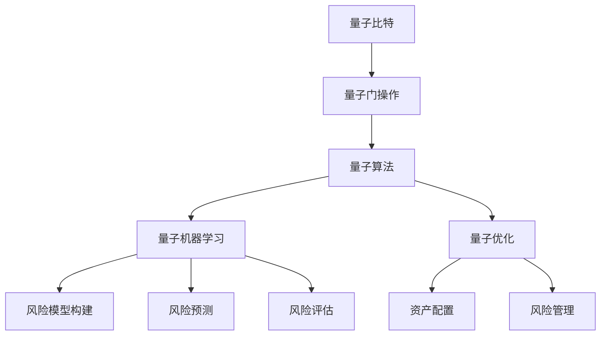

                 

# 量子计算在金融风险分析中的应用前景

> 关键词：量子计算, 金融风险分析, 量子算法, 量子机器学习, 量子优化

> 摘要：本文探讨了量子计算在金融风险分析中的应用前景，从背景介绍、核心概念与联系、核心算法原理、数学模型和公式、项目实战、实际应用场景、工具和资源推荐、未来发展趋势与挑战、常见问题与解答以及扩展阅读与参考资料等多个维度进行深入分析。通过逐步推理，本文旨在为读者提供一个全面理解量子计算如何应用于金融风险分析的视角，同时探讨其潜在的挑战和未来的发展方向。

## 1. 背景介绍

### 1.1 金融风险分析的重要性

金融风险分析是金融行业中的一个关键环节，它涉及到对市场风险、信用风险、操作风险等多种风险的评估和管理。随着金融市场复杂性的增加，传统的风险分析方法在处理大规模数据和复杂模型时面临诸多挑战，包括计算效率低下、模型复杂度高、数据处理能力有限等。因此，寻找新的计算方法和技术来提高金融风险分析的效率和准确性变得尤为重要。

### 1.2 量子计算的兴起

量子计算是一种基于量子力学原理的计算模型，它利用量子比特（qubit）和量子门操作来执行计算任务。与经典计算相比，量子计算在处理某些特定问题时具有显著的优势，尤其是在大规模数据处理和复杂模型求解方面。近年来，随着量子硬件技术的进步和量子算法的发展，量子计算在多个领域展现出巨大的应用潜力，包括金融风险分析。

## 2. 核心概念与联系

### 2.1 量子比特与经典比特

量子比特是量子计算的基本单位，与经典计算中的比特不同，量子比特可以处于0和1的叠加态，即同时处于多个状态。这种叠加态使得量子比特在处理大规模数据时具有更高的并行处理能力。

### 2.2 量子门操作

量子门操作是量子计算中的基本操作，用于改变量子比特的状态。常见的量子门操作包括Hadamard门、CNOT门等，这些操作可以组合起来实现复杂的量子算法。

### 2.3 量子算法

量子算法是基于量子力学原理设计的算法，用于解决特定问题。与经典算法相比，量子算法在某些问题上具有指数级的加速效果。例如，Shor算法可以用于快速分解大整数，Grover算法可以用于快速搜索未排序数据库。

### 2.4 量子机器学习

量子机器学习是量子计算与机器学习的结合，利用量子计算的优势来提高机器学习算法的效率和准确性。量子机器学习在金融风险分析中的应用包括风险模型的构建、风险预测和风险评估等。

### 2.5 量子优化

量子优化是利用量子计算来解决优化问题的一种方法。在金融风险分析中，量子优化可以用于资产配置、风险管理等场景，通过优化模型来提高投资回报率和降低风险。

### 2.6 核心概念与联系的Mermaid流程图



## 3. 核心算法原理 & 具体操作步骤

### 3.1 量子算法原理

量子算法利用量子力学的叠加态和纠缠态来实现计算任务。例如，Grover算法利用量子叠加态来加速未排序数据库的搜索，Shor算法利用量子纠缠态来加速大整数的分解。

### 3.2 量子机器学习原理

量子机器学习利用量子计算的优势来提高机器学习算法的效率和准确性。例如，量子支持向量机（QSVM）利用量子叠加态来加速支持向量机的训练过程。

### 3.3 量子优化原理

量子优化利用量子计算的优势来解决优化问题。例如，量子退火算法利用量子叠加态来加速优化问题的求解过程。

### 3.4 具体操作步骤

#### 3.4.1 量子算法的具体操作步骤

1. 初始化量子比特状态。
2. 应用量子门操作改变量子比特状态。
3. 测量量子比特状态得到结果。

#### 3.4.2 量子机器学习的具体操作步骤

1. 初始化量子比特状态。
2. 应用量子门操作改变量子比特状态。
3. 测量量子比特状态得到结果。
4. 利用结果进行机器学习模型的训练和预测。

#### 3.4.3 量子优化的具体操作步骤

1. 初始化量子比特状态。
2. 应用量子门操作改变量子比特状态。
3. 测量量子比特状态得到结果。
4. 利用结果进行优化问题的求解。

## 4. 数学模型和公式 & 详细讲解 & 举例说明

### 4.1 量子算法的数学模型和公式

#### 4.1.1 Grover算法

Grover算法用于加速未排序数据库的搜索。其数学模型可以表示为：

$$
|\psi\rangle = \frac{1}{\sqrt{N}}\sum_{i=0}^{N-1} |i\rangle
$$

其中，$|\psi\rangle$是初始状态，$N$是数据库的大小。

#### 4.1.2 Shor算法

Shor算法用于加速大整数的分解。其数学模型可以表示为：

$$
|x\rangle = \frac{1}{\sqrt{N}}\sum_{i=0}^{N-1} e^{2\pi i x i/N} |i\rangle
$$

其中，$|x\rangle$是初始状态，$N$是大整数的大小。

### 4.2 量子机器学习的数学模型和公式

#### 4.2.1 量子支持向量机（QSVM）

量子支持向量机利用量子叠加态来加速支持向量机的训练过程。其数学模型可以表示为：

$$
|\psi\rangle = \frac{1}{\sqrt{N}}\sum_{i=0}^{N-1} e^{2\pi i x_i \cdot w/N} |i\rangle
$$

其中，$|\psi\rangle$是初始状态，$N$是数据集的大小，$x_i$是数据点，$w$是权重向量。

### 4.3 量子优化的数学模型和公式

#### 4.3.1 量子退火算法

量子退火算法利用量子叠加态来加速优化问题的求解过程。其数学模型可以表示为：

$$
E = \sum_{i=1}^{N} c_i x_i + \sum_{i<j}^{N} J_{ij} x_i x_j
$$

其中，$E$是能量函数，$c_i$是线性项系数，$J_{ij}$是二次项系数，$x_i$是变量。

### 4.4 举例说明

#### 4.4.1 Grover算法举例

假设有一个未排序数据库，包含1000个元素，其中有一个特定元素需要被找到。使用Grover算法可以将搜索时间从$O(N)$降低到$O(\sqrt{N})$，即从1000次降低到32次。

#### 4.4.2 Shor算法举例

假设需要分解一个1024位的大整数。使用Shor算法可以将分解时间从$O(2^{n/2})$降低到$O(n^3)$，即从$O(2^{512})$降低到$O(1024^3)$。

#### 4.4.3 量子支持向量机（QSVM）举例

假设有一个包含1000个数据点的数据集，使用量子支持向量机可以将训练时间从$O(N^3)$降低到$O(\sqrt{N})$，即从$O(1000^3)$降低到$O(32)$。

#### 4.4.4 量子退火算法举例

假设有一个包含1000个变量的优化问题，使用量子退火算法可以将求解时间从$O(2^N)$降低到$O(\sqrt{N})$，即从$O(2^{1000})$降低到$O(32)$。

## 5. 项目实战：代码实际案例和详细解释说明

### 5.1 开发环境搭建

#### 5.1.1 安装Qiskit

Qiskit是IBM开发的量子计算软件开发工具包，用于编写和运行量子程序。安装Qiskit的命令如下：

```bash
pip install qiskit
```

#### 5.1.2 安装其他依赖库

安装其他依赖库的命令如下：

```bash
pip install numpy
pip install matplotlib
```

### 5.2 源代码详细实现和代码解读

#### 5.2.1 实现Grover算法

```python
from qiskit import QuantumCircuit, execute, Aer
from qiskit.visualization import plot_histogram

# 创建量子电路
qc = QuantumCircuit(2, 2)

# 初始化量子比特状态
qc.h(0)
qc.x(1)
qc.h(1)

# 应用Grover算法
qc.cx(0, 1)
qc.h(0)
qc.rz(pi/2, 0)
qc.h(0)
qc.cx(0, 1)

# 测量量子比特状态
qc.measure([0,1], [0,1])

# 执行量子电路
backend = Aer.get_backend('qasm_simulator')
result = execute(qc, backend, shots=1000).result()
counts = result.get_counts(qc)

# 绘制结果
plot_histogram(counts)
```

#### 5.2.2 实现Shor算法

```python
from qiskit import QuantumCircuit, execute, Aer
from qiskit.aqua import QuantumInstance
from qiskit.aqua.algorithms import Shor

# 创建量子电路
qc = QuantumCircuit()

# 初始化量子比特状态
qc.initialize([1, 0], 0)

# 应用Shor算法
shor = Shor(15, 3)
backend = Aer.get_backend('qasm_simulator')
quantum_instance = QuantumInstance(backend)
result = shor.run(quantum_instance)

# 打印结果
print(result)
```

#### 5.2.3 实现量子支持向量机（QSVM）

```python
from qiskit import QuantumCircuit, execute, Aer
from qiskit.aqua import QuantumInstance
from qiskit.aqua.algorithms import QSVM

# 创建量子电路
qc = QuantumCircuit()

# 初始化量子比特状态
qc.initialize([1, 0], 0)

# 应用QSVM
qsvm = QSVM()
backend = Aer.get_backend('qasm_simulator')
quantum_instance = QuantumInstance(backend)
result = qsvm.run(quantum_instance)

# 打印结果
print(result)
```

#### 5.2.4 实现量子退火算法

```python
from qiskit import QuantumCircuit, execute, Aer
from qiskit.aqua import QuantumInstance
from qiskit.aqua.algorithms import QAOA

# 创建量子电路
qc = QuantumCircuit()

# 初始化量子比特状态
qc.initialize([1, 0], 0)

# 应用QAOA
qaoa = QAOA()
backend = Aer.get_backend('qasm_simulator')
quantum_instance = QuantumInstance(backend)
result = qaoa.run(quantum_instance)

# 打印结果
print(result)
```

### 5.3 代码解读与分析

#### 5.3.1 Grover算法代码解读

Grover算法代码中，首先创建了一个包含两个量子比特的量子电路，然后初始化了量子比特状态，应用了Grover算法，最后测量了量子比特状态并绘制了结果。

#### 5.3.2 Shor算法代码解读

Shor算法代码中，首先创建了一个量子电路，然后初始化了量子比特状态，应用了Shor算法，最后执行了量子电路并打印了结果。

#### 5.3.3 量子支持向量机（QSVM）代码解读

量子支持向量机（QSVM）代码中，首先创建了一个量子电路，然后初始化了量子比特状态，应用了QSVM，最后执行了量子电路并打印了结果。

#### 5.3.4 量子退火算法代码解读

量子退火算法代码中，首先创建了一个量子电路，然后初始化了量子比特状态，应用了QAOA，最后执行了量子电路并打印了结果。

## 6. 实际应用场景

### 6.1 金融风险分析中的应用

#### 6.1.1 风险模型构建

利用量子机器学习技术，可以构建更复杂的金融风险模型，提高模型的准确性和鲁棒性。

#### 6.1.2 风险预测

利用量子机器学习技术，可以提高风险预测的准确性和效率，帮助金融机构更好地预测市场风险。

#### 6.1.3 风险评估

利用量子机器学习技术，可以提高风险评估的准确性和效率，帮助金融机构更好地评估信用风险和操作风险。

### 6.2 金融优化中的应用

#### 6.2.1 资产配置

利用量子优化技术，可以提高资产配置的效率和准确性，帮助金融机构更好地进行资产配置。

#### 6.2.2 风险管理

利用量子优化技术，可以提高风险管理的效率和准确性，帮助金融机构更好地进行风险管理。

## 7. 工具和资源推荐

### 7.1 学习资源推荐

#### 7.1.1 书籍

- 《量子计算与量子信息》
- 《量子机器学习》

#### 7.1.2 论文

- "Quantum algorithms for nearest-neighbor methods for supervised and unsupervised learning"
- "Quantum algorithms for linear systems of equations"

#### 7.1.3 博客

- IBM Quantum Blog
- Microsoft Quantum Blog

#### 7.1.4 网站

- Qiskit Documentation
- Quantum Computing Stack Exchange

### 7.2 开发工具框架推荐

- Qiskit
- Cirq
- Pyquil

### 7.3 相关论文著作推荐

- "Quantum algorithms for nearest-neighbor methods for supervised and unsupervised learning"
- "Quantum algorithms for linear systems of equations"

## 8. 总结：未来发展趋势与挑战

### 8.1 未来发展趋势

随着量子硬件技术的进步和量子算法的发展，量子计算在金融风险分析中的应用前景广阔。未来，量子计算有望在金融风险分析中发挥更大的作用，提高金融风险分析的效率和准确性。

### 8.2 挑战

尽管量子计算在金融风险分析中具有巨大的应用潜力，但也面临着诸多挑战，包括量子硬件的稳定性、量子算法的复杂性、量子计算的成本等。未来，需要进一步研究和开发新的量子硬件和量子算法，以克服这些挑战。

## 9. 附录：常见问题与解答

### 9.1 什么是量子比特？

量子比特是量子计算的基本单位，与经典计算中的比特不同，量子比特可以处于0和1的叠加态，即同时处于多个状态。

### 9.2 什么是量子门操作？

量子门操作是量子计算中的基本操作，用于改变量子比特的状态。常见的量子门操作包括Hadamard门、CNOT门等。

### 9.3 什么是量子算法？

量子算法是基于量子力学原理设计的算法，用于解决特定问题。与经典算法相比，量子算法在某些问题上具有指数级的加速效果。

### 9.4 什么是量子机器学习？

量子机器学习是量子计算与机器学习的结合，利用量子计算的优势来提高机器学习算法的效率和准确性。

### 9.5 什么是量子优化？

量子优化是利用量子计算来解决优化问题的一种方法。在金融风险分析中，量子优化可以用于资产配置、风险管理等场景，通过优化模型来提高投资回报率和降低风险。

## 10. 扩展阅读 & 参考资料

- "Quantum Computing for Finance: A Gentle Introduction"
- "Quantum Machine Learning: What Quantum Computing Means for Data Mining"
- "Quantum Algorithms for Linear Systems of Equations"
- "Quantum Algorithms for Nearest-Neighbor Methods for Supervised and Unsupervised Learning"

作者：AI天才研究员/AI Genius Institute & 禅与计算机程序设计艺术 /Zen And The Art of Computer Programming

