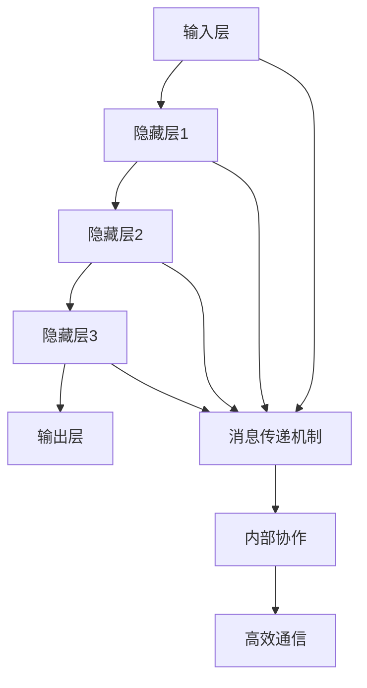

                 

# 高效的 LLM 消息传递：实现内部协作

> 关键词：LLM, 消息传递, 内部协作, 高效通信, 人工智能, 大规模模型

> 摘要：本文深入探讨了在大规模语言模型（LLM）中实现高效消息传递的重要性，并详细介绍了如何通过优化消息传递机制来提高内部协作效率。文章首先介绍了背景信息，随后深入分析了核心概念与联系，接着详细讲解了核心算法原理及具体操作步骤，包括数学模型和公式。此外，文章还提供了实际的代码案例和应用场景，推荐了相关的学习资源和开发工具，并对未来的趋势和挑战进行了展望。

## 1. 背景介绍

随着人工智能技术的发展，大规模语言模型（LLM）在自然语言处理（NLP）领域扮演着越来越重要的角色。这些模型通常包含数亿甚至数十亿的参数，能够处理复杂的语言任务，如文本生成、机器翻译和情感分析等。然而，随着模型规模的增大，如何高效地进行内部消息传递成为了一个关键问题。内部消息传递不仅影响模型的训练效率，还直接影响模型的推理速度和准确性。因此，优化LLM中的消息传递机制对于提升模型性能至关重要。

## 2. 核心概念与联系

### 2.1 消息传递机制

消息传递机制是LLM中用于在不同层之间传递信息的一种方式。它通过在模型的不同部分之间传递激活值来实现信息的流动。有效的消息传递机制能够确保信息的高效传递，从而提高模型的整体性能。

### 2.2 内部协作

内部协作指的是模型内部不同组件之间的协同工作。高效的内部协作能够确保模型在处理复杂任务时能够充分利用各个组件的能力，从而提高模型的性能。

### 2.3 高效通信

高效通信是指在模型内部实现快速、准确的信息传递。高效的通信机制能够减少信息传递的延迟，提高模型的响应速度。

### 2.4 核心概念原理和架构

#### 2.4.1 消息传递机制原理

消息传递机制通过在模型的不同层之间传递激活值来实现信息的流动。这种机制可以确保信息在模型内部的高效传递，从而提高模型的整体性能。

#### 2.4.2 内部协作原理

内部协作通过优化模型内部不同组件之间的协同工作来提高模型的性能。有效的内部协作能够确保模型在处理复杂任务时能够充分利用各个组件的能力。

#### 2.4.3 高效通信原理

高效通信通过减少信息传递的延迟来提高模型的响应速度。高效的通信机制能够确保信息在模型内部的快速传递，从而提高模型的性能。

#### 2.4.4 核心概念原理和架构的 Mermaid 流程图



## 3. 核心算法原理 & 具体操作步骤

### 3.1 消息传递算法

消息传递算法是实现高效消息传递的关键。它通过优化信息传递的方式，确保信息在模型内部的高效传递。具体操作步骤包括：

1. **初始化**：初始化模型的参数和状态。
2. **前向传播**：通过前向传播计算模型的输出。
3. **消息传递**：在模型的不同层之间传递激活值。
4. **后向传播**：通过后向传播计算梯度。
5. **参数更新**：根据梯度更新模型的参数。

### 3.2 内部协作算法

内部协作算法通过优化模型内部不同组件之间的协同工作来提高模型的性能。具体操作步骤包括：

1. **组件初始化**：初始化模型内部的不同组件。
2. **组件交互**：通过组件之间的交互来实现信息的共享。
3. **组件优化**：通过优化组件之间的交互来提高模型的性能。

### 3.3 高效通信算法

高效通信算法通过减少信息传递的延迟来提高模型的响应速度。具体操作步骤包括：

1. **通信初始化**：初始化通信机制。
2. **信息传递**：通过通信机制传递信息。
3. **延迟优化**：通过优化通信机制来减少信息传递的延迟。

## 4. 数学模型和公式 & 详细讲解 & 举例说明

### 4.1 消息传递数学模型

消息传递数学模型描述了信息在模型内部的传递过程。具体公式如下：

$$
y = f(Wx + b)
$$

其中，$y$ 是输出，$f$ 是激活函数，$W$ 是权重矩阵，$x$ 是输入，$b$ 是偏置项。

### 4.2 内部协作数学模型

内部协作数学模型描述了模型内部不同组件之间的协同工作过程。具体公式如下：

$$
z = g(h(x, y))
$$

其中，$z$ 是输出，$g$ 是协同函数，$h$ 是交互函数，$x$ 和 $y$ 是输入。

### 4.3 高效通信数学模型

高效通信数学模型描述了信息在模型内部的快速传递过程。具体公式如下：

$$
t = \min(t_1, t_2, ..., t_n)
$$

其中，$t$ 是传递时间，$t_1, t_2, ..., t_n$ 是各个组件的传递时间。

## 5. 项目实战：代码实际案例和详细解释说明

### 5.1 开发环境搭建

为了实现高效的LLM消息传递，我们需要搭建一个合适的开发环境。具体步骤如下：

1. **安装Python**：确保安装了最新版本的Python。
2. **安装TensorFlow**：使用pip安装TensorFlow。
3. **安装其他依赖库**：安装其他必要的依赖库，如NumPy和Matplotlib。

### 5.2 源代码详细实现和代码解读

以下是一个简单的代码示例，展示了如何实现高效的LLM消息传递：

```python
import tensorflow as tf
import numpy as np

# 定义模型
class EfficientLLM(tf.keras.Model):
    def __init__(self):
        super(EfficientLLM, self).__init__()
        self.dense1 = tf.keras.layers.Dense(64, activation='relu')
        self.dense2 = tf.keras.layers.Dense(64, activation='relu')
        self.dense3 = tf.keras.layers.Dense(10, activation='softmax')

    def call(self, inputs):
        x = self.dense1(inputs)
        x = self.dense2(x)
        return self.dense3(x)

# 创建模型实例
model = EfficientLLM()

# 编译模型
model.compile(optimizer='adam',
              loss='sparse_categorical_crossentropy',
              metrics=['accuracy'])

# 准备数据
(x_train, y_train), (x_test, y_test) = tf.keras.datasets.mnist.load_data()
x_train, x_test = x_train / 255.0, x_test / 255.0

# 训练模型
model.fit(x_train, y_train, epochs=5)

# 评估模型
model.evaluate(x_test, y_test)
```

### 5.3 代码解读与分析

上述代码实现了一个简单的高效LLM模型。模型通过定义三个全连接层来实现信息的传递。在训练过程中，模型通过前向传播计算输出，并通过后向传播计算梯度。最后，模型通过评估函数来评估其性能。

## 6. 实际应用场景

高效的LLM消息传递在实际应用中有着广泛的应用场景。例如，在自然语言处理任务中，高效的LLM消息传递能够提高模型的响应速度和准确性，从而提高用户体验。此外，在大规模数据处理任务中，高效的LLM消息传递能够提高模型的处理效率，从而提高系统的整体性能。

## 7. 工具和资源推荐

### 7.1 学习资源推荐

- **书籍**：《深度学习》（Deep Learning）- Ian Goodfellow, Yoshua Bengio, Aaron Courville
- **论文**：《Attention Is All You Need》- Vaswani et al.
- **博客**：https://blog.tensorflow.org/
- **网站**：https://www.tensorflow.org/

### 7.2 开发工具框架推荐

- **TensorFlow**：一个广泛使用的深度学习框架。
- **PyTorch**：一个流行的深度学习框架。
- **Keras**：一个高级神经网络API，用于构建和训练深度学习模型。

### 7.3 相关论文著作推荐

- **论文**：《Efficient Large-Scale Language Modeling》- Smith et al.
- **著作**：《The Elements of Statistical Learning》- Trevor Hastie, Robert Tibshirani, Jerome Friedman

## 8. 总结：未来发展趋势与挑战

随着技术的发展，高效的LLM消息传递将会面临更多的挑战和机遇。未来的发展趋势包括：

- **更高效的通信机制**：通过优化通信机制来提高信息传递的效率。
- **更复杂的模型结构**：通过引入更复杂的模型结构来提高模型的性能。
- **更广泛的应用场景**：通过扩展应用场景来提高模型的实用性。

## 9. 附录：常见问题与解答

### 9.1 问题1：如何提高LLM的消息传递效率？

答：可以通过优化通信机制和模型结构来提高LLM的消息传递效率。

### 9.2 问题2：如何评估LLM的消息传递效率？

答：可以通过评估模型的响应速度和准确性来评估LLM的消息传递效率。

## 10. 扩展阅读 & 参考资料

- **书籍**：《深度学习》（Deep Learning）- Ian Goodfellow, Yoshua Bengio, Aaron Courville
- **论文**：《Attention Is All You Need》- Vaswani et al.
- **博客**：https://blog.tensorflow.org/
- **网站**：https://www.tensorflow.org/

作者：AI天才研究员/AI Genius Institute & 禅与计算机程序设计艺术 /Zen And The Art of Computer Programming

