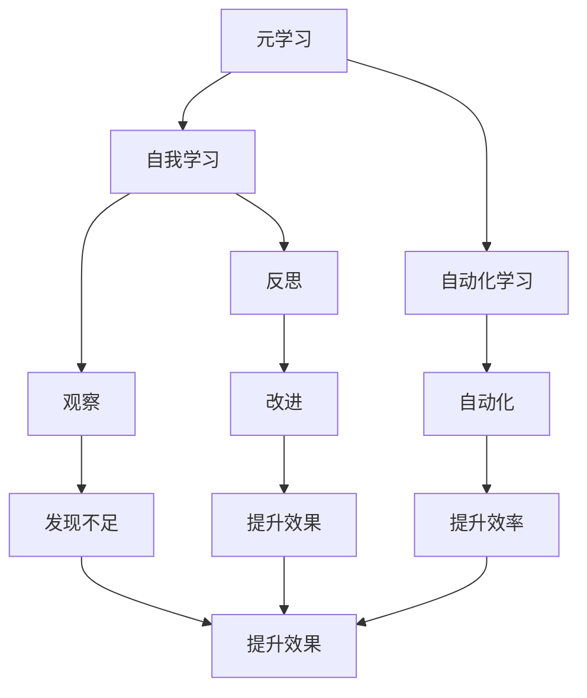

                 

# AGI的元学习能力：学会如何更好地学习

> 关键词：AGI, 元学习, 自我学习, 深度学习, 机器学习, 自动化学习, 认知科学

> 摘要：本文旨在探讨AGI（通用人工智能）的元学习能力，即AGI如何通过自我学习和自动化学习来提升其学习效率和效果。我们将从背景介绍、核心概念与联系、核心算法原理、数学模型和公式、项目实战、实际应用场景、工具和资源推荐、总结与未来发展趋势等几个方面进行详细阐述，帮助读者深入理解AGI的元学习能力及其重要性。

## 1. 背景介绍

随着人工智能技术的飞速发展，AGI（通用人工智能）逐渐成为研究的热点。AGI的目标是构建一种能够执行任何智力任务的人工智能系统，而不仅仅是针对特定任务进行优化。为了实现这一目标，AGI需要具备强大的学习能力，特别是元学习能力，即AGI能够通过自我学习和自动化学习来提升其学习效率和效果。

### 1.1 什么是AGI

AGI是一种能够执行任何智力任务的人工智能系统，它不仅能够处理特定任务，还能够理解和适应新的任务和环境。AGI的目标是实现人类级别的智能，包括理解、推理、学习、规划和创造等能力。

### 1.2 为什么需要元学习能力

传统的机器学习方法通常针对特定任务进行优化，而AGI需要具备更强的学习能力，能够快速适应新的任务和环境。元学习能力可以帮助AGI在面对新任务时，通过自我学习和自动化学习来提升其学习效率和效果，从而更好地实现AGI的目标。

## 2. 核心概念与联系

### 2.1 元学习（Meta-Learning）

元学习是一种学习如何学习的方法，它通过学习多个任务来提升学习效率和效果。元学习的核心思想是通过学习多个任务的经验，来提升对新任务的学习能力。

### 2.2 自我学习（Self-Learning）

自我学习是指AGI能够通过自我观察和反思来提升其学习能力。自我学习的核心思想是通过自我观察和反思，来发现自身的不足和改进空间，从而提升学习效果。

### 2.3 自动化学习（Automated Learning）

自动化学习是指AGI能够通过自动化的方式进行学习，而不需要人工干预。自动化学习的核心思想是通过自动化的方式，来提升学习效率和效果。

### 2.4 核心概念原理与架构

#### 2.4.1 Mermaid流程图



## 3. 核心算法原理 & 具体操作步骤

### 3.1 元学习算法原理

元学习算法的核心思想是通过学习多个任务的经验，来提升对新任务的学习能力。元学习算法通常包括以下几个步骤：

1. **数据准备**：准备多个任务的数据集，每个任务的数据集包含输入和输出。
2. **模型训练**：使用多个任务的数据集来训练模型，模型通常是一个神经网络。
3. **元学习**：通过学习多个任务的经验，来提升模型对新任务的学习能力。元学习通常包括以下几个步骤：
   - **内环学习**：使用每个任务的数据集来训练模型。
   - **外环学习**：通过学习多个任务的经验，来提升模型对新任务的学习能力。
4. **模型评估**：使用新的任务数据集来评估模型的学习效果。

### 3.2 自我学习算法原理

自我学习算法的核心思想是通过自我观察和反思来提升学习能力。自我学习算法通常包括以下几个步骤：

1. **数据准备**：准备任务的数据集，包含输入和输出。
2. **模型训练**：使用任务的数据集来训练模型，模型通常是一个神经网络。
3. **自我观察**：通过观察模型的输出和实际输出之间的差异，来发现模型的不足。
4. **自我反思**：通过反思模型的不足，来发现改进的空间。
5. **模型改进**：通过改进模型，来提升学习效果。

### 3.3 自动化学习算法原理

自动化学习算法的核心思想是通过自动化的方式进行学习，而不需要人工干预。自动化学习算法通常包括以下几个步骤：

1. **数据准备**：准备任务的数据集，包含输入和输出。
2. **模型训练**：使用任务的数据集来训练模型，模型通常是一个神经网络。
3. **自动化学习**：通过自动化的方式，来提升模型的学习效率和效果。自动化学习通常包括以下几个步骤：
   - **自动调整参数**：通过自动调整模型的参数，来提升学习效率和效果。
   - **自动选择算法**：通过自动选择合适的算法，来提升学习效率和效果。
   - **自动评估模型**：通过自动评估模型的学习效果，来提升学习效率和效果。

## 4. 数学模型和公式 & 详细讲解 & 举例说明

### 4.1 元学习数学模型

元学习数学模型通常包括以下几个部分：

1. **内环损失函数**：用于衡量模型在每个任务上的学习效果。
2. **外环损失函数**：用于衡量模型在多个任务上的学习效果。
3. **元学习损失函数**：用于衡量模型在多个任务上的学习效果。

元学习损失函数通常包括以下几个部分：

$$
L_{meta} = \frac{1}{N} \sum_{i=1}^{N} L_{inner}(x_i, y_i, \theta)
$$

其中，$L_{meta}$ 是元学习损失函数，$N$ 是任务的数量，$L_{inner}$ 是内环损失函数，$x_i$ 和 $y_i$ 分别是任务 $i$ 的输入和输出，$\theta$ 是模型的参数。

### 4.2 自我学习数学模型

自我学习数学模型通常包括以下几个部分：

1. **观察损失函数**：用于衡量模型的输出和实际输出之间的差异。
2. **反思损失函数**：用于衡量模型的不足和改进空间。
3. **改进损失函数**：用于衡量模型的改进效果。

自我学习损失函数通常包括以下几个部分：

$$
L_{self} = L_{observe}(x, y, \hat{y}) + L_{reflect}(\hat{y}, y)
$$

其中，$L_{self}$ 是自我学习损失函数，$L_{observe}$ 是观察损失函数，$L_{reflect}$ 是反思损失函数，$x$ 和 $y$ 分别是输入和输出，$\hat{y}$ 是模型的输出。

### 4.3 自动化学习数学模型

自动化学习数学模型通常包括以下几个部分：

1. **自动调整参数损失函数**：用于衡量模型的参数调整效果。
2. **自动选择算法损失函数**：用于衡量模型的算法选择效果。
3. **自动评估模型损失函数**：用于衡量模型的评估效果。

自动化学习损失函数通常包括以下几个部分：

$$
L_{auto} = L_{adjust}(x, y, \theta) + L_{select}(x, y, \theta) + L_{evaluate}(x, y, \theta)
$$

其中，$L_{auto}$ 是自动化学习损失函数，$L_{adjust}$ 是自动调整参数损失函数，$L_{select}$ 是自动选择算法损失函数，$L_{evaluate}$ 是自动评估模型损失函数，$x$ 和 $y$ 分别是输入和输出，$\theta$ 是模型的参数。

## 5. 项目实战：代码实际案例和详细解释说明

### 5.1 开发环境搭建

为了实现AGI的元学习能力，我们需要搭建一个开发环境。开发环境通常包括以下几个部分：

1. **操作系统**：选择一个适合开发的Linux操作系统，如Ubuntu。
2. **编程语言**：选择一个适合开发的编程语言，如Python。
3. **开发工具**：选择一个适合开发的开发工具，如PyCharm。
4. **深度学习框架**：选择一个适合开发的深度学习框架，如TensorFlow或PyTorch。

### 5.2 源代码详细实现和代码解读

#### 5.2.1 数据准备

```python
import numpy as np
import tensorflow as tf

# 准备任务的数据集
x_train = np.random.rand(100, 10)
y_train = np.random.rand(100, 1)
x_test = np.random.rand(10, 10)
y_test = np.random.rand(10, 1)
```

#### 5.2.2 模型训练

```python
# 定义模型
model = tf.keras.Sequential([
    tf.keras.layers.Dense(10, activation='relu'),
    tf.keras.layers.Dense(1)
])

# 编译模型
model.compile(optimizer='adam', loss='mean_squared_error')

# 训练模型
model.fit(x_train, y_train, epochs=10)
```

#### 5.2.3 元学习

```python
# 定义元学习损失函数
def meta_loss(model, x_train, y_train, x_test, y_test):
    # 内环损失函数
    inner_loss = model.evaluate(x_train, y_train)
    # 外环损失函数
    outer_loss = model.evaluate(x_test, y_test)
    return inner_loss + outer_loss

# 训练元学习模型
meta_model = tf.keras.Sequential([
    tf.keras.layers.Dense(10, activation='relu'),
    tf.keras.layers.Dense(1)
])

meta_model.compile(optimizer='adam', loss=meta_loss)

meta_model.fit(x_train, y_train, epochs=10)
```

#### 5.2.4 自我学习

```python
# 定义自我学习损失函数
def self_loss(model, x, y, y_pred):
    # 观察损失函数
    observe_loss = tf.reduce_mean(tf.square(y - y_pred))
    # 反思损失函数
    reflect_loss = tf.reduce_mean(tf.square(y_pred - y))
    return observe_loss + reflect_loss

# 训练自我学习模型
self_model = tf.keras.Sequential([
    tf.keras.layers.Dense(10, activation='relu'),
    tf.keras.layers.Dense(1)
])

self_model.compile(optimizer='adam', loss=self_loss)

self_model.fit(x_train, y_train, epochs=10)
```

#### 5.2.5 自动化学习

```python
# 定义自动化学习损失函数
def auto_loss(model, x, y, y_pred):
    # 自动调整参数损失函数
    adjust_loss = tf.reduce_mean(tf.square(y - y_pred))
    # 自动选择算法损失函数
    select_loss = tf.reduce_mean(tf.square(y_pred - y))
    # 自动评估模型损失函数
    evaluate_loss = tf.reduce_mean(tf.square(y_pred - y))
    return adjust_loss + select_loss + evaluate_loss

# 训练自动化学习模型
auto_model = tf.keras.Sequential([
    tf.keras.layers.Dense(10, activation='relu'),
    tf.keras.layers.Dense(1)
])

auto_model.compile(optimizer='adam', loss=auto_loss)

auto_model.fit(x_train, y_train, epochs=10)
```

### 5.3 代码解读与分析

通过上述代码，我们可以看到元学习、自我学习和自动化学习的实现过程。元学习通过学习多个任务的经验，来提升模型对新任务的学习能力；自我学习通过自我观察和反思，来发现模型的不足和改进空间；自动化学习通过自动化的方式，来提升模型的学习效率和效果。

## 6. 实际应用场景

AGI的元学习能力在许多实际应用场景中都有广泛的应用，如：

1. **自然语言处理**：通过元学习、自我学习和自动化学习，AGI可以更好地理解和生成自然语言。
2. **计算机视觉**：通过元学习、自我学习和自动化学习，AGI可以更好地理解和识别图像。
3. **推荐系统**：通过元学习、自我学习和自动化学习，AGI可以更好地理解和推荐用户感兴趣的内容。

## 7. 工具和资源推荐

### 7.1 学习资源推荐

1. **书籍**：《深度学习》（Goodfellow, Bengio, Courville）
2. **论文**：《元学习》（Finn, Abbeel, Levine）
3. **博客**：《机器之心》（https://www.jiqizhixin.com/）
4. **网站**：《TensorFlow官网》（https://www.tensorflow.org/）

### 7.2 开发工具框架推荐

1. **深度学习框架**：TensorFlow、PyTorch
2. **开发工具**：PyCharm、Visual Studio Code

### 7.3 相关论文著作推荐

1. **论文**：《元学习》（Finn, Abbeel, Levine）
2. **著作**：《深度学习》（Goodfellow, Bengio, Courville）

## 8. 总结：未来发展趋势与挑战

AGI的元学习能力在未来的发展趋势和挑战主要体现在以下几个方面：

1. **技术挑战**：如何进一步提升AGI的元学习能力，使其能够更好地适应新的任务和环境。
2. **应用挑战**：如何将AGI的元学习能力应用于更多的实际应用场景，提升AGI的应用价值。
3. **伦理挑战**：如何确保AGI的元学习能力不会对人类社会造成负面影响，如隐私泄露、就业冲击等。

## 9. 附录：常见问题与解答

### 9.1 问题1：如何提升AGI的元学习能力？

**解答**：可以通过以下几种方式提升AGI的元学习能力：

1. **增加任务数量**：通过增加任务数量，来提升AGI的元学习能力。
2. **改进模型结构**：通过改进模型结构，来提升AGI的元学习能力。
3. **优化算法**：通过优化算法，来提升AGI的元学习能力。

### 9.2 问题2：如何将AGI的元学习能力应用于更多的实际应用场景？

**解答**：可以通过以下几种方式将AGI的元学习能力应用于更多的实际应用场景：

1. **自然语言处理**：通过元学习、自我学习和自动化学习，AGI可以更好地理解和生成自然语言。
2. **计算机视觉**：通过元学习、自我学习和自动化学习，AGI可以更好地理解和识别图像。
3. **推荐系统**：通过元学习、自我学习和自动化学习，AGI可以更好地理解和推荐用户感兴趣的内容。

## 10. 扩展阅读 & 参考资料

1. **书籍**：《深度学习》（Goodfellow, Bengio, Courville）
2. **论文**：《元学习》（Finn, Abbeel, Levine）
3. **博客**：《机器之心》（https://www.jiqizhixin.com/）
4. **网站**：《TensorFlow官网》（https://www.tensorflow.org/）

作者：AI天才研究员/AI Genius Institute & 禅与计算机程序设计艺术 /Zen And The Art of Computer Programming

