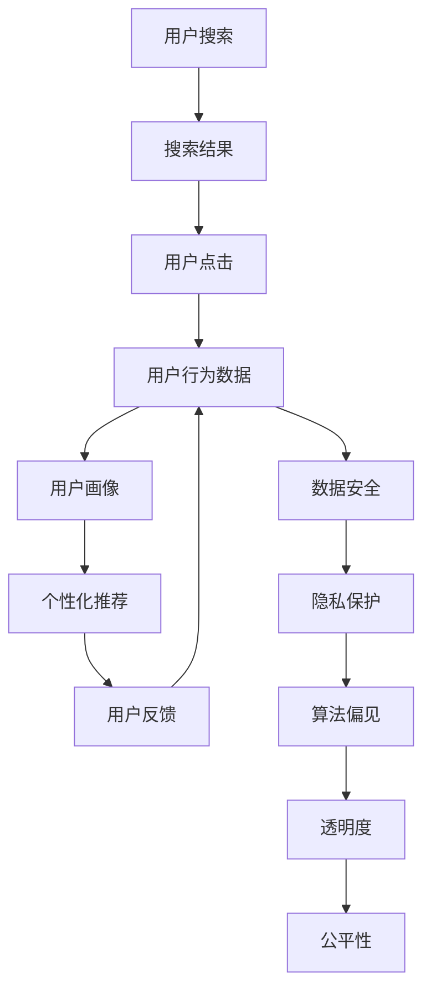

                 

# AI 在电商搜索导购中的伦理问题：探索技术应用的边界

> 关键词：电商搜索，导购，伦理问题，技术边界，用户隐私，数据安全，算法偏见，透明度，公平性

> 摘要：随着人工智能技术在电商领域的广泛应用，搜索导购系统已成为电商平台的核心组成部分。本文将深入探讨AI在电商搜索导购中的伦理问题，从技术应用的边界出发，分析其潜在的风险和挑战。通过逐步推理和详细案例分析，本文旨在为开发者和决策者提供有价值的见解，以促进技术的健康发展和伦理责任的履行。

## 1. 背景介绍

随着互联网技术的飞速发展，电商平台已成为人们日常生活的重要组成部分。为了提高用户体验，电商平台不断引入先进的AI技术，如自然语言处理（NLP）、机器学习（ML）和深度学习（DL）等，以实现更加智能的搜索导购功能。然而，这些技术的应用并非没有风险和挑战。本文将从伦理角度出发，探讨AI在电商搜索导购中的应用边界，分析其潜在的伦理问题，并提出相应的解决方案。

## 2. 核心概念与联系

### 2.1 电商搜索导购系统概述

电商搜索导购系统是一种基于用户需求和商品信息，通过智能算法为用户提供个性化推荐的商品和服务的系统。其核心功能包括：

- **搜索**：用户通过关键词或描述搜索商品。
- **导购**：根据用户的搜索历史、浏览行为和偏好，推荐相关商品。
- **个性化推荐**：利用机器学习算法，为用户提供个性化的商品推荐。

### 2.2 伦理问题的核心概念

- **用户隐私**：电商平台需要收集用户的个人信息和行为数据，以提供个性化服务。然而，如何在保护用户隐私的同时，充分利用这些数据，是一个重要的伦理问题。
- **数据安全**：数据泄露和滥用可能导致用户信息被非法利用，给用户带来严重的安全风险。
- **算法偏见**：算法设计和训练过程中可能存在的偏见，可能导致不公平的推荐结果。
- **透明度**：用户有权了解推荐算法的工作原理和决策依据，以确保推荐结果的公正性和可信度。
- **公平性**：推荐系统应避免歧视性推荐，确保所有用户都能获得公平的服务。

### 2.3 Mermaid 流程图



## 3. 核心算法原理 & 具体操作步骤

### 3.1 搜索算法

搜索算法的核心在于如何高效地从海量商品信息中找到与用户需求匹配的商品。常见的搜索算法包括：

- **关键词匹配**：通过关键词与商品描述的匹配度来排序商品。
- **TF-IDF**：利用词频-逆文档频率（Term Frequency-Inverse Document Frequency）算法，计算关键词在商品描述中的重要性。
- **余弦相似度**：通过计算商品描述与用户搜索词之间的余弦相似度，来衡量匹配度。

### 3.2 个性化推荐算法

个性化推荐算法的核心在于如何根据用户的兴趣和行为，为用户推荐最相关和最感兴趣的商品。常见的推荐算法包括：

- **协同过滤**：通过分析用户的历史行为和偏好，找到具有相似行为的用户，推荐他们喜欢的商品。
- **基于内容的推荐**：通过分析商品的特征和用户的历史行为，推荐与用户兴趣相似的商品。
- **深度学习推荐**：利用神经网络模型，学习用户和商品之间的复杂关系，进行个性化推荐。

### 3.3 具体操作步骤

1. **数据收集**：收集用户的搜索历史、浏览行为、购买记录等数据。
2. **数据预处理**：清洗和标准化数据，去除噪声和异常值。
3. **特征提取**：从用户和商品数据中提取有用的特征。
4. **模型训练**：利用机器学习算法训练推荐模型。
5. **模型评估**：通过交叉验证等方法评估模型的性能。
6. **模型部署**：将训练好的模型部署到生产环境，实时为用户提供推荐服务。

## 4. 数学模型和公式 & 详细讲解 & 举例说明

### 4.1 余弦相似度

余弦相似度是一种衡量两个向量之间相似度的方法。其公式如下：

$$
\text{cosine similarity}(A, B) = \frac{A \cdot B}{\|A\| \|B\|}
$$

其中，$A \cdot B$ 表示向量A和向量B的点积，$\|A\|$ 和 $\|B\|$ 分别表示向量A和向量B的模长。

### 4.2 协同过滤

协同过滤算法的核心在于找到与目标用户具有相似行为的用户，推荐他们喜欢的商品。其基本公式如下：

$$
\hat{r}_{ui} = \frac{\sum_{j \in N_i} r_{uj} \cdot \frac{1}{\sqrt{1 + d_{uj}^2}}}{\sum_{j \in N_i} \frac{1}{\sqrt{1 + d_{uj}^2}}}
$$

其中，$r_{uj}$ 表示用户u对商品j的评分，$N_i$ 表示与用户i具有相似行为的用户集合，$d_{uj}$ 表示用户u和用户j之间的相似度。

### 4.3 深度学习推荐

深度学习推荐算法利用神经网络模型学习用户和商品之间的复杂关系。其基本模型结构如下：

$$
\text{Output} = \text{softmax}(W \cdot \text{ReLU}(V \cdot \text{Input}))
$$

其中，$W$ 和 $V$ 分别表示权重矩阵，$\text{ReLU}$ 表示激活函数，$\text{softmax}$ 表示归一化函数。

## 5. 项目实战：代码实际案例和详细解释说明

### 5.1 开发环境搭建

为了实现电商搜索导购系统，我们需要搭建一个完整的开发环境。具体步骤如下：

1. **安装Python**：确保安装了Python 3.8及以上版本。
2. **安装依赖库**：使用pip安装必要的库，如`numpy`、`pandas`、`scikit-learn`等。
3. **配置数据库**：使用MySQL或MongoDB等数据库存储用户和商品数据。
4. **配置API接口**：使用Flask或Django等框架搭建API接口，提供搜索和推荐服务。

### 5.2 源代码详细实现和代码解读

以下是一个简单的基于协同过滤的推荐系统实现代码：

```python
import numpy as np
from sklearn.metrics.pairwise import cosine_similarity

# 假设我们有一个用户-商品评分矩阵
ratings_matrix = np.array([
    [5, 3, 0, 1],
    [4, 0, 0, 1],
    [1, 1, 0, 5],
    [1, 0, 0, 4],
    [0, 1, 5, 4]
])

# 计算用户之间的相似度
user_similarity = cosine_similarity(ratings_matrix.T)

# 为用户1推荐商品
user_id = 0
similar_users = np.argsort(user_similarity[user_id])[::-1][1:6]  # 排除用户自身

# 计算推荐商品的评分
recommended_ratings = np.sum(ratings_matrix[similar_users], axis=0) / np.sum(user_similarity[user_id, similar_users])

# 推荐评分最高的商品
recommended_item = np.argmax(recommended_ratings)
print(f"推荐商品：{recommended_item}")
```

### 5.3 代码解读与分析

- **用户-商品评分矩阵**：`ratings_matrix`是一个用户-商品评分矩阵，其中每个元素表示用户对商品的评分。
- **计算用户相似度**：使用`cosine_similarity`函数计算用户之间的相似度。
- **推荐商品**：通过计算与目标用户相似的用户对商品的评分，推荐评分最高的商品。

## 6. 实际应用场景

### 6.1 个性化推荐

个性化推荐是电商搜索导购系统的核心功能之一。通过分析用户的搜索历史、浏览行为和偏好，为用户推荐最相关和最感兴趣的商品。这不仅可以提高用户的购物体验，还可以增加用户的购买转化率。

### 6.2 搜索优化

搜索优化是电商搜索导购系统的重要组成部分。通过优化搜索算法，提高搜索结果的相关性和准确性，可以提高用户的搜索满意度，减少用户的搜索时间。

### 6.3 数据驱动决策

数据驱动决策是电商搜索导购系统的重要应用之一。通过对用户行为数据的分析，可以发现用户的购物习惯和偏好，为商家提供有价值的市场洞察，帮助商家做出更明智的决策。

## 7. 工具和资源推荐

### 7.1 学习资源推荐

- **书籍**：《推荐系统实践》、《机器学习实战》
- **论文**：《基于协同过滤的推荐系统》、《深度学习在推荐系统中的应用》
- **博客**：阿里云开发者社区、GitHub开源项目
- **网站**：Kaggle、DataCamp

### 7.2 开发工具框架推荐

- **Python库**：`numpy`、`pandas`、`scikit-learn`、`tensorflow`、`keras`
- **框架**：Flask、Django、TensorFlow、PyTorch

### 7.3 相关论文著作推荐

- **论文**：《基于深度学习的推荐系统》、《协同过滤算法的改进与应用》
- **著作**：《推荐系统原理与实践》、《机器学习与数据挖掘》

## 8. 总结：未来发展趋势与挑战

### 8.1 未来发展趋势

- **个性化推荐**：随着数据量的增加和算法的改进，个性化推荐将更加精准和智能。
- **搜索优化**：通过引入自然语言处理技术，搜索结果将更加自然和准确。
- **数据驱动决策**：通过分析用户行为数据，为商家提供更全面的市场洞察。

### 8.2 挑战

- **用户隐私**：如何在保护用户隐私的同时，充分利用用户数据，是一个重要的挑战。
- **算法偏见**：如何避免算法设计和训练过程中的偏见，确保推荐结果的公正性和公平性，是一个重要的挑战。
- **透明度**：如何提高推荐算法的透明度，让用户了解推荐结果的决策依据，是一个重要的挑战。

## 9. 附录：常见问题与解答

### 9.1 问题1：如何保护用户隐私？

- **答案**：可以通过数据脱敏、数据加密和匿名化处理等技术手段，保护用户隐私。

### 9.2 问题2：如何避免算法偏见？

- **答案**：可以通过引入多样化的数据源、定期评估和调整算法、引入专家审核等方法，避免算法偏见。

### 9.3 问题3：如何提高推荐算法的透明度？

- **答案**：可以通过解释性模型、可视化工具和用户反馈等方法，提高推荐算法的透明度。

## 10. 扩展阅读 & 参考资料

- **书籍**：《推荐系统实践》、《机器学习实战》
- **论文**：《基于协同过滤的推荐系统》、《深度学习在推荐系统中的应用》
- **网站**：Kaggle、DataCamp
- **开源项目**：TensorFlow、PyTorch

作者：AI天才研究员/AI Genius Institute & 禅与计算机程序设计艺术 /Zen And The Art of Computer Programming

