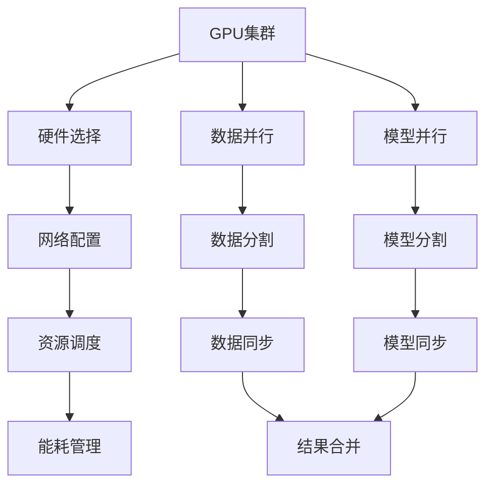

                 

# AI 大模型原理与应用：物理世界GPU集群建设问题

> 关键词：大模型、GPU集群、物理世界、分布式计算、并行处理、深度学习、高性能计算

> 摘要：本文旨在深入探讨如何在物理世界中构建和优化GPU集群，以支持大规模深度学习模型的训练和推理。我们将从背景介绍出发，逐步解析GPU集群的核心概念、架构设计、算法原理、数学模型，以及实际应用案例。通过详细的技术分析和代码示例，帮助读者理解如何在实际项目中高效地部署和管理GPU集群，以应对日益增长的计算需求。

## 1. 背景介绍

随着人工智能技术的飞速发展，深度学习模型的规模和复杂度也在不断增加。为了满足这些模型对计算资源的需求，构建高效的GPU集群成为了一个重要的研究方向。GPU集群不仅能够提供强大的计算能力，还能通过并行处理技术显著提高训练和推理的速度。然而，构建和优化GPU集群面临着诸多挑战，包括硬件选择、网络配置、资源调度、能耗管理等。本文将从这些方面进行深入探讨，帮助读者更好地理解和应用GPU集群技术。

## 2. 核心概念与联系

### 2.1 GPU集群概述

GPU集群是指由多个GPU节点组成的计算系统，通过高速网络连接，实现分布式计算。每个GPU节点可以独立执行计算任务，同时通过网络进行数据交换和同步。GPU集群在深度学习领域具有广泛的应用，特别是在大规模模型训练和推理中。

### 2.2 核心概念

- **GPU（图形处理单元）**：GPU是一种专门用于处理图形和并行计算任务的硬件设备，具有高度并行处理能力。
- **分布式计算**：分布式计算是指将计算任务分解为多个子任务，分配给不同的计算节点进行并行处理。
- **并行处理**：并行处理是指同时执行多个计算任务，以提高计算效率。
- **数据并行**：数据并行是指将数据集分割成多个子集，每个GPU节点处理一个子集，最后合并结果。
- **模型并行**：模型并行是指将模型的计算任务分割成多个部分，每个GPU节点处理一部分，最后合并结果。

### 2.3 Mermaid 流程图



## 3. 核心算法原理 & 具体操作步骤

### 3.1 数据并行

数据并行是指将数据集分割成多个子集，每个GPU节点处理一个子集，最后合并结果。具体操作步骤如下：

1. **数据分割**：将数据集分割成多个子集，每个子集分配给一个GPU节点。
2. **前向传播**：每个GPU节点独立执行前向传播计算。
3. **梯度计算**：每个GPU节点计算局部梯度。
4. **梯度聚合**：将所有GPU节点的梯度进行聚合，得到全局梯度。
5. **参数更新**：使用全局梯度更新模型参数。

### 3.2 模型并行

模型并行是指将模型的计算任务分割成多个部分，每个GPU节点处理一部分，最后合并结果。具体操作步骤如下：

1. **模型分割**：将模型的计算任务分割成多个部分，每个部分分配给一个GPU节点。
2. **前向传播**：每个GPU节点独立执行前向传播计算。
3. **梯度计算**：每个GPU节点计算局部梯度。
4. **梯度聚合**：将所有GPU节点的梯度进行聚合，得到全局梯度。
5. **参数更新**：使用全局梯度更新模型参数。

### 3.3 资源调度

资源调度是指合理分配计算资源，以提高计算效率。具体操作步骤如下：

1. **任务分配**：根据任务的计算需求和资源可用性，合理分配任务给GPU节点。
2. **负载均衡**：通过动态调整任务分配，保持各GPU节点的负载均衡。
3. **任务调度**：使用调度算法（如轮询、优先级调度等）进行任务调度。

### 3.4 能耗管理

能耗管理是指通过优化计算策略，降低能耗。具体操作步骤如下：

1. **能耗监测**：实时监测GPU节点的能耗情况。
2. **能耗优化**：通过调整计算策略，降低能耗。
3. **能耗预测**：通过能耗预测模型，提前进行能耗优化。

## 4. 数学模型和公式 & 详细讲解 & 举例说明

### 4.1 数据并行

数据并行的数学模型可以表示为：

$$
\text{梯度聚合} = \frac{1}{N} \sum_{i=1}^{N} \nabla_{\theta_i} \mathcal{L}(\theta_i, x_i)
$$

其中，$\theta_i$ 表示第 $i$ 个GPU节点的模型参数，$x_i$ 表示第 $i$ 个子集的数据，$\mathcal{L}(\theta_i, x_i)$ 表示损失函数。

### 4.2 模型并行

模型并行的数学模型可以表示为：

$$
\text{梯度聚合} = \frac{1}{M} \sum_{j=1}^{M} \nabla_{\theta_j} \mathcal{L}(\theta_j, x_j)
$$

其中，$\theta_j$ 表示第 $j$ 个GPU节点的模型参数，$x_j$ 表示第 $j$ 个部分的数据，$\mathcal{L}(\theta_j, x_j)$ 表示损失函数。

### 4.3 资源调度

资源调度的数学模型可以表示为：

$$
\text{任务分配} = \arg\min_{\textbf{a}} \sum_{i=1}^{N} \textbf{a}_i \cdot \textbf{c}_i
$$

其中，$\textbf{a}_i$ 表示任务 $i$ 的分配，$\textbf{c}_i$ 表示任务 $i$ 的计算需求。

### 4.4 能耗管理

能耗管理的数学模型可以表示为：

$$
\text{能耗优化} = \arg\min_{\textbf{p}} \sum_{i=1}^{N} \textbf{p}_i \cdot \textbf{e}_i
$$

其中，$\textbf{p}_i$ 表示任务 $i$ 的能耗策略，$\textbf{e}_i$ 表示任务 $i$ 的能耗。

## 5. 项目实战：代码实际案例和详细解释说明

### 5.1 开发环境搭建

#### 5.1.1 硬件选择

选择高性能的GPU节点，如NVIDIA Tesla V100或A100。每个节点需要配备足够的内存和显存，以支持大规模模型的训练和推理。

#### 5.1.2 网络配置

使用高速网络连接GPU节点，如InfiniBand或RoCE。网络带宽和延迟对集群性能有重要影响。

#### 5.1.3 软件环境

安装CUDA和cuDNN，以支持GPU计算。安装TensorFlow或PyTorch等深度学习框架，以简化模型训练和推理。

### 5.2 源代码详细实现和代码解读

#### 5.2.1 数据并行

```python
import torch
import torch.nn as nn
import torch.optim as optim

# 定义模型
class MyModel(nn.Module):
    def __init__(self):
        super(MyModel, self).__init__()
        self.fc1 = nn.Linear(100, 50)
        self.fc2 = nn.Linear(50, 10)

    def forward(self, x):
        x = torch.relu(self.fc1(x))
        x = self.fc2(x)
        return x

# 初始化模型和优化器
model = MyModel().cuda()
optimizer = optim.SGD(model.parameters(), lr=0.01)

# 数据并行
model = nn.DataParallel(model)

# 训练
for epoch in range(10):
    for data, target in train_loader:
        data, target = data.cuda(), target.cuda()
        optimizer.zero_grad()
        output = model(data)
        loss = F.cross_entropy(output, target)
        loss.backward()
        optimizer.step()
```

#### 5.2.2 模型并行

```python
import torch
import torch.nn as nn
import torch.optim as optim

# 定义模型
class MyModel(nn.Module):
    def __init__(self):
        super(MyModel, self).__init__()
        self.fc1 = nn.Linear(100, 50)
        self.fc2 = nn.Linear(50, 10)

    def forward(self, x):
        x = torch.relu(self.fc1(x))
        x = self.fc2(x)
        return x

# 初始化模型和优化器
model = MyModel().cuda()
optimizer = optim.SGD(model.parameters(), lr=0.01)

# 模型并行
model = nn.parallel.DistributedDataParallel(model)

# 训练
for epoch in range(10):
    for data, target in train_loader:
        data, target = data.cuda(), target.cuda()
        optimizer.zero_grad()
        output = model(data)
        loss = F.cross_entropy(output, target)
        loss.backward()
        optimizer.step()
```

### 5.3 代码解读与分析

#### 5.3.1 数据并行

- `nn.DataParallel`：将模型分割成多个部分，每个部分分配给一个GPU节点。
- `model(data)`：每个GPU节点独立执行前向传播计算。
- `loss.backward()`：每个GPU节点计算局部梯度。
- `optimizer.step()`：使用全局梯度更新模型参数。

#### 5.3.2 模型并行

- `nn.parallel.DistributedDataParallel`：将模型分割成多个部分，每个部分分配给一个GPU节点。
- `model(data)`：每个GPU节点独立执行前向传播计算。
- `loss.backward()`：每个GPU节点计算局部梯度。
- `optimizer.step()`：使用全局梯度更新模型参数。

## 6. 实际应用场景

### 6.1 大规模模型训练

在大规模模型训练中，数据并行和模型并行技术可以显著提高训练速度。例如，在训练大规模语言模型时，可以使用数据并行和模型并行技术，将数据集和模型分割成多个部分，分配给多个GPU节点进行并行计算。

### 6.2 实时推理

在实时推理场景中，数据并行和模型并行技术可以提高推理速度。例如，在语音识别和图像识别任务中，可以使用数据并行和模型并行技术，将输入数据和模型分割成多个部分，分配给多个GPU节点进行并行计算。

## 7. 工具和资源推荐

### 7.1 学习资源推荐

- **书籍**：《深度学习》（Goodfellow, Bengio, Courville）
- **论文**：《Distributed Deep Learning at Scale》（Google AI）
- **博客**：《PyTorch官方博客》（PyTorch）
- **网站**：NVIDIA官网（NVIDIA）

### 7.2 开发工具框架推荐

- **深度学习框架**：TensorFlow、PyTorch
- **分布式计算框架**：Horovod、Ray

### 7.3 相关论文著作推荐

- **论文**：《Distributed Deep Learning at Scale》（Google AI）
- **著作**：《深度学习》（Goodfellow, Bengio, Courville）

## 8. 总结：未来发展趋势与挑战

### 8.1 未来发展趋势

- **硬件加速**：GPU、TPU等硬件加速器将进一步提升计算性能。
- **算法优化**：新的并行算法和优化策略将提高计算效率。
- **能耗管理**：能耗优化技术将进一步降低能耗。

### 8.2 挑战

- **硬件成本**：高性能GPU的成本较高，限制了集群规模。
- **网络延迟**：网络延迟对集群性能有重要影响。
- **资源调度**：资源调度算法需要进一步优化。

## 9. 附录：常见问题与解答

### 9.1 问题1：如何选择合适的GPU节点？

- **答案**：根据模型规模和计算需求选择高性能的GPU节点，如NVIDIA Tesla V100或A100。

### 9.2 问题2：如何优化网络配置？

- **答案**：使用高速网络连接GPU节点，如InfiniBand或RoCE，以降低网络延迟。

### 9.3 问题3：如何进行资源调度？

- **答案**：使用调度算法（如轮询、优先级调度等）进行任务调度，保持各GPU节点的负载均衡。

## 10. 扩展阅读 & 参考资料

- **书籍**：《深度学习》（Goodfellow, Bengio, Courville）
- **论文**：《Distributed Deep Learning at Scale》（Google AI）
- **网站**：NVIDIA官网（NVIDIA）

---

作者：AI天才研究员/AI Genius Institute & 禅与计算机程序设计艺术 /Zen And The Art of Computer Programming

