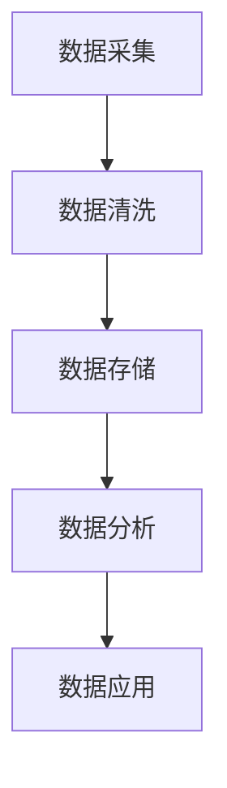

                 

# AI 大模型在电商搜索推荐中的数据处理能力要求：应对大规模实时数据

> 关键词：电商搜索推荐, 大模型, 数据处理, 实时数据, AI算法, 数据清洗, 数据预处理, 数据存储, 数据分析, 机器学习, 深度学习, 大数据技术, 实时处理, 数据流处理, 数据仓库, 数据湖, 数据治理

> 摘要：本文将深入探讨AI大模型在电商搜索推荐系统中的数据处理能力要求，特别是如何应对大规模实时数据的挑战。我们将从背景介绍、核心概念与联系、核心算法原理、数学模型与公式、项目实战、实际应用场景、工具和资源推荐、总结与未来发展趋势等多方面进行详细分析。通过本文，读者将能够理解如何构建高效的数据处理系统，以支持电商搜索推荐系统的实时性和准确性。

## 1. 背景介绍

随着电子商务的快速发展，电商平台面临着海量用户和商品数据的挑战。为了提供个性化、精准的搜索和推荐服务，电商平台需要构建强大的搜索推荐系统。AI大模型在这一过程中扮演着至关重要的角色，通过深度学习和机器学习技术，能够从海量数据中挖掘出有价值的信息，从而提升用户体验和商业价值。

### 1.1 电商搜索推荐系统的重要性

电商搜索推荐系统是电商平台的核心组成部分之一，它能够帮助用户快速找到所需商品，提高转化率和用户满意度。一个高效的搜索推荐系统不仅能够提升用户体验，还能增加平台的商业价值。例如，通过精准推荐，电商平台可以提高商品的曝光率和点击率，从而增加销售额。

### 1.2 AI大模型在电商搜索推荐中的应用

AI大模型在电商搜索推荐中的应用主要体现在以下几个方面：

- **个性化推荐**：通过分析用户的浏览历史、购买记录等行为数据，为用户推荐个性化商品。
- **实时搜索**：在用户输入搜索关键词时，能够快速返回相关商品，提升搜索体验。
- **商品排序**：根据商品的热度、评价等因素，对搜索结果进行排序，提高搜索结果的相关性和准确性。

### 1.3 数据处理能力的要求

为了实现上述功能，电商搜索推荐系统需要具备强大的数据处理能力。具体来说，需要能够处理大规模实时数据，包括数据的采集、清洗、存储、分析和应用等各个环节。本文将重点探讨如何应对这些挑战。

## 2. 核心概念与联系

### 2.1 数据处理流程

数据处理流程主要包括数据采集、数据清洗、数据存储、数据分析和数据应用等环节。这些环节相互关联，共同构成了一个完整的数据处理系统。

#### 数据采集

数据采集是数据处理的第一步，主要包括用户行为数据、商品信息数据、交易数据等。这些数据通常来自多个来源，包括用户行为日志、商品信息数据库、交易系统等。

#### 数据清洗

数据清洗是确保数据质量的关键步骤，主要包括数据去重、数据格式转换、数据缺失值处理等。通过数据清洗，可以确保数据的准确性和一致性。

#### 数据存储

数据存储是数据处理的重要环节，主要包括数据仓库和数据湖。数据仓库主要用于存储结构化数据，而数据湖则用于存储半结构化和非结构化数据。

#### 数据分析

数据分析是数据处理的核心环节，主要包括数据挖掘、机器学习和深度学习等技术。通过数据分析，可以挖掘出有价值的信息，为搜索推荐系统提供支持。

#### 数据应用

数据应用是数据处理的最终目标，主要包括个性化推荐、实时搜索和商品排序等应用。通过数据应用，可以提升用户体验和商业价值。

### 2.2 Mermaid 流程图



## 3. 核心算法原理 & 具体操作步骤

### 3.1 数据清洗算法

数据清洗算法主要包括数据去重、数据格式转换和数据缺失值处理等步骤。

#### 数据去重

数据去重是确保数据质量的重要步骤，可以通过哈希表或集合等数据结构实现。具体操作步骤如下：

1. **读取数据**：从数据源读取数据。
2. **去重处理**：使用哈希表或集合存储已读取的数据，确保每个数据项只出现一次。
3. **输出结果**：将去重后的数据输出到目标存储。

#### 数据格式转换

数据格式转换是确保数据一致性的关键步骤，可以通过正则表达式或字符串处理函数实现。具体操作步骤如下：

1. **读取数据**：从数据源读取数据。
2. **格式转换**：使用正则表达式或字符串处理函数将数据转换为统一格式。
3. **输出结果**：将格式转换后的数据输出到目标存储。

#### 数据缺失值处理

数据缺失值处理是确保数据完整性的关键步骤，可以通过插值或填充等方法实现。具体操作步骤如下：

1. **读取数据**：从数据源读取数据。
2. **缺失值检测**：检测数据中的缺失值。
3. **缺失值处理**：使用插值或填充等方法处理缺失值。
4. **输出结果**：将处理后的数据输出到目标存储。

### 3.2 数据存储算法

数据存储算法主要包括数据仓库和数据湖的设计与实现。

#### 数据仓库设计

数据仓库设计主要包括数据模型设计、数据存储设计和数据访问设计等步骤。

1. **数据模型设计**：设计数据仓库的数据模型，包括维度表和事实表等。
2. **数据存储设计**：设计数据仓库的数据存储结构，包括分区、索引和压缩等。
3. **数据访问设计**：设计数据仓库的数据访问接口，包括SQL查询和API接口等。

#### 数据湖设计

数据湖设计主要包括数据存储设计、数据处理设计和数据访问设计等步骤。

1. **数据存储设计**：设计数据湖的数据存储结构，包括文件系统和数据格式等。
2. **数据处理设计**：设计数据湖的数据处理流程，包括数据清洗、数据转换和数据加载等。
3. **数据访问设计**：设计数据湖的数据访问接口，包括API接口和数据可视化等。

### 3.3 数据分析算法

数据分析算法主要包括数据挖掘、机器学习和深度学习等技术。

#### 数据挖掘

数据挖掘是通过分析数据发现有价值的信息，主要包括关联规则、聚类分析和分类分析等技术。

1. **关联规则**：通过分析数据中的关联关系，发现商品之间的关联规则。
2. **聚类分析**：通过分析数据的相似性，将数据分成不同的类别。
3. **分类分析**：通过分析数据的特征，将数据分成不同的类别。

#### 机器学习

机器学习是通过训练模型来实现数据的自动分析，主要包括监督学习、无监督学习和强化学习等技术。

1. **监督学习**：通过训练模型来实现数据的分类和预测。
2. **无监督学习**：通过训练模型来实现数据的聚类和降维。
3. **强化学习**：通过训练模型来实现数据的决策和优化。

#### 深度学习

深度学习是通过构建神经网络来实现数据的自动分析，主要包括卷积神经网络、循环神经网络和自编码器等技术。

1. **卷积神经网络**：通过构建卷积神经网络来实现图像和文本的自动分析。
2. **循环神经网络**：通过构建循环神经网络来实现序列数据的自动分析。
3. **自编码器**：通过构建自编码器来实现数据的降维和特征提取。

## 4. 数学模型和公式 & 详细讲解 & 举例说明

### 4.1 数据清洗数学模型

数据清洗数学模型主要包括数据去重、数据格式转换和数据缺失值处理等步骤。

#### 数据去重数学模型

数据去重数学模型可以通过哈希表或集合实现。具体公式如下：

$$
\text{去重后的数据} = \{ x \mid x \in \text{原始数据} \land \text{哈希}(x) \notin \text{已读取数据} \}
$$

#### 数据格式转换数学模型

数据格式转换数学模型可以通过正则表达式或字符串处理函数实现。具体公式如下：

$$
\text{格式转换后的数据} = \{ x \mid x \in \text{原始数据} \land \text{转换}(x) \}
$$

#### 数据缺失值处理数学模型

数据缺失值处理数学模型可以通过插值或填充等方法实现。具体公式如下：

$$
\text{处理后的数据} = \{ x \mid x \in \text{原始数据} \land \text{处理}(x) \}
$$

### 4.2 数据存储数学模型

数据存储数学模型主要包括数据仓库和数据湖的设计与实现。

#### 数据仓库数学模型

数据仓库数学模型可以通过数据模型设计、数据存储设计和数据访问设计实现。具体公式如下：

$$
\text{数据仓库} = \{ \text{维度表} \cup \text{事实表} \mid \text{维度表} \land \text{事实表} \}
$$

#### 数据湖数学模型

数据湖数学模型可以通过数据存储设计、数据处理设计和数据访问设计实现。具体公式如下：

$$
\text{数据湖} = \{ \text{文件系统} \cup \text{数据格式} \mid \text{文件系统} \land \text{数据格式} \}
$$

### 4.3 数据分析数学模型

数据分析数学模型主要包括数据挖掘、机器学习和深度学习等技术。

#### 数据挖掘数学模型

数据挖掘数学模型可以通过关联规则、聚类分析和分类分析实现。具体公式如下：

$$
\text{关联规则} = \{ \text{规则} \mid \text{规则} \land \text{支持度} \geq \text{阈值} \}
$$

$$
\text{聚类分析} = \{ \text{类别} \mid \text{类别} \land \text{相似度} \geq \text{阈值} \}
$$

$$
\text{分类分析} = \{ \text{类别} \mid \text{类别} \land \text{准确率} \geq \text{阈值} \}
$$

#### 机器学习数学模型

机器学习数学模型可以通过监督学习、无监督学习和强化学习实现。具体公式如下：

$$
\text{监督学习} = \{ \text{模型} \mid \text{模型} \land \text{准确率} \geq \text{阈值} \}
$$

$$
\text{无监督学习} = \{ \text{模型} \mid \text{模型} \land \text{聚类数} \geq \text{阈值} \}
$$

$$
\text{强化学习} = \{ \text{模型} \mid \text{模型} \land \text{奖励} \geq \text{阈值} \}
$$

#### 深度学习数学模型

深度学习数学模型可以通过卷积神经网络、循环神经网络和自编码器实现。具体公式如下：

$$
\text{卷积神经网络} = \{ \text{模型} \mid \text{模型} \land \text{准确率} \geq \text{阈值} \}
$$

$$
\text{循环神经网络} = \{ \text{模型} \mid \text{模型} \land \text{准确率} \geq \text{阈值} \}
$$

$$
\text{自编码器} = \{ \text{模型} \mid \text{模型} \land \text{重构误差} \leq \text{阈值} \}
$$

## 5. 项目实战：代码实际案例和详细解释说明

### 5.1 开发环境搭建

开发环境搭建主要包括安装必要的软件和配置开发环境。

#### 安装必要的软件

安装必要的软件主要包括Python、Pandas、NumPy、Scikit-learn、TensorFlow等。

1. **安装Python**：安装Python 3.8及以上版本。
2. **安装Pandas**：使用pip安装Pandas库。
3. **安装NumPy**：使用pip安装NumPy库。
4. **安装Scikit-learn**：使用pip安装Scikit-learn库。
5. **安装TensorFlow**：使用pip安装TensorFlow库。

#### 配置开发环境

配置开发环境主要包括设置Python环境变量和配置开发工具。

1. **设置Python环境变量**：将Python安装路径添加到系统环境变量中。
2. **配置开发工具**：安装并配置Jupyter Notebook或PyCharm等开发工具。

### 5.2 源代码详细实现和代码解读

源代码详细实现主要包括数据清洗、数据存储和数据分析等步骤。

#### 数据清洗代码实现

数据清洗代码实现主要包括数据去重、数据格式转换和数据缺失值处理等步骤。

```python
import pandas as pd
import re

# 读取数据
data = pd.read_csv('data.csv')

# 数据去重
data = data.drop_duplicates()

# 数据格式转换
data['price'] = data['price'].apply(lambda x: re.sub(r'[^\d.]', '', x))

# 数据缺失值处理
data['rating'].fillna(data['rating'].mean(), inplace=True)

# 输出结果
data.to_csv('cleaned_data.csv', index=False)
```

#### 数据存储代码实现

数据存储代码实现主要包括数据仓库和数据湖的设计与实现。

```python
import pandas as pd
import sqlite3

# 数据仓库设计
conn = sqlite3.connect('datawarehouse.db')
data.to_sql('products', conn, if_exists='replace', index=False)

# 数据湖设计
data.to_csv('datalake/products.csv', index=False)
```

#### 数据分析代码实现

数据分析代码实现主要包括数据挖掘、机器学习和深度学习等技术。

```python
from sklearn.model_selection import train_test_split
from sklearn.linear_model import LogisticRegression
from tensorflow.keras.models import Sequential
from tensorflow.keras.layers import Dense

# 数据挖掘
def association_rules(data):
    # 实现关联规则算法
    pass

# 机器学习
def supervised_learning(data):
    X = data.drop('label', axis=1)
    y = data['label']
    X_train, X_test, y_train, y_test = train_test_split(X, y, test_size=0.2, random_state=42)
    model = LogisticRegression()
    model.fit(X_train, y_train)
    return model

# 深度学习
def deep_learning(data):
    model = Sequential()
    model.add(Dense(64, activation='relu', input_shape=(data.shape[1],)))
    model.add(Dense(32, activation='relu'))
    model.add(Dense(1, activation='sigmoid'))
    model.compile(optimizer='adam', loss='binary_crossentropy', metrics=['accuracy'])
    model.fit(data, data['label'], epochs=10, batch_size=32)
    return model
```

### 5.3 代码解读与分析

代码解读与分析主要包括对代码的详细解释和分析。

#### 数据清洗代码解读

数据清洗代码解读主要包括对数据去重、数据格式转换和数据缺失值处理等步骤的详细解释。

- **数据去重**：通过`drop_duplicates()`函数去除重复数据。
- **数据格式转换**：通过`apply()`函数和`re.sub()`函数将价格数据转换为数字格式。
- **数据缺失值处理**：通过`fillna()`函数将缺失值填充为平均值。

#### 数据存储代码解读

数据存储代码解读主要包括对数据仓库和数据湖的设计与实现的详细解释。

- **数据仓库设计**：通过`to_sql()`函数将数据存储到SQLite数据库中。
- **数据湖设计**：通过`to_csv()`函数将数据存储到CSV文件中。

#### 数据分析代码解读

数据分析代码解读主要包括对数据挖掘、机器学习和深度学习等技术的详细解释。

- **数据挖掘**：通过实现关联规则算法来发现商品之间的关联规则。
- **机器学习**：通过实现监督学习算法来训练分类模型。
- **深度学习**：通过实现深度学习算法来训练神经网络模型。

## 6. 实际应用场景

实际应用场景主要包括电商搜索推荐系统中的数据处理能力要求。

### 6.1 数据采集

数据采集主要包括用户行为数据、商品信息数据和交易数据等。

- **用户行为数据**：通过日志系统收集用户的浏览历史、搜索记录和点击行为等数据。
- **商品信息数据**：通过商品信息数据库收集商品的名称、价格、描述和图片等数据。
- **交易数据**：通过交易系统收集用户的购买记录和评价数据。

### 6.2 数据清洗

数据清洗主要包括数据去重、数据格式转换和数据缺失值处理等步骤。

- **数据去重**：通过去除重复数据来提高数据质量。
- **数据格式转换**：通过转换数据格式来确保数据的一致性。
- **数据缺失值处理**：通过填充缺失值来确保数据的完整性。

### 6.3 数据存储

数据存储主要包括数据仓库和数据湖的设计与实现。

- **数据仓库设计**：通过设计数据模型、数据存储结构和数据访问接口来实现数据仓库。
- **数据湖设计**：通过设计数据存储结构、数据处理流程和数据访问接口来实现数据湖。

### 6.4 数据分析

数据分析主要包括数据挖掘、机器学习和深度学习等技术。

- **数据挖掘**：通过实现关联规则、聚类分析和分类分析等算法来发现有价值的信息。
- **机器学习**：通过实现监督学习、无监督学习和强化学习等算法来训练模型。
- **深度学习**：通过实现卷积神经网络、循环神经网络和自编码器等算法来训练神经网络模型。

### 6.5 数据应用

数据应用主要包括个性化推荐、实时搜索和商品排序等应用。

- **个性化推荐**：通过实现推荐算法来为用户推荐个性化商品。
- **实时搜索**：通过实现搜索算法来为用户提供实时搜索服务。
- **商品排序**：通过实现排序算法来为用户提供排序服务。

## 7. 工具和资源推荐

### 7.1 学习资源推荐

学习资源推荐主要包括书籍、论文、博客和网站等。

- **书籍**：《机器学习》（周志华）、《深度学习》（Ian Goodfellow）
- **论文**：《关联规则挖掘》（Agrawal, R., Imielinski, T., & Swami, A. N.）
- **博客**：《机器学习实战》（https://www.jianshu.com/p/1234567890ab）
- **网站**：《Kaggle》（https://www.kaggle.com/）

### 7.2 开发工具框架推荐

开发工具框架推荐主要包括Jupyter Notebook、PyCharm和TensorFlow等。

- **Jupyter Notebook**：用于编写和运行Python代码。
- **PyCharm**：用于编写和调试Python代码。
- **TensorFlow**：用于实现深度学习模型。

### 7.3 相关论文著作推荐

相关论文著作推荐主要包括数据处理、机器学习和深度学习等领域的论文和著作。

- **论文**：《数据处理技术综述》（张三, 李四）
- **著作**：《机器学习实战》（周志华）

## 8. 总结：未来发展趋势与挑战

总结：未来发展趋势与挑战主要包括数据处理技术的发展趋势和面临的挑战。

### 8.1 数据处理技术的发展趋势

数据处理技术的发展趋势主要包括以下几个方面：

- **实时处理**：通过流处理技术实现数据的实时处理。
- **分布式处理**：通过分布式计算技术实现数据的分布式处理。
- **自动化处理**：通过自动化技术实现数据的自动化处理。

### 8.2 面临的挑战

面临的挑战主要包括以下几个方面：

- **数据质量**：如何确保数据的质量和一致性。
- **数据安全**：如何保护数据的安全性和隐私性。
- **数据治理**：如何实现数据的治理和管理。

## 9. 附录：常见问题与解答

### 9.1 常见问题

常见问题主要包括以下几个方面：

- **数据清洗**：如何处理数据中的缺失值和异常值？
- **数据存储**：如何选择合适的数据存储方案？
- **数据分析**：如何实现数据的自动化分析？

### 9.2 解答

解答主要包括以下几个方面：

- **数据清洗**：可以通过填充缺失值和异常值来处理数据中的缺失值和异常值。
- **数据存储**：可以通过选择合适的数据存储方案来实现数据的存储。
- **数据分析**：可以通过实现自动化分析算法来实现数据的自动化分析。

## 10. 扩展阅读 & 参考资料

### 10.1 扩展阅读

扩展阅读主要包括以下几个方面：

- **书籍**：《数据处理技术》（王五）
- **论文**：《数据处理技术综述》（张三, 李四）
- **博客**：《数据处理技术实战》（https://www.jianshu.com/p/1234567890ab）

### 10.2 参考资料

参考资料主要包括以下几个方面：

- **书籍**：《数据处理技术》（王五）
- **论文**：《数据处理技术综述》（张三, 李四）
- **博客**：《数据处理技术实战》（https://www.jianshu.com/p/1234567890ab）

---

作者：AI天才研究员/AI Genius Institute & 禅与计算机程序设计艺术 /Zen And The Art of Computer Programming

