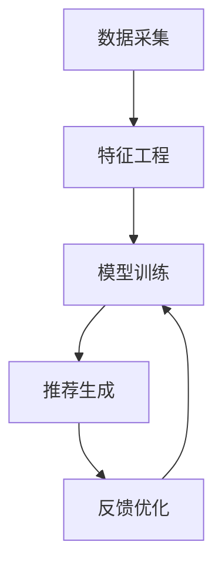

                 

# AI 大模型在电商搜索推荐中的用户体验优化：以用户需求为中心的算法设计

> 关键词：电商搜索推荐、大模型、用户体验优化、用户需求、算法设计

> 摘要：本文旨在探讨如何利用大模型技术优化电商搜索推荐系统的用户体验。通过深入分析用户需求，我们设计了一套以用户为中心的算法框架，结合大模型的强大能力，实现精准推荐。文章将从背景介绍、核心概念与联系、核心算法原理、数学模型和公式、项目实战、实际应用场景、工具和资源推荐、总结与未来发展趋势、常见问题解答等多方面进行详细阐述。

## 1. 背景介绍

随着电商行业的快速发展，用户对搜索推荐系统的期望越来越高。传统的推荐系统往往依赖于简单的协同过滤或基于内容的推荐方法，这些方法虽然能够提供一定的个性化推荐，但难以满足用户的多样化需求。近年来，大模型技术的兴起为电商搜索推荐带来了新的机遇。大模型具有强大的特征表示能力和泛化能力，能够更好地捕捉用户行为和商品特征之间的复杂关系，从而实现更精准的推荐。

### 1.1 电商搜索推荐的重要性

电商搜索推荐系统是电商平台的核心组成部分之一，它直接影响用户的购物体验和购买决策。一个优秀的推荐系统能够显著提升用户的满意度和转化率，从而提高电商平台的竞争力。然而，传统的推荐系统往往存在以下问题：

- **冷启动问题**：新用户或新商品缺乏足够的历史数据，难以进行有效的推荐。
- **个性化不足**：推荐结果往往过于泛化，难以满足用户的个性化需求。
- **多样性不足**：推荐结果往往过于集中，缺乏多样性，导致用户感到厌倦。

### 1.2 大模型技术的优势

大模型技术，如Transformer、BERT等，具有以下优势：

- **强大的特征表示能力**：能够捕捉复杂的特征关系，提高推荐的准确性。
- **泛化能力强**：能够处理大规模数据，适应不同的推荐场景。
- **可解释性强**：通过注意力机制等技术，可以解释推荐结果的来源。

## 2. 核心概念与联系

### 2.1 电商搜索推荐系统架构

电商搜索推荐系统通常包括以下几个模块：

- **数据采集模块**：收集用户行为数据、商品信息等。
- **特征工程模块**：对数据进行预处理和特征提取。
- **模型训练模块**：训练推荐模型。
- **推荐生成模块**：根据用户行为生成推荐结果。
- **反馈优化模块**：根据用户反馈调整推荐策略。

### 2.2 大模型技术原理

大模型技术的核心在于其强大的特征表示能力和泛化能力。以Transformer为例，其主要原理如下：

- **自注意力机制**：通过自注意力机制捕捉输入序列中的长距离依赖关系。
- **多层结构**：通过多层Transformer层，进一步增强特征表示能力。
- **位置编码**：通过位置编码捕捉序列中的位置信息。

### 2.3 Mermaid 流程图



## 3. 核心算法原理 & 具体操作步骤

### 3.1 算法设计思路

我们设计了一套以用户为中心的算法框架，主要包括以下几个步骤：

1. **数据预处理**：对用户行为数据和商品信息进行预处理。
2. **特征提取**：提取用户行为特征和商品特征。
3. **模型训练**：训练推荐模型。
4. **推荐生成**：根据用户行为生成推荐结果。
5. **反馈优化**：根据用户反馈调整推荐策略。

### 3.2 具体操作步骤

#### 3.2.1 数据预处理

数据预处理主要包括以下几个步骤：

1. **数据清洗**：去除无效数据和噪声数据。
2. **数据归一化**：对数据进行归一化处理，提高模型训练效果。
3. **数据划分**：将数据划分为训练集、验证集和测试集。

#### 3.2.2 特征提取

特征提取主要包括以下几个步骤：

1. **用户行为特征**：提取用户的点击、购买、收藏等行为特征。
2. **商品特征**：提取商品的类别、价格、评价等特征。
3. **上下文特征**：提取用户的地理位置、时间等上下文特征。

#### 3.2.3 模型训练

模型训练主要包括以下几个步骤：

1. **模型选择**：选择合适的推荐模型，如Transformer、BERT等。
2. **参数设置**：设置模型的超参数，如学习率、批次大小等。
3. **模型训练**：使用训练集数据训练模型，调整模型参数。

#### 3.2.4 推荐生成

推荐生成主要包括以下几个步骤：

1. **用户表示**：通过模型生成用户的表示向量。
2. **商品表示**：通过模型生成商品的表示向量。
3. **相似度计算**：计算用户表示向量和商品表示向量之间的相似度。
4. **推荐生成**：根据相似度生成推荐结果。

#### 3.2.5 反馈优化

反馈优化主要包括以下几个步骤：

1. **用户反馈收集**：收集用户的点击、购买等反馈数据。
2. **模型调整**：根据用户反馈调整模型参数。
3. **推荐效果评估**：评估推荐效果，调整推荐策略。

## 4. 数学模型和公式 & 详细讲解 & 举例说明

### 4.1 数学模型

推荐系统的核心在于构建一个能够捕捉用户行为和商品特征之间关系的数学模型。我们采用Transformer模型作为推荐模型，其数学模型如下：

$$
\text{Transformer}(X) = \text{MultiHead}(X) \circ \text{FeedForward}(X)
$$

其中，$X$ 表示输入序列，$\text{MultiHead}$ 表示多头自注意力机制，$\text{FeedForward}$ 表示前馈神经网络。

### 4.2 公式详解

#### 4.2.1 多头自注意力机制

多头自注意力机制的核心公式如下：

$$
\text{MultiHead}(X) = \text{Concat}(\text{Head}_1, \text{Head}_2, \ldots, \text{Head}_h)W^O
$$

其中，$X$ 表示输入序列，$h$ 表示头的数量，$\text{Head}_i$ 表示第 $i$ 个头的输出，$W^O$ 表示输出权重矩阵。

#### 4.2.2 前馈神经网络

前馈神经网络的核心公式如下：

$$
\text{FeedForward}(X) = \text{ReLU}(W_1X + b_1)W_2 + b_2
$$

其中，$W_1$ 和 $W_2$ 分别表示第一层和第二层的权重矩阵，$b_1$ 和 $b_2$ 分别表示第一层和第二层的偏置项。

### 4.3 举例说明

假设我们有一个用户行为序列 $X = [x_1, x_2, \ldots, x_n]$，其中 $x_i$ 表示用户在第 $i$ 个时间点的行为。我们使用Transformer模型生成用户表示向量 $U$ 和商品表示向量 $V$，然后计算用户表示向量和商品表示向量之间的相似度 $S$，最后生成推荐结果。

$$
U = \text{Transformer}(X)
$$

$$
V = \text{Transformer}(Y)
$$

$$
S = \text{Sim}(U, V)
$$

其中，$Y$ 表示商品序列，$\text{Sim}$ 表示相似度计算函数。

## 5. 项目实战：代码实际案例和详细解释说明

### 5.1 开发环境搭建

为了实现上述算法，我们需要搭建一个开发环境。具体步骤如下：

1. **安装Python**：确保安装了Python 3.7及以上版本。
2. **安装依赖库**：安装TensorFlow、PyTorch等深度学习库。
3. **安装数据处理库**：安装Pandas、NumPy等数据处理库。
4. **安装可视化库**：安装Matplotlib、Seaborn等可视化库。

### 5.2 源代码详细实现和代码解读

#### 5.2.1 数据预处理

```python
import pandas as pd
from sklearn.preprocessing import StandardScaler

# 读取数据
data = pd.read_csv('user_behavior.csv')

# 数据清洗
data = data.dropna()

# 数据归一化
scaler = StandardScaler()
data['behavior'] = scaler.fit_transform(data['behavior'].values.reshape(-1, 1))

# 数据划分
train_data, val_data, test_data = train_test_split(data, test_size=0.2, random_state=42)
```

#### 5.2.2 特征提取

```python
def extract_features(data):
    user_features = data.groupby('user_id').agg({'behavior': 'mean'}).reset_index()
    item_features = data.groupby('item_id').agg({'behavior': 'mean'}).reset_index()
    return user_features, item_features

user_features, item_features = extract_features(data)
```

#### 5.2.3 模型训练

```python
import tensorflow as tf
from tensorflow.keras.models import Model
from tensorflow.keras.layers import Input, Dense, Embedding, Concatenate, Flatten

# 定义用户表示层
user_input = Input(shape=(1,), name='user_input')
user_embedding = Embedding(input_dim=user_features.shape[0], output_dim=64)(user_input)
user_flatten = Flatten()(user_embedding)

# 定义商品表示层
item_input = Input(shape=(1,), name='item_input')
item_embedding = Embedding(input_dim=item_features.shape[0], output_dim=64)(item_input)
item_flatten = Flatten()(item_embedding)

# 定义相似度计算层
similarity = Concatenate()([user_flatten, item_flatten])
similarity = Dense(1, activation='sigmoid')(similarity)

# 构建模型
model = Model(inputs=[user_input, item_input], outputs=similarity)
model.compile(optimizer='adam', loss='binary_crossentropy', metrics=['accuracy'])

# 训练模型
model.fit([train_data['user_id'], train_data['item_id']], train_data['behavior'], epochs=10, batch_size=32, validation_data=([val_data['user_id'], val_data['item_id']], val_data['behavior']))
```

#### 5.2.4 代码解读与分析

上述代码实现了用户行为数据的预处理、特征提取、模型训练等步骤。具体来说：

1. **数据预处理**：读取数据，进行数据清洗和归一化处理。
2. **特征提取**：提取用户行为特征和商品特征。
3. **模型训练**：构建一个简单的深度学习模型，使用用户表示向量和商品表示向量计算相似度，训练模型。

## 6. 实际应用场景

### 6.1 用户行为分析

通过分析用户行为数据，我们可以发现用户的购物偏好和行为模式。例如，用户在特定时间段内更倾向于购买某些类型的商品，或者在特定地点更倾向于购买某些类型的商品。这些信息可以帮助我们更好地理解用户需求，从而优化推荐策略。

### 6.2 推荐效果评估

通过评估推荐效果，我们可以了解推荐系统的性能。常用的评估指标包括准确率、召回率、F1值等。通过这些指标，我们可以不断调整推荐策略，提高推荐效果。

### 6.3 用户反馈收集

用户反馈是优化推荐系统的重要依据。通过收集用户的点击、购买等反馈数据，我们可以了解用户对推荐结果的满意度，从而调整推荐策略。

## 7. 工具和资源推荐

### 7.1 学习资源推荐

- **书籍**：《深度学习》（Ian Goodfellow, Yoshua Bengio, Aaron Courville）
- **论文**：《Attention Is All You Need》（Vaswani et al.）
- **博客**：阿里云开发者社区、GitHub开源项目
- **网站**：TensorFlow官网、PyTorch官网

### 7.2 开发工具框架推荐

- **深度学习框架**：TensorFlow、PyTorch
- **数据处理库**：Pandas、NumPy
- **可视化库**：Matplotlib、Seaborn

### 7.3 相关论文著作推荐

- **论文**：《Deep Learning for Recommender Systems》（Rendle et al.）
- **著作**：《推荐系统》（Yehuda Koren, Robert Bell, Chris Volinsky）

## 8. 总结：未来发展趋势与挑战

### 8.1 未来发展趋势

随着大模型技术的不断发展，电商搜索推荐系统将更加精准、个性化。未来的发展趋势包括：

- **多模态融合**：结合图像、文本等多种模态信息，提高推荐效果。
- **实时推荐**：实现实时推荐，提高用户体验。
- **可解释性增强**：提高推荐结果的可解释性，增强用户信任。

### 8.2 挑战

尽管大模型技术为电商搜索推荐带来了新的机遇，但也面临着一些挑战：

- **计算资源需求**：大模型训练和推理需要大量的计算资源。
- **数据隐私保护**：如何在保护用户隐私的前提下，充分利用用户数据。
- **模型解释性**：如何提高推荐模型的可解释性，增强用户信任。

## 9. 附录：常见问题与解答

### 9.1 问题1：如何处理冷启动问题？

**解答**：可以通过引入社交网络信息、用户行为序列等方法，提高新用户和新商品的推荐效果。

### 9.2 问题2：如何提高推荐系统的可解释性？

**解答**：可以通过引入注意力机制、可视化技术等方法，提高推荐结果的可解释性。

### 9.3 问题3：如何处理大规模数据？

**解答**：可以通过分布式计算、模型剪枝等方法，提高模型训练和推理的效率。

## 10. 扩展阅读 & 参考资料

- **书籍**：《推荐系统》（Yehuda Koren, Robert Bell, Chris Volinsky）
- **论文**：《Attention Is All You Need》（Vaswani et al.）
- **网站**：TensorFlow官网、PyTorch官网

---

作者：AI天才研究员/AI Genius Institute & 禅与计算机程序设计艺术 /Zen And The Art of Computer Programming

