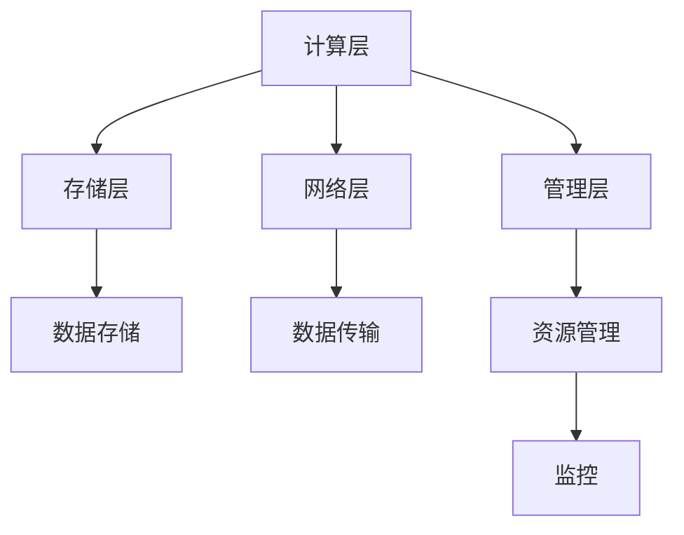
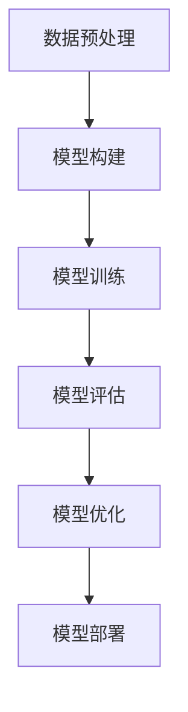

                 

# AI 大模型应用数据中心建设：数据中心技术创新

> 关键词：AI大模型、数据中心、技术创新、数据处理、模型训练、高性能计算

> 摘要：本文旨在探讨如何构建AI大模型应用数据中心，通过技术创新提升数据中心的性能和效率。我们将从背景介绍、核心概念与联系、核心算法原理与具体操作步骤、数学模型和公式、项目实战、实际应用场景、工具和资源推荐、总结与未来发展趋势等方面进行详细阐述。通过本文，读者将能够理解AI大模型应用数据中心的构建过程，并掌握相关技术的应用与实践。

## 1. 背景介绍

随着人工智能技术的飞速发展，AI大模型的应用场景日益广泛，从自然语言处理到图像识别，从推荐系统到自动驾驶，AI大模型在各个领域展现出巨大的潜力。然而，AI大模型的训练和应用对计算资源的需求极高，传统的数据中心架构难以满足其需求。因此，构建AI大模型应用数据中心成为当前技术领域的热点话题。

### 1.1 AI大模型的定义与特点

AI大模型是指参数量巨大、训练数据量庞大、计算复杂度高的机器学习模型。这些模型通常包含数百万甚至数十亿个参数，需要处理PB级别的训练数据。AI大模型的特点包括：

- **参数量巨大**：模型参数量通常在数百万到数十亿之间。
- **训练数据量庞大**：训练数据量通常在TB到PB级别。
- **计算复杂度高**：模型训练和推理过程需要大量的计算资源。
- **应用场景广泛**：包括自然语言处理、图像识别、推荐系统、自动驾驶等领域。

### 1.2 传统数据中心的挑战

传统数据中心在处理AI大模型时面临以下挑战：

- **计算资源不足**：传统数据中心的计算资源难以满足AI大模型的高计算需求。
- **数据传输延迟**：大规模数据传输过程中存在延迟问题，影响模型训练效率。
- **能耗问题**：AI大模型训练和推理过程能耗巨大，传统数据中心难以有效管理。
- **扩展性不足**：传统数据中心的扩展性有限，难以快速响应业务需求的变化。

### 1.3 AI大模型应用数据中心的需求

构建AI大模型应用数据中心的需求主要体现在以下几个方面：

- **高性能计算**：提供强大的计算能力，支持大规模模型训练和推理。
- **高效数据处理**：实现高效的数据传输和存储，降低数据处理延迟。
- **能耗管理**：优化能耗管理，降低数据中心的运营成本。
- **灵活扩展**：具备良好的扩展性，能够快速响应业务需求的变化。

## 2. 核心概念与联系

### 2.1 数据中心架构

数据中心架构主要包括计算层、存储层、网络层和管理层。计算层负责提供计算资源，存储层负责存储数据，网络层负责数据传输，管理层负责资源管理和监控。

#### Mermaid 流程图



### 2.2 AI大模型训练流程

AI大模型训练流程主要包括数据预处理、模型构建、模型训练和模型评估四个阶段。

#### Mermaid 流程图



## 3. 核心算法原理 & 具体操作步骤

### 3.1 数据预处理

数据预处理是AI大模型训练的第一步，主要包括数据清洗、数据标注和数据增强。

#### 具体操作步骤

1. **数据清洗**：去除无效数据、处理缺失值和异常值。
2. **数据标注**：对数据进行标注，以便模型学习。
3. **数据增强**：通过数据变换增加数据多样性，提高模型泛化能力。

### 3.2 模型构建

模型构建是AI大模型训练的关键步骤，主要包括选择合适的模型架构和配置超参数。

#### 具体操作步骤

1. **选择模型架构**：根据任务需求选择合适的模型架构，如Transformer、CNN等。
2. **配置超参数**：设置模型的超参数，如学习率、批次大小等。

### 3.3 模型训练

模型训练是AI大模型训练的核心步骤，主要包括前向传播、反向传播和优化算法。

#### 具体操作步骤

1. **前向传播**：计算模型的输出。
2. **反向传播**：计算损失函数对模型参数的梯度。
3. **优化算法**：使用优化算法更新模型参数，如SGD、Adam等。

### 3.4 模型评估

模型评估是AI大模型训练的最后一步，主要包括计算模型的准确率、损失值等指标。

#### 具体操作步骤

1. **计算准确率**：计算模型在测试集上的准确率。
2. **计算损失值**：计算模型在测试集上的损失值。
3. **模型优化**：根据评估结果调整模型参数，提高模型性能。

## 4. 数学模型和公式 & 详细讲解 & 举例说明

### 4.1 损失函数

损失函数是衡量模型预测结果与真实结果之间差异的数学模型。常用的损失函数包括均方误差（MSE）、交叉熵损失（Cross-Entropy Loss）等。

#### 公式

$$
\text{MSE} = \frac{1}{n} \sum_{i=1}^{n} (y_i - \hat{y}_i)^2
$$

$$
\text{Cross-Entropy Loss} = -\frac{1}{n} \sum_{i=1}^{n} \left[ y_i \log(\hat{y}_i) + (1 - y_i) \log(1 - \hat{y}_i) \right]
$$

### 4.2 优化算法

优化算法是通过调整模型参数来最小化损失函数的数学模型。常用的优化算法包括梯度下降（Gradient Descent）、随机梯度下降（SGD）、Adam等。

#### 公式

$$
\theta_{t+1} = \theta_t - \eta \nabla J(\theta_t)
$$

其中，$\theta_t$ 表示第 $t$ 次迭代的参数，$\eta$ 表示学习率，$\nabla J(\theta_t)$ 表示损失函数关于参数的梯度。

## 5. 项目实战：代码实际案例和详细解释说明

### 5.1 开发环境搭建

#### 环境配置

1. **操作系统**：Ubuntu 20.04
2. **Python版本**：3.8
3. **深度学习框架**：PyTorch 1.9

#### 安装依赖

```bash
sudo apt-get update
sudo apt-get install -y python3-pip
pip3 install torch torchvision
```

### 5.2 源代码详细实现和代码解读

#### 代码示例

```python
import torch
import torch.nn as nn
import torch.optim as optim

# 定义模型
class SimpleModel(nn.Module):
    def __init__(self):
        super(SimpleModel, self).__init__()
        self.fc1 = nn.Linear(10, 50)
        self.fc2 = nn.Linear(50, 1)

    def forward(self, x):
        x = torch.relu(self.fc1(x))
        x = self.fc2(x)
        return x

# 初始化模型
model = SimpleModel()

# 定义损失函数
criterion = nn.MSELoss()

# 定义优化器
optimizer = optim.SGD(model.parameters(), lr=0.01)

# 训练数据
x = torch.randn(100, 10)
y = torch.randn(100, 1)

# 训练模型
for epoch in range(100):
    # 前向传播
    outputs = model(x)
    loss = criterion(outputs, y)

    # 反向传播
    optimizer.zero_grad()
    loss.backward()

    # 更新参数
    optimizer.step()

    if (epoch+1) % 10 == 0:
        print(f'Epoch [{epoch+1}/100], Loss: {loss.item():.4f}')
```

### 5.3 代码解读与分析

1. **模型定义**：定义了一个简单的线性模型，包含两个全连接层。
2. **损失函数**：使用均方误差损失函数。
3. **优化器**：使用随机梯度下降优化器。
4. **训练数据**：生成随机输入和输出数据。
5. **训练过程**：通过前向传播、反向传播和参数更新完成模型训练。

## 6. 实际应用场景

### 6.1 自然语言处理

AI大模型在自然语言处理领域具有广泛的应用，如文本分类、情感分析、机器翻译等。

### 6.2 图像识别

AI大模型在图像识别领域具有广泛的应用，如物体检测、图像分类、图像生成等。

### 6.3 推荐系统

AI大模型在推荐系统领域具有广泛的应用，如用户画像、商品推荐、内容推荐等。

## 7. 工具和资源推荐

### 7.1 学习资源推荐

- **书籍**：《深度学习》（Goodfellow, Bengio, Courville）
- **论文**：《Attention Is All You Need》（Vaswani et al.）
- **博客**：阿里云开发者社区
- **网站**：PyTorch官网

### 7.2 开发工具框架推荐

- **深度学习框架**：PyTorch、TensorFlow
- **数据处理工具**：Pandas、NumPy
- **可视化工具**：Matplotlib、Seaborn

### 7.3 相关论文著作推荐

- **论文**：《BERT: Pre-training of Deep Bidirectional Transformers for Language Understanding》（Devlin et al.）
- **著作**：《深度学习实战》（周志华）

## 8. 总结：未来发展趋势与挑战

### 8.1 未来发展趋势

- **模型优化**：模型优化技术将进一步发展，提高模型的性能和效率。
- **计算资源**：计算资源将进一步提升，支持更大规模的模型训练和推理。
- **能耗管理**：能耗管理技术将进一步优化，降低数据中心的运营成本。
- **扩展性**：数据中心的扩展性将进一步提升，能够快速响应业务需求的变化。

### 8.2 挑战

- **计算资源**：计算资源的限制仍然是一个挑战，需要进一步提升计算能力。
- **数据传输**：数据传输延迟仍然是一个挑战，需要进一步优化数据传输技术。
- **能耗管理**：能耗管理仍然是一个挑战，需要进一步优化能耗管理技术。
- **扩展性**：数据中心的扩展性仍然是一个挑战，需要进一步提升扩展性。

## 9. 附录：常见问题与解答

### 9.1 问题1：如何选择合适的模型架构？

**解答**：选择合适的模型架构需要根据任务需求和数据特点进行综合考虑。可以参考现有的研究成果和实践经验，选择适合的任务和数据的模型架构。

### 9.2 问题2：如何优化模型参数？

**解答**：可以通过调整学习率、批次大小等超参数来优化模型参数。可以使用交叉验证等方法来选择最优的超参数。

### 9.3 问题3：如何降低数据传输延迟？

**解答**：可以通过优化数据传输技术、使用高速网络设备等方法来降低数据传输延迟。

## 10. 扩展阅读 & 参考资料

- **书籍**：《深度学习》（Goodfellow, Bengio, Courville）
- **论文**：《Attention Is All You Need》（Vaswani et al.）
- **网站**：PyTorch官网
- **博客**：阿里云开发者社区

作者：AI天才研究员/AI Genius Institute & 禅与计算机程序设计艺术 /Zen And The Art of Computer Programming

