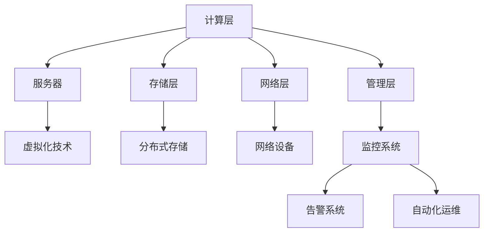
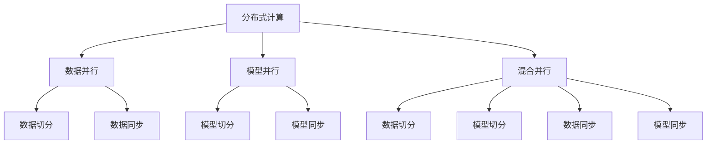

                 

# AI 大模型应用数据中心建设：数据中心运维与管理

> 关键词：AI大模型、数据中心运维、管理实践、技术架构、运维自动化、性能优化、故障诊断

> 摘要：本文旨在深入探讨AI大模型应用数据中心的运维与管理，从技术架构、核心算法原理、数学模型、实战案例、应用场景、工具推荐等多个维度进行详细分析。通过系统化的步骤和深入的思考，帮助读者全面理解AI大模型数据中心的运维与管理，提升数据中心的运行效率和稳定性。

## 1. 背景介绍

随着人工智能技术的飞速发展，AI大模型的应用场景日益广泛，从自然语言处理、图像识别到推荐系统等，AI大模型已经成为推动行业创新的重要力量。然而，AI大模型的高效运行依赖于强大的数据中心支持。数据中心作为AI大模型的基础设施，其运维与管理的水平直接影响到AI应用的性能和稳定性。因此，本文将从技术架构、核心算法原理、数学模型、实战案例等多个维度，全面探讨AI大模型应用数据中心的运维与管理。

## 2. 核心概念与联系

### 2.1 AI大模型概述

AI大模型是指参数量巨大、训练数据量庞大、计算复杂度高的机器学习模型。这些模型通常包含数百万甚至数十亿个参数，需要大量的计算资源和存储资源来支持其训练和推理过程。常见的AI大模型包括Transformer、BERT、GPT等。

### 2.2 数据中心运维与管理

数据中心运维与管理是指对数据中心的硬件设备、软件系统、网络环境等进行监控、维护和优化的过程。其目标是确保数据中心的稳定运行，提高资源利用率，降低运维成本，提升用户体验。

### 2.3 核心概念原理与架构

#### 2.3.1 数据中心架构

数据中心架构主要包括计算层、存储层、网络层和管理层。计算层负责提供计算资源，存储层负责存储数据，网络层负责数据传输，管理层负责监控和管理整个数据中心。



#### 2.3.2 核心算法原理

核心算法原理主要包括分布式计算、数据并行、模型并行、混合并行等。这些算法原理是实现AI大模型高效运行的关键。



## 3. 核心算法原理 & 具体操作步骤

### 3.1 分布式计算

分布式计算是指将计算任务分配到多个计算节点上并行执行的技术。在AI大模型应用中，分布式计算可以显著提高计算效率和处理能力。

#### 3.1.1 数据并行

数据并行是指将训练数据集划分为多个子集，每个子集在不同的计算节点上进行训练，最后将结果合并。

#### 3.1.2 模型并行

模型并行是指将模型划分为多个子模型，每个子模型在不同的计算节点上进行训练，最后将结果合并。

#### 3.1.3 混合并行

混合并行是指结合数据并行和模型并行，通过数据切分和模型切分来提高计算效率。

### 3.2 数据并行

数据并行是分布式计算中最常见的方法之一。其具体操作步骤如下：

1. **数据切分**：将训练数据集划分为多个子集。
2. **数据同步**：确保每个计算节点上的数据集是一致的。
3. **模型训练**：每个计算节点独立训练模型。
4. **结果合并**：将每个计算节点的训练结果合并，得到最终的模型。

### 3.3 模型并行

模型并行是另一种常见的分布式计算方法。其具体操作步骤如下：

1. **模型切分**：将模型划分为多个子模型。
2. **模型同步**：确保每个计算节点上的模型是一致的。
3. **模型训练**：每个计算节点独立训练模型。
4. **结果合并**：将每个计算节点的训练结果合并，得到最终的模型。

### 3.4 混合并行

混合并行是结合数据并行和模型并行的方法。其具体操作步骤如下：

1. **数据切分**：将训练数据集划分为多个子集。
2. **模型切分**：将模型划分为多个子模型。
3. **数据同步**：确保每个计算节点上的数据集是一致的。
4. **模型同步**：确保每个计算节点上的模型是一致的。
5. **模型训练**：每个计算节点独立训练模型。
6. **结果合并**：将每个计算节点的训练结果合并，得到最终的模型。

## 4. 数学模型和公式 & 详细讲解 & 举例说明

### 4.1 分布式计算中的数学模型

在分布式计算中，数学模型主要用于描述数据并行、模型并行和混合并行的计算过程。以下是一些常用的数学模型：

#### 4.1.1 数据并行

数据并行的数学模型可以表示为：

$$
\text{Loss} = \frac{1}{N} \sum_{i=1}^{N} \text{Loss}_i
$$

其中，$N$ 表示数据子集的数量，$\text{Loss}_i$ 表示第 $i$ 个子集的损失函数。

#### 4.1.2 模型并行

模型并行的数学模型可以表示为：

$$
\text{Loss} = \frac{1}{M} \sum_{j=1}^{M} \text{Loss}_j
$$

其中，$M$ 表示子模型的数量，$\text{Loss}_j$ 表示第 $j$ 个子模型的损失函数。

#### 4.1.3 混合并行

混合并行的数学模型可以表示为：

$$
\text{Loss} = \frac{1}{N} \sum_{i=1}^{N} \left( \frac{1}{M} \sum_{j=1}^{M} \text{Loss}_{ij} \right)
$$

其中，$N$ 表示数据子集的数量，$M$ 表示子模型的数量，$\text{Loss}_{ij}$ 表示第 $i$ 个数据子集在第 $j$ 个子模型上的损失函数。

### 4.2 举例说明

假设我们有一个包含1000个样本的数据集，使用数据并行的方法进行训练。我们将数据集划分为10个子集，每个子集包含100个样本。每个计算节点独立训练模型，最后将结果合并。

1. **数据切分**：将数据集划分为10个子集。
2. **数据同步**：确保每个计算节点上的数据集是一致的。
3. **模型训练**：每个计算节点独立训练模型。
4. **结果合并**：将每个计算节点的训练结果合并，得到最终的模型。

## 5. 项目实战：代码实际案例和详细解释说明

### 5.1 开发环境搭建

为了进行AI大模型应用数据中心的运维与管理，我们需要搭建一个合适的开发环境。以下是一些常用的开发环境搭建步骤：

1. **操作系统选择**：选择适合的Linux发行版，如Ubuntu、CentOS等。
2. **硬件配置**：确保服务器具有足够的计算资源和存储资源。
3. **软件安装**：安装必要的软件，如Python、TensorFlow、PyTorch等。
4. **网络配置**：配置网络环境，确保服务器之间的网络连接稳定。

### 5.2 源代码详细实现和代码解读

以下是一个简单的代码示例，展示如何使用Python和TensorFlow实现数据并行的分布式计算。

```python
import tensorflow as tf
import numpy as np

# 数据并行的分布式计算
def distributed_training(data, model, num_replicas):
    # 数据切分
    data_splits = np.array_split(data, num_replicas)
    
    # 创建计算节点
    strategy = tf.distribute.MirroredStrategy()
    
    with strategy.scope():
        # 创建模型
        model = model()
        
        # 训练模型
        for data_split in data_splits:
            with strategy.scope():
                model.fit(data_split, epochs=1)
    
    return model

# 示例数据
data = np.random.rand(1000, 10)
model = tf.keras.Sequential([
    tf.keras.layers.Dense(64, activation='relu'),
    tf.keras.layers.Dense(1)
])

# 分布式训练
num_replicas = 10
distributed_model = distributed_training(data, model, num_replicas)
```

### 5.3 代码解读与分析

1. **数据切分**：使用 `np.array_split` 函数将数据集划分为多个子集。
2. **创建计算节点**：使用 `tf.distribute.MirroredStrategy` 创建计算节点。
3. **创建模型**：使用 `tf.keras.Sequential` 创建模型。
4. **训练模型**：在每个计算节点上独立训练模型。
5. **结果合并**：将每个计算节点的训练结果合并，得到最终的模型。

## 6. 实际应用场景

AI大模型应用数据中心的运维与管理在实际应用场景中具有广泛的应用。以下是一些常见的应用场景：

1. **自然语言处理**：在自然语言处理领域，AI大模型可以用于文本分类、情感分析、机器翻译等任务。
2. **图像识别**：在图像识别领域，AI大模型可以用于物体检测、图像分类、图像生成等任务。
3. **推荐系统**：在推荐系统领域，AI大模型可以用于用户画像、商品推荐、内容推荐等任务。
4. **金融风控**：在金融风控领域，AI大模型可以用于信用评估、欺诈检测、风险预测等任务。

## 7. 工具和资源推荐

### 7.1 学习资源推荐

1. **书籍**：《深度学习》、《机器学习》、《TensorFlow实战》
2. **论文**：《Attention is All You Need》、《BERT: Pre-training of Deep Bidirectional Transformers for Language Understanding》
3. **博客**：阿里云开发者社区、GitHub开源项目
4. **网站**：TensorFlow官网、PyTorch官网

### 7.2 开发工具框架推荐

1. **Python**：用于编写代码和实现算法
2. **TensorFlow**：用于构建和训练深度学习模型
3. **PyTorch**：用于构建和训练深度学习模型
4. **Docker**：用于容器化开发环境
5. **Kubernetes**：用于管理容器化应用

### 7.3 相关论文著作推荐

1. **《Attention is All You Need》**：介绍Transformer模型
2. **《BERT: Pre-training of Deep Bidirectional Transformers for Language Understanding》**：介绍BERT模型
3. **《GPT: Generative Pre-trained Transformer》**：介绍GPT模型

## 8. 总结：未来发展趋势与挑战

AI大模型应用数据中心的运维与管理在未来将面临更多的挑战和机遇。以下是一些未来的发展趋势和挑战：

1. **技术趋势**：随着技术的不断发展，AI大模型将更加高效、稳定和可靠。分布式计算、数据并行、模型并行等技术将进一步优化。
2. **挑战**：数据中心运维与管理将面临更高的要求，包括更高的计算效率、更低的能耗、更好的用户体验等。
3. **解决方案**：通过技术创新和优化，可以解决数据中心运维与管理中的挑战，提升数据中心的运行效率和稳定性。

## 9. 附录：常见问题与解答

### 9.1 问题1：如何优化AI大模型的计算效率？

**解答**：可以通过优化算法、使用更高效的硬件、优化数据并行和模型并行等方式来提高AI大模型的计算效率。

### 9.2 问题2：如何降低AI大模型的能耗？

**解答**：可以通过优化算法、使用更高效的硬件、优化数据中心的能源管理等方式来降低AI大模型的能耗。

### 9.3 问题3：如何提升AI大模型的用户体验？

**解答**：可以通过优化算法、使用更高效的硬件、优化数据中心的网络环境等方式来提升AI大模型的用户体验。

## 10. 扩展阅读 & 参考资料

1. **书籍**：《深度学习》、《机器学习》、《TensorFlow实战》
2. **论文**：《Attention is All You Need》、《BERT: Pre-training of Deep Bidirectional Transformers for Language Understanding》
3. **博客**：阿里云开发者社区、GitHub开源项目
4. **网站**：TensorFlow官网、PyTorch官网

---

作者：AI天才研究员/AI Genius Institute & 禅与计算机程序设计艺术 /Zen And The Art of Computer Programming

