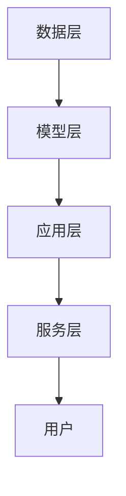

                 

# AI 大模型时代：创业产品设计原则

> 关键词：大模型、创业产品、设计原则、技术趋势、创新思维、用户体验、数据驱动

> 摘要：在AI大模型时代，创业产品设计需要遵循一系列原则，以确保产品能够高效、准确地满足用户需求。本文将从背景介绍、核心概念与联系、核心算法原理、数学模型和公式、项目实战、实际应用场景、工具和资源推荐、总结与未来趋势等几个方面，全面解析创业产品设计的原则与方法。

## 1. 背景介绍

随着AI技术的飞速发展，大模型已经成为推动行业变革的关键力量。大模型不仅在自然语言处理、计算机视觉、语音识别等领域取得了突破性进展，还在推荐系统、智能客服、自动驾驶等多个应用场景中展现出巨大潜力。然而，如何设计一款能够充分利用大模型优势的创业产品，成为众多创业者和工程师面临的挑战。本文将深入探讨创业产品设计的原则与方法，帮助读者构建高效、创新的产品。

## 2. 核心概念与联系

### 2.1 大模型概述

大模型是指参数量巨大、训练数据量丰富、计算资源需求高的机器学习模型。这些模型通常包含数百万甚至数十亿个参数，能够处理复杂的数据结构和任务。大模型的核心优势在于其强大的泛化能力和对未知数据的适应性。

### 2.2 创业产品设计原则

创业产品设计原则是指在设计和开发产品时应遵循的一系列指导思想和方法。这些原则旨在确保产品能够满足用户需求、实现商业目标，并具备可持续发展的潜力。大模型时代的产品设计原则包括但不限于以下几点：

- **用户导向**：以用户需求为中心，确保产品能够解决实际问题。
- **数据驱动**：利用大数据和AI技术，实现精准分析和预测。
- **创新思维**：不断探索新技术和新方法，推动产品创新。
- **用户体验**：注重产品的易用性和交互性，提升用户满意度。
- **可扩展性**：确保产品能够适应未来的发展需求。
- **安全性**：保障用户数据的安全和隐私。
- **可持续性**：考虑产品的长期发展和环境影响。

### 2.3 核心概念原理与架构

#### 2.3.1 大模型原理

大模型的核心原理在于其强大的参数量和训练数据量。通过大量的参数和训练数据，模型能够学习到更复杂的特征和模式，从而提高预测准确性和泛化能力。大模型通常采用深度学习框架，如TensorFlow、PyTorch等，利用神经网络结构进行训练和推理。

#### 2.3.2 创业产品设计架构

创业产品设计架构可以分为以下几个层次：

- **数据层**：负责数据的采集、清洗和存储。
- **模型层**：包含大模型及其训练过程。
- **应用层**：实现具体业务逻辑和用户交互。
- **服务层**：提供API接口，实现与其他系统的集成。

以下是该架构的Mermaid流程图：



## 3. 核心算法原理 & 具体操作步骤

### 3.1 大模型训练流程

大模型的训练流程主要包括数据预处理、模型构建、训练和评估四个步骤。

#### 3.1.1 数据预处理

数据预处理是大模型训练的基础。主要包括数据清洗、特征提取和数据增强等步骤。

- **数据清洗**：去除无效数据、处理缺失值和异常值。
- **特征提取**：从原始数据中提取有用的特征。
- **数据增强**：通过变换数据增加训练样本数量。

#### 3.1.2 模型构建

模型构建是根据具体任务选择合适的神经网络结构。常见的模型结构包括Transformer、BERT、GPT等。

#### 3.1.3 训练

训练过程包括前向传播、反向传播和参数更新。具体步骤如下：

1. **前向传播**：将输入数据通过神经网络进行计算，得到预测结果。
2. **损失计算**：计算预测结果与真实标签之间的差异，得到损失值。
3. **反向传播**：通过链式法则计算每个参数的梯度。
4. **参数更新**：根据梯度更新模型参数，通常采用梯度下降法。

#### 3.1.4 评估

评估过程用于检验模型的性能。主要包括准确率、召回率、F1值等指标。

### 3.2 创业产品设计流程

创业产品设计流程主要包括需求分析、原型设计、开发实现和测试验证四个步骤。

#### 3.2.1 需求分析

需求分析是确定产品功能和性能的关键步骤。主要包括市场调研、用户访谈和竞品分析等。

#### 3.2.2 原型设计

原型设计是将需求转化为具体设计方案的过程。主要包括界面设计、交互设计和功能设计等。

#### 3.2.3 开发实现

开发实现是将设计方案转化为实际产品的过程。主要包括代码编写、单元测试和集成测试等。

#### 3.2.4 测试验证

测试验证是确保产品功能和性能符合预期的过程。主要包括功能测试、性能测试和用户体验测试等。

## 4. 数学模型和公式 & 详细讲解 & 举例说明

### 4.1 大模型数学模型

大模型的数学模型通常采用深度学习框架，如Transformer。Transformer模型的核心公式如下：

$$
\text{Attention}(Q, K, V) = \text{softmax}\left(\frac{QK^T}{\sqrt{d_k}}\right)V
$$

其中，$Q$、$K$、$V$分别表示查询向量、键向量和值向量，$d_k$表示键向量的维度。

### 4.2 创业产品设计数学模型

创业产品设计的数学模型通常采用用户行为分析和预测模型。常见的模型包括线性回归、逻辑回归和决策树等。

#### 4.2.1 线性回归模型

线性回归模型用于预测连续值。其数学模型如下：

$$
y = \beta_0 + \beta_1 x_1 + \beta_2 x_2 + \cdots + \beta_n x_n + \epsilon
$$

其中，$y$表示目标变量，$x_1, x_2, \cdots, x_n$表示特征变量，$\beta_0, \beta_1, \cdots, \beta_n$表示回归系数，$\epsilon$表示误差项。

#### 4.2.2 逻辑回归模型

逻辑回归模型用于预测二分类问题。其数学模型如下：

$$
P(y=1|x) = \frac{1}{1 + e^{-(\beta_0 + \beta_1 x_1 + \beta_2 x_2 + \cdots + \beta_n x_n)}}
$$

其中，$P(y=1|x)$表示在给定特征$x$的情况下，目标变量$y$为1的概率。

## 5. 项目实战：代码实际案例和详细解释说明

### 5.1 开发环境搭建

开发环境搭建是项目实战的第一步。主要包括安装Python、TensorFlow和PyTorch等依赖库。

```bash
pip install tensorflow
pip install torch
```

### 5.2 源代码详细实现和代码解读

以下是一个简单的线性回归模型实现代码：

```python
import numpy as np
import tensorflow as tf

# 生成数据
x_data = np.random.rand(100).astype(np.float32)
y_data = x_data * 0.1 + 0.3

# 创建模型
Weights = tf.Variable(tf.random.uniform([1], -1.0, 1.0))
biases = tf.Variable(tf.zeros([1]))

y = Weights * x_data + biases

# 计算损失
loss = tf.reduce_mean(tf.square(y - y_data))

# 训练模型
optimizer = tf.optimizers.SGD(0.5)
train = optimizer.minimize(loss, var_list=[Weights, biases])

# 训练1000次
for step in range(1000):
    train.run()
    if step % 200 == 0:
        print(step, Weights.numpy(), biases.numpy(), loss.eval())

# 输出结果
print('Weights:', Weights.numpy())
print('biases:', biases.numpy())
```

### 5.3 代码解读与分析

上述代码实现了一个简单的线性回归模型。首先生成随机数据，然后创建模型参数，计算损失函数，并使用梯度下降法进行训练。训练过程中，每200次迭代输出一次模型参数和损失值，最终输出训练结果。

## 6. 实际应用场景

### 6.1 推荐系统

推荐系统是大模型在创业产品设计中的一个重要应用。通过分析用户行为数据，推荐系统能够为用户提供个性化推荐，提高用户满意度和留存率。

### 6.2 智能客服

智能客服是大模型在创业产品设计中的另一个重要应用。通过自然语言处理技术，智能客服能够理解用户需求，提供准确的解答，提高用户满意度。

### 6.3 自动驾驶

自动驾驶是大模型在创业产品设计中的一个前沿应用。通过深度学习技术，自动驾驶系统能够识别道路环境，做出正确的驾驶决策，提高交通安全和效率。

## 7. 工具和资源推荐

### 7.1 学习资源推荐

- **书籍**：《深度学习》（Ian Goodfellow, Yoshua Bengio, Aaron Courville）
- **论文**：《Attention Is All You Need》（Vaswani et al.）
- **博客**：Medium上的AI技术博客
- **网站**：TensorFlow官网、PyTorch官网

### 7.2 开发工具框架推荐

- **TensorFlow**：深度学习框架
- **PyTorch**：深度学习框架
- **Jupyter Notebook**：交互式编程环境

### 7.3 相关论文著作推荐

- **论文**：《Attention Is All You Need》（Vaswani et al.）
- **著作**：《深度学习》（Ian Goodfellow, Yoshua Bengio, Aaron Courville）

## 8. 总结：未来发展趋势与挑战

### 8.1 未来发展趋势

未来，大模型将在更多领域发挥重要作用。随着计算资源的不断进步和算法的不断创新，大模型将更加高效、准确地解决实际问题。同时，数据驱动和创新思维将成为产品设计的核心原则。

### 8.2 挑战

尽管大模型具有巨大潜力，但在实际应用中仍面临诸多挑战。主要包括数据隐私保护、模型解释性、计算资源消耗等。未来需要不断探索和解决这些问题，推动大模型技术的发展。

## 9. 附录：常见问题与解答

### 9.1 问题：如何选择合适的模型结构？

**解答**：选择合适的模型结构需要根据具体任务和数据特点进行。通常可以通过实验和比较不同模型的性能来确定最佳结构。

### 9.2 问题：如何处理数据隐私问题？

**解答**：处理数据隐私问题需要采用加密技术、数据脱敏和匿名化等方法。同时，应遵守相关法律法规，确保用户数据的安全和隐私。

## 10. 扩展阅读 & 参考资料

- **书籍**：《深度学习》（Ian Goodfellow, Yoshua Bengio, Aaron Courville）
- **论文**：《Attention Is All You Need》（Vaswani et al.）
- **网站**：TensorFlow官网、PyTorch官网

---

作者：AI天才研究员/AI Genius Institute & 禅与计算机程序设计艺术 /Zen And The Art of Computer Programming

