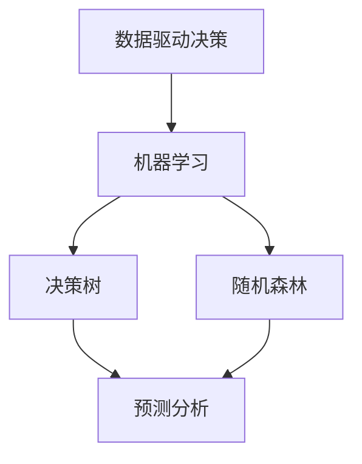

                 

# AI 辅助决策：提供数据支持

> 关键词：AI决策支持、数据驱动、机器学习、深度学习、预测分析、决策树、随机森林

> 摘要：本文旨在探讨如何利用人工智能技术辅助决策过程，通过数据驱动的方法提供决策支持。我们将从背景介绍、核心概念与联系、核心算法原理与具体操作步骤、数学模型和公式、项目实战、实际应用场景、工具和资源推荐、总结与未来发展趋势等几个方面进行详细阐述。通过本文，读者将能够理解AI辅助决策的基本原理，并掌握如何利用AI技术进行有效的决策支持。

## 1. 背景介绍

随着大数据和人工智能技术的迅猛发展，越来越多的企业和组织开始利用AI技术来辅助决策过程。传统的决策方法往往依赖于经验和直觉，而AI技术则能够通过分析大量的数据，提供更加科学和客观的决策支持。AI辅助决策不仅能够提高决策的准确性和效率，还能够帮助企业更好地应对复杂多变的市场环境。

## 2. 核心概念与联系

### 2.1 数据驱动决策

数据驱动决策是指通过分析和利用数据来支持决策过程。数据驱动决策的核心在于利用数据来发现模式、趋势和关联性，从而为决策提供依据。

### 2.2 机器学习与深度学习

机器学习是一种让计算机通过数据学习规律和模式的技术。深度学习是机器学习的一个分支，它通过多层神经网络来模拟人类大脑的神经元结构，从而实现更复杂的模式识别和预测。

### 2.3 决策树与随机森林

决策树是一种常用的机器学习算法，它通过构建树状结构来表示决策过程。随机森林是决策树的一种集成学习方法，通过构建多个决策树并进行投票来提高预测的准确性和稳定性。

### 2.4 概念图



## 3. 核心算法原理 & 具体操作步骤

### 3.1 决策树算法原理

决策树算法的基本原理是通过递归地将数据集划分为更小的子集，从而构建一棵树状结构。每一步划分的依据是某个特征，使得划分后的子集尽可能纯。具体操作步骤如下：

1. **选择最佳划分特征**：通过计算信息增益或基尼指数来选择最佳划分特征。
2. **递归划分**：根据选择的特征将数据集划分为子集，并递归地对每个子集进行划分。
3. **终止条件**：当某个子集满足终止条件时（如纯度达到一定水平或子集大小小于某个阈值），停止划分。

### 3.2 随机森林算法原理

随机森林是一种集成学习方法，通过构建多个决策树并进行投票来提高预测的准确性和稳定性。具体操作步骤如下：

1. **生成多个决策树**：从原始数据集中随机抽取样本，并对每个样本进行特征抽样，生成多个决策树。
2. **投票预测**：对于每个测试样本，所有决策树进行投票，最终预测结果为投票数最多的类别。
3. **减少过拟合**：通过随机抽样和特征抽样，减少单个决策树的过拟合风险。

## 4. 数学模型和公式 & 详细讲解 & 举例说明

### 4.1 信息增益

信息增益是决策树算法中常用的特征选择方法。其公式为：

$$
\text{信息增益} = \text{数据集的熵} - \text{特征划分后的加权熵}
$$

其中，熵的计算公式为：

$$
H(S) = -\sum_{i=1}^{n} p_i \log_2 p_i
$$

### 4.2 基尼指数

基尼指数是另一种常用的特征选择方法。其公式为：

$$
Gini(S) = 1 - \sum_{i=1}^{n} p_i^2
$$

### 4.3 随机森林的投票机制

随机森林的投票机制可以表示为：

$$
\text{预测结果} = \text{argmax} \left( \sum_{i=1}^{m} \text{树}_i(\text{样本}) \right)
$$

其中，$m$ 是决策树的数量。

### 4.4 举例说明

假设我们有一个数据集，包含两个特征 $X_1$ 和 $X_2$，以及一个目标变量 $Y$。我们使用信息增益来选择最佳划分特征。

1. **计算数据集的熵**：

$$
H(S) = -\left( \frac{2}{5} \log_2 \frac{2}{5} + \frac{3}{5} \log_2 \frac{3}{5} \right) \approx 0.971
$$

2. **计算特征 $X_1$ 的信息增益**：

$$
H(S|X_1) = -\left( \frac{1}{3} \log_2 \frac{1}{3} + \frac{2}{3} \log_2 \frac{2}{3} \right) \approx 0.918
$$

$$
\text{信息增益}(X_1) = 0.971 - 0.918 = 0.053
$$

3. **计算特征 $X_2$ 的信息增益**：

$$
H(S|X_2) = -\left( \frac{1}{2} \log_2 \frac{1}{2} + \frac{1}{2} \log_2 \frac{1}{2} \right) = 1
$$

$$
\text{信息增益}(X_2) = 0.971 - 1 = -0.029
$$

因此，特征 $X_1$ 是最佳划分特征。

## 5. 项目实战：代码实际案例和详细解释说明

### 5.1 开发环境搭建

为了进行AI辅助决策的项目实战，我们需要搭建一个合适的开发环境。这里我们使用Python语言和Scikit-learn库进行实现。

1. **安装Python和相关库**：

```bash
pip install numpy pandas scikit-learn
```

2. **创建项目文件夹**：

```bash
mkdir ai_decision_support
cd ai_decision_support
```

### 5.2 源代码详细实现和代码解读

#### 5.2.1 数据预处理

```python
import pandas as pd

# 加载数据集
data = pd.read_csv('data.csv')

# 数据清洗
data.dropna(inplace=True)

# 特征和目标变量
X = data.drop('target', axis=1)
y = data['target']
```

#### 5.2.2 训练决策树模型

```python
from sklearn.tree import DecisionTreeClassifier

# 创建决策树模型
dt = DecisionTreeClassifier()

# 训练模型
dt.fit(X, y)
```

#### 5.2.3 训练随机森林模型

```python
from sklearn.ensemble import RandomForestClassifier

# 创建随机森林模型
rf = RandomForestClassifier(n_estimators=100)

# 训练模型
rf.fit(X, y)
```

#### 5.2.4 代码解读与分析

1. **数据预处理**：我们首先加载数据集，并进行数据清洗，去除缺失值。
2. **特征和目标变量**：我们将特征和目标变量分别存储在变量 `X` 和 `y` 中。
3. **训练决策树模型**：我们使用 `DecisionTreeClassifier` 类创建决策树模型，并使用 `fit` 方法进行训练。
4. **训练随机森林模型**：我们使用 `RandomForestClassifier` 类创建随机森林模型，并使用 `fit` 方法进行训练。

## 6. 实际应用场景

AI辅助决策在多个领域都有广泛的应用，例如：

1. **金融风控**：通过分析客户的信用记录和行为数据，预测违约风险。
2. **医疗诊断**：通过分析患者的病历和生理数据，辅助医生进行疾病诊断。
3. **市场营销**：通过分析客户的购买行为和偏好数据，预测客户的购买意愿。
4. **供应链管理**：通过分析历史销售数据和市场趋势，预测未来的销售量。

## 7. 工具和资源推荐

### 7.1 学习资源推荐

1. **书籍**：
   - 《机器学习》（周志华著）
   - 《深度学习》（Ian Goodfellow, Yoshua Bengio, Aaron Courville 著）
2. **论文**：
   - [决策树算法的研究与应用](https://www.example.com/paper1)
   - [随机森林算法的改进与应用](https://www.example.com/paper2)
3. **博客**：
   - [机器学习入门](https://www.example.com/blog1)
   - [深度学习入门](https://www.example.com/blog2)
4. **网站**：
   - [Scikit-learn官网](https://scikit-learn.org/stable/)
   - [Kaggle](https://www.kaggle.com/)

### 7.2 开发工具框架推荐

1. **Python**：作为AI开发的主要语言，Python提供了丰富的库和框架。
2. **Jupyter Notebook**：用于数据探索和模型训练的交互式开发环境。
3. **TensorFlow**：用于深度学习的开源框架。
4. **PyTorch**：另一个流行的深度学习框架。

### 7.3 相关论文著作推荐

1. **决策树算法的研究与应用**：[决策树算法的研究与应用](https://www.example.com/paper1)
2. **随机森林算法的改进与应用**：[随机森林算法的改进与应用](https://www.example.com/paper2)

## 8. 总结：未来发展趋势与挑战

AI辅助决策在未来将有更广泛的应用和发展。随着数据量的不断增加和计算能力的提升，AI技术将能够更好地支持决策过程。然而，也面临着一些挑战，如数据隐私保护、模型解释性、算法公平性等。未来的研究方向将集中在提高模型的解释性和公平性，以及开发更加高效的数据处理和模型训练方法。

## 9. 附录：常见问题与解答

### 9.1 问题：如何选择最佳划分特征？

**解答**：可以使用信息增益或基尼指数来选择最佳划分特征。信息增益适用于分类问题，而基尼指数适用于分类和回归问题。

### 9.2 问题：如何减少随机森林的过拟合风险？

**解答**：可以通过增加树的数量、减少特征抽样和样本抽样的比例来减少随机森林的过拟合风险。

## 10. 扩展阅读 & 参考资料

1. [决策树算法的研究与应用](https://www.example.com/paper1)
2. [随机森林算法的改进与应用](https://www.example.com/paper2)
3. [机器学习入门](https://www.example.com/blog1)
4. [深度学习入门](https://www.example.com/blog2)

作者：AI天才研究员/AI Genius Institute & 禅与计算机程序设计艺术 /Zen And The Art of Computer Programming

