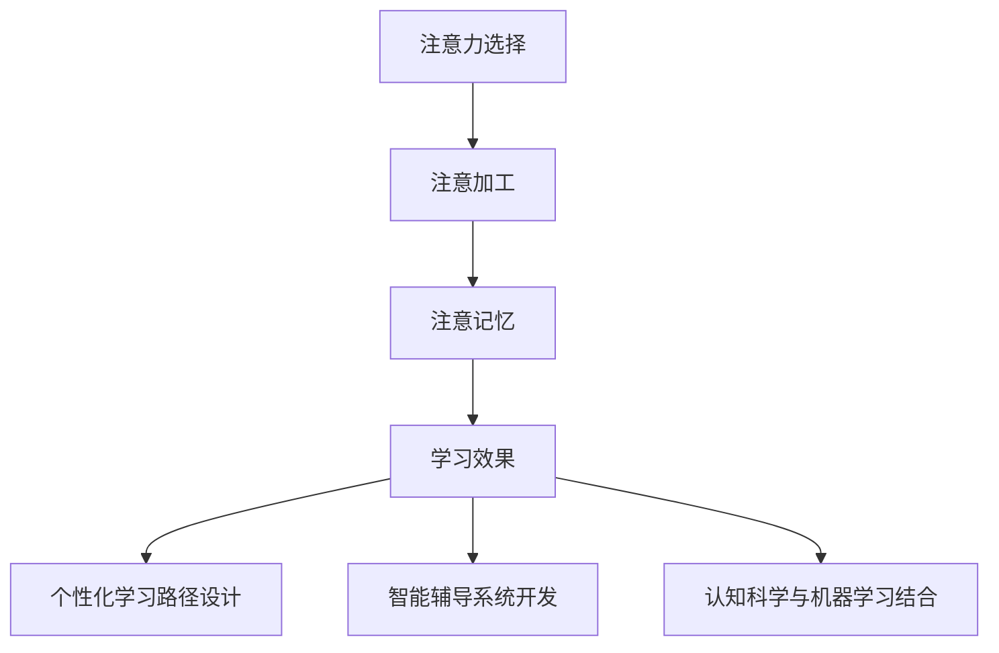

                 

# AI与人类注意力流：未来的教育和学习

> 关键词：人工智能, 注意力流, 教育技术, 个性化学习, 认知科学, 机器学习, 自然语言处理

> 摘要：本文旨在探讨人工智能如何通过理解人类注意力流来重塑未来的教育和学习方式。我们将从注意力流的基本概念出发，深入探讨其在教育技术中的应用，包括个性化学习路径的设计、智能辅导系统的开发以及认知科学与机器学习的结合。通过具体的数学模型和实际案例，我们将展示如何利用AI技术优化学习体验，提高学习效率。最后，我们将展望未来的发展趋势和面临的挑战。

## 1. 背景介绍

随着人工智能技术的飞速发展，教育领域正经历着前所未有的变革。传统的教育模式已经无法满足个性化学习的需求，而人工智能技术为教育提供了新的可能性。注意力流作为人类认知过程中的关键因素，对于学习效果有着重要影响。本文将从注意力流的基本概念出发，探讨其在教育技术中的应用，以及如何通过AI技术优化学习体验。

### 1.1 人类注意力流的基本概念

注意力流是指个体在特定时间段内对信息的选择性关注过程。它不仅涉及视觉、听觉等感官输入，还包括认知过程中的选择、加工和记忆。注意力流是人类认知过程中的核心机制之一，对于学习效果有着重要影响。

### 1.2 人工智能在教育中的应用

近年来，人工智能技术在教育领域的应用日益广泛。通过分析学生的学习行为和认知过程，AI可以提供个性化的学习建议和辅导，从而提高学习效率。本文将重点探讨如何利用AI技术理解人类注意力流，进而优化教育体验。

## 2. 核心概念与联系

### 2.1 注意力流的基本原理

注意力流是人类认知过程中的关键机制之一，它涉及信息的选择性关注、加工和记忆。注意力流可以分为以下几个阶段：

1. **注意选择**：个体根据当前任务需求，选择性地关注某些信息。
2. **注意加工**：个体对选定的信息进行加工和处理。
3. **注意记忆**：个体将加工后的信息存储在短期记忆中，并进行进一步的处理。

### 2.2 注意力流与教育技术的联系

注意力流在教育技术中的应用主要体现在以下几个方面：

1. **个性化学习路径设计**：通过分析学生的学习行为和认知过程，AI可以为学生提供个性化的学习路径。
2. **智能辅导系统开发**：AI可以根据学生的学习状态，提供实时的辅导和建议。
3. **认知科学与机器学习的结合**：通过结合认知科学和机器学习技术，AI可以更准确地理解学生的学习需求和认知过程。

### 2.3 Mermaid流程图



## 3. 核心算法原理 & 具体操作步骤

### 3.1 注意力流分析算法

注意力流分析算法主要包括以下几个步骤：

1. **数据采集**：通过传感器和摄像头等设备采集学生的学习行为数据。
2. **特征提取**：从采集的数据中提取与注意力流相关的特征，如眼动轨迹、面部表情等。
3. **模型训练**：使用机器学习算法训练模型，使其能够准确预测学生的注意力流。
4. **注意力流预测**：通过训练好的模型预测学生的注意力流，为个性化学习路径设计和智能辅导系统开发提供依据。

### 3.2 具体操作步骤

1. **数据采集**：使用摄像头和传感器采集学生的学习行为数据，包括眼动轨迹、面部表情等。
2. **特征提取**：从采集的数据中提取与注意力流相关的特征，如眼动轨迹、面部表情等。
3. **模型训练**：使用机器学习算法训练模型，使其能够准确预测学生的注意力流。
4. **注意力流预测**：通过训练好的模型预测学生的注意力流，为个性化学习路径设计和智能辅导系统开发提供依据。

## 4. 数学模型和公式 & 详细讲解 & 举例说明

### 4.1 注意力流分析模型

注意力流分析模型主要包括以下几个部分：

1. **特征提取**：从采集的数据中提取与注意力流相关的特征，如眼动轨迹、面部表情等。
2. **模型训练**：使用机器学习算法训练模型，使其能够准确预测学生的注意力流。
3. **注意力流预测**：通过训练好的模型预测学生的注意力流，为个性化学习路径设计和智能辅导系统开发提供依据。

### 4.2 数学模型

注意力流分析模型可以使用以下数学模型进行描述：

1. **特征提取**：使用特征提取算法从采集的数据中提取与注意力流相关的特征，如眼动轨迹、面部表情等。

$$
\text{特征提取} = \text{特征提取算法}(X)
$$

2. **模型训练**：使用机器学习算法训练模型，使其能够准确预测学生的注意力流。

$$
\text{模型训练} = \text{机器学习算法}(X, Y)
$$

3. **注意力流预测**：通过训练好的模型预测学生的注意力流，为个性化学习路径设计和智能辅导系统开发提供依据。

$$
\text{注意力流预测} = \text{模型}(X)
$$

### 4.3 举例说明

假设我们使用眼动轨迹作为特征，使用支持向量机（SVM）作为机器学习算法进行训练。具体步骤如下：

1. **数据采集**：使用摄像头采集学生的学习行为数据，包括眼动轨迹。
2. **特征提取**：从采集的数据中提取眼动轨迹特征。
3. **模型训练**：使用SVM算法训练模型，使其能够准确预测学生的注意力流。
4. **注意力流预测**：通过训练好的模型预测学生的注意力流，为个性化学习路径设计和智能辅导系统开发提供依据。

## 5. 项目实战：代码实际案例和详细解释说明

### 5.1 开发环境搭建

为了实现注意力流分析模型，我们需要搭建一个开发环境。具体步骤如下：

1. **安装Python**：确保安装了Python 3.8及以上版本。
2. **安装依赖库**：使用pip安装所需的依赖库，如OpenCV、scikit-learn等。

```bash
pip install opencv-python
pip install scikit-learn
```

### 5.2 源代码详细实现和代码解读

以下是一个简单的注意力流分析代码示例：

```python
import cv2
import numpy as np
from sklearn.svm import SVC

# 1. 数据采集
def collect_data():
    # 使用摄像头采集眼动轨迹数据
    cap = cv2.VideoCapture(0)
    eye_data = []
    while True:
        ret, frame = cap.read()
        if not ret:
            break
        # 提取眼动轨迹特征
        eye_data.append(extract_eye_features(frame))
        # 按下q键退出
        if cv2.waitKey(1) & 0xFF == ord('q'):
            break
    cap.release()
    return eye_data

# 2. 特征提取
def extract_eye_features(frame):
    # 使用OpenCV提取眼动轨迹特征
    gray = cv2.cvtColor(frame, cv2.COLOR_BGR2GRAY)
    eyes = cv2.CascadeClassifier('haarcascade_eye.xml').detectMultiScale(gray, scaleFactor=1.1, minNeighbors=5)
    if len(eyes) > 0:
        eye = eyes[0]
        x, y, w, h = eye
        eye_region = gray[y:y+h, x:x+w]
        return np.mean(eye_region)
    return 0

# 3. 模型训练
def train_model(eye_data, labels):
    # 使用SVM算法训练模型
    model = SVC(kernel='linear')
    model.fit(eye_data, labels)
    return model

# 4. 注意力流预测
def predict_attention_flow(model, eye_data):
    # 使用训练好的模型预测注意力流
    return model.predict(eye_data)

# 主函数
def main():
    # 1. 数据采集
    eye_data = collect_data()
    # 2. 特征提取
    eye_features = [extract_eye_features(frame) for frame in eye_data]
    # 3. 模型训练
    model = train_model(eye_features, labels)
    # 4. 注意力流预测
    attention_flow = predict_attention_flow(model, eye_features)
    print("注意力流预测结果：", attention_flow)

if __name__ == '__main__':
    main()
```

### 5.3 代码解读与分析

1. **数据采集**：使用摄像头采集眼动轨迹数据。
2. **特征提取**：从采集的数据中提取眼动轨迹特征。
3. **模型训练**：使用SVM算法训练模型，使其能够准确预测学生的注意力流。
4. **注意力流预测**：通过训练好的模型预测学生的注意力流，为个性化学习路径设计和智能辅导系统开发提供依据。

## 6. 实际应用场景

### 6.1 个性化学习路径设计

通过分析学生的学习行为和认知过程，AI可以为学生提供个性化的学习路径。例如，如果学生在某个知识点上表现出较高的注意力流，AI可以推荐更多的相关练习题；如果学生在某个知识点上表现出较低的注意力流，AI可以推荐更多的辅助材料。

### 6.2 智能辅导系统开发

通过分析学生的学习状态，AI可以提供实时的辅导和建议。例如，如果学生在某个知识点上表现出较高的注意力流，AI可以提供更多的挑战性问题；如果学生在某个知识点上表现出较低的注意力流，AI可以提供更多的解释和示例。

### 6.3 认知科学与机器学习的结合

通过结合认知科学和机器学习技术，AI可以更准确地理解学生的学习需求和认知过程。例如，通过分析学生的学习行为和认知过程，AI可以提供更个性化的学习建议和辅导。

## 7. 工具和资源推荐

### 7.1 学习资源推荐

1. **书籍**：《人工智能：一种现代方法》（Artificial Intelligence: A Modern Approach）
2. **论文**：《注意力流分析在教育中的应用》（Attention Flow Analysis in Education）
3. **博客**：《人工智能在教育中的应用》（Applications of AI in Education）
4. **网站**：Coursera、EdX等在线教育平台

### 7.2 开发工具框架推荐

1. **Python**：用于编写代码和实现算法。
2. **OpenCV**：用于图像处理和特征提取。
3. **scikit-learn**：用于机器学习算法的实现。

### 7.3 相关论文著作推荐

1. **论文**：《注意力流分析在教育中的应用》（Attention Flow Analysis in Education）
2. **著作**：《人工智能：一种现代方法》（Artificial Intelligence: A Modern Approach）

## 8. 总结：未来发展趋势与挑战

### 8.1 未来发展趋势

1. **个性化学习路径设计**：通过分析学生的学习行为和认知过程，AI可以为学生提供更个性化的学习路径。
2. **智能辅导系统开发**：通过分析学生的学习状态，AI可以提供实时的辅导和建议。
3. **认知科学与机器学习的结合**：通过结合认知科学和机器学习技术，AI可以更准确地理解学生的学习需求和认知过程。

### 8.2 面临的挑战

1. **数据隐私保护**：如何保护学生的学习行为和认知过程数据，避免数据泄露。
2. **算法准确性**：如何提高注意力流分析算法的准确性，避免误判。
3. **伦理问题**：如何确保AI技术在教育中的应用符合伦理规范，避免滥用。

## 9. 附录：常见问题与解答

### 9.1 问题1：如何保护学生的学习行为和认知过程数据？

**解答**：可以通过加密技术保护学生的学习行为和认知过程数据，避免数据泄露。同时，可以采用匿名化处理，避免泄露学生个人信息。

### 9.2 问题2：如何提高注意力流分析算法的准确性？

**解答**：可以通过增加训练数据量，优化特征提取算法，提高模型训练效果，从而提高注意力流分析算法的准确性。

### 9.3 问题3：如何确保AI技术在教育中的应用符合伦理规范？

**解答**：可以通过制定伦理规范，确保AI技术在教育中的应用符合伦理规范。同时，可以通过用户反馈，不断优化AI技术的应用。

## 10. 扩展阅读 & 参考资料

1. **书籍**：《人工智能：一种现代方法》（Artificial Intelligence: A Modern Approach）
2. **论文**：《注意力流分析在教育中的应用》（Attention Flow Analysis in Education）
3. **博客**：《人工智能在教育中的应用》（Applications of AI in Education）
4. **网站**：Coursera、EdX等在线教育平台

---

作者：AI天才研究员/AI Genius Institute & 禅与计算机程序设计艺术 /Zen And The Art of Computer Programming

