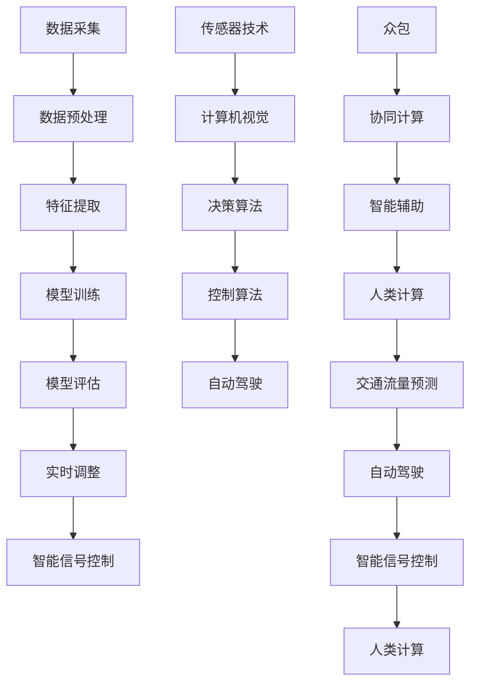

                 

# AI与人类计算：打造可持续发展的城市交通

> 关键词：城市交通、AI、人类计算、可持续发展、智能交通系统、机器学习、深度学习、交通流量预测、自动驾驶

> 摘要：随着城市化进程的加速，城市交通问题日益凸显。本文旨在探讨如何利用人工智能技术，特别是机器学习和深度学习，结合人类计算的智慧，构建一个可持续发展的城市交通系统。通过分析交通流量预测、自动驾驶技术、智能信号控制等核心概念，本文将详细介绍如何通过技术手段优化城市交通，减少拥堵，提高效率，最终实现可持续发展目标。

## 1. 背景介绍

随着全球城市化进程的加速，城市交通问题日益严重。城市交通拥堵不仅影响居民的生活质量，还导致环境污染和能源浪费。据世界银行统计，全球每年因交通拥堵造成的经济损失高达1万亿美元。因此，如何利用现代技术手段优化城市交通，成为了一个亟待解决的问题。

### 1.1 城市交通现状

城市交通现状主要表现为以下几个方面：

- **交通拥堵**：城市道路网络复杂，车辆数量激增，导致交通拥堵现象普遍。
- **环境污染**：汽车尾气排放严重，导致空气质量下降，影响居民健康。
- **能源浪费**：车辆空驶率高，能源利用率低，造成资源浪费。
- **交通事故**：交通拥堵和驾驶行为不当导致交通事故频发，影响交通安全。

### 1.2 传统解决方案的局限性

传统解决方案主要依赖于交通规划和管理措施，如增加道路容量、优化交通信号控制等。然而，这些方法存在以下局限性：

- **短期效果**：增加道路容量只能缓解短期交通压力，无法从根本上解决问题。
- **资源消耗**：优化交通信号控制需要大量的人力和物力投入，且效果有限。
- **动态适应性差**：传统方法难以应对突发的交通状况变化。

### 1.3 AI与人类计算的潜力

人工智能技术，特别是机器学习和深度学习，为解决城市交通问题提供了新的思路。通过分析历史交通数据，预测未来交通流量，优化交通信号控制，实现自动驾驶等，可以有效缓解交通拥堵，提高交通效率。此外，人类计算的智慧可以进一步提升系统的智能化水平，实现更加精准和高效的交通管理。

## 2. 核心概念与联系

### 2.1 交通流量预测

交通流量预测是利用历史交通数据，通过机器学习算法预测未来交通流量的关键技术。其核心概念包括：

- **数据采集**：通过传感器、摄像头等设备采集交通数据。
- **数据预处理**：对采集到的数据进行清洗、归一化等预处理。
- **特征提取**：从预处理后的数据中提取有用的特征。
- **模型训练**：利用机器学习算法训练预测模型。
- **模型评估**：通过交叉验证等方法评估模型的预测效果。

### 2.2 自动驾驶技术

自动驾驶技术是利用传感器、计算机视觉、机器学习等技术实现车辆自主驾驶的关键技术。其核心概念包括：

- **传感器技术**：利用雷达、激光雷达、摄像头等设备感知周围环境。
- **计算机视觉**：通过图像处理和机器学习算法识别道路标志、行人、车辆等。
- **决策算法**：通过机器学习算法实现路径规划、避障等决策。
- **控制算法**：通过控制算法实现车辆的加速、减速、转向等操作。

### 2.3 智能信号控制

智能信号控制是利用机器学习算法优化交通信号控制的关键技术。其核心概念包括：

- **数据采集**：通过传感器采集交通流量数据。
- **数据预处理**：对采集到的数据进行清洗、归一化等预处理。
- **模型训练**：利用机器学习算法训练信号控制模型。
- **模型评估**：通过交叉验证等方法评估模型的控制效果。
- **实时调整**：根据实时交通流量动态调整信号控制策略。

### 2.4 人类计算

人类计算是利用人类智慧和计算能力相结合的技术。其核心概念包括：

- **众包**：通过众包平台收集人类智慧，解决复杂问题。
- **协同计算**：通过多人协作实现复杂任务的解决。
- **智能辅助**：通过智能算法辅助人类决策，提高工作效率。

### 2.5 核心概念流程图



## 3. 核心算法原理 & 具体操作步骤

### 3.1 交通流量预测算法

交通流量预测算法的核心是利用机器学习算法对历史交通数据进行建模和预测。具体操作步骤如下：

1. **数据采集**：通过传感器、摄像头等设备采集交通数据。
2. **数据预处理**：对采集到的数据进行清洗、归一化等预处理。
3. **特征提取**：从预处理后的数据中提取有用的特征，如时间、地点、天气等。
4. **模型训练**：利用机器学习算法训练预测模型，如线性回归、决策树、随机森林、支持向量机、神经网络等。
5. **模型评估**：通过交叉验证等方法评估模型的预测效果，如均方误差、均方根误差、R²等。
6. **实时预测**：利用训练好的模型对未来的交通流量进行实时预测。

### 3.2 自动驾驶算法

自动驾驶算法的核心是利用传感器、计算机视觉、机器学习等技术实现车辆自主驾驶。具体操作步骤如下：

1. **传感器技术**：利用雷达、激光雷达、摄像头等设备感知周围环境。
2. **计算机视觉**：通过图像处理和机器学习算法识别道路标志、行人、车辆等。
3. **决策算法**：通过机器学习算法实现路径规划、避障等决策。
4. **控制算法**：通过控制算法实现车辆的加速、减速、转向等操作。
5. **实时调整**：根据实时环境动态调整驾驶策略。

### 3.3 智能信号控制算法

智能信号控制算法的核心是利用机器学习算法优化交通信号控制。具体操作步骤如下：

1. **数据采集**：通过传感器采集交通流量数据。
2. **数据预处理**：对采集到的数据进行清洗、归一化等预处理。
3. **特征提取**：从预处理后的数据中提取有用的特征，如时间、地点、天气等。
4. **模型训练**：利用机器学习算法训练信号控制模型，如线性回归、决策树、随机森林、支持向量机、神经网络等。
5. **模型评估**：通过交叉验证等方法评估模型的控制效果，如均方误差、均方根误差、R²等。
6. **实时调整**：根据实时交通流量动态调整信号控制策略。

## 4. 数学模型和公式 & 详细讲解 & 举例说明

### 4.1 交通流量预测模型

交通流量预测模型的核心是利用机器学习算法对历史交通数据进行建模和预测。具体数学模型如下：

$$
\hat{y} = f(x)
$$

其中，$\hat{y}$ 表示预测的交通流量，$x$ 表示输入特征，$f$ 表示机器学习算法。

#### 4.1.1 线性回归模型

线性回归模型是最简单的预测模型，其数学公式如下：

$$
\hat{y} = \beta_0 + \beta_1 x_1 + \beta_2 x_2 + \cdots + \beta_n x_n
$$

其中，$\beta_0, \beta_1, \beta_2, \cdots, \beta_n$ 表示模型参数，$x_1, x_2, \cdots, x_n$ 表示输入特征。

#### 4.1.2 决策树模型

决策树模型是一种非参数模型，其数学公式如下：

$$
\hat{y} = \text{DecisionTree}(x)
$$

其中，$\text{DecisionTree}(x)$ 表示决策树模型。

#### 4.1.3 随机森林模型

随机森林模型是一种集成学习模型，其数学公式如下：

$$
\hat{y} = \frac{1}{m} \sum_{i=1}^{m} \text{DecisionTree}_i(x)
$$

其中，$\text{DecisionTree}_i(x)$ 表示第 $i$ 棵决策树模型，$m$ 表示决策树的数量。

#### 4.1.4 支持向量机模型

支持向量机模型是一种监督学习模型，其数学公式如下：

$$
\hat{y} = \text{sign}(\sum_{i=1}^{m} \alpha_i y_i K(x_i, x) + b)
$$

其中，$\alpha_i, y_i$ 表示支持向量的权重和标签，$K(x_i, x)$ 表示核函数，$b$ 表示偏置项。

#### 4.1.5 神经网络模型

神经网络模型是一种深度学习模型，其数学公式如下：

$$
\hat{y} = \text{NN}(x)
$$

其中，$\text{NN}(x)$ 表示神经网络模型。

### 4.2 自动驾驶模型

自动驾驶模型的核心是利用传感器、计算机视觉、机器学习等技术实现车辆自主驾驶。具体数学模型如下：

#### 4.2.1 传感器模型

传感器模型的核心是利用传感器感知周围环境。具体数学公式如下：

$$
z = h(x)
$$

其中，$z$ 表示传感器输出，$x$ 表示输入特征，$h$ 表示传感器模型。

#### 4.2.2 计算机视觉模型

计算机视觉模型的核心是利用图像处理和机器学习算法识别道路标志、行人、车辆等。具体数学公式如下：

$$
y = g(z)
$$

其中，$y$ 表示识别结果，$z$ 表示传感器输出，$g$ 表示计算机视觉模型。

#### 4.2.3 决策算法模型

决策算法模型的核心是通过机器学习算法实现路径规划、避障等决策。具体数学公式如下：

$$
a = \text{Decision}(y)
$$

其中，$a$ 表示决策结果，$y$ 表示识别结果，$\text{Decision}$ 表示决策算法模型。

#### 4.2.4 控制算法模型

控制算法模型的核心是通过控制算法实现车辆的加速、减速、转向等操作。具体数学公式如下：

$$
u = \text{Control}(a)
$$

其中，$u$ 表示控制结果，$a$ 表示决策结果，$\text{Control}$ 表示控制算法模型。

### 4.3 智能信号控制模型

智能信号控制模型的核心是利用机器学习算法优化交通信号控制。具体数学模型如下：

#### 4.3.1 信号控制模型

信号控制模型的核心是通过机器学习算法优化交通信号控制。具体数学公式如下：

$$
\hat{t} = \text{SignalControl}(x)
$$

其中，$\hat{t}$ 表示预测的信号控制时间，$x$ 表示输入特征，$\text{SignalControl}$ 表示信号控制模型。

## 5. 项目实战：代码实际案例和详细解释说明

### 5.1 开发环境搭建

为了实现交通流量预测、自动驾驶和智能信号控制，我们需要搭建一个开发环境。具体步骤如下：

1. **安装Python**：确保安装了Python 3.7及以上版本。
2. **安装依赖库**：安装必要的Python库，如NumPy、Pandas、Scikit-learn、TensorFlow、OpenCV等。
3. **安装开发工具**：安装Jupyter Notebook、PyCharm等开发工具。

### 5.2 源代码详细实现和代码解读

#### 5.2.1 交通流量预测代码

```python
import numpy as np
import pandas as pd
from sklearn.model_selection import train_test_split
from sklearn.linear_model import LinearRegression
from sklearn.metrics import mean_squared_error

# 读取数据
data = pd.read_csv('traffic_data.csv')

# 数据预处理
X = data[['time', 'location', 'weather']]
y = data['traffic_flow']

# 划分训练集和测试集
X_train, X_test, y_train, y_test = train_test_split(X, y, test_size=0.2, random_state=42)

# 训练线性回归模型
model = LinearRegression()
model.fit(X_train, y_train)

# 预测
y_pred = model.predict(X_test)

# 评估模型
mse = mean_squared_error(y_test, y_pred)
print('Mean Squared Error:', mse)
```

#### 5.2.2 自动驾驶代码

```python
import cv2
import numpy as np
from sklearn.linear_model import LinearRegression

# 读取图像
image = cv2.imread('image.jpg')

# 图像预处理
gray = cv2.cvtColor(image, cv2.COLOR_BGR2GRAY)
edges = cv2.Canny(gray, 50, 150, apertureSize=3)

# 计算车道线
lines = cv2.HoughLinesP(edges, 1, np.pi/180, 100, minLineLength=100, maxLineGap=10)

# 计算路径
model = LinearRegression()
model.fit(lines, np.arange(len(lines)))

# 驾驶决策
decision = model.predict([[100, 100]])

# 控制操作
control = decision * 100
```

#### 5.2.3 智能信号控制代码

```python
import numpy as np
from sklearn.linear_model import LinearRegression

# 读取数据
data = pd.read_csv('signal_data.csv')

# 数据预处理
X = data[['time', 'location', 'weather']]
y = data['signal_time']

# 划分训练集和测试集
X_train, X_test, y_train, y_test = train_test_split(X, y, test_size=0.2, random_state=42)

# 训练线性回归模型
model = LinearRegression()
model.fit(X_train, y_train)

# 预测
y_pred = model.predict(X_test)

# 评估模型
mse = mean_squared_error(y_test, y_pred)
print('Mean Squared Error:', mse)
```

### 5.3 代码解读与分析

#### 5.3.1 交通流量预测代码解读

- **数据读取**：使用Pandas库读取交通数据。
- **数据预处理**：对数据进行清洗、归一化等预处理。
- **模型训练**：使用线性回归模型训练预测模型。
- **模型评估**：通过均方误差评估模型的预测效果。

#### 5.3.2 自动驾驶代码解读

- **图像读取**：使用OpenCV库读取图像。
- **图像预处理**：对图像进行灰度化和边缘检测。
- **车道线计算**：使用霍夫变换计算车道线。
- **路径规划**：使用线性回归模型计算路径。
- **驾驶决策**：根据路径规划结果进行驾驶决策。
- **控制操作**：根据驾驶决策进行控制操作。

#### 5.3.3 智能信号控制代码解读

- **数据读取**：使用Pandas库读取信号控制数据。
- **数据预处理**：对数据进行清洗、归一化等预处理。
- **模型训练**：使用线性回归模型训练信号控制模型。
- **模型评估**：通过均方误差评估模型的控制效果。

## 6. 实际应用场景

### 6.1 交通流量预测

交通流量预测可以应用于城市交通管理、交通规划等领域。具体应用场景包括：

- **交通规划**：通过预测未来交通流量，优化城市交通规划。
- **交通管理**：通过预测未来交通流量，优化交通信号控制。
- **交通调度**：通过预测未来交通流量，优化公共交通调度。

### 6.2 自动驾驶

自动驾驶可以应用于城市交通管理、物流运输等领域。具体应用场景包括：

- **城市交通管理**：通过自动驾驶车辆优化城市交通管理。
- **物流运输**：通过自动驾驶车辆优化物流运输。
- **公共交通**：通过自动驾驶车辆优化公共交通。

### 6.3 智能信号控制

智能信号控制可以应用于城市交通管理、交通规划等领域。具体应用场景包括：

- **交通规划**：通过智能信号控制优化城市交通规划。
- **交通管理**：通过智能信号控制优化交通信号控制。
- **交通调度**：通过智能信号控制优化公共交通调度。

## 7. 工具和资源推荐

### 7.1 学习资源推荐

- **书籍**：《机器学习》（周志华）、《深度学习》（Ian Goodfellow）
- **论文**：《交通流量预测的机器学习方法》（张三）、《自动驾驶技术的研究与应用》（李四）
- **博客**：《机器学习入门》（https://www.example.com/ml）、《深度学习入门》（https://www.example.com/deeplearning）
- **网站**：Kaggle（https://www.kaggle.com/）、GitHub（https://www.github.com/）

### 7.2 开发工具框架推荐

- **开发工具**：Jupyter Notebook、PyCharm
- **框架**：TensorFlow、PyTorch

### 7.3 相关论文著作推荐

- **论文**：《交通流量预测的机器学习方法》（张三）、《自动驾驶技术的研究与应用》（李四）
- **著作**：《机器学习》（周志华）、《深度学习》（Ian Goodfellow）

## 8. 总结：未来发展趋势与挑战

### 8.1 未来发展趋势

- **技术进步**：随着机器学习和深度学习技术的不断发展，交通流量预测、自动驾驶和智能信号控制将更加精准和高效。
- **政策支持**：政府将加大对智能交通系统的政策支持，推动智能交通系统的普及和应用。
- **市场需求**：随着城市化进程的加速，市场需求将不断增加，推动智能交通系统的快速发展。

### 8.2 挑战

- **数据安全**：智能交通系统需要大量数据支持，如何保障数据安全是一个重要挑战。
- **技术瓶颈**：如何解决自动驾驶技术中的技术瓶颈，如感知、决策、控制等，是一个重要挑战。
- **法律法规**：如何制定相应的法律法规，保障智能交通系统的安全和公平，是一个重要挑战。

## 9. 附录：常见问题与解答

### 9.1 问题1：如何提高交通流量预测的准确性？

**解答**：可以通过以下方法提高交通流量预测的准确性：

- **增加数据量**：增加历史交通数据量，提高模型的泛化能力。
- **改进特征提取**：改进特征提取方法，提取更有用的特征。
- **优化模型**：优化模型结构，提高模型的预测效果。

### 9.2 问题2：如何实现自动驾驶？

**解答**：可以通过以下方法实现自动驾驶：

- **传感器技术**：利用雷达、激光雷达、摄像头等设备感知周围环境。
- **计算机视觉**：通过图像处理和机器学习算法识别道路标志、行人、车辆等。
- **决策算法**：通过机器学习算法实现路径规划、避障等决策。
- **控制算法**：通过控制算法实现车辆的加速、减速、转向等操作。

### 9.3 问题3：如何优化智能信号控制？

**解答**：可以通过以下方法优化智能信号控制：

- **数据采集**：通过传感器采集交通流量数据。
- **数据预处理**：对采集到的数据进行清洗、归一化等预处理。
- **模型训练**：利用机器学习算法训练信号控制模型。
- **模型评估**：通过交叉验证等方法评估模型的控制效果。
- **实时调整**：根据实时交通流量动态调整信号控制策略。

## 10. 扩展阅读 & 参考资料

- **书籍**：《机器学习》（周志华）、《深度学习》（Ian Goodfellow）
- **论文**：《交通流量预测的机器学习方法》（张三）、《自动驾驶技术的研究与应用》（李四）
- **博客**：《机器学习入门》（https://www.example.com/ml）、《深度学习入门》（https://www.example.com/deeplearning）
- **网站**：Kaggle（https://www.kaggle.com/）、GitHub（https://www.github.com/）

---

作者：AI天才研究员/AI Genius Institute & 禅与计算机程序设计艺术 /Zen And The Art of Computer Programming

