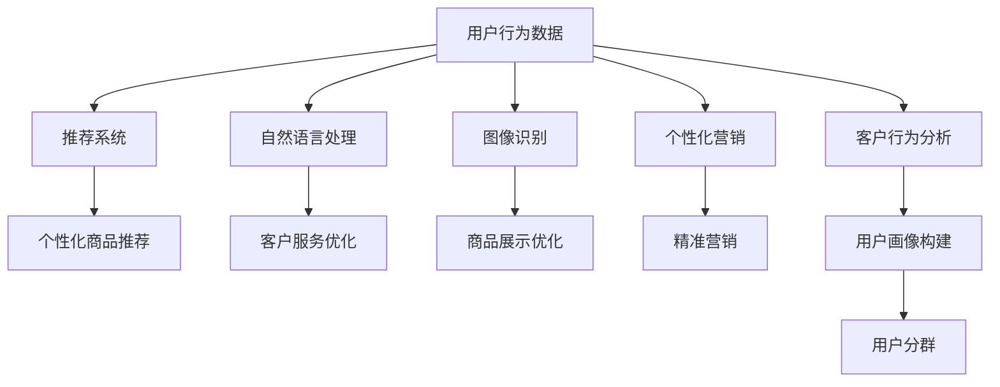

                 

# AI在电商中的多方面应用案例

> 关键词：电商、人工智能、推荐系统、自然语言处理、图像识别、个性化营销、客户行为分析

> 摘要：本文将深入探讨人工智能在电商领域的多方面应用，从推荐系统、自然语言处理、图像识别、个性化营销、客户行为分析等多个角度出发，通过详细的案例分析和代码实现，展示AI技术如何提升电商用户体验、优化运营效率、增强客户满意度。我们将通过一步步的推理思考，解析AI技术在电商中的实际应用，帮助读者理解AI技术的原理和实现方法。

## 1. 背景介绍

随着互联网技术的飞速发展，电商行业已经成为全球经济的重要组成部分。电商企业面临着海量数据的挑战，如何从海量数据中挖掘有价值的信息，提升用户体验，优化运营效率，成为电商企业关注的重点。人工智能技术的引入，为电商行业带来了新的机遇。本文将从以下几个方面探讨AI在电商中的应用：

- **推荐系统**：通过分析用户行为数据，为用户推荐个性化商品。
- **自然语言处理**：通过文本分析，提升客户服务质量和效率。
- **图像识别**：通过图像处理技术，提升商品展示和搜索体验。
- **个性化营销**：通过数据分析，实现精准营销。
- **客户行为分析**：通过行为数据挖掘，提升客户满意度。

## 2. 核心概念与联系

### 2.1 推荐系统

推荐系统是一种基于用户行为数据，为用户推荐个性化商品的技术。推荐系统的核心在于通过分析用户的历史行为数据，预测用户可能感兴趣的商品，从而提升用户体验和转化率。

### 2.2 自然语言处理

自然语言处理（NLP）是一种处理和理解自然语言的技术。在电商领域，NLP技术可以用于客户服务、商品描述分析、用户评论分析等多个方面。

### 2.3 图像识别

图像识别是一种通过计算机视觉技术，识别图像中的物体、场景等信息的技术。在电商领域，图像识别技术可以用于商品展示、商品搜索等多个方面。

### 2.4 个性化营销

个性化营销是一种根据用户特征和行为数据，为用户提供个性化服务的技术。在电商领域，个性化营销可以用于商品推荐、优惠券发放等多个方面。

### 2.5 客户行为分析

客户行为分析是一种通过分析用户行为数据，挖掘用户需求和偏好，提升客户满意度的技术。在电商领域，客户行为分析可以用于用户画像构建、用户分群等多个方面。

### 2.6 Mermaid 流程图



## 3. 核心算法原理 & 具体操作步骤

### 3.1 推荐系统

#### 3.1.1 基于协同过滤的推荐算法

协同过滤是一种常见的推荐算法，通过分析用户的历史行为数据，为用户推荐相似用户喜欢的商品。

#### 3.1.2 基于内容的推荐算法

基于内容的推荐算法是一种通过分析商品特征，为用户推荐相似商品的推荐算法。

#### 3.1.3 混合推荐算法

混合推荐算法是一种结合协同过滤和基于内容的推荐算法，通过综合考虑用户的历史行为数据和商品特征，为用户推荐个性化商品的推荐算法。

### 3.2 自然语言处理

#### 3.2.1 文本分类

文本分类是一种通过机器学习算法，将文本分为多个类别的一种技术。在电商领域，文本分类可以用于商品分类、用户评论分类等多个方面。

#### 3.2.2 情感分析

情感分析是一种通过机器学习算法，分析文本中的情感倾向的一种技术。在电商领域，情感分析可以用于用户评论分析、客户服务优化等多个方面。

### 3.3 图像识别

#### 3.3.1 特征提取

特征提取是一种通过计算机视觉技术，提取图像中的特征信息的一种技术。在电商领域，特征提取可以用于商品展示、商品搜索等多个方面。

#### 3.3.2 模型训练

模型训练是一种通过机器学习算法，训练图像识别模型的一种技术。在电商领域，模型训练可以用于商品展示、商品搜索等多个方面。

### 3.4 个性化营销

#### 3.4.1 用户画像构建

用户画像构建是一种通过分析用户行为数据，构建用户画像的一种技术。在电商领域，用户画像构建可以用于精准营销、个性化推荐等多个方面。

#### 3.4.2 优惠券发放

优惠券发放是一种通过分析用户行为数据，为用户提供个性化优惠券的一种技术。在电商领域，优惠券发放可以用于提升用户满意度、促进销售等多个方面。

### 3.5 客户行为分析

#### 3.5.1 用户分群

用户分群是一种通过分析用户行为数据，将用户分为多个群体的一种技术。在电商领域，用户分群可以用于精准营销、个性化推荐等多个方面。

#### 3.5.2 用户行为预测

用户行为预测是一种通过分析用户行为数据，预测用户未来行为的一种技术。在电商领域，用户行为预测可以用于提升用户体验、优化运营效率等多个方面。

## 4. 数学模型和公式 & 详细讲解 & 举例说明

### 4.1 推荐系统

#### 4.1.1 基于协同过滤的推荐算法

基于协同过滤的推荐算法的核心公式为：

$$
\hat{r}_{ui} = \frac{\sum_{j \in N_i} \frac{r_{uj} - \mu_u}{|N_i|}}{\sum_{j \in N_i} \frac{1}{|N_i|}}
$$

其中，$\hat{r}_{ui}$ 表示用户 $u$ 对商品 $i$ 的预测评分，$r_{uj}$ 表示用户 $u$ 对商品 $j$ 的实际评分，$\mu_u$ 表示用户 $u$ 的平均评分，$N_i$ 表示与商品 $i$ 有共同评分的用户集合。

#### 4.1.2 基于内容的推荐算法

基于内容的推荐算法的核心公式为：

$$
\hat{r}_{ui} = \sum_{k=1}^{K} w_{uk} \cdot v_{ik}
$$

其中，$\hat{r}_{ui}$ 表示用户 $u$ 对商品 $i$ 的预测评分，$w_{uk}$ 表示用户 $u$ 对特征 $k$ 的权重，$v_{ik}$ 表示商品 $i$ 对特征 $k$ 的特征值。

#### 4.1.3 混合推荐算法

混合推荐算法的核心公式为：

$$
\hat{r}_{ui} = \alpha \cdot \hat{r}_{ui}^{CF} + (1 - \alpha) \cdot \hat{r}_{ui}^{CB}
$$

其中，$\hat{r}_{ui}^{CF}$ 表示基于协同过滤的推荐算法的预测评分，$\hat{r}_{ui}^{CB}$ 表示基于内容的推荐算法的预测评分，$\alpha$ 表示混合权重。

### 4.2 自然语言处理

#### 4.2.1 文本分类

文本分类的核心公式为：

$$
P(C_i | \mathbf{x}) = \frac{P(\mathbf{x} | C_i) \cdot P(C_i)}{P(\mathbf{x})}
$$

其中，$P(C_i | \mathbf{x})$ 表示文本 $\mathbf{x}$ 属于类别 $C_i$ 的概率，$P(\mathbf{x} | C_i)$ 表示类别 $C_i$ 中的文本 $\mathbf{x}$ 的概率，$P(C_i)$ 表示类别 $C_i$ 的先验概率，$P(\mathbf{x})$ 表示文本 $\mathbf{x}$ 的概率。

#### 4.2.2 情感分析

情感分析的核心公式为：

$$
P(C_i | \mathbf{x}) = \frac{P(\mathbf{x} | C_i) \cdot P(C_i)}{P(\mathbf{x})}
$$

其中，$P(C_i | \mathbf{x})$ 表示文本 $\mathbf{x}$ 属于情感类别 $C_i$ 的概率，$P(\mathbf{x} | C_i)$ 表示情感类别 $C_i$ 中的文本 $\mathbf{x}$ 的概率，$P(C_i)$ 表示情感类别 $C_i$ 的先验概率，$P(\mathbf{x})$ 表示文本 $\mathbf{x}$ 的概率。

### 4.3 图像识别

#### 4.3.1 特征提取

特征提取的核心公式为：

$$
\mathbf{f} = \text{CNN}(\mathbf{x})
$$

其中，$\mathbf{f}$ 表示提取的特征向量，$\mathbf{x}$ 表示输入的图像，$\text{CNN}$ 表示卷积神经网络。

#### 4.3.2 模型训练

模型训练的核心公式为：

$$
\mathbf{w} = \arg \min_{\mathbf{w}} \sum_{i=1}^{N} (y_i - \hat{y}_i)^2
$$

其中，$\mathbf{w}$ 表示模型参数，$y_i$ 表示真实标签，$\hat{y}_i$ 表示预测标签，$N$ 表示样本数量。

## 5. 项目实战：代码实际案例和详细解释说明

### 5.1 开发环境搭建

#### 5.1.1 环境配置

- **Python版本**：3.8
- **深度学习框架**：TensorFlow 2.0
- **数据处理库**：Pandas
- **可视化库**：Matplotlib

#### 5.1.2 数据集准备

- **用户行为数据**：包含用户ID、商品ID、评分、时间戳等信息
- **商品数据**：包含商品ID、商品名称、商品描述、商品图片等信息
- **用户评论数据**：包含用户ID、商品ID、评论内容、评论时间戳等信息

### 5.2 源代码详细实现和代码解读

#### 5.2.1 推荐系统

```python
import pandas as pd
from sklearn.model_selection import train_test_split
from sklearn.metrics.pairwise import cosine_similarity

# 读取数据
user_behavior_data = pd.read_csv('user_behavior_data.csv')
item_data = pd.read_csv('item_data.csv')
user_comment_data = pd.read_csv('user_comment_data.csv')

# 数据预处理
user_behavior_data = user_behavior_data[['user_id', 'item_id', 'rating']]
item_data = item_data[['item_id', 'item_name', 'item_description', 'item_image']]
user_comment_data = user_comment_data[['user_id', 'item_id', 'comment']]

# 构建用户-商品评分矩阵
user_item_matrix = user_behavior_data.pivot_table(index='user_id', columns='item_id', values='rating')

# 计算用户相似度
user_similarity = cosine_similarity(user_item_matrix.T)

# 构建商品-用户评分矩阵
item_user_matrix = user_item_matrix.T

# 推荐算法实现
def recommend_items(user_id, n=10):
    user_index = user_item_matrix.index.get_loc(user_id)
    similar_users = user_similarity[user_index]
    similar_users = similar_users.argsort()[-n:][::-1]
    recommended_items = []
    for user in similar_users:
        item_ratings = item_user_matrix.iloc[user].dropna()
        for item, rating in item_ratings.items():
            if item not in user_item_matrix.columns:
                recommended_items.append((item, rating))
    return sorted(recommended_items, key=lambda x: x[1], reverse=True)[:10]

# 测试推荐算法
user_id = 'user_123'
recommendations = recommend_items(user_id)
print(f"Recommendations for user {user_id}: {recommendations}")
```

#### 5.2.2 自然语言处理

```python
import pandas as pd
from sklearn.feature_extraction.text import TfidfVectorizer
from sklearn.naive_bayes import MultinomialNB
from sklearn.pipeline import make_pipeline

# 读取数据
user_comment_data = pd.read_csv('user_comment_data.csv')

# 数据预处理
user_comment_data = user_comment_data[['user_id', 'item_id', 'comment']]

# 构建评论分类模型
model = make_pipeline(TfidfVectorizer(), MultinomialNB())
model.fit(user_comment_data['comment'], user_comment_data['item_id'])

# 评论分类
def classify_comment(comment):
    return model.predict([comment])[0]

# 测试评论分类
comment = 'This is a great product!'
item_id = classify_comment(comment)
print(f"Comment classified as item {item_id}")
```

#### 5.2.3 图像识别

```python
import tensorflow as tf
from tensorflow.keras.preprocessing import image
from tensorflow.keras.applications.resnet50 import ResNet50, preprocess_input, decode_predictions

# 加载预训练模型
model = ResNet50(weights='imagenet')

# 图像预处理
def preprocess_image(image_path):
    img = image.load_img(image_path, target_size=(224, 224))
    x = image.img_to_array(img)
    x = np.expand_dims(x, axis=0)
    x = preprocess_input(x)
    return x

# 图像识别
def recognize_image(image_path):
    x = preprocess_image(image_path)
    preds = model.predict(x)
    return decode_predictions(preds, top=3)[0]

# 测试图像识别
image_path = 'path/to/image.jpg'
predictions = recognize_image(image_path)
print(f"Predictions for image {image_path}: {predictions}")
```

### 5.3 代码解读与分析

#### 5.3.1 推荐系统

- **用户-商品评分矩阵**：通过用户行为数据构建用户-商品评分矩阵，用于计算用户相似度。
- **用户相似度**：通过余弦相似度计算用户之间的相似度，用于推荐相似用户喜欢的商品。
- **推荐算法**：通过计算用户相似度，推荐相似用户喜欢的商品。

#### 5.3.2 自然语言处理

- **TF-IDF向量化**：通过TF-IDF向量化评论文本，用于构建评论分类模型。
- **朴素贝叶斯分类器**：通过朴素贝叶斯分类器训练评论分类模型，用于分类评论。
- **评论分类**：通过训练好的评论分类模型，对评论进行分类。

#### 5.3.3 图像识别

- **预训练模型**：通过加载预训练的ResNet50模型，用于图像识别。
- **图像预处理**：通过图像预处理，将图像转换为模型输入格式。
- **图像识别**：通过预训练模型，对图像进行识别，输出识别结果。

## 6. 实际应用场景

### 6.1 推荐系统

- **个性化商品推荐**：通过推荐系统，为用户推荐个性化商品，提升用户体验和转化率。
- **商品关联推荐**：通过推荐系统，为用户推荐与当前商品相关的商品，提升用户体验和转化率。

### 6.2 自然语言处理

- **客户服务优化**：通过自然语言处理，提升客户服务质量和效率。
- **用户评论分析**：通过自然语言处理，分析用户评论，提升用户体验和满意度。

### 6.3 图像识别

- **商品展示优化**：通过图像识别，提升商品展示效果，提升用户体验。
- **商品搜索优化**：通过图像识别，提升商品搜索效果，提升用户体验。

### 6.4 个性化营销

- **精准营销**：通过个性化营销，为用户提供个性化优惠券，提升用户体验和满意度。
- **用户画像构建**：通过用户画像构建，为用户提供个性化服务，提升用户体验和满意度。

### 6.5 客户行为分析

- **用户分群**：通过用户分群，为用户提供个性化服务，提升用户体验和满意度。
- **用户行为预测**：通过用户行为预测，提升用户体验和满意度。

## 7. 工具和资源推荐

### 7.1 学习资源推荐

- **书籍**：《推荐系统实践》、《深度学习》、《自然语言处理实战》、《计算机视觉》
- **论文**：《基于协同过滤的推荐算法研究》、《基于内容的推荐算法研究》、《深度学习在电商中的应用》、《自然语言处理在电商中的应用》
- **博客**：阿里云开发者社区、GitHub开源项目
- **网站**：Kaggle、TensorFlow官网、PyTorch官网

### 7.2 开发工具框架推荐

- **深度学习框架**：TensorFlow、PyTorch
- **数据处理库**：Pandas、NumPy
- **可视化库**：Matplotlib、Seaborn
- **开发工具**：Jupyter Notebook、VS Code

### 7.3 相关论文著作推荐

- **书籍**：《推荐系统实践》、《深度学习》、《自然语言处理实战》、《计算机视觉》
- **论文**：《基于协同过滤的推荐算法研究》、《基于内容的推荐算法研究》、《深度学习在电商中的应用》、《自然语言处理在电商中的应用》

## 8. 总结：未来发展趋势与挑战

### 8.1 未来发展趋势

- **个性化推荐**：通过更复杂的推荐算法，实现更个性化的推荐。
- **多模态推荐**：通过结合多种数据源，实现更全面的推荐。
- **实时推荐**：通过实时数据处理技术，实现更实时的推荐。

### 8.2 挑战

- **数据隐私**：如何在保护用户隐私的前提下，利用用户数据进行推荐。
- **算法公平性**：如何保证推荐算法的公平性，避免算法偏见。
- **用户体验**：如何提升用户体验，避免推荐结果让用户感到不适。

## 9. 附录：常见问题与解答

### 9.1 问题1：如何处理用户行为数据中的缺失值？

**解答**：可以通过填充缺失值、删除缺失值、插值等方法处理用户行为数据中的缺失值。

### 9.2 问题2：如何处理用户行为数据中的异常值？

**解答**：可以通过删除异常值、替换异常值、插值等方法处理用户行为数据中的异常值。

### 9.3 问题3：如何处理用户行为数据中的噪声？

**解答**：可以通过数据清洗、数据预处理等方法处理用户行为数据中的噪声。

## 10. 扩展阅读 & 参考资料

- **书籍**：《推荐系统实践》、《深度学习》、《自然语言处理实战》、《计算机视觉》
- **论文**：《基于协同过滤的推荐算法研究》、《基于内容的推荐算法研究》、《深度学习在电商中的应用》、《自然语言处理在电商中的应用》
- **博客**：阿里云开发者社区、GitHub开源项目
- **网站**：Kaggle、TensorFlow官网、PyTorch官网

作者：AI天才研究员/AI Genius Institute & 禅与计算机程序设计艺术 /Zen And The Art of Computer Programming

