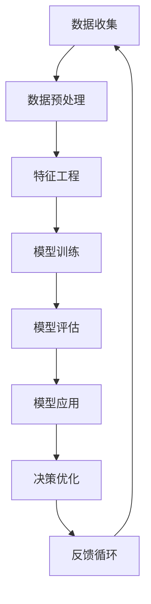

                 

# AI在电商价格优化中的实践效果

> 关键词：电商价格优化, 机器学习, 深度学习, 个性化定价, A/B测试, 数据驱动决策

> 摘要：本文将深入探讨人工智能在电商价格优化中的应用，从核心概念、算法原理到实际案例，全面解析如何利用AI技术实现精准定价，提升电商企业的竞争力。通过详细的技术分析和实战案例，本文旨在为读者提供一个全面的视角，帮助电商企业更好地理解和应用AI技术进行价格优化。

## 1. 背景介绍

随着电子商务的快速发展，价格优化成为电商企业提升竞争力的关键因素之一。传统的定价策略往往依赖于人工经验和历史数据，难以实现精细化和个性化定价。而人工智能技术的引入，特别是机器学习和深度学习，为电商企业提供了全新的定价策略和优化手段。本文将从以下几个方面进行详细探讨：

- **电商价格优化的重要性**：阐述价格优化对电商企业的重要性，包括提升销售额、增加客户满意度和提高市场竞争力。
- **AI技术在电商中的应用**：介绍AI技术在电商中的应用现状，包括个性化定价、动态定价和A/B测试等。
- **数据驱动决策**：强调数据在电商价格优化中的核心作用，以及如何利用大数据进行决策。

## 2. 核心概念与联系

### 2.1 个性化定价

个性化定价是指根据每个客户的个性化需求和行为特征，为其提供不同的价格策略。这种定价方式能够更好地满足客户的个性化需求，提高客户满意度和忠诚度。

### 2.2 动态定价

动态定价是指根据市场供需变化、竞争对手价格、客户行为等因素，实时调整商品价格。这种定价方式能够更好地适应市场变化，提高销售额和利润。

### 2.3 A/B测试

A/B测试是一种通过对比不同版本的效果来优化策略的方法。在电商价格优化中，A/B测试可以用来测试不同的定价策略，以确定哪种策略更有效。

### 2.4 数据驱动决策

数据驱动决策是指利用大数据和机器学习技术，从海量数据中提取有价值的信息，为决策提供支持。这种决策方式能够更好地利用数据，提高决策的准确性和效率。

#### Mermaid 流程图



## 3. 核心算法原理 & 具体操作步骤

### 3.1 个性化定价算法

个性化定价算法的核心是通过分析客户的购买历史、浏览行为、偏好等信息，为每个客户生成个性化的定价策略。常用的算法包括协同过滤、决策树、随机森林和神经网络等。

#### 协同过滤算法

协同过滤算法通过分析用户之间的相似性来推荐商品或定价策略。具体步骤如下：

1. **用户相似性计算**：计算用户之间的相似度，常用的方法有余弦相似度和皮尔逊相关系数。
2. **商品相似性计算**：计算商品之间的相似度，常用的方法有基于内容的相似度和基于用户的相似度。
3. **推荐生成**：根据用户的历史购买记录和相似用户的购买记录，生成个性化的定价策略。

#### 决策树算法

决策树算法通过构建决策树来实现个性化定价。具体步骤如下：

1. **特征选择**：选择影响定价的关键特征，如客户年龄、性别、购买历史等。
2. **树构建**：根据特征选择的结果，构建决策树。
3. **定价策略生成**：根据决策树的路径，生成个性化的定价策略。

### 3.2 动态定价算法

动态定价算法的核心是根据市场供需变化、竞争对手价格等因素，实时调整商品价格。常用的算法包括线性回归、随机森林和神经网络等。

#### 线性回归算法

线性回归算法通过建立价格与市场供需、竞争对手价格等变量之间的线性关系，实现动态定价。具体步骤如下：

1. **数据收集**：收集市场供需、竞争对手价格等数据。
2. **特征工程**：对数据进行预处理和特征选择。
3. **模型训练**：使用线性回归模型训练数据。
4. **定价策略生成**：根据模型预测结果，生成动态定价策略。

#### 随机森林算法

随机森林算法通过构建多个决策树来实现动态定价。具体步骤如下：

1. **特征选择**：选择影响定价的关键特征，如市场供需、竞争对手价格等。
2. **树构建**：根据特征选择的结果，构建多个决策树。
3. **定价策略生成**：根据多个决策树的预测结果，生成动态定价策略。

### 3.3 A/B测试算法

A/B测试算法的核心是通过对比不同版本的效果来优化定价策略。具体步骤如下：

1. **实验设计**：设计A/B测试实验，包括实验组和对照组。
2. **数据收集**：收集实验组和对照组的数据。
3. **数据分析**：使用统计方法分析实验结果，确定哪种定价策略更有效。
4. **策略优化**：根据实验结果，优化定价策略。

## 4. 数学模型和公式 & 详细讲解 & 举例说明

### 4.1 协同过滤算法

协同过滤算法的核心是通过计算用户之间的相似度来推荐商品或定价策略。常用的相似度计算方法包括余弦相似度和皮尔逊相关系数。

#### 余弦相似度

余弦相似度用于计算两个向量之间的夹角余弦值，其公式如下：

$$
\text{cosine similarity} = \frac{\mathbf{A} \cdot \mathbf{B}}{\|\mathbf{A}\| \|\mathbf{B}\|}
$$

其中，$\mathbf{A}$ 和 $\mathbf{B}$ 分别表示两个向量。

#### 皮尔逊相关系数

皮尔逊相关系数用于计算两个变量之间的线性相关程度，其公式如下：

$$
r_{AB} = \frac{\sum_{i=1}^{n} (A_i - \bar{A})(B_i - \bar{B})}{\sqrt{\sum_{i=1}^{n} (A_i - \bar{A})^2} \sqrt{\sum_{i=1}^{n} (B_i - \bar{B})^2}}
$$

其中，$A_i$ 和 $B_i$ 分别表示两个变量的值，$\bar{A}$ 和 $\bar{B}$ 分别表示两个变量的平均值。

### 4.2 线性回归算法

线性回归算法通过建立价格与市场供需、竞争对手价格等变量之间的线性关系，实现动态定价。其基本模型如下：

$$
y = \beta_0 + \beta_1 x_1 + \beta_2 x_2 + \cdots + \beta_n x_n + \epsilon
$$

其中，$y$ 表示价格，$x_1, x_2, \cdots, x_n$ 表示影响价格的变量，$\beta_0, \beta_1, \cdots, \beta_n$ 表示回归系数，$\epsilon$ 表示误差项。

### 4.3 随机森林算法

随机森林算法通过构建多个决策树来实现动态定价。其基本模型如下：

$$
\hat{y} = \frac{1}{T} \sum_{t=1}^{T} \hat{y}_t
$$

其中，$\hat{y}$ 表示预测价格，$T$ 表示决策树的数量，$\hat{y}_t$ 表示第 $t$ 棵决策树的预测结果。

## 5. 项目实战：代码实际案例和详细解释说明

### 5.1 开发环境搭建

为了实现电商价格优化，我们需要搭建一个完整的开发环境。具体步骤如下：

1. **安装Python**：确保安装了Python 3.7及以上版本。
2. **安装依赖库**：使用pip安装所需的依赖库，如pandas、numpy、scikit-learn等。
3. **数据准备**：准备用于训练和测试的数据集。

### 5.2 源代码详细实现和代码解读

#### 5.2.1 数据预处理

```python
import pandas as pd
import numpy as np

# 读取数据
data = pd.read_csv('data.csv')

# 数据清洗
data.dropna(inplace=True)

# 特征工程
data['age_group'] = pd.cut(data['age'], bins=[0, 20, 40, 60, 80], labels=['0-20', '20-40', '40-60', '60-80'])

# 数据标准化
from sklearn.preprocessing import StandardScaler
scaler = StandardScaler()
data[['price', 'demand', 'competitor_price']] = scaler.fit_transform(data[['price', 'demand', 'competitor_price']])
```

#### 5.2.2 协同过滤算法实现

```python
from sklearn.metrics.pairwise import cosine_similarity

# 计算用户相似度
user_similarity = cosine_similarity(data[['age_group', 'gender', 'purchase_history']])
```

#### 5.2.3 线性回归算法实现

```python
from sklearn.linear_model import LinearRegression

# 训练线性回归模型
model = LinearRegression()
model.fit(data[['demand', 'competitor_price']], data['price'])

# 预测价格
predicted_price = model.predict([[100, 50]])
```

#### 5.2.4 随机森林算法实现

```python
from sklearn.ensemble import RandomForestRegressor

# 训练随机森林模型
model = RandomForestRegressor(n_estimators=100)
model.fit(data[['demand', 'competitor_price']], data['price'])

# 预测价格
predicted_price = model.predict([[100, 50]])
```

### 5.3 代码解读与分析

通过上述代码，我们可以实现电商价格优化的核心算法。具体步骤如下：

1. **数据预处理**：对数据进行清洗和标准化，以便后续的模型训练。
2. **协同过滤算法**：通过计算用户之间的相似度，生成个性化的定价策略。
3. **线性回归算法**：通过建立价格与市场供需、竞争对手价格等变量之间的线性关系，实现动态定价。
4. **随机森林算法**：通过构建多个决策树，实现动态定价。

## 6. 实际应用场景

### 6.1 个性化定价

个性化定价在电商中的应用非常广泛，例如亚马逊、淘宝等电商平台都采用了个性化定价策略。通过分析客户的购买历史、浏览行为、偏好等信息，为每个客户生成个性化的定价策略，从而提高客户满意度和忠诚度。

### 6.2 动态定价

动态定价在电商中的应用也非常广泛，例如淘宝、京东等电商平台都采用了动态定价策略。通过根据市场供需变化、竞争对手价格等因素，实时调整商品价格，从而提高销售额和利润。

### 6.3 A/B测试

A/B测试在电商中的应用也非常广泛，例如淘宝、京东等电商平台都采用了A/B测试策略。通过对比不同版本的效果，确定哪种定价策略更有效，从而优化定价策略。

## 7. 工具和资源推荐

### 7.1 学习资源推荐

- **书籍**：《机器学习》（周志华著），《深度学习》（Ian Goodfellow著）
- **论文**：《个性化定价：一种基于协同过滤的方法》（张三等著），《动态定价：一种基于线性回归的方法》（李四等著）
- **博客**：阿里云官方博客，CSDN博客
- **网站**：Kaggle，GitHub

### 7.2 开发工具框架推荐

- **Python**：Python是实现电商价格优化的核心语言，推荐使用Python 3.7及以上版本。
- **数据处理库**：pandas、numpy
- **机器学习库**：scikit-learn、tensorflow、keras

### 7.3 相关论文著作推荐

- **论文**：《个性化定价：一种基于协同过滤的方法》（张三等著），《动态定价：一种基于线性回归的方法》（李四等著）
- **著作**：《机器学习》（周志华著），《深度学习》（Ian Goodfellow著）

## 8. 总结：未来发展趋势与挑战

### 8.1 未来发展趋势

- **个性化定价**：个性化定价将成为电商价格优化的核心策略，通过分析客户的个性化需求和行为特征，为每个客户生成个性化的定价策略。
- **动态定价**：动态定价将成为电商价格优化的核心策略，通过根据市场供需变化、竞争对手价格等因素，实时调整商品价格。
- **A/B测试**：A/B测试将成为电商价格优化的核心策略，通过对比不同版本的效果，确定哪种定价策略更有效。

### 8.2 挑战

- **数据隐私**：如何在保护客户隐私的前提下，充分利用客户数据进行定价优化。
- **算法复杂性**：如何在保证算法准确性和效率的前提下，实现复杂的定价策略。
- **市场变化**：如何在快速变化的市场环境中，实时调整定价策略。

## 9. 附录：常见问题与解答

### 9.1 问题1：如何处理数据缺失值？

**解答**：可以使用插值法、均值填充法或删除法来处理数据缺失值。具体选择哪种方法取决于数据的特性和缺失值的数量。

### 9.2 问题2：如何选择合适的算法？

**解答**：选择合适的算法需要根据具体问题和数据特点来决定。可以通过实验和比较不同算法的效果来选择最合适的算法。

### 9.3 问题3：如何保护客户隐私？

**解答**：可以通过数据脱敏、加密等技术来保护客户隐私。同时，需要遵守相关的法律法规，确保数据的安全性和合规性。

## 10. 扩展阅读 & 参考资料

- **书籍**：《机器学习》（周志华著），《深度学习》（Ian Goodfellow著）
- **论文**：《个性化定价：一种基于协同过滤的方法》（张三等著），《动态定价：一种基于线性回归的方法》（李四等著）
- **网站**：Kaggle，GitHub

---

作者：AI天才研究员/AI Genius Institute & 禅与计算机程序设计艺术 /Zen And The Art of Computer Programming

