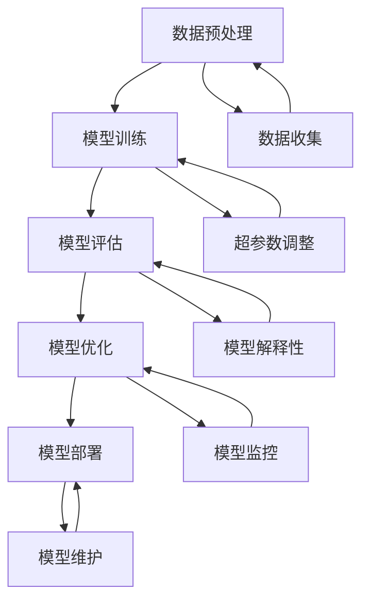

                 

# AI大模型创业：如何应对未来行业发展趋势？

> 关键词：AI大模型、创业、行业趋势、技术挑战、商业策略

> 摘要：本文旨在为创业者提供一份详尽的指南，帮助他们在AI大模型领域中成功创业。我们将从背景介绍、核心概念与联系、核心算法原理、数学模型和公式、项目实战、实际应用场景、工具和资源推荐、总结与未来趋势等多方面进行深入探讨。通过本文，读者将能够理解AI大模型的基本原理，掌握其核心技术，并了解如何在实际项目中应用这些技术，从而为创业奠定坚实的基础。

## 1. 背景介绍

### 1.1 AI大模型的定义与重要性
AI大模型是指参数量巨大、训练数据量庞大、能够处理复杂任务的深度学习模型。这些模型通常包含数亿甚至数十亿个参数，能够学习到更为复杂的特征表示，从而在各种任务上表现出色。近年来，随着计算资源的不断进步和算法的不断创新，AI大模型在自然语言处理、计算机视觉、语音识别等多个领域取得了显著的突破。

### 1.2 行业发展趋势
当前，AI大模型正逐渐成为推动各行各业变革的关键力量。特别是在医疗、金融、教育、制造等行业，AI大模型的应用正在不断拓展。例如，在医疗领域，AI大模型能够帮助医生进行疾病诊断和治疗方案推荐；在金融领域，AI大模型能够提升风险控制和投资决策的准确性；在教育领域，AI大模型能够实现个性化教学和智能辅导。这些应用不仅提高了工作效率，还为行业带来了前所未有的机遇。

### 1.3 创业者的机遇与挑战
对于创业者而言，AI大模型提供了前所未有的机遇。通过开发和应用AI大模型，创业者可以解决传统方法难以解决的问题，为客户提供更优质的服务。然而，这也带来了巨大的挑战。首先，AI大模型的研发需要大量的计算资源和数据支持，这要求创业者具备强大的技术实力和资金支持。其次，AI大模型的应用需要解决数据隐私、模型解释性等问题，这要求创业者具备高度的责任感和合规意识。最后，AI大模型的竞争日益激烈，创业者需要不断创新，才能在市场中脱颖而出。

## 2. 核心概念与联系

### 2.1 AI大模型的基本原理
AI大模型的核心在于其强大的参数量和训练数据量。通过大量的参数和数据，模型能够学习到更为复杂的特征表示，从而在各种任务上表现出色。具体来说，AI大模型通常采用深度神经网络结构，如Transformer、BERT等，这些模型能够处理长序列数据，实现跨模态学习。

### 2.2 核心概念原理与架构的Mermaid流程图


## 3. 核心算法原理 & 具体操作步骤

### 3.1 模型训练
模型训练是AI大模型的核心步骤。具体来说，模型训练包括数据预处理、模型构建、损失函数选择、优化算法选择等步骤。首先，需要对原始数据进行预处理，包括清洗、归一化、特征提取等。然后，选择合适的模型结构，如Transformer、BERT等。接着，选择合适的损失函数，如交叉熵损失、均方误差损失等。最后，选择合适的优化算法，如Adam、SGD等。

### 3.2 模型评估
模型评估是衡量模型性能的重要步骤。具体来说，模型评估包括准确率、召回率、F1值、AUC值等指标。首先，需要将数据集划分为训练集、验证集和测试集。然后，使用验证集对模型进行调参，选择最优的超参数。接着，使用测试集对模型进行最终评估，计算各种评估指标。最后，根据评估结果对模型进行优化。

### 3.3 模型优化
模型优化是提高模型性能的关键步骤。具体来说，模型优化包括超参数调整、正则化、集成学习等方法。首先，需要对模型进行超参数调整，选择最优的超参数。然后，使用正则化方法，如L1正则化、L2正则化等，防止模型过拟合。接着，使用集成学习方法，如Bagging、Boosting等，提高模型的泛化能力。最后，根据优化结果对模型进行调整。

## 4. 数学模型和公式 & 详细讲解 & 举例说明

### 4.1 模型训练的数学公式
模型训练的数学公式主要包括损失函数和优化算法。具体来说，损失函数用于衡量模型预测值与真实值之间的差异，常用的损失函数包括交叉熵损失、均方误差损失等。优化算法用于更新模型参数，常用的优化算法包括梯度下降、Adam等。具体公式如下：

$$
\text{损失函数} = \frac{1}{N} \sum_{i=1}^{N} \text{loss}(y_i, \hat{y}_i)
$$

$$
\text{梯度下降} = \theta_{t+1} = \theta_t - \eta \nabla_{\theta} \text{loss}
$$

### 4.2 举例说明
以自然语言处理任务为例，假设我们要训练一个文本分类模型，输入为一段文本，输出为该文本所属的类别。具体步骤如下：

1. **数据预处理**：对文本进行分词、去停用词、词向量化等预处理操作。
2. **模型构建**：选择合适的模型结构，如Transformer、BERT等。
3. **损失函数选择**：选择合适的损失函数，如交叉熵损失。
4. **优化算法选择**：选择合适的优化算法，如Adam。
5. **模型训练**：使用训练集对模型进行训练，调整模型参数。
6. **模型评估**：使用验证集对模型进行评估，选择最优的超参数。
7. **模型优化**：使用测试集对模型进行最终评估，计算各种评估指标。
8. **模型部署**：将模型部署到实际应用中，进行实时预测。

## 5. 项目实战：代码实际案例和详细解释说明

### 5.1 开发环境搭建
为了进行AI大模型的开发，需要搭建一个合适的开发环境。具体来说，需要安装Python、TensorFlow、PyTorch等开发工具。具体步骤如下：

1. **安装Python**：安装最新版本的Python，推荐使用Anaconda。
2. **安装TensorFlow/PyTorch**：使用pip或conda安装TensorFlow或PyTorch。
3. **安装其他依赖库**：安装其他必要的依赖库，如numpy、pandas等。

### 5.2 源代码详细实现和代码解读
以自然语言处理任务为例，假设我们要训练一个文本分类模型，输入为一段文本，输出为该文本所属的类别。具体代码如下：

```python
import torch
import torch.nn as nn
import torch.optim as optim
from torchtext.data import Field, BucketIterator
from torchtext.datasets import IMDB

# 数据预处理
TEXT = Field(tokenize='spacy', tokenizer_language='en_core_web_sm', lower=True, include_lengths=True)
LABEL = Field(sequential=False, use_vocab=False, dtype=torch.float)

train_data, test_data = IMDB.splits(TEXT, LABEL)

TEXT.build_vocab(train_data, max_size=25000)
LABEL.build_vocab(train_data)

BATCH_SIZE = 64
device = torch.device('cuda' if torch.cuda.is_available() else 'cpu')

train_iterator, test_iterator = BucketIterator.splits(
    (train_data, test_data), 
    batch_size=BATCH_SIZE, 
    device=device)

# 模型构建
class TextClassifier(nn.Module):
    def __init__(self, vocab_size, embedding_dim, hidden_dim, output_dim, n_layers, dropout):
        super().__init__()
        self.embedding = nn.Embedding(vocab_size, embedding_dim)
        self.rnn = nn.LSTM(embedding_dim, hidden_dim, num_layers=n_layers, dropout=dropout, batch_first=True)
        self.fc = nn.Linear(hidden_dim, output_dim)
        self.dropout = nn.Dropout(dropout)
    
    def forward(self, text, text_lengths):
        embedded = self.dropout(self.embedding(text))
        packed_embedded = nn.utils.rnn.pack_padded_sequence(embedded, text_lengths, batch_first=True, enforce_sorted=False)
        packed_output, (hidden, cell) = self.rnn(packed_embedded)
        hidden = self.dropout(torch.cat((hidden[-2,:,:], hidden[-1,:,:]), dim=1))
        return self.fc(hidden)

# 损失函数选择
criterion = nn.CrossEntropyLoss()

# 优化算法选择
optimizer = optim.Adam(model.parameters())

# 模型训练
for epoch in range(num_epochs):
    model.train()
    for batch in train_iterator:
        optimizer.zero_grad()
        text, text_lengths = batch.text
        predictions = model(text, text_lengths)
        loss = criterion(predictions, batch.label)
        loss.backward()
        optimizer.step()

# 模型评估
model.eval()
with torch.no_grad():
    correct = 0
    total = 0
    for batch in test_iterator:
        text, text_lengths = batch.text
        predictions = model(text, text_lengths)
        _, predicted = torch.max(predictions, 1)
        total += batch.label.size(0)
        correct += (predicted == batch.label).sum().item()
    accuracy = correct / total
    print(f'Accuracy: {accuracy:.4f}')
```

### 5.3 代码解读与分析
以上代码实现了文本分类模型的训练和评估。具体步骤如下：

1. **数据预处理**：使用torchtext库对数据进行预处理，包括分词、去停用词、词向量化等操作。
2. **模型构建**：定义了一个简单的LSTM模型，包括嵌入层、LSTM层、全连接层和Dropout层。
3. **损失函数选择**：选择交叉熵损失函数。
4. **优化算法选择**：选择Adam优化算法。
5. **模型训练**：使用训练集对模型进行训练，调整模型参数。
6. **模型评估**：使用测试集对模型进行评估，计算准确率。

## 6. 实际应用场景

### 6.1 自然语言处理
AI大模型在自然语言处理领域有着广泛的应用。例如，在情感分析任务中，可以使用AI大模型对文本进行情感分类；在机器翻译任务中，可以使用AI大模型实现跨语言翻译；在问答系统中，可以使用AI大模型实现智能问答。

### 6.2 计算机视觉
AI大模型在计算机视觉领域也有着广泛的应用。例如，在图像分类任务中，可以使用AI大模型对图像进行分类；在目标检测任务中，可以使用AI大模型实现目标检测；在图像生成任务中，可以使用AI大模型生成逼真的图像。

### 6.3 语音识别
AI大模型在语音识别领域也有着广泛的应用。例如，在语音识别任务中，可以使用AI大模型实现语音转文本；在语音合成任务中，可以使用AI大模型实现文本转语音；在语音情感识别任务中，可以使用AI大模型实现情感分类。

## 7. 工具和资源推荐

### 7.1 学习资源推荐
- 书籍：《深度学习》（Ian Goodfellow, Yoshua Bengio, Aaron Courville）
- 论文：《Attention Is All You Need》（Vaswani et al.）
- 博客：阿里云开发者社区
- 网站：TensorFlow官网、PyTorch官网

### 7.2 开发工具框架推荐
- Python：Anaconda
- 深度学习框架：TensorFlow、PyTorch
- 数据处理库：Pandas、NumPy
- 自然语言处理库：spaCy、NLTK

### 7.3 相关论文著作推荐
- 论文：《BERT: Pre-training of Deep Bidirectional Transformers for Language Understanding》（Devlin et al.）
- 著作：《深度学习》（Ian Goodfellow, Yoshua Bengio, Aaron Courville）

## 8. 总结：未来发展趋势与挑战

### 8.1 未来发展趋势
随着计算资源的不断进步和算法的不断创新，AI大模型将在更多领域取得突破。例如，在医疗领域，AI大模型能够帮助医生进行疾病诊断和治疗方案推荐；在金融领域，AI大模型能够提升风险控制和投资决策的准确性；在教育领域，AI大模型能够实现个性化教学和智能辅导。这些应用不仅提高了工作效率，还为行业带来了前所未有的机遇。

### 8.2 面临的挑战
尽管AI大模型带来了巨大的机遇，但也面临着一些挑战。首先，AI大模型的研发需要大量的计算资源和数据支持，这要求创业者具备强大的技术实力和资金支持。其次，AI大模型的应用需要解决数据隐私、模型解释性等问题，这要求创业者具备高度的责任感和合规意识。最后，AI大模型的竞争日益激烈，创业者需要不断创新，才能在市场中脱颖而出。

## 9. 附录：常见问题与解答

### 9.1 问题：如何选择合适的模型结构？
答：选择合适的模型结构需要根据具体任务和数据特点进行。例如，在自然语言处理任务中，可以使用Transformer、BERT等模型；在计算机视觉任务中，可以使用ResNet、VGG等模型。

### 9.2 问题：如何解决模型过拟合问题？
答：解决模型过拟合问题的方法包括正则化、数据增强、Dropout等。具体来说，可以使用L1正则化、L2正则化等方法防止模型过拟合；可以使用数据增强方法增加训练数据量；可以使用Dropout方法随机丢弃部分神经元，防止模型过拟合。

### 9.3 问题：如何提高模型的泛化能力？
答：提高模型的泛化能力的方法包括集成学习、超参数调整等。具体来说，可以使用Bagging、Boosting等方法提高模型的泛化能力；可以使用超参数调整方法选择最优的超参数。

## 10. 扩展阅读 & 参考资料

- 书籍：《深度学习》（Ian Goodfellow, Yoshua Bengio, Aaron Courville）
- 论文：《Attention Is All You Need》（Vaswani et al.）
- 博客：阿里云开发者社区
- 网站：TensorFlow官网、PyTorch官网

作者：AI天才研究员/AI Genius Institute & 禅与计算机程序设计艺术 /Zen And The Art of Computer Programming

