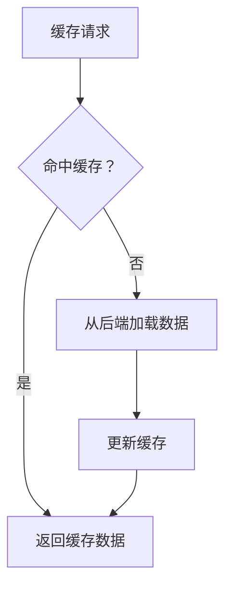

                 

# AI大模型应用的缓存设计与优化策略

> 关键词：AI大模型、缓存设计、优化策略、数据预取、负载均衡、内存管理、性能优化

> 摘要：本文旨在深入探讨AI大模型在实际应用中的缓存设计与优化策略。通过分析缓存的基本原理、核心算法、数学模型以及实际案例，本文将帮助读者理解如何在AI大模型中高效地设计和优化缓存系统，从而提升整体性能和用户体验。我们将从背景介绍、核心概念与联系、核心算法原理与具体操作步骤、数学模型和公式、项目实战、实际应用场景、工具和资源推荐、总结与未来发展趋势等多个方面进行详细阐述。

## 1. 背景介绍

随着AI技术的飞速发展，大模型的应用越来越广泛，从自然语言处理到图像识别，再到推荐系统，AI大模型在各个领域发挥着重要作用。然而，大模型的训练和推理过程往往需要大量的计算资源和存储资源，这不仅增加了成本，还可能导致性能瓶颈。因此，如何高效地设计和优化缓存系统，成为提升AI大模型性能的关键。

## 2. 核心概念与联系

### 2.1 缓存的基本原理

缓存是一种临时存储机制，用于存储频繁访问的数据，以减少对后端存储系统的访问次数，从而提高数据访问速度。缓存系统通常由缓存层、缓存策略和缓存管理三部分组成。

### 2.2 核心概念

- **缓存层**：负责存储和管理缓存数据。
- **缓存策略**：决定哪些数据应该被缓存，以及如何替换缓存中的数据。
- **缓存管理**：负责缓存数据的加载、更新和删除。

### 2.3 Mermaid 流程图



## 3. 核心算法原理 & 具体操作步骤

### 3.1 命中率优化算法

命中率是衡量缓存性能的重要指标。通过优化缓存策略，可以提高缓存的命中率，从而提升整体性能。

#### 3.1.1 LRU（最近最少使用）算法

LRU算法是最常用的缓存替换策略之一。它基于数据的访问频率，将最近最少使用的数据替换出缓存。

#### 3.1.2 LFU（最少使用）算法

LFU算法根据数据的访问次数来决定替换策略，访问次数最少的数据优先被替换。

#### 3.1.3 命中率优化步骤

1. **数据访问统计**：记录每个数据项的访问次数。
2. **缓存替换**：根据统计结果，选择访问次数最少的数据项进行替换。
3. **更新缓存**：将新数据加载到缓存中。

### 3.2 数据预取算法

数据预取是指在数据实际被请求之前，提前将数据加载到缓存中。这可以显著减少数据加载时间，提高整体性能。

#### 3.2.1 数据预取步骤

1. **预测数据访问模式**：通过分析历史数据访问模式，预测未来可能被访问的数据。
2. **预加载数据**：将预测的数据提前加载到缓存中。
3. **更新缓存**：确保缓存中的数据是最新的。

## 4. 数学模型和公式 & 详细讲解 & 举例说明

### 4.1 命中率公式

缓存的命中率可以通过以下公式计算：

$$
\text{命中率} = \frac{\text{命中次数}}{\text{总访问次数}}
$$

### 4.2 数据预取模型

数据预取模型可以通过以下公式计算预加载的数据量：

$$
\text{预加载数据量} = \text{预测访问次数} \times \text{数据大小}
$$

### 4.3 举例说明

假设一个AI大模型的缓存系统，每天的总访问次数为1000次，其中命中次数为800次。那么，该系统的缓存命中率为：

$$
\text{命中率} = \frac{800}{1000} = 0.8
$$

如果预测未来一天的访问次数为1200次，且每条数据的大小为10KB，那么预加载的数据量为：

$$
\text{预加载数据量} = 1200 \times 10KB = 12MB
$$

## 5. 项目实战：代码实际案例和详细解释说明

### 5.1 开发环境搭建

#### 5.1.1 环境准备

1. **操作系统**：Ubuntu 20.04
2. **编程语言**：Python 3.8
3. **缓存库**：Redis

#### 5.1.2 安装依赖

```bash
sudo apt-get update
sudo apt-get install -y python3-pip
pip3 install redis
```

### 5.2 源代码详细实现和代码解读

#### 5.2.1 缓存客户端代码

```python
import redis
import time

# 连接Redis服务器
r = redis.Redis(host='localhost', port=6379, db=0)

def get_data(key):
    start_time = time.time()
    data = r.get(key)
    if data is None:
        print(f"Miss: {key}")
    else:
        print(f"Hit: {key}")
    end_time = time.time()
    print(f"Time taken: {end_time - start_time:.4f} seconds")
    return data

def set_data(key, value):
    r.set(key, value)

# 测试缓存
set_data('test_key', 'test_value')
time.sleep(1)  # 模拟数据访问间隔
get_data('test_key')
```

#### 5.2.2 缓存服务器代码

```python
import redis
import time

# 连接Redis服务器
r = redis.Redis(host='localhost', port=6379, db=0)

def load_data(key):
    # 模拟从后端加载数据
    time.sleep(1)
    return f"Loaded data for {key}"

def cache_data(key, value):
    r.set(key, value)

def get_data(key):
    start_time = time.time()
    data = r.get(key)
    if data is None:
        data = load_data(key)
        cache_data(key, data)
    else:
        print(f"Hit: {key}")
    end_time = time.time()
    print(f"Time taken: {end_time - start_time:.4f} seconds")
    return data

# 测试缓存
get_data('test_key')
```

### 5.3 代码解读与分析

- **缓存客户端代码**：通过`get_data`函数获取数据，如果命中缓存则直接返回，否则从后端加载数据并更新缓存。
- **缓存服务器代码**：通过`load_data`函数模拟从后端加载数据，通过`cache_data`函数将数据加载到缓存中。

## 6. 实际应用场景

### 6.1 推荐系统

在推荐系统中，缓存可以显著提高推荐速度。通过缓存用户的历史行为数据，可以快速生成推荐结果，提升用户体验。

### 6.2 图像识别

在图像识别任务中，缓存可以加速模型推理过程。通过缓存已经处理过的图像数据，可以减少重复计算，提高整体性能。

### 6.3 自然语言处理

在自然语言处理任务中，缓存可以加速文本处理过程。通过缓存已经处理过的文本数据，可以减少重复计算，提高整体性能。

## 7. 工具和资源推荐

### 7.1 学习资源推荐

- **书籍**：《高性能服务器编程》、《Redis权威指南》
- **论文**：《缓存系统设计与优化》、《高性能缓存技术》
- **博客**：阿里云技术博客、腾讯技术博客
- **网站**：Redis官网、Docker官网

### 7.2 开发工具框架推荐

- **缓存库**：Redis、Memcached
- **开发框架**：Django、Flask

### 7.3 相关论文著作推荐

- **论文**：《缓存系统设计与优化》、《高性能缓存技术》
- **著作**：《高性能服务器编程》、《Redis权威指南》

## 8. 总结：未来发展趋势与挑战

### 8.1 未来发展趋势

- **智能化缓存**：通过机器学习算法优化缓存策略。
- **分布式缓存**：通过分布式缓存系统提高缓存性能和可靠性。
- **边缘计算**：通过边缘缓存提高数据处理速度和响应时间。

### 8.2 挑战

- **数据一致性**：缓存与后端数据的一致性问题。
- **性能优化**：如何在保证性能的同时，降低缓存系统的复杂度。
- **资源管理**：如何合理分配缓存资源，避免资源浪费。

## 9. 附录：常见问题与解答

### 9.1 问题1：缓存命中率低怎么办？

**解答**：可以通过优化缓存策略，如使用LRU或LFU算法，提高缓存命中率。

### 9.2 问题2：如何保证缓存数据的一致性？

**解答**：可以通过使用分布式缓存系统，如Redis，确保缓存与后端数据的一致性。

### 9.3 问题3：如何优化缓存性能？

**解答**：可以通过优化缓存策略，如使用LRU或LFU算法，以及预加载数据，提高缓存性能。

## 10. 扩展阅读 & 参考资料

- **书籍**：《高性能服务器编程》、《Redis权威指南》
- **论文**：《缓存系统设计与优化》、《高性能缓存技术》
- **网站**：Redis官网、Docker官网

---

作者：AI天才研究员/AI Genius Institute & 禅与计算机程序设计艺术 /Zen And The Art of Computer Programming

