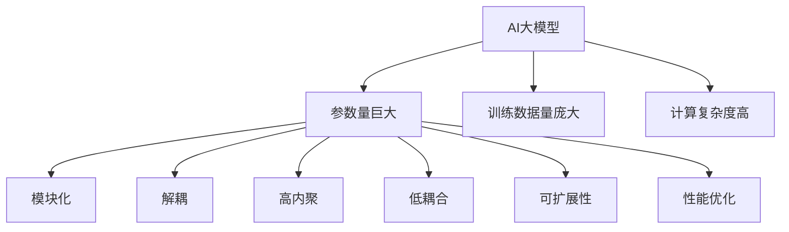

                 

# AI大模型时代的软件架构设计

> 关键词：AI大模型、软件架构、设计原则、模型优化、并行计算、分布式系统、微服务架构

> 摘要：随着AI大模型的兴起，软件架构设计面临着前所未有的挑战与机遇。本文将深入探讨AI大模型时代的软件架构设计，从核心概念、算法原理、数学模型、实战案例到应用场景，全面解析如何构建高效、可扩展的AI系统。通过详细的技术分析和实际案例，本文旨在为读者提供全面的技术指导，帮助他们在AI大模型时代构建出更加稳健和高效的软件架构。

## 1. 背景介绍

### 1.1 AI大模型的兴起
近年来，随着计算能力的提升和数据量的爆炸性增长，AI大模型逐渐成为推动技术进步的关键力量。这些模型通常包含数亿甚至数十亿个参数，能够处理复杂的任务，如自然语言处理、图像识别、语音识别等。AI大模型的兴起不仅推动了技术的发展，也对软件架构设计提出了新的要求。

### 1.2 软件架构设计的重要性
软件架构设计是构建高效、可扩展系统的基石。在AI大模型时代，软件架构设计不仅要考虑模型本身的性能，还要考虑系统的整体性能、可维护性、可扩展性以及资源利用效率。合理的软件架构设计能够显著提升系统的性能和稳定性，降低开发和维护成本。

## 2. 核心概念与联系

### 2.1 AI大模型概述
AI大模型通常指的是参数量巨大、训练数据量庞大、计算复杂度高的模型。这些模型通常采用深度学习技术，如Transformer、BERT、GPT等。AI大模型的特点包括：

- **参数量巨大**：通常包含数亿甚至数十亿个参数。
- **训练数据量庞大**：需要大量的标注数据进行训练。
- **计算复杂度高**：训练和推理过程需要大量的计算资源。

### 2.2 软件架构设计原则
软件架构设计需要遵循一系列原则，以确保系统的高效性和可扩展性。这些原则包括：

- **模块化**：将系统划分为独立的模块，每个模块负责特定的功能。
- **解耦**：模块之间保持低耦合，提高系统的灵活性和可维护性。
- **高内聚**：模块内部的功能应紧密相关，提高模块的独立性和可重用性。
- **低耦合**：模块之间应尽量减少依赖，提高系统的灵活性和可扩展性。
- **可扩展性**：系统应能够轻松扩展，以应对未来的需求变化。
- **性能优化**：系统应具备高效的性能，以满足实时性和响应性要求。

### 2.3 Mermaid流程图
为了更好地理解AI大模型时代的软件架构设计，我们可以通过Mermaid流程图来展示其核心概念和联系。以下是Mermaid流程图的示意图：



## 3. 核心算法原理 & 具体操作步骤

### 3.1 模型训练过程
AI大模型的训练过程通常包括以下几个步骤：

1. **数据预处理**：对原始数据进行清洗、标注和格式化。
2. **模型构建**：选择合适的模型架构，如Transformer、BERT等。
3. **参数初始化**：对模型参数进行初始化，通常采用随机初始化或预训练模型的参数。
4. **损失函数选择**：选择合适的损失函数，如交叉熵损失、均方误差等。
5. **优化算法选择**：选择合适的优化算法，如SGD、Adam等。
6. **训练过程**：通过反向传播算法更新模型参数，最小化损失函数。
7. **验证和测试**：在验证集和测试集上评估模型性能。

### 3.2 模型推理过程
模型推理过程通常包括以下几个步骤：

1. **输入数据预处理**：对输入数据进行预处理，如分词、编码等。
2. **模型前向传播**：通过模型进行前向传播，得到输出结果。
3. **结果后处理**：对模型输出结果进行后处理，如解码、分类等。
4. **性能评估**：评估模型的性能，如准确率、召回率等。

### 3.3 具体操作步骤
以BERT模型为例，其训练和推理过程的具体操作步骤如下：

#### 3.3.1 数据预处理
```python
import pandas as pd
from transformers import BertTokenizer

# 读取数据
data = pd.read_csv('data.csv')

# 初始化分词器
tokenizer = BertTokenizer.from_pretrained('bert-base-uncased')

# 对数据进行分词和编码
inputs = tokenizer(data['text'].tolist(), padding=True, truncation=True, return_tensors='pt')
```

#### 3.3.2 模型构建
```python
from transformers import BertForSequenceClassification

# 构建模型
model = BertForSequenceClassification.from_pretrained('bert-base-uncased', num_labels=2)
```

#### 3.3.3 参数初始化
```python
# 参数初始化
model.init_weights()
```

#### 3.3.4 损失函数选择
```python
import torch.nn as nn

# 选择损失函数
criterion = nn.CrossEntropyLoss()
```

#### 3.3.5 优化算法选择
```python
from transformers import AdamW

# 选择优化算法
optimizer = AdamW(model.parameters(), lr=1e-5)
```

#### 3.3.6 训练过程
```python
import torch

# 训练过程
for epoch in range(num_epochs):
    model.train()
    for batch in train_dataloader:
        inputs = {key: val.to(device) for key, val in inputs.items()}
        labels = batch['labels'].to(device)
        
        optimizer.zero_grad()
        outputs = model(**inputs)
        loss = criterion(outputs.logits, labels)
        loss.backward()
        optimizer.step()
```

#### 3.3.7 验证和测试
```python
model.eval()
with torch.no_grad():
    for batch in val_dataloader:
        inputs = {key: val.to(device) for key, val in inputs.items()}
        labels = batch['labels'].to(device)
        
        outputs = model(**inputs)
        loss = criterion(outputs.logits, labels)
        val_loss += loss.item()
```

## 4. 数学模型和公式 & 详细讲解 & 举例说明

### 4.1 损失函数
损失函数是衡量模型性能的重要指标。常见的损失函数包括交叉熵损失和均方误差损失。

#### 4.1.1 交叉熵损失
交叉熵损失用于分类任务，其公式如下：

$$
L = -\frac{1}{N} \sum_{i=1}^{N} \sum_{j=1}^{C} y_{ij} \log(p_{ij})
$$

其中，$N$ 是样本数量，$C$ 是类别数量，$y_{ij}$ 是真实标签，$p_{ij}$ 是模型预测的概率。

#### 4.1.2 均方误差损失
均方误差损失用于回归任务，其公式如下：

$$
L = \frac{1}{N} \sum_{i=1}^{N} (y_i - \hat{y}_i)^2
$$

其中，$N$ 是样本数量，$y_i$ 是真实值，$\hat{y}_i$ 是模型预测值。

### 4.2 优化算法
优化算法用于更新模型参数，使其损失函数最小化。常见的优化算法包括SGD、Adam等。

#### 4.2.1 SGD
SGD是最简单的优化算法，其公式如下：

$$
\theta_{t+1} = \theta_t - \eta \nabla L(\theta_t)
$$

其中，$\theta_t$ 是当前参数，$\eta$ 是学习率，$\nabla L(\theta_t)$ 是损失函数的梯度。

#### 4.2.2 Adam
Adam是一种自适应学习率的优化算法，其公式如下：

$$
m_t = \beta_1 m_{t-1} + (1 - \beta_1) \nabla L(\theta_t)
$$

$$
v_t = \beta_2 v_{t-1} + (1 - \beta_2) \nabla L(\theta_t)^2
$$

$$
\hat{m}_t = \frac{m_t}{1 - \beta_1^t}
$$

$$
\hat{v}_t = \frac{v_t}{1 - \beta_2^t}
$$

$$
\theta_{t+1} = \theta_t - \eta \frac{\hat{m}_t}{\sqrt{\hat{v}_t} + \epsilon}
$$

其中，$\beta_1$ 和 $\beta_2$ 是超参数，$\epsilon$ 是一个很小的常数，防止分母为零。

### 4.3 举例说明
以BERT模型为例，其损失函数和优化算法的具体实现如下：

#### 4.3.1 损失函数
```python
import torch.nn as nn

# 选择损失函数
criterion = nn.CrossEntropyLoss()
```

#### 4.3.2 优化算法
```python
from transformers import AdamW

# 选择优化算法
optimizer = AdamW(model.parameters(), lr=1e-5)
```

## 5. 项目实战：代码实际案例和详细解释说明

### 5.1 开发环境搭建
为了搭建开发环境，我们需要安装必要的库和工具。以下是安装步骤：

1. **安装Python**：确保安装了Python 3.7及以上版本。
2. **安装PyTorch**：使用pip安装PyTorch库。
3. **安装Transformers**：使用pip安装Transformers库。
4. **安装其他依赖库**：根据项目需求安装其他依赖库。

```bash
pip install torch transformers
```

### 5.2 源代码详细实现和代码解读
以下是一个完整的BERT模型训练和推理代码示例：

```python
import torch
from transformers import BertTokenizer, BertForSequenceClassification, AdamW, get_linear_schedule_with_warmup
from torch.utils.data import DataLoader, Dataset
import pandas as pd

# 读取数据
data = pd.read_csv('data.csv')

# 初始化分词器
tokenizer = BertTokenizer.from_pretrained('bert-base-uncased')

# 对数据进行分词和编码
inputs = tokenizer(data['text'].tolist(), padding=True, truncation=True, return_tensors='pt')
labels = torch.tensor(data['label'].tolist())

# 构建数据集
class TextDataset(Dataset):
    def __init__(self, inputs, labels):
        self.inputs = inputs
        self.labels = labels
    
    def __len__(self):
        return len(self.labels)
    
    def __getitem__(self, idx):
        return {key: val[idx] for key, val in self.inputs.items()}, self.labels[idx]

# 构建数据加载器
train_dataset = TextDataset(inputs, labels)
train_dataloader = DataLoader(train_dataset, batch_size=16, shuffle=True)

# 构建模型
model = BertForSequenceClassification.from_pretrained('bert-base-uncased', num_labels=2)

# 初始化参数
model.init_weights()

# 选择损失函数
criterion = nn.CrossEntropyLoss()

# 选择优化算法
optimizer = AdamW(model.parameters(), lr=1e-5)

# 训练过程
num_epochs = 3
device = torch.device('cuda' if torch.cuda.is_available() else 'cpu')
model.to(device)

for epoch in range(num_epochs):
    model.train()
    for batch in train_dataloader:
        inputs = {key: val.to(device) for key, val in batch[0].items()}
        labels = batch[1].to(device)
        
        optimizer.zero_grad()
        outputs = model(**inputs)
        loss = criterion(outputs.logits, labels)
        loss.backward()
        optimizer.step()
```

### 5.3 代码解读与分析
以上代码实现了BERT模型的训练过程。具体步骤如下：

1. **数据预处理**：使用BertTokenizer对文本数据进行分词和编码。
2. **构建数据集**：将分词后的数据和标签封装成数据集。
3. **构建数据加载器**：使用DataLoader将数据集划分为批次。
4. **构建模型**：使用BertForSequenceClassification构建模型。
5. **初始化参数**：对模型参数进行初始化。
6. **选择损失函数**：选择交叉熵损失函数。
7. **选择优化算法**：选择AdamW优化算法。
8. **训练过程**：通过反向传播更新模型参数，最小化损失函数。

## 6. 实际应用场景

### 6.1 自然语言处理
AI大模型在自然语言处理领域有着广泛的应用，如情感分析、文本分类、机器翻译等。通过合理的软件架构设计，可以构建高效、可扩展的自然语言处理系统。

### 6.2 语音识别
AI大模型在语音识别领域也有着重要的应用，如语音转文本、语音情感分析等。通过合理的软件架构设计，可以构建高效、可扩展的语音识别系统。

### 6.3 图像识别
AI大模型在图像识别领域也有着广泛的应用，如物体检测、图像分类等。通过合理的软件架构设计，可以构建高效、可扩展的图像识别系统。

## 7. 工具和资源推荐

### 7.1 学习资源推荐
- **书籍**：《深度学习》（Goodfellow, Bengio, Courville）
- **论文**：《Attention Is All You Need》（Vaswani et al.）
- **博客**：Medium上的AI大模型相关文章
- **网站**：Hugging Face、PyTorch官网

### 7.2 开发工具框架推荐
- **PyTorch**：深度学习框架，支持GPU加速。
- **Transformers**：Hugging Face提供的预训练模型库。
- **TensorFlow**：深度学习框架，支持多种硬件加速。

### 7.3 相关论文著作推荐
- **《Attention Is All You Need》**：Vaswani, Ashish, et al. "Attention is all you need." Advances in neural information processing systems 30 (2017).
- **《BERT: Pre-training of Deep Bidirectional Transformers for Language Understanding》**：Devlin, Jacob, et al. "BERT: Pre-training of deep bidirectional transformers for language understanding." arXiv preprint arXiv:1810.04805 (2018).

## 8. 总结：未来发展趋势与挑战

### 8.1 未来发展趋势
AI大模型在未来的发展趋势包括：

- **模型优化**：通过模型剪枝、量化等技术提高模型的性能和效率。
- **并行计算**：通过分布式计算提高模型的训练和推理速度。
- **自动化训练**：通过自动化工具提高模型训练的效率和准确性。
- **可解释性**：提高模型的可解释性，使其更容易被人类理解和应用。

### 8.2 挑战
AI大模型在未来的发展过程中面临的主要挑战包括：

- **计算资源**：训练和推理大模型需要大量的计算资源，如何有效利用计算资源是一个重要问题。
- **数据隐私**：如何保护数据隐私，避免数据泄露是一个重要问题。
- **模型可解释性**：如何提高模型的可解释性，使其更容易被人类理解和应用是一个重要问题。
- **模型泛化能力**：如何提高模型的泛化能力，使其在不同场景下都能表现出色是一个重要问题。

## 9. 附录：常见问题与解答

### 9.1 问题1：如何选择合适的优化算法？
**解答**：选择合适的优化算法需要考虑模型的特性和计算资源。对于小模型，SGD可能是一个不错的选择；对于大模型，Adam等自适应学习率的优化算法可能更合适。

### 9.2 问题2：如何提高模型的性能？
**解答**：提高模型性能的方法包括模型优化、并行计算、自动化训练等。通过模型剪枝、量化等技术可以提高模型的性能和效率；通过分布式计算可以提高模型的训练和推理速度；通过自动化工具可以提高模型训练的效率和准确性。

### 9.3 问题3：如何保护数据隐私？
**解答**：保护数据隐私的方法包括数据加密、数据脱敏、数据匿名化等。通过数据加密可以保护数据的安全性；通过数据脱敏可以保护数据的隐私性；通过数据匿名化可以保护数据的可追溯性。

## 10. 扩展阅读 & 参考资料

### 10.1 扩展阅读
- **《深度学习》**：Ian Goodfellow, Yoshua Bengio, Aaron Courville
- **《Attention Is All You Need》**：Vaswani, Ashish, et al.
- **《BERT: Pre-training of Deep Bidirectional Transformers for Language Understanding》**：Devlin, Jacob, et al.

### 10.2 参考资料
- **PyTorch官网**：https://pytorch.org/
- **Hugging Face**：https://huggingface.co/
- **TensorFlow官网**：https://www.tensorflow.org/

---

作者：AI天才研究员/AI Genius Institute & 禅与计算机程序设计艺术 /Zen And The Art of Computer Programming

