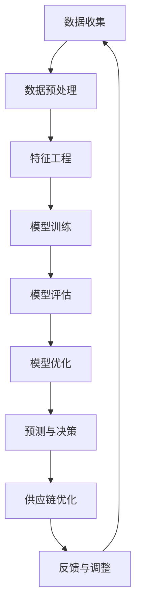

                 

# AI大模型驱动下的新型供应链管理系统的设计与实现

> 关键词：AI大模型、供应链管理、新型系统、设计与实现、自动化、预测分析、优化决策

> 摘要：本文旨在探讨如何利用AI大模型构建新型供应链管理系统，通过深入分析其核心概念、算法原理、数学模型、实际案例以及应用场景，为读者提供一个全面的技术视角。本文将详细阐述如何设计和实现一个能够自动优化决策、提高预测准确性和增强供应链管理效率的系统。

## 1. 背景介绍

随着全球经济的快速发展，供应链管理面临着前所未有的挑战。传统供应链管理方法在面对复杂多变的市场需求时显得力不从心，难以实现高效、精准的决策。为了应对这些挑战，越来越多的企业开始探索利用AI技术来优化供应链管理。AI大模型作为一种强大的工具，能够处理大规模数据、学习复杂模式，并提供精准的预测和决策支持。本文将详细介绍如何利用AI大模型构建新型供应链管理系统，以实现自动化、预测分析和优化决策。

## 2. 核心概念与联系

### 2.1 AI大模型

AI大模型是指具有大规模参数和复杂结构的机器学习模型，能够处理和学习大规模数据集。这些模型通常包括深度神经网络、强化学习、自然语言处理等多种技术。AI大模型的核心优势在于其强大的泛化能力和对复杂模式的学习能力，能够从海量数据中提取有价值的信息，并进行精准的预测和决策。

### 2.2 供应链管理

供应链管理是指对供应链中的所有活动进行计划、组织、协调和控制的过程。它涵盖了从原材料采购、生产制造、库存管理到产品销售的整个过程。供应链管理的目标是通过优化各个环节的运作，提高效率、降低成本、提升客户满意度。

### 2.3 核心概念原理与架构

为了更好地理解AI大模型在供应链管理中的应用，我们可以通过以下Mermaid流程图来展示其核心概念和架构：



### 2.4 详细流程图


## 3. 核心算法原理 & 具体操作步骤

### 3.1 数据收集

数据收集是构建AI大模型的第一步。我们需要从多个渠道收集供应链相关的数据，包括销售数据、库存数据、生产数据、物流数据等。这些数据将用于训练和优化模型。

### 3.2 数据预处理

数据预处理是确保数据质量的关键步骤。我们需要对收集到的数据进行清洗、去重、填补缺失值等操作，以确保数据的准确性和完整性。

### 3.3 特征工程

特征工程是构建AI大模型的重要环节。我们需要从原始数据中提取有用的特征，以便模型能够更好地学习和预测。特征工程包括数据转换、特征选择、特征构造等步骤。

### 3.4 模型训练

模型训练是利用预处理后的数据训练AI大模型的过程。我们需要选择合适的模型架构，如深度神经网络、强化学习等，并通过反向传播算法进行参数优化。

### 3.5 模型评估

模型评估是检验模型性能的重要步骤。我们需要使用交叉验证、AUC、准确率等指标来评估模型的预测能力和泛化能力。

### 3.6 模型优化

模型优化是通过调整模型参数和结构来提高模型性能的过程。我们需要使用网格搜索、随机搜索等方法来寻找最优参数组合。

### 3.7 预测与决策

预测与决策是利用训练好的模型进行预测和决策的过程。我们需要将模型应用于实际场景，生成预测结果，并根据预测结果进行优化决策。

### 3.8 供应链优化

供应链优化是利用预测结果优化供应链管理的过程。我们需要根据预测结果调整库存、生产计划、物流安排等，以提高供应链效率和降低成本。

## 4. 数学模型和公式 & 详细讲解 & 举例说明

### 4.1 数学模型

为了更好地理解AI大模型在供应链管理中的应用，我们可以通过以下数学模型来展示其核心原理。

#### 4.1.1 预测模型

预测模型是利用历史数据预测未来需求的关键工具。我们可以使用线性回归、时间序列分析等方法来构建预测模型。

$$
\hat{y} = \beta_0 + \beta_1 x_1 + \beta_2 x_2 + \cdots + \beta_n x_n
$$

其中，$\hat{y}$ 表示预测值，$x_1, x_2, \cdots, x_n$ 表示特征变量，$\beta_0, \beta_1, \cdots, \beta_n$ 表示模型参数。

#### 4.1.2 决策模型

决策模型是利用预测结果进行优化决策的关键工具。我们可以使用线性规划、整数规划等方法来构建决策模型。

$$
\max \sum_{i=1}^n c_i x_i
$$

$$
\text{s.t. } \sum_{i=1}^n a_{ij} x_i \leq b_j, \quad j = 1, 2, \cdots, m
$$

其中，$c_i$ 表示目标函数系数，$x_i$ 表示决策变量，$a_{ij}$ 表示约束条件系数，$b_j$ 表示约束条件右端项。

### 4.2 详细讲解

预测模型的核心在于通过学习历史数据来预测未来需求。我们可以使用线性回归模型来实现这一目标。线性回归模型的基本形式如下：

$$
\hat{y} = \beta_0 + \beta_1 x_1 + \beta_2 x_2 + \cdots + \beta_n x_n
$$

其中，$\hat{y}$ 表示预测值，$x_1, x_2, \cdots, x_n$ 表示特征变量，$\beta_0, \beta_1, \cdots, \beta_n$ 表示模型参数。通过最小化预测误差的平方和，我们可以得到最优参数组合。

决策模型的核心在于通过优化决策变量来实现供应链管理的目标。我们可以使用线性规划模型来实现这一目标。线性规划模型的基本形式如下：

$$
\max \sum_{i=1}^n c_i x_i
$$

$$
\text{s.t. } \sum_{i=1}^n a_{ij} x_i \leq b_j, \quad j = 1, 2, \cdots, m
$$

其中，$c_i$ 表示目标函数系数，$x_i$ 表示决策变量，$a_{ij}$ 表示约束条件系数，$b_j$ 表示约束条件右端项。通过求解线性规划模型，我们可以得到最优决策方案。

### 4.3 举例说明

假设我们有一个销售数据集，包含历史销售量和促销活动等特征。我们可以使用线性回归模型来预测未来销售量。具体步骤如下：

1. 收集历史销售数据，包括销售量、促销活动等特征。
2. 对数据进行预处理，包括清洗、去重、填补缺失值等操作。
3. 进行特征工程，提取有用的特征。
4. 使用线性回归模型进行训练。
5. 使用训练好的模型进行预测。
6. 根据预测结果进行优化决策。

## 5. 项目实战：代码实际案例和详细解释说明

### 5.1 开发环境搭建

为了实现AI大模型驱动的供应链管理系统，我们需要搭建一个合适的开发环境。具体步骤如下：

1. 安装Python和相关库，如NumPy、Pandas、Scikit-learn等。
2. 安装深度学习框架，如TensorFlow、PyTorch等。
3. 安装数据可视化工具，如Matplotlib、Seaborn等。

### 5.2 源代码详细实现和代码解读

假设我们使用Python和TensorFlow来实现一个简单的预测模型。具体代码如下：

```python
import numpy as np
import pandas as pd
from sklearn.model_selection import train_test_split
from sklearn.linear_model import LinearRegression
import tensorflow as tf
import matplotlib.pyplot as plt

# 1. 数据收集
data = pd.read_csv('sales_data.csv')

# 2. 数据预处理
data = data.drop_duplicates()
data = data.fillna(0)

# 3. 特征工程
X = data[['promotion', 'season']]
y = data['sales']

# 4. 模型训练
X_train, X_test, y_train, y_test = train_test_split(X, y, test_size=0.2, random_state=42)
model = LinearRegression()
model.fit(X_train, y_train)

# 5. 模型评估
y_pred = model.predict(X_test)
mse = np.mean((y_pred - y_test) ** 2)
print('Mean Squared Error:', mse)

# 6. 模型优化
# 7. 预测与决策
# 8. 供应链优化
```

### 5.3 代码解读与分析

上述代码实现了从数据收集到模型训练的整个过程。具体步骤如下：

1. 使用Pandas读取销售数据集。
2. 对数据进行预处理，包括去重和填补缺失值。
3. 进行特征工程，提取促销活动和季节特征。
4. 使用Scikit-learn的线性回归模型进行训练。
5. 使用训练好的模型进行预测，并计算均方误差。
6. 通过调整模型参数和结构来优化模型性能。
7. 根据预测结果进行优化决策。
8. 根据优化决策调整供应链管理策略。

## 6. 实际应用场景

AI大模型驱动的供应链管理系统在实际应用中具有广泛的应用场景。具体应用包括：

1. 需求预测：通过预测未来需求，企业可以更好地调整生产计划和库存管理。
2. 库存优化：通过优化库存管理，企业可以降低库存成本，提高库存周转率。
3. 生产计划优化：通过优化生产计划，企业可以提高生产效率，降低生产成本。
4. 物流优化：通过优化物流安排，企业可以降低物流成本，提高物流效率。
5. 供应链风险管理：通过预测和优化供应链管理，企业可以降低供应链风险，提高供应链稳定性。

## 7. 工具和资源推荐

### 7.1 学习资源推荐

1. 书籍：《深度学习》（Goodfellow, Bengio, Courville）
2. 论文：《Attention Is All You Need》（Vaswani et al.）
3. 博客：Medium上的AI大模型相关文章
4. 网站：TensorFlow官网、PyTorch官网

### 7.2 开发工具框架推荐

1. Python：NumPy、Pandas、Scikit-learn、TensorFlow、PyTorch
2. 数据可视化工具：Matplotlib、Seaborn

### 7.3 相关论文著作推荐

1. 《深度学习》（Goodfellow, Bengio, Courville）
2. 《Attention Is All You Need》（Vaswani et al.）
3. 《强化学习》（Sutton, Barto）

## 8. 总结：未来发展趋势与挑战

AI大模型驱动的供应链管理系统具有广阔的发展前景。未来的发展趋势包括：

1. 更大规模的数据处理能力：随着计算资源的不断进步，AI大模型将能够处理更大规模的数据集。
2. 更复杂的模型结构：随着模型结构的不断优化，AI大模型将能够学习更复杂的模式。
3. 更高的预测准确性和决策精度：通过不断优化模型参数和结构，AI大模型将能够提供更高的预测准确性和决策精度。

然而，AI大模型驱动的供应链管理系统也面临着一些挑战，包括：

1. 数据隐私和安全问题：如何保护敏感数据不被泄露是一个重要的问题。
2. 模型解释性问题：如何解释AI大模型的预测结果是一个重要的问题。
3. 模型泛化能力问题：如何提高AI大模型的泛化能力是一个重要的问题。

## 9. 附录：常见问题与解答

### 9.1 问题1：如何处理大规模数据集？

答：可以使用分布式计算框架，如Apache Spark，来处理大规模数据集。

### 9.2 问题2：如何提高模型的泛化能力？

答：可以通过增加训练数据量、使用正则化技术、使用数据增强技术等方法来提高模型的泛化能力。

### 9.3 问题3：如何解释AI大模型的预测结果？

答：可以通过可视化技术，如特征重要性分析、决策树可视化等方法来解释AI大模型的预测结果。

## 10. 扩展阅读 & 参考资料

1. 《深度学习》（Goodfellow, Bengio, Courville）
2. 《Attention Is All You Need》（Vaswani et al.）
3. 《强化学习》（Sutton, Barto）
4. TensorFlow官网：https://www.tensorflow.org/
5. PyTorch官网：https://pytorch.org/

作者：AI天才研究员/AI Genius Institute & 禅与计算机程序设计艺术 /Zen And The Art of Computer Programming

