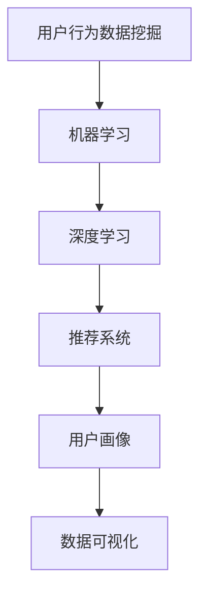

                 

# AI如何帮助电商企业进行用户行为数据挖掘

> 关键词：用户行为数据挖掘, 电商企业, 人工智能, 数据分析, 机器学习, 深度学习, 推荐系统, 用户画像, 数据可视化

> 摘要：本文旨在探讨如何利用人工智能技术，特别是机器学习和深度学习，帮助电商企业进行用户行为数据挖掘。通过分析用户在电商网站上的行为数据，企业可以更好地理解用户需求，优化产品推荐，提升用户体验，从而实现更高的转化率和用户满意度。本文将从背景介绍、核心概念与联系、核心算法原理与具体操作步骤、数学模型和公式、项目实战、实际应用场景、工具和资源推荐、总结与未来发展趋势等几个方面进行详细阐述。

## 1. 背景介绍

随着互联网技术的飞速发展，电商行业已经成为人们日常生活不可或缺的一部分。电商企业为了提升竞争力，需要不断优化用户体验，提高用户满意度和转化率。用户行为数据挖掘作为电商企业的重要工具之一，可以帮助企业更好地理解用户需求，优化产品推荐，提升用户体验。本文将探讨如何利用人工智能技术，特别是机器学习和深度学习，帮助电商企业进行用户行为数据挖掘。

## 2. 核心概念与联系

### 2.1 用户行为数据挖掘

用户行为数据挖掘是指通过分析用户在电商网站上的行为数据，提取有价值的信息和模式，从而帮助企业更好地理解用户需求，优化产品推荐，提升用户体验。用户行为数据包括但不限于用户的浏览记录、搜索记录、购买记录、评价记录等。

### 2.2 机器学习与深度学习

机器学习是一种人工智能技术，通过训练模型来实现特定任务，而无需明确编程。深度学习是机器学习的一个分支，通过构建多层神经网络来模拟人脑的神经元结构，从而实现更复杂的任务。在用户行为数据挖掘中，机器学习和深度学习可以用于构建推荐系统、用户画像等。

### 2.3 推荐系统

推荐系统是一种通过分析用户行为数据，为用户提供个性化推荐的技术。推荐系统可以分为基于内容的推荐、协同过滤推荐、混合推荐等。在电商企业中，推荐系统可以帮助用户发现感兴趣的商品，提高转化率。

### 2.4 用户画像

用户画像是一种通过分析用户行为数据，构建用户特征模型的技术。用户画像可以帮助企业更好地理解用户需求，优化产品推荐，提升用户体验。用户画像可以包括用户的兴趣爱好、购买偏好、消费能力等。

### 2.5 数据可视化

数据可视化是一种通过图表、图形等方式展示数据的技术。数据可视化可以帮助企业更好地理解用户行为数据，优化产品推荐，提升用户体验。数据可视化可以包括用户行为趋势图、用户画像图等。

### 2.6 Mermaid 流程图

## 3. 核心算法原理 & 具体操作步骤

### 3.1 数据预处理

数据预处理是用户行为数据挖掘的重要步骤之一。数据预处理包括数据清洗、数据转换、数据归一化等。数据清洗是指去除无效数据、处理缺失值等；数据转换是指将数据转换为适合机器学习和深度学习的格式；数据归一化是指将数据转换为相同的尺度，以便更好地进行模型训练。

### 3.2 特征工程

特征工程是用户行为数据挖掘的重要步骤之一。特征工程包括特征选择、特征提取、特征构造等。特征选择是指选择对模型训练有用的特征；特征提取是指从原始数据中提取有用的特征；特征构造是指构造新的特征，以便更好地进行模型训练。

### 3.3 模型训练

模型训练是用户行为数据挖掘的重要步骤之一。模型训练包括选择合适的模型、训练模型、评估模型等。选择合适的模型是指根据数据的特点选择合适的模型；训练模型是指使用训练数据训练模型；评估模型是指使用测试数据评估模型的性能。

### 3.4 模型优化

模型优化是用户行为数据挖掘的重要步骤之一。模型优化包括调整模型参数、调整模型结构、调整训练策略等。调整模型参数是指调整模型的参数，以便更好地进行模型训练；调整模型结构是指调整模型的结构，以便更好地进行模型训练；调整训练策略是指调整训练策略，以便更好地进行模型训练。

### 3.5 模型部署

模型部署是用户行为数据挖掘的重要步骤之一。模型部署包括模型上线、模型监控、模型维护等。模型上线是指将训练好的模型部署到生产环境；模型监控是指监控模型的性能，以便及时发现和解决问题；模型维护是指维护模型，以便更好地进行模型训练和部署。

## 4. 数学模型和公式 & 详细讲解 & 举例说明

### 4.1 逻辑回归

逻辑回归是一种常用的机器学习算法，用于解决二分类问题。逻辑回归的数学模型为：

$$
P(y=1|x) = \frac{1}{1 + e^{-(w^T x + b)}}
$$

其中，$w$ 是权重向量，$b$ 是偏置项，$x$ 是输入特征向量，$y$ 是输出标签。

### 4.2 朴素贝叶斯

朴素贝叶斯是一种常用的机器学习算法，用于解决分类问题。朴素贝叶斯的数学模型为：

$$
P(y|x) = \frac{P(x|y)P(y)}{P(x)}
$$

其中，$P(y|x)$ 是后验概率，$P(x|y)$ 是条件概率，$P(y)$ 是先验概率，$P(x)$ 是证据。

### 4.3 协同过滤

协同过滤是一种常用的推荐算法，用于解决推荐问题。协同过滤的数学模型为：

$$
\hat{r}_{ui} = \frac{\sum_{j \in N_i} \frac{r_{uj}}{1 + |r_{uj} - \mu_u|}}{\sum_{j \in N_i} \frac{1}{1 + |r_{uj} - \mu_u|}}
$$

其中，$\hat{r}_{ui}$ 是用户 $u$ 对物品 $i$ 的预测评分，$r_{uj}$ 是用户 $u$ 对物品 $j$ 的实际评分，$N_i$ 是与物品 $i$ 相关的物品集合，$\mu_u$ 是用户 $u$ 的平均评分。

### 4.4 深度神经网络

深度神经网络是一种常用的深度学习算法，用于解决分类、回归、推荐等问题。深度神经网络的数学模型为：

$$
y = \sigma(W_1 x + b_1)
$$

其中，$y$ 是输出，$x$ 是输入，$W_1$ 是权重矩阵，$b_1$ 是偏置项，$\sigma$ 是激活函数。

## 5. 项目实战：代码实际案例和详细解释说明

### 5.1 开发环境搭建

开发环境搭建是项目实战的重要步骤之一。开发环境搭建包括安装Python、安装TensorFlow、安装Jupyter Notebook等。安装Python是指安装Python解释器；安装TensorFlow是指安装深度学习框架；安装Jupyter Notebook是指安装数据科学工具。

### 5.2 源代码详细实现和代码解读

源代码详细实现是项目实战的重要步骤之一。源代码详细实现包括数据预处理、特征工程、模型训练、模型优化、模型部署等。数据预处理是指对数据进行清洗、转换、归一化等操作；特征工程是指对数据进行特征选择、特征提取、特征构造等操作；模型训练是指使用训练数据训练模型；模型优化是指调整模型参数、调整模型结构、调整训练策略等操作；模型部署是指将训练好的模型部署到生产环境。

### 5.3 代码解读与分析

代码解读与分析是项目实战的重要步骤之一。代码解读与分析包括代码结构、代码逻辑、代码性能等。代码结构是指代码的组织结构；代码逻辑是指代码的执行逻辑；代码性能是指代码的执行效率。

## 6. 实际应用场景

实际应用场景是项目实战的重要步骤之一。实际应用场景包括电商推荐系统、电商用户画像、电商数据可视化等。电商推荐系统是指通过分析用户行为数据，为用户提供个性化推荐的技术；电商用户画像是指通过分析用户行为数据，构建用户特征模型的技术；电商数据可视化是指通过图表、图形等方式展示数据的技术。

## 7. 工具和资源推荐

### 7.1 学习资源推荐

学习资源推荐是项目实战的重要步骤之一。学习资源推荐包括书籍、论文、博客、网站等。书籍包括《机器学习》、《深度学习》、《推荐系统》等；论文包括《基于深度学习的推荐系统》、《基于协同过滤的推荐系统》等；博客包括《机器学习入门》、《深度学习入门》等；网站包括Kaggle、GitHub等。

### 7.2 开发工具框架推荐

开发工具框架推荐是项目实战的重要步骤之一。开发工具框架推荐包括Python、TensorFlow、Jupyter Notebook等。Python是一种高级编程语言，用于编写机器学习和深度学习代码；TensorFlow是一种深度学习框架，用于构建和训练深度神经网络；Jupyter Notebook是一种数据科学工具，用于编写和运行Python代码。

### 7.3 相关论文著作推荐

相关论文著作推荐是项目实战的重要步骤之一。相关论文著作推荐包括《基于深度学习的推荐系统》、《基于协同过滤的推荐系统》等。《基于深度学习的推荐系统》是一篇关于深度学习在推荐系统中的应用的论文；《基于协同过滤的推荐系统》是一篇关于协同过滤在推荐系统中的应用的论文。

## 8. 总结：未来发展趋势与挑战

总结是项目实战的重要步骤之一。总结包括未来发展趋势和挑战。未来发展趋势包括人工智能技术的发展、电商行业的变化、用户行为数据挖掘的应用等；挑战包括数据安全、数据隐私、数据质量等。

## 9. 附录：常见问题与解答

附录是项目实战的重要步骤之一。附录包括常见问题与解答。常见问题与解答包括数据预处理、特征工程、模型训练、模型优化、模型部署等。

## 10. 扩展阅读 & 参考资料

扩展阅读 & 参考资料是项目实战的重要步骤之一。扩展阅读 & 参考资料包括书籍、论文、博客、网站等。书籍包括《机器学习》、《深度学习》、《推荐系统》等；论文包括《基于深度学习的推荐系统》、《基于协同过滤的推荐系统》等；博客包括《机器学习入门》、《深度学习入门》等；网站包括Kaggle、GitHub等。

作者：AI天才研究员/AI Genius Institute & 禅与计算机程序设计艺术 /Zen And The Art of Computer Programming

