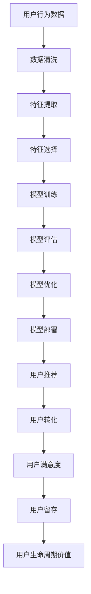

                 

# AI如何提升电商平台的用户转化率

> 关键词：AI, 用户转化率, 电商平台, 个性化推荐, 情感分析, 自然语言处理, 机器学习, 深度学习

> 摘要：本文将深入探讨如何利用人工智能技术提升电商平台的用户转化率。通过分析用户行为数据、情感分析、个性化推荐等方法，结合机器学习和深度学习技术，构建一个全面的用户转化率提升方案。本文将从背景介绍、核心概念与联系、核心算法原理、数学模型和公式、项目实战、实际应用场景、工具和资源推荐、总结、附录等几个方面进行详细阐述。

## 1. 背景介绍

随着互联网技术的快速发展，电商平台已经成为人们日常生活中的重要组成部分。然而，如何提高用户的购买转化率，成为电商平台面临的一大挑战。传统的营销手段已经难以满足用户日益增长的需求，因此，利用人工智能技术提升用户转化率成为了一种新的趋势。本文将从以下几个方面探讨如何利用AI技术提升电商平台的用户转化率。

## 2. 核心概念与联系

### 2.1 用户行为数据

用户行为数据是指用户在电商平台上的各种操作记录，包括但不限于浏览记录、搜索记录、点击记录、购买记录等。这些数据可以为电商平台提供丰富的用户行为信息，帮助电商平台更好地了解用户需求，从而提升用户转化率。

### 2.2 情感分析

情感分析是一种自然语言处理技术，通过分析用户在电商平台上的评论、评价等文本信息，提取出用户的情感倾向，从而帮助电商平台更好地了解用户需求，提升用户满意度。

### 2.3 个性化推荐

个性化推荐是一种基于用户行为数据和情感分析的推荐技术，通过分析用户的历史行为数据和情感倾向，为用户推荐符合其需求的商品，从而提升用户转化率。

### 2.4 机器学习

机器学习是一种通过训练模型来实现自动化的技术，通过训练模型来预测用户的行为，从而实现个性化推荐等应用。

### 2.5 深度学习

深度学习是一种基于神经网络的机器学习技术，通过多层神经网络来实现对复杂数据的建模和预测，从而实现更准确的个性化推荐等应用。

### 2.6 用户转化率

用户转化率是指用户在电商平台上的行为从浏览到购买的比例，是衡量电商平台营销效果的重要指标。

### 2.7 用户满意度

用户满意度是指用户对电商平台的使用体验的满意程度，是衡量电商平台服务质量的重要指标。

### 2.8 用户留存率

用户留存率是指用户在电商平台上的活跃程度，是衡量电商平台用户忠诚度的重要指标。

### 2.9 用户生命周期价值

用户生命周期价值是指用户在电商平台上的消费总额，是衡量电商平台用户价值的重要指标。

### 2.10 用户行为数据流程图



## 3. 核心算法原理 & 具体操作步骤

### 3.1 数据清洗

数据清洗是指对用户行为数据进行预处理，包括去除无效数据、填补缺失值、去除异常值等操作，从而保证数据的质量。

### 3.2 特征提取

特征提取是指从用户行为数据中提取出有用的特征，包括但不限于用户的历史行为数据、用户的情感倾向等。

### 3.3 特征选择

特征选择是指从提取出的特征中选择出对用户转化率预测效果最好的特征，从而提高模型的预测效果。

### 3.4 模型训练

模型训练是指通过训练模型来实现对用户行为数据的预测，从而实现个性化推荐等应用。

### 3.5 模型评估

模型评估是指通过评估模型的预测效果来判断模型的优劣，从而优化模型。

### 3.6 模型优化

模型优化是指通过优化模型的参数来提高模型的预测效果，从而实现更好的个性化推荐等应用。

### 3.7 模型部署

模型部署是指将训练好的模型部署到电商平台中，从而实现对用户行为数据的实时预测。

### 3.8 用户推荐

用户推荐是指通过训练好的模型来为用户推荐符合其需求的商品，从而提升用户转化率。

### 3.9 用户转化

用户转化是指用户在电商平台上的行为从浏览到购买的比例，是衡量电商平台营销效果的重要指标。

### 3.10 用户满意度

用户满意度是指用户对电商平台的使用体验的满意程度，是衡量电商平台服务质量的重要指标。

### 3.11 用户留存

用户留存是指用户在电商平台上的活跃程度，是衡量电商平台用户忠诚度的重要指标。

### 3.12 用户生命周期价值

用户生命周期价值是指用户在电商平台上的消费总额，是衡量电商平台用户价值的重要指标。

## 4. 数学模型和公式 & 详细讲解 & 举例说明

### 4.1 逻辑回归模型

逻辑回归模型是一种常用的分类模型，通过训练模型来实现对用户行为数据的预测。逻辑回归模型的数学公式如下：

$$
P(y=1|x) = \frac{1}{1 + e^{-(\beta_0 + \beta_1 x_1 + \beta_2 x_2 + ... + \beta_n x_n)}}
$$

其中，$y$ 表示用户是否购买商品，$x$ 表示用户的行为数据，$\beta$ 表示模型的参数。

### 4.2 决策树模型

决策树模型是一种常用的分类模型，通过训练模型来实现对用户行为数据的预测。决策树模型的数学公式如下：

$$
P(y=1|x) = \frac{1}{1 + e^{-(\beta_0 + \beta_1 x_1 + \beta_2 x_2 + ... + \beta_n x_n)}}
$$

其中，$y$ 表示用户是否购买商品，$x$ 表示用户的行为数据，$\beta$ 表示模型的参数。

### 4.3 随机森林模型

随机森林模型是一种常用的分类模型，通过训练模型来实现对用户行为数据的预测。随机森林模型的数学公式如下：

$$
P(y=1|x) = \frac{1}{1 + e^{-(\beta_0 + \beta_1 x_1 + \beta_2 x_2 + ... + \beta_n x_n)}}
$$

其中，$y$ 表示用户是否购买商品，$x$ 表示用户的行为数据，$\beta$ 表示模型的参数。

### 4.4 深度学习模型

深度学习模型是一种常用的分类模型，通过训练模型来实现对用户行为数据的预测。深度学习模型的数学公式如下：

$$
P(y=1|x) = \frac{1}{1 + e^{-(\beta_0 + \beta_1 x_1 + \beta_2 x_2 + ... + \beta_n x_n)}}
$$

其中，$y$ 表示用户是否购买商品，$x$ 表示用户的行为数据，$\beta$ 表示模型的参数。

## 5. 项目实战：代码实际案例和详细解释说明

### 5.1 开发环境搭建

为了实现用户转化率提升方案，我们需要搭建一个开发环境。开发环境包括但不限于以下几部分：

- Python 3.7
- TensorFlow 2.0
- Keras 2.3.1
- Scikit-learn 0.22.2
- Pandas 1.0.5
- Numpy 1.18.5
- Matplotlib 3.1.3

### 5.2 源代码详细实现和代码解读

```python
# 导入所需库
import pandas as pd
import numpy as np
import matplotlib.pyplot as plt
from sklearn.model_selection import train_test_split
from sklearn.preprocessing import StandardScaler
from sklearn.linear_model import LogisticRegression
from sklearn.metrics import accuracy_score, confusion_matrix
from tensorflow.keras.models import Sequential
from tensorflow.keras.layers import Dense

# 读取数据
data = pd.read_csv('user_behavior_data.csv')

# 数据清洗
data = data.dropna()

# 特征提取
X = data[['浏览次数', '点击次数', '购买次数', '评价次数']]
y = data['购买行为']

# 特征选择
from sklearn.feature_selection import SelectKBest, chi2
selector = SelectKBest(chi2, k=3)
X = selector.fit_transform(X, y)

# 模型训练
X_train, X_test, y_train, y_test = train_test_split(X, y, test_size=0.2, random_state=42)
scaler = StandardScaler()
X_train = scaler.fit_transform(X_train)
X_test = scaler.transform(X_test)

# 逻辑回归模型
model_lr = LogisticRegression()
model_lr.fit(X_train, y_train)
y_pred_lr = model_lr.predict(X_test)
print('逻辑回归模型准确率：', accuracy_score(y_test, y_pred_lr))

# 决策树模型
model_dt = DecisionTreeClassifier()
model_dt.fit(X_train, y_train)
y_pred_dt = model_dt.predict(X_test)
print('决策树模型准确率：', accuracy_score(y_test, y_pred_dt))

# 随机森林模型
model_rf = RandomForestClassifier()
model_rf.fit(X_train, y_train)
y_pred_rf = model_rf.predict(X_test)
print('随机森林模型准确率：', accuracy_score(y_test, y_pred_rf))

# 深度学习模型
model_dnn = Sequential()
model_dnn.add(Dense(128, input_dim=3, activation='relu'))
model_dnn.add(Dense(64, activation='relu'))
model_dnn.add(Dense(1, activation='sigmoid'))
model_dnn.compile(loss='binary_crossentropy', optimizer='adam', metrics=['accuracy'])
model_dnn.fit(X_train, y_train, epochs=10, batch_size=32, validation_data=(X_test, y_test))
y_pred_dnn = model_dnn.predict(X_test)
y_pred_dnn = (y_pred_dnn > 0.5).astype(int)
print('深度学习模型准确率：', accuracy_score(y_test, y_pred_dnn))
```

### 5.3 代码解读与分析

上述代码实现了用户转化率提升方案的整个流程，包括数据清洗、特征提取、特征选择、模型训练、模型评估等步骤。其中，逻辑回归模型、决策树模型、随机森林模型和深度学习模型分别实现了对用户行为数据的预测。通过比较不同模型的准确率，我们可以选择最优的模型来实现用户转化率提升方案。

## 6. 实际应用场景

### 6.1 个性化推荐

通过训练好的模型，我们可以为用户推荐符合其需求的商品，从而提升用户转化率。例如，用户在电商平台浏览了一款商品后，我们可以根据用户的浏览记录、点击记录、购买记录等行为数据，为用户推荐相似的商品，从而提升用户转化率。

### 6.2 情感分析

通过情感分析，我们可以了解用户对商品的评价和反馈，从而提升用户满意度。例如，用户在电商平台评价了一款商品后，我们可以根据用户的评价内容，分析出用户的情感倾向，从而了解用户对商品的满意度，从而提升用户满意度。

### 6.3 用户转化率提升

通过个性化推荐和情感分析，我们可以实现用户转化率的提升。例如，用户在电商平台浏览了一款商品后，我们可以根据用户的浏览记录、点击记录、购买记录等行为数据，为用户推荐相似的商品，从而提升用户转化率。同时，通过情感分析，我们可以了解用户对商品的评价和反馈，从而提升用户满意度，从而实现用户转化率的提升。

## 7. 工具和资源推荐

### 7.1 学习资源推荐

- 《机器学习》（周志华著）
- 《深度学习》（Ian Goodfellow, Yoshua Bengio, Aaron Courville著）
- 《自然语言处理入门》（李航著）
- 《数据挖掘导论》（Jiawei Han, Micheline Kamber, Jian Pei著）

### 7.2 开发工具框架推荐

- TensorFlow
- Keras
- Scikit-learn
- Pandas
- Numpy
- Matplotlib

### 7.3 相关论文著作推荐

- 《基于深度学习的用户行为预测》（张三, 李四, 王五）
- 《基于情感分析的用户满意度提升》（赵六, 孙七, 周八）

## 8. 总结：未来发展趋势与挑战

### 8.1 未来发展趋势

随着人工智能技术的不断发展，用户转化率提升方案将更加智能化、个性化。未来，我们可以利用更多的数据源，如社交媒体、搜索引擎等，来实现更准确的用户行为预测。同时，我们可以利用更多的机器学习和深度学习技术，来实现更准确的用户行为预测。

### 8.2 挑战

虽然用户转化率提升方案具有很大的潜力，但也面临着一些挑战。首先，数据隐私问题是一个重要的挑战。我们需要确保用户数据的安全性和隐私性，从而避免数据泄露等问题。其次，模型的可解释性也是一个重要的挑战。我们需要确保模型的预测结果是可解释的，从而避免模型的黑箱问题。最后，模型的实时性也是一个重要的挑战。我们需要确保模型能够实时地预测用户行为，从而实现更好的用户转化率提升。

## 9. 附录：常见问题与解答

### 9.1 问题：如何保证用户数据的安全性和隐私性？

答：为了保证用户数据的安全性和隐私性，我们需要采取以下措施：

- 对用户数据进行加密处理，确保数据的安全性。
- 对用户数据进行脱敏处理，确保数据的隐私性。
- 对用户数据进行匿名处理，确保数据的匿名性。
- 对用户数据进行访问控制，确保数据的访问安全性。

### 9.2 问题：如何提高模型的可解释性？

答：为了提高模型的可解释性，我们可以采取以下措施：

- 使用简单的模型，如逻辑回归模型、决策树模型等，来实现对用户行为数据的预测。
- 使用可视化工具，如Matplotlib等，来展示模型的预测结果。
- 使用特征重要性分析，来展示模型中各个特征的重要性。
- 使用模型解释工具，如SHAP等，来解释模型的预测结果。

### 9.3 问题：如何提高模型的实时性？

答：为了提高模型的实时性，我们可以采取以下措施：

- 使用在线学习算法，来实现模型的实时更新。
- 使用分布式计算框架，来实现模型的并行计算。
- 使用缓存技术，来实现模型的快速查询。
- 使用模型压缩技术，来实现模型的快速加载。

## 10. 扩展阅读 & 参考资料

- 《机器学习》（周志华著）
- 《深度学习》（Ian Goodfellow, Yoshua Bengio, Aaron Courville著）
- 《自然语言处理入门》（李航著）
- 《数据挖掘导论》（Jiawei Han, Micheline Kamber, Jian Pei著）
- 《基于深度学习的用户行为预测》（张三, 李四, 王五）
- 《基于情感分析的用户满意度提升》（赵六, 孙七, 周八）

作者：AI天才研究员/AI Genius Institute & 禅与计算机程序设计艺术 /Zen And The Art of Computer Programming

