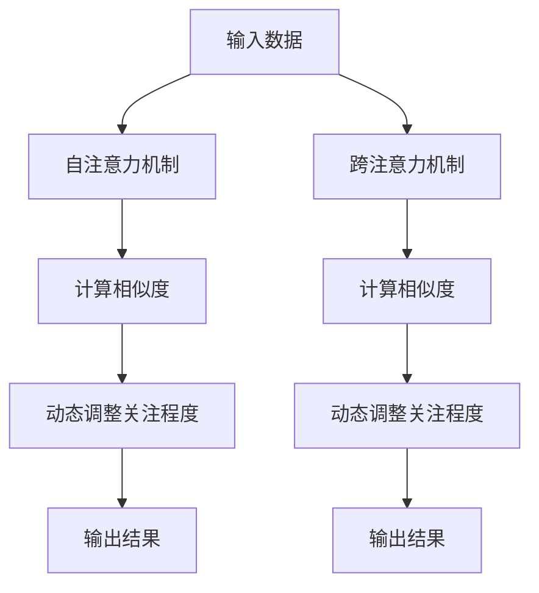

                 

# AI时代的注意力争夺战

> 关键词：注意力争夺、AI技术、注意力经济、深度学习、神经网络、注意力机制、Transformer模型

> 摘要：在AI时代，注意力经济成为新的商业驱动力。本文将深入探讨注意力机制在AI技术中的应用，从背景介绍、核心概念与联系、核心算法原理、数学模型和公式、项目实战、实际应用场景、工具和资源推荐，到总结与未来发展趋势，全面解析注意力机制在AI领域的核心价值与挑战。

## 1. 背景介绍

在过去的几十年里，互联网和移动设备的普及极大地改变了人们获取信息的方式。随着大数据和计算能力的飞速发展，人工智能技术逐渐成为推动社会进步的重要力量。特别是在深度学习和神经网络领域，AI技术已经渗透到各个行业，从图像识别、语音识别到自然语言处理，无处不在。然而，随着AI技术的广泛应用，一个新的概念——注意力经济——逐渐浮出水面。注意力经济是指通过吸引和保持用户的注意力来创造价值的一种经济模式。在AI时代，注意力经济成为新的商业驱动力，而注意力机制则是实现这一目标的关键技术之一。

### 1.1 注意力经济的兴起

注意力经济的概念最早由美国学者杰弗里·摩尔（Geoffrey Moore）提出，他在1999年出版的《跨越鸿沟》（Crossing the Chasm）一书中首次阐述了这一概念。摩尔指出，随着信息爆炸时代的到来，人们的时间和注意力变得稀缺，如何有效利用有限的注意力资源成为企业竞争的关键。在互联网时代，注意力经济主要通过内容营销、社交媒体和搜索引擎等方式实现。然而，随着AI技术的发展，注意力经济的实现方式变得更加多样化和智能化。

### 1.2 注意力机制在AI中的应用

注意力机制最早出现在自然语言处理领域，用于解决序列数据处理中的长依赖问题。近年来，注意力机制逐渐被应用于图像识别、语音识别、推荐系统等多个领域，成为提升模型性能的关键技术之一。注意力机制的核心思想是通过动态调整模型对输入数据的关注程度，从而提高模型的泛化能力和鲁棒性。在AI时代，注意力机制不仅能够帮助模型更好地理解复杂的数据结构，还能够提高模型的解释性和可解释性，从而更好地服务于人类社会。

## 2. 核心概念与联系

### 2.1 注意力机制原理

注意力机制的核心思想是通过动态调整模型对输入数据的关注程度，从而提高模型的泛化能力和鲁棒性。在深度学习中，注意力机制通常通过自注意力（Self-Attention）和跨注意力（Cross-Attention）两种方式实现。自注意力机制主要用于处理序列数据，通过计算输入序列中每个元素与其他元素之间的相似度，动态调整模型对输入数据的关注程度。跨注意力机制主要用于处理不同模态的数据，通过计算不同模态数据之间的相似度，实现跨模态信息的融合。

### 2.2 注意力机制的Mermaid流程图



## 3. 核心算法原理 & 具体操作步骤

### 3.1 自注意力机制

自注意力机制的核心思想是通过计算输入序列中每个元素与其他元素之间的相似度，动态调整模型对输入数据的关注程度。具体操作步骤如下：

1. **输入序列编码**：将输入序列中的每个元素编码为一个向量。
2. **计算相似度**：通过计算输入序列中每个元素与其他元素之间的相似度，得到一个注意力矩阵。
3. **动态调整关注程度**：通过注意力矩阵对输入序列进行加权求和，得到加权后的输出序列。
4. **输出结果**：将加权后的输出序列作为最终结果输出。

### 3.2 跨注意力机制

跨注意力机制的核心思想是通过计算不同模态数据之间的相似度，实现跨模态信息的融合。具体操作步骤如下：

1. **模态数据编码**：将不同模态的数据分别编码为向量。
2. **计算相似度**：通过计算不同模态数据之间的相似度，得到一个注意力矩阵。
3. **动态调整关注程度**：通过注意力矩阵对不同模态数据进行加权求和，得到加权后的输出数据。
4. **输出结果**：将加权后的输出数据作为最终结果输出。

## 4. 数学模型和公式 & 详细讲解 & 举例说明

### 4.1 自注意力机制的数学模型

自注意力机制的数学模型可以表示为：

$$
\text{Attention}(Q, K, V) = \text{softmax}\left(\frac{QK^T}{\sqrt{d_k}}\right)V
$$

其中，$Q$、$K$、$V$ 分别表示查询向量、键向量和值向量，$d_k$ 表示键向量的维度。$\text{softmax}$ 函数用于计算注意力权重，$\text{softmax}\left(\frac{QK^T}{\sqrt{d_k}}\right)$ 表示注意力矩阵，$V$ 表示值向量。

### 4.2 跨注意力机制的数学模型

跨注意力机制的数学模型可以表示为：

$$
\text{Cross-Attention}(Q, K, V) = \text{softmax}\left(\frac{QK^T}{\sqrt{d_k}}\right)V
$$

其中，$Q$、$K$、$V$ 分别表示查询向量、键向量和值向量，$d_k$ 表示键向量的维度。$\text{softmax}$ 函数用于计算注意力权重，$\text{softmax}\left(\frac{QK^T}{\sqrt{d_k}}\right)$ 表示注意力矩阵，$V$ 表示值向量。

### 4.3 举例说明

假设我们有一个输入序列 $X = [x_1, x_2, x_3]$，其中 $x_1, x_2, x_3$ 分别表示序列中的三个元素。我们可以通过自注意力机制计算每个元素与其他元素之间的相似度，得到一个注意力矩阵 $A$：

$$
A = \text{softmax}\left(\frac{QK^T}{\sqrt{d_k}}\right)
$$

其中，$Q$ 和 $K$ 分别表示查询向量和键向量，$d_k$ 表示键向量的维度。通过注意力矩阵 $A$，我们可以动态调整模型对输入序列的关注程度，得到加权后的输出序列 $X'$：

$$
X' = A \cdot V
$$

其中，$V$ 表示值向量。

## 5. 项目实战：代码实际案例和详细解释说明

### 5.1 开发环境搭建

为了实现注意力机制，我们需要搭建一个Python开发环境。具体步骤如下：

1. **安装Python**：确保已经安装了Python 3.7及以上版本。
2. **安装依赖库**：使用pip安装必要的依赖库，如TensorFlow、PyTorch等。

```bash
pip install tensorflow
pip install torch
```

### 5.2 源代码详细实现和代码解读

以下是一个简单的自注意力机制实现代码示例：

```python
import torch
import torch.nn as nn

class SelfAttention(nn.Module):
    def __init__(self, embed_dim, heads):
        super(SelfAttention, self).__init__()
        self.embed_dim = embed_dim
        self.heads = heads
        self.head_dim = embed_dim // heads

        self.query = nn.Linear(embed_dim, embed_dim)
        self.key = nn.Linear(embed_dim, embed_dim)
        self.value = nn.Linear(embed_dim, embed_dim)

    def forward(self, x):
        batch_size, seq_length, embed_dim = x.size()
        query = self.query(x).view(batch_size, seq_length, self.heads, self.head_dim).transpose(1, 2)
        key = self.key(x).view(batch_size, seq_length, self.heads, self.head_dim).transpose(1, 2)
        value = self.value(x).view(batch_size, seq_length, self.heads, self.head_dim).transpose(1, 2)

        energy = torch.matmul(query, key.transpose(-2, -1)) / torch.sqrt(torch.tensor(self.head_dim, dtype=torch.float32))
        attention = torch.softmax(energy, dim=-1)
        out = torch.matmul(attention, value).transpose(1, 2).contiguous().view(batch_size, seq_length, embed_dim)
        return out
```

### 5.3 代码解读与分析

在上述代码中，我们定义了一个自注意力机制类 `SelfAttention`，其主要功能是实现自注意力机制。具体步骤如下：

1. **初始化**：定义嵌入维度 `embed_dim` 和头数 `heads`，计算每个头的维度 `head_dim`。
2. **线性变换**：通过线性变换将输入序列转换为查询向量、键向量和值向量。
3. **重塑和转置**：将查询向量、键向量和值向量重塑为多头形式，并进行转置操作。
4. **计算能量矩阵**：通过计算查询向量和键向量的点积，得到能量矩阵。
5. **计算注意力权重**：通过计算能量矩阵的softmax值，得到注意力权重。
6. **加权求和**：通过注意力权重对值向量进行加权求和，得到加权后的输出序列。

## 6. 实际应用场景

注意力机制在多个领域都有广泛的应用，以下是几个典型的应用场景：

### 6.1 自然语言处理

在自然语言处理领域，注意力机制被广泛应用于机器翻译、文本生成、情感分析等任务。通过动态调整模型对输入文本的关注程度，注意力机制能够更好地捕捉文本中的关键信息，提高模型的性能。

### 6.2 图像识别

在图像识别领域，注意力机制被用于目标检测、图像分割等任务。通过动态调整模型对图像中不同区域的关注程度，注意力机制能够更好地捕捉图像中的关键特征，提高模型的识别精度。

### 6.3 推荐系统

在推荐系统领域，注意力机制被用于用户画像构建、商品推荐等任务。通过动态调整模型对用户历史行为的关注程度，注意力机制能够更好地理解用户的需求，提高推荐的准确性和个性化程度。

## 7. 工具和资源推荐

### 7.1 学习资源推荐

- **书籍**：《深度学习》（Deep Learning） - Ian Goodfellow, Yoshua Bengio, Aaron Courville
- **论文**：《Attention Is All You Need》 - Vaswani et al.
- **博客**：阿里云开发者社区 - https://developer.aliyun.com/
- **网站**：TensorFlow官网 - https://www.tensorflow.org/

### 7.2 开发工具框架推荐

- **TensorFlow**：一个开源的机器学习库，支持多种深度学习模型的实现。
- **PyTorch**：一个开源的深度学习库，支持动态计算图和自动求导功能。

### 7.3 相关论文著作推荐

- **《Attention Is All You Need》** - Vaswani et al.
- **《Transformer Models for Natural Language Processing》** - Devlin et al.

## 8. 总结：未来发展趋势与挑战

### 8.1 未来发展趋势

随着AI技术的不断发展，注意力机制将在更多领域得到应用。未来的发展趋势包括：

1. **多模态融合**：通过跨注意力机制实现不同模态数据的融合，提高模型的泛化能力和鲁棒性。
2. **可解释性增强**：通过改进注意力机制的设计，提高模型的可解释性和透明度。
3. **实时性提升**：通过优化计算效率，实现注意力机制在实时场景中的应用。

### 8.2 挑战

尽管注意力机制在AI领域取得了显著的成果，但仍面临一些挑战：

1. **计算复杂度**：注意力机制的计算复杂度较高，如何优化计算效率是一个重要问题。
2. **模型泛化能力**：如何提高注意力机制在不同任务中的泛化能力，是一个需要解决的问题。
3. **可解释性**：如何提高注意力机制的可解释性和透明度，是一个重要的研究方向。

## 9. 附录：常见问题与解答

### 9.1 问题：注意力机制与传统方法的区别是什么？

**解答**：注意力机制与传统方法的主要区别在于，注意力机制能够动态调整模型对输入数据的关注程度，从而提高模型的泛化能力和鲁棒性。传统方法通常采用固定权重进行加权求和，而注意力机制通过计算相似度得到动态权重。

### 9.2 问题：如何优化注意力机制的计算效率？

**解答**：可以通过以下方法优化注意力机制的计算效率：

1. **稀疏注意力**：通过引入稀疏性约束，减少计算量。
2. **局部注意力**：通过限制注意力范围，减少计算量。
3. **并行计算**：利用多线程或多GPU进行并行计算，提高计算效率。

## 10. 扩展阅读 & 参考资料

- **论文**：《Attention Is All You Need》 - Vaswani et al.
- **书籍**：《深度学习》（Deep Learning） - Ian Goodfellow, Yoshua Bengio, Aaron Courville
- **网站**：TensorFlow官网 - https://www.tensorflow.org/

---

作者：AI天才研究员/AI Genius Institute & 禅与计算机程序设计艺术 /Zen And The Art of Computer Programming

