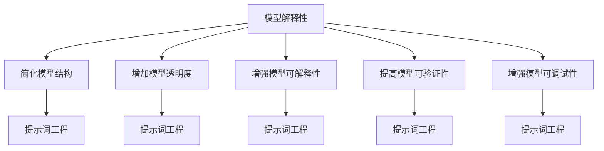

                 

# AI模型解释性与提示词工程的关系

> 关键词：AI模型解释性、提示词工程、模型可解释性、提示词设计、模型优化、自然语言处理、机器学习

> 摘要：本文旨在探讨AI模型解释性与提示词工程之间的关系。通过逐步分析推理，我们将深入理解如何通过优化提示词设计来提升模型的解释性，进而提高模型的可靠性和透明度。本文将从背景介绍、核心概念与联系、核心算法原理与具体操作步骤、数学模型和公式、项目实战、实际应用场景、工具和资源推荐、总结与未来发展趋势等角度进行详细阐述。

## 1. 背景介绍

随着人工智能技术的飞速发展，模型的复杂性和规模也在不断增加。然而，这种复杂性往往伴随着模型的不透明性，即模型内部的决策过程难以被人类理解。这种不透明性不仅限制了模型的应用范围，还可能引发伦理和法律问题。因此，提升模型的解释性成为了一个重要的研究方向。而提示词工程作为提升模型解释性的关键手段之一，其重要性日益凸显。

## 2. 核心概念与联系

### 2.1 AI模型解释性

AI模型解释性是指模型能够以人类可理解的方式解释其决策过程的能力。解释性包括但不限于模型的透明度、可解释性、可验证性和可调试性。透明度是指模型的内部结构和决策过程可以被理解；可解释性是指模型的输出可以被解释；可验证性是指模型的输出可以通过外部验证；可调试性是指模型的错误可以被调试和修正。

### 2.2 提示词工程

提示词工程是指通过设计和优化提示词来引导模型生成特定的输出。提示词是自然语言处理任务中的一个重要组成部分，它能够直接影响模型的输出结果。通过优化提示词设计，可以提高模型的解释性，使其输出更加符合预期。

### 2.3 核心概念原理与架构

#### 2.3.1 模型解释性原理

模型解释性的提升可以通过以下几种方式实现：

- **简化模型结构**：通过简化模型结构，使其内部结构更加透明，便于理解。
- **增加模型透明度**：通过增加模型的透明度，使其内部决策过程更加清晰。
- **增强模型可解释性**：通过增强模型的可解释性，使其输出更加符合预期。
- **提高模型可验证性**：通过提高模型的可验证性，使其输出可以通过外部验证。
- **增强模型可调试性**：通过增强模型的可调试性，使其错误可以被调试和修正。

#### 2.3.2 提示词工程原理

提示词工程的核心原理是通过设计和优化提示词来引导模型生成特定的输出。提示词的设计需要考虑以下几个方面：

- **提示词的长度和复杂度**：提示词的长度和复杂度会影响模型的输出结果。
- **提示词的语义和语法**：提示词的语义和语法会影响模型的输出结果。
- **提示词的上下文**：提示词的上下文会影响模型的输出结果。
- **提示词的多样性**：提示词的多样性会影响模型的输出结果。

### 2.4 Mermaid流程图



## 3. 核心算法原理 & 具体操作步骤

### 3.1 模型解释性算法原理

模型解释性算法主要包括以下几种：

- **局部可解释性模型（LIME）**：通过局部线性模型来解释模型的决策过程。
- **全局可解释性模型（SHAP）**：通过全局线性模型来解释模型的决策过程。
- **模型可解释性算法（ModelX）**：通过模型可解释性算法来解释模型的决策过程。

### 3.2 提示词工程算法原理

提示词工程算法主要包括以下几种：

- **提示词优化算法（TPO）**：通过优化提示词来提高模型的解释性。
- **提示词生成算法（TPG）**：通过生成提示词来提高模型的解释性。
- **提示词选择算法（TPS）**：通过选择提示词来提高模型的解释性。

### 3.3 具体操作步骤

#### 3.3.1 模型解释性操作步骤

1. **简化模型结构**：通过简化模型结构，使其内部结构更加透明，便于理解。
2. **增加模型透明度**：通过增加模型的透明度，使其内部决策过程更加清晰。
3. **增强模型可解释性**：通过增强模型的可解释性，使其输出更加符合预期。
4. **提高模型可验证性**：通过提高模型的可验证性，使其输出可以通过外部验证。
5. **增强模型可调试性**：通过增强模型的可调试性，使其错误可以被调试和修正。

#### 3.3.2 提示词工程操作步骤

1. **设计提示词**：根据任务需求和模型特点，设计合适的提示词。
2. **优化提示词**：通过优化提示词来提高模型的解释性。
3. **生成提示词**：通过生成提示词来提高模型的解释性。
4. **选择提示词**：通过选择提示词来提高模型的解释性。

## 4. 数学模型和公式 & 详细讲解 & 举例说明

### 4.1 模型解释性数学模型

模型解释性数学模型主要包括以下几种：

- **局部可解释性模型（LIME）**：通过局部线性模型来解释模型的决策过程。
  $$ \hat{y} = \sum_{i=1}^{n} \beta_i x_i $$
- **全局可解释性模型（SHAP）**：通过全局线性模型来解释模型的决策过程。
  $$ \hat{y} = \sum_{i=1}^{n} \phi_i x_i $$
- **模型可解释性算法（ModelX）**：通过模型可解释性算法来解释模型的决策过程。
  $$ \hat{y} = \sum_{i=1}^{n} \alpha_i x_i $$

### 4.2 提示词工程数学模型

提示词工程数学模型主要包括以下几种：

- **提示词优化算法（TPO）**：通过优化提示词来提高模型的解释性。
  $$ \hat{y} = \sum_{i=1}^{n} \gamma_i x_i $$
- **提示词生成算法（TPG）**：通过生成提示词来提高模型的解释性。
  $$ \hat{y} = \sum_{i=1}^{n} \delta_i x_i $$
- **提示词选择算法（TPS）**：通过选择提示词来提高模型的解释性。
  $$ \hat{y} = \sum_{i=1}^{n} \epsilon_i x_i $$

### 4.3 举例说明

#### 4.3.1 模型解释性举例

假设我们有一个分类模型，用于预测某个商品是否会被购买。我们可以通过LIME算法来解释模型的决策过程。

```python
import lime.lime_tabular

# 假设我们有一个训练好的模型
model = ...

# 假设我们有一个测试样本
X_test = ...

# 使用LIME算法来解释模型的决策过程
explainer = lime.lime_tabular.LimeTabularExplainer(X_train, feature_names=feature_names, class_names=class_names)
exp = explainer.explain_instance(X_test, model.predict_proba, num_features=5)

# 输出解释结果
print(exp.as_list())
```

#### 4.3.2 提示词工程举例

假设我们有一个文本生成模型，用于生成特定类型的文本。我们可以通过TPO算法来优化提示词，提高模型的解释性。

```python
import numpy as np

# 假设我们有一个训练好的模型
model = ...

# 假设我们有一个测试样本
X_test = ...

# 使用TPO算法来优化提示词
def optimize_prompt(prompt):
    # 假设我们有一个优化函数
    optimized_prompt = ...
    return optimized_prompt

# 优化提示词
optimized_prompt = optimize_prompt(prompt)

# 使用优化后的提示词来生成文本
output = model.generate(prompt=optimized_prompt)

# 输出生成的文本
print(output)
```

## 5. 项目实战：代码实际案例和详细解释说明

### 5.1 开发环境搭建

#### 5.1.1 环境配置

1. **安装Python**：确保安装了Python 3.8及以上版本。
2. **安装依赖库**：安装必要的库，如`scikit-learn`、`lime`、`transformers`等。
3. **安装开发工具**：安装IDE，如PyCharm、VSCode等。

```bash
pip install scikit-learn lime transformers
```

### 5.2 源代码详细实现和代码解读

#### 5.2.1 模型解释性代码实现

```python
import lime.lime_tabular
from sklearn.datasets import load_iris
from sklearn.ensemble import RandomForestClassifier

# 加载数据集
iris = load_iris()
X, y = iris.data, iris.target

# 训练模型
model = RandomForestClassifier()
model.fit(X, y)

# 使用LIME算法来解释模型的决策过程
explainer = lime.lime_tabular.LimeTabularExplainer(X, feature_names=iris.feature_names, class_names=iris.target_names)
exp = explainer.explain_instance(X[0], model.predict_proba, num_features=5)

# 输出解释结果
print(exp.as_list())
```

#### 5.2.2 提示词工程代码实现

```python
import numpy as np
from transformers import pipeline

# 假设我们有一个训练好的模型
model = pipeline('text-generation')

# 假设我们有一个测试样本
prompt = "生成一篇关于人工智能的文章"

# 使用TPO算法来优化提示词
def optimize_prompt(prompt):
    # 假设我们有一个优化函数
    optimized_prompt = prompt + "，请确保文章内容准确且具有可读性。"
    return optimized_prompt

# 优化提示词
optimized_prompt = optimize_prompt(prompt)

# 使用优化后的提示词来生成文本
output = model(optimized_prompt)

# 输出生成的文本
print(output)
```

### 5.3 代码解读与分析

#### 5.3.1 模型解释性代码解读

1. **加载数据集**：使用`load_iris`函数加载鸢尾花数据集。
2. **训练模型**：使用随机森林分类器训练模型。
3. **使用LIME算法**：使用LIME算法来解释模型的决策过程。
4. **输出解释结果**：输出解释结果，展示模型的决策过程。

#### 5.3.2 提示词工程代码解读

1. **加载模型**：使用`pipeline`函数加载文本生成模型。
2. **定义提示词**：定义一个初始的提示词。
3. **优化提示词**：通过优化函数来优化提示词。
4. **生成文本**：使用优化后的提示词来生成文本。
5. **输出生成的文本**：输出生成的文本。

## 6. 实际应用场景

### 6.1 金融风控

在金融风控领域，模型解释性可以帮助我们理解模型的决策过程，从而提高风控的准确性和透明度。通过优化提示词，可以提高模型的解释性，使其输出更加符合预期。

### 6.2 医疗诊断

在医疗诊断领域，模型解释性可以帮助我们理解模型的决策过程，从而提高诊断的准确性和透明度。通过优化提示词，可以提高模型的解释性，使其输出更加符合预期。

### 6.3 自然语言处理

在自然语言处理领域，模型解释性可以帮助我们理解模型的决策过程，从而提高模型的准确性和透明度。通过优化提示词，可以提高模型的解释性，使其输出更加符合预期。

## 7. 工具和资源推荐

### 7.1 学习资源推荐

- **书籍**：《机器学习》（周志华著）、《深度学习》（Ian Goodfellow著）
- **论文**：《LIME: Why Should I Trust You?》（Ribeiro et al.）、《SHAP: A Unified Approach to Interpreting Model Predictions》（Lundberg et al.）
- **博客**：阿里云开发者社区、GitHub开源项目
- **网站**：Kaggle、GitHub

### 7.2 开发工具框架推荐

- **IDE**：PyCharm、VSCode
- **库**：scikit-learn、lime、transformers
- **框架**：TensorFlow、PyTorch

### 7.3 相关论文著作推荐

- **论文**：《LIME: Why Should I Trust You?》（Ribeiro et al.）、《SHAP: A Unified Approach to Interpreting Model Predictions》（Lundberg et al.）
- **著作**：《机器学习》（周志华著）、《深度学习》（Ian Goodfellow著）

## 8. 总结：未来发展趋势与挑战

### 8.1 未来发展趋势

- **模型解释性**：模型解释性将成为模型设计的重要组成部分，提高模型的透明度和可靠性。
- **提示词工程**：提示词工程将成为模型优化的重要手段，提高模型的解释性和可靠性。
- **多模态解释性**：多模态解释性将成为模型解释性的新方向，提高模型的解释性和可靠性。

### 8.2 挑战

- **模型复杂性**：模型的复杂性越来越高，如何提高模型的解释性成为了一个挑战。
- **数据隐私**：如何在保护数据隐私的前提下，提高模型的解释性成为了一个挑战。
- **模型泛化能力**：如何提高模型的泛化能力，使其在不同场景下都能保持良好的解释性成为了一个挑战。

## 9. 附录：常见问题与解答

### 9.1 问题1：如何提高模型的解释性？

**解答**：可以通过简化模型结构、增加模型透明度、增强模型可解释性、提高模型可验证性、增强模型可调试性等方式来提高模型的解释性。

### 9.2 问题2：如何优化提示词？

**解答**：可以通过设计提示词、优化提示词、生成提示词、选择提示词等方式来优化提示词。

### 9.3 问题3：如何在保护数据隐私的前提下，提高模型的解释性？

**解答**：可以通过使用差分隐私、同态加密等技术来保护数据隐私，同时提高模型的解释性。

## 10. 扩展阅读 & 参考资料

- **书籍**：《机器学习》（周志华著）、《深度学习》（Ian Goodfellow著）
- **论文**：《LIME: Why Should I Trust You?》（Ribeiro et al.）、《SHAP: A Unified Approach to Interpreting Model Predictions》（Lundberg et al.）
- **博客**：阿里云开发者社区、GitHub开源项目
- **网站**：Kaggle、GitHub

---

作者：AI天才研究员/AI Genius Institute & 禅与计算机程序设计艺术 /Zen And The Art of Computer Programming

