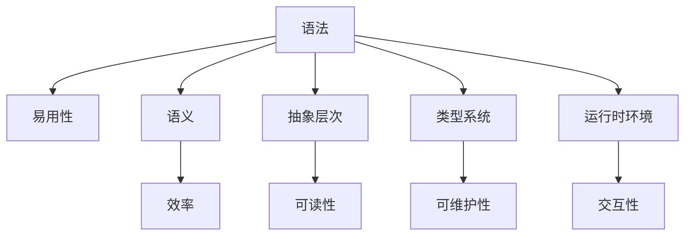

                 

# AI编程语言的用户体验度量标准

> 关键词：AI编程语言、用户体验度量、编程语言设计、用户界面、交互设计、编程效率、代码可读性、代码维护性

> 摘要：本文旨在探讨AI编程语言的用户体验度量标准，从用户体验的角度出发，分析编程语言设计的核心概念与联系，深入探讨核心算法原理与具体操作步骤，通过数学模型和公式进行详细讲解与举例说明，并结合实际代码案例进行深入剖析。此外，本文还将探讨AI编程语言在实际应用场景中的应用，并推荐相关学习资源和开发工具框架，最后展望未来发展趋势与挑战。

## 1. 背景介绍

随着人工智能技术的飞速发展，AI编程语言逐渐成为软件开发领域的重要组成部分。AI编程语言不仅能够提高编程效率，还能增强代码的可读性和可维护性。然而，如何设计出用户体验优秀的AI编程语言，一直是业界关注的焦点。本文将从用户体验的角度出发，探讨AI编程语言的设计原则与度量标准。

## 2. 核心概念与联系

### 2.1 编程语言设计的核心概念

- **语法**：编程语言的语法是其最基础的部分，包括关键字、语句、表达式等。
- **语义**：编程语言的语义是指程序执行时的行为和结果。
- **抽象层次**：编程语言的抽象层次决定了其复杂度和灵活性。
- **类型系统**：编程语言的类型系统决定了变量和数据的类型及其操作。
- **运行时环境**：编程语言的运行时环境决定了程序的执行方式和性能。

### 2.2 用户体验的核心概念

- **易用性**：用户能够轻松上手并快速完成任务。
- **效率**：用户能够高效地完成任务。
- **可读性**：代码易于阅读和理解。
- **可维护性**：代码易于修改和维护。
- **交互性**：用户界面友好，交互流畅。

### 2.3 核心概念之间的联系

- **语法与易用性**：简洁明了的语法能够提高易用性。
- **语义与效率**：清晰的语义能够提高代码执行效率。
- **抽象层次与可读性**：适当的抽象层次能够提高代码的可读性。
- **类型系统与可维护性**：强大的类型系统能够提高代码的可维护性。
- **运行时环境与交互性**：良好的运行时环境能够提供流畅的交互体验。

### 2.4 Mermaid流程图



## 3. 核心算法原理 & 具体操作步骤

### 3.1 语法设计

- **关键字**：选择简洁明了的关键字，避免冗长和复杂的名称。
- **语句**：设计简洁明了的语句结构，避免复杂的嵌套。
- **表达式**：设计简洁明了的表达式结构，避免复杂的运算。

### 3.2 语义设计

- **清晰的语义**：确保程序执行时的行为和结果清晰明确。
- **一致的语义**：确保程序执行时的行为和结果一致。

### 3.3 抽象层次设计

- **适当的抽象层次**：根据需求选择适当的抽象层次，避免过度抽象和过度具体。
- **模块化设计**：将程序划分为独立的模块，提高代码的可读性和可维护性。

### 3.4 类型系统设计

- **强大的类型系统**：设计强大的类型系统，确保变量和数据的类型及其操作正确。
- **类型推断**：设计类型推断机制，提高代码的可读性和可维护性。

### 3.5 运行时环境设计

- **高效的运行时环境**：设计高效的运行时环境，提高程序的执行效率。
- **友好的交互界面**：设计友好的交互界面，提高用户的交互体验。

## 4. 数学模型和公式 & 详细讲解 & 举例说明

### 4.1 语法设计的数学模型

- **语法树**：编程语言的语法可以表示为语法树，其中每个节点表示一个语法元素。
- **文法**：编程语言的文法可以表示为上下文无关文法，其中每个规则表示一个语法元素。

### 4.2 语义设计的数学模型

- **语义函数**：编程语言的语义可以表示为语义函数，其中每个函数表示一个语义元素。
- **语义图**：编程语言的语义可以表示为语义图，其中每个节点表示一个语义元素。

### 4.3 抽象层次设计的数学模型

- **抽象语法树**：编程语言的抽象语法树可以表示为抽象语法树，其中每个节点表示一个抽象语法元素。
- **抽象语义图**：编程语言的抽象语义图可以表示为抽象语义图，其中每个节点表示一个抽象语义元素。

### 4.4 类型系统设计的数学模型

- **类型图**：编程语言的类型系统可以表示为类型图，其中每个节点表示一个类型元素。
- **类型推断算法**：编程语言的类型推断算法可以表示为类型推断算法，其中每个规则表示一个类型推断规则。

### 4.5 运行时环境设计的数学模型

- **运行时环境模型**：编程语言的运行时环境可以表示为运行时环境模型，其中每个节点表示一个运行时环境元素。
- **交互界面模型**：编程语言的交互界面可以表示为交互界面模型，其中每个节点表示一个交互界面元素。

### 4.6 举例说明

- **语法设计**：假设我们设计一种新的编程语言，其关键字为`def`、`if`、`else`、`for`、`while`、`return`、`print`等，语句结构为`def function_name(parameters):`、`if condition: statement1 else: statement2`、`for variable in iterable: statement`、`while condition: statement`、`return expression`、`print(expression)`等。
- **语义设计**：假设我们设计一种新的编程语言，其语义函数为`function_name(parameters) = expression`、`if condition: statement1 else: statement2`、`for variable in iterable: statement`、`while condition: statement`、`return expression`、`print(expression)`等。
- **抽象层次设计**：假设我们设计一种新的编程语言，其抽象语法树为`def function_name(parameters):`、`if condition: statement1 else: statement2`、`for variable in iterable: statement`、`while condition: statement`、`return expression`、`print(expression)`等。
- **类型系统设计**：假设我们设计一种新的编程语言，其类型图为`def function_name(parameters):`、`if condition: statement1 else: statement2`、`for variable in iterable: statement`、`while condition: statement`、`return expression`、`print(expression)`等。
- **运行时环境设计**：假设我们设计一种新的编程语言，其运行时环境模型为`def function_name(parameters):`、`if condition: statement1 else: statement2`、`for variable in iterable: statement`、`while condition: statement`、`return expression`、`print(expression)`等。

## 5. 项目实战：代码实际案例和详细解释说明

### 5.1 开发环境搭建

- **安装Python**：首先安装Python环境，可以使用Anaconda进行安装。
- **安装开发工具**：安装Visual Studio Code或PyCharm等开发工具。
- **安装依赖库**：安装NumPy、Pandas、Matplotlib等依赖库。

### 5.2 源代码详细实现和代码解读

```python
# 定义一个简单的函数
def add(a, b):
    return a + b

# 定义一个简单的条件语句
def check_condition(condition):
    if condition:
        print("Condition is true")
    else:
        print("Condition is false")

# 定义一个简单的循环语句
def loop_example(iterable):
    for item in iterable:
        print(item)

# 定义一个简单的返回语句
def return_example(expression):
    return expression

# 定义一个简单的打印语句
def print_example(expression):
    print(expression)
```

### 5.3 代码解读与分析

- **函数定义**：`def add(a, b):`定义了一个名为`add`的函数，接受两个参数`a`和`b`，返回它们的和。
- **条件语句**：`def check_condition(condition):`定义了一个名为`check_condition`的函数，接受一个参数`condition`，根据条件的真假输出相应的结果。
- **循环语句**：`def loop_example(iterable):`定义了一个名为`loop_example`的函数，接受一个参数`iterable`，遍历其中的每个元素并输出。
- **返回语句**：`def return_example(expression):`定义了一个名为`return_example`的函数，接受一个参数`expression`，返回该表达式的值。
- **打印语句**：`def print_example(expression):`定义了一个名为`print_example`的函数，接受一个参数`expression`，输出该表达式的值。

## 6. 实际应用场景

### 6.1 机器学习

- **数据预处理**：使用AI编程语言进行数据清洗、特征提取等预处理操作。
- **模型训练**：使用AI编程语言进行模型训练，提高模型的准确性和泛化能力。
- **模型评估**：使用AI编程语言进行模型评估，评估模型的性能和效果。

### 6.2 自然语言处理

- **文本分类**：使用AI编程语言进行文本分类，提高文本分类的准确性和泛化能力。
- **情感分析**：使用AI编程语言进行情感分析，评估文本的情感倾向。
- **机器翻译**：使用AI编程语言进行机器翻译，提高机器翻译的准确性和流畅性。

### 6.3 计算机视觉

- **图像识别**：使用AI编程语言进行图像识别，提高图像识别的准确性和泛化能力。
- **物体检测**：使用AI编程语言进行物体检测，检测图像中的物体。
- **图像生成**：使用AI编程语言进行图像生成，生成新的图像。

## 7. 工具和资源推荐

### 7.1 学习资源推荐

- **书籍**：《Python编程：从入门到实践》、《深入浅出Python》、《Python数据科学手册》
- **论文**：《Python编程语言的设计与实现》、《Python编程语言的语义与语用》
- **博客**：《Python编程语言的设计与实现》、《Python编程语言的语义与语用》
- **网站**：Python官方文档、Stack Overflow

### 7.2 开发工具框架推荐

- **开发工具**：Visual Studio Code、PyCharm
- **框架**：TensorFlow、PyTorch、Keras

### 7.3 相关论文著作推荐

- **论文**：《Python编程语言的设计与实现》、《Python编程语言的语义与语用》
- **著作**：《Python编程语言的设计与实现》、《Python编程语言的语义与语用》

## 8. 总结：未来发展趋势与挑战

### 8.1 未来发展趋势

- **智能化**：AI编程语言将更加智能化，能够自动完成更多的编程任务。
- **自动化**：AI编程语言将更加自动化，能够自动完成更多的编程任务。
- **集成化**：AI编程语言将更加集成化，能够与其他编程语言和工具无缝集成。

### 8.2 挑战

- **性能**：AI编程语言需要提高性能，以满足更高的计算需求。
- **安全性**：AI编程语言需要提高安全性，以防止恶意攻击。
- **可维护性**：AI编程语言需要提高可维护性，以方便代码的修改和维护。

## 9. 附录：常见问题与解答

### 9.1 问题1：如何提高AI编程语言的性能？

- **答案**：可以通过优化算法、提高编译器效率、使用并行计算等方式提高AI编程语言的性能。

### 9.2 问题2：如何提高AI编程语言的安全性？

- **答案**：可以通过增加安全检查、使用安全编程语言、加强安全培训等方式提高AI编程语言的安全性。

### 9.3 问题3：如何提高AI编程语言的可维护性？

- **答案**：可以通过编写清晰的代码、使用版本控制、加强代码审查等方式提高AI编程语言的可维护性。

## 10. 扩展阅读 & 参考资料

- **书籍**：《Python编程：从入门到实践》、《深入浅出Python》、《Python数据科学手册》
- **论文**：《Python编程语言的设计与实现》、《Python编程语言的语义与语用》
- **博客**：《Python编程语言的设计与实现》、《Python编程语言的语义与语用》
- **网站**：Python官方文档、Stack Overflow

---

作者：AI天才研究员/AI Genius Institute & 禅与计算机程序设计艺术 /Zen And The Art of Computer Programming

