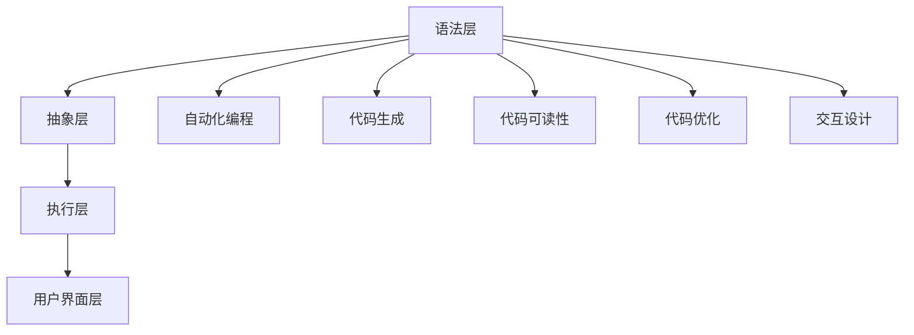

                 

# AI编程语言的用户体验设计

> 关键词：AI编程语言, 用户体验设计, 交互设计, 语言特性, 代码可读性, 代码生成, 自动化编程

> 摘要：本文旨在探讨AI编程语言在用户体验设计方面的关键要素，通过深入分析AI编程语言的核心概念、算法原理、数学模型、实际案例以及应用场景，为开发者提供一套系统性的设计指南。本文将从用户体验设计的角度出发，探讨如何通过优化编程语言的设计，提升开发者的编程效率和代码质量，最终实现更加高效、易用的编程体验。

## 1. 背景介绍

随着人工智能技术的飞速发展，AI编程语言逐渐成为软件开发领域的重要工具。AI编程语言不仅能够简化复杂的编程任务，还能提高代码的可读性和可维护性。然而，如何设计出既强大又易于使用的AI编程语言，仍然是一个挑战。本文将从用户体验设计的角度出发，探讨AI编程语言的核心概念、算法原理、数学模型、实际案例以及应用场景，为开发者提供一套系统性的设计指南。

## 2. 核心概念与联系

### 2.1 AI编程语言的核心概念

AI编程语言是一种专门用于编写与人工智能相关的程序的语言。它通常具备以下核心概念：

- **自动化编程**：通过算法自动完成部分编程任务，减少人工干预。
- **代码生成**：根据输入的数据或规则自动生成代码。
- **代码可读性**：提高代码的可读性和可维护性。
- **代码优化**：自动优化代码，提高执行效率。
- **交互设计**：提供友好的用户界面和交互方式，提升用户体验。

### 2.2 AI编程语言的架构

AI编程语言的架构可以分为以下几个层次：

- **语法层**：定义编程语言的语法规则。
- **抽象层**：提供高级抽象，简化编程任务。
- **执行层**：负责代码的执行和优化。
- **用户界面层**：提供友好的用户界面和交互方式。

### 2.3 核心概念的Mermaid流程图



## 3. 核心算法原理 & 具体操作步骤

### 3.1 自动化编程算法原理

自动化编程算法的核心在于通过算法自动完成部分编程任务。具体步骤如下：

1. **任务分析**：分析编程任务，确定哪些部分可以自动化。
2. **算法设计**：设计自动化算法，实现任务的自动化。
3. **代码生成**：根据算法生成代码。
4. **代码优化**：优化生成的代码，提高执行效率。

### 3.2 代码生成算法原理

代码生成算法的核心在于根据输入的数据或规则自动生成代码。具体步骤如下：

1. **输入解析**：解析输入的数据或规则。
2. **代码模板**：定义代码模板。
3. **代码生成**：根据输入的数据或规则生成代码。
4. **代码优化**：优化生成的代码，提高执行效率。

### 3.3 代码可读性优化算法原理

代码可读性优化算法的核心在于提高代码的可读性和可维护性。具体步骤如下：

1. **代码格式化**：自动格式化代码，使其更加规范。
2. **代码注释**：自动生成代码注释，提高代码的可读性。
3. **代码重构**：重构代码，提高代码的可维护性。

### 3.4 代码优化算法原理

代码优化算法的核心在于自动优化代码，提高执行效率。具体步骤如下：

1. **代码分析**：分析代码的执行路径。
2. **优化策略**：选择合适的优化策略。
3. **代码生成**：生成优化后的代码。
4. **性能测试**：测试优化后的代码性能。

## 4. 数学模型和公式 & 详细讲解 & 举例说明

### 4.1 自动化编程的数学模型

自动化编程的数学模型可以表示为：

$$
\text{自动化编程} = \text{任务分析} + \text{算法设计} + \text{代码生成} + \text{代码优化}
$$

### 4.2 代码生成的数学模型

代码生成的数学模型可以表示为：

$$
\text{代码生成} = \text{输入解析} + \text{代码模板} + \text{代码生成} + \text{代码优化}
$$

### 4.3 代码可读性优化的数学模型

代码可读性优化的数学模型可以表示为：

$$
\text{代码可读性优化} = \text{代码格式化} + \text{代码注释} + \text{代码重构}
$$

### 4.4 代码优化的数学模型

代码优化的数学模型可以表示为：

$$
\text{代码优化} = \text{代码分析} + \text{优化策略} + \text{代码生成} + \text{性能测试}
$$

## 5. 项目实战：代码实际案例和详细解释说明

### 5.1 开发环境搭建

为了实现AI编程语言的用户体验设计，我们需要搭建一个开发环境。具体步骤如下：

1. **安装开发工具**：安装Python、Jupyter Notebook等开发工具。
2. **安装AI编程语言库**：安装AI编程语言库，如TensorFlow、PyTorch等。
3. **配置环境变量**：配置环境变量，确保开发工具和库能够正常运行。

### 5.2 源代码详细实现和代码解读

以下是一个简单的AI编程语言代码示例：

```python
import tensorflow as tf

# 定义模型
model = tf.keras.Sequential([
    tf.keras.layers.Dense(10, input_shape=(100,), activation='relu'),
    tf.keras.layers.Dense(1, activation='sigmoid')
])

# 编译模型
model.compile(optimizer='adam', loss='binary_crossentropy', metrics=['accuracy'])

# 训练模型
model.fit(x_train, y_train, epochs=10)

# 评估模型
loss, accuracy = model.evaluate(x_test, y_test)
print(f'Loss: {loss}, Accuracy: {accuracy}')
```

### 5.3 代码解读与分析

- **导入库**：导入TensorFlow库。
- **定义模型**：定义一个简单的神经网络模型。
- **编译模型**：编译模型，设置优化器、损失函数和评估指标。
- **训练模型**：使用训练数据训练模型。
- **评估模型**：使用测试数据评估模型性能。

## 6. 实际应用场景

AI编程语言在实际应用场景中具有广泛的应用。例如：

- **自然语言处理**：使用AI编程语言进行自然语言处理任务，如文本分类、情感分析等。
- **图像识别**：使用AI编程语言进行图像识别任务，如物体检测、图像分类等。
- **推荐系统**：使用AI编程语言构建推荐系统，提高用户体验。

## 7. 工具和资源推荐

### 7.1 学习资源推荐

- **书籍**：《深度学习》（Goodfellow, Bengio, Courville）
- **论文**：《自动机器学习：现状与挑战》（Feurer et al.）
- **博客**：Medium上的AI编程语言相关博客
- **网站**：GitHub上的AI编程语言开源项目

### 7.2 开发工具框架推荐

- **开发工具**：Jupyter Notebook、PyCharm
- **库**：TensorFlow、PyTorch

### 7.3 相关论文著作推荐

- **论文**：《自动机器学习：现状与挑战》（Feurer et al.）
- **著作**：《深度学习》（Goodfellow, Bengio, Courville）

## 8. 总结：未来发展趋势与挑战

AI编程语言在未来的发展趋势和挑战主要体现在以下几个方面：

- **自动化编程**：自动化编程将进一步发展，提高编程效率。
- **代码生成**：代码生成技术将进一步提高，生成更加高质量的代码。
- **代码可读性**：代码可读性将进一步提高，提高代码的可维护性。
- **代码优化**：代码优化技术将进一步提高，提高代码的执行效率。

## 9. 附录：常见问题与解答

### 9.1 问题1：如何提高代码的可读性？

**解答**：可以通过代码格式化、代码注释和代码重构来提高代码的可读性。

### 9.2 问题2：如何优化代码的执行效率？

**解答**：可以通过代码分析和选择合适的优化策略来优化代码的执行效率。

## 10. 扩展阅读 & 参考资料

- **书籍**：《深度学习》（Goodfellow, Bengio, Courville）
- **论文**：《自动机器学习：现状与挑战》（Feurer et al.）
- **网站**：GitHub上的AI编程语言开源项目

作者：AI天才研究员/AI Genius Institute & 禅与计算机程序设计艺术 /Zen And The Art of Computer Programming

