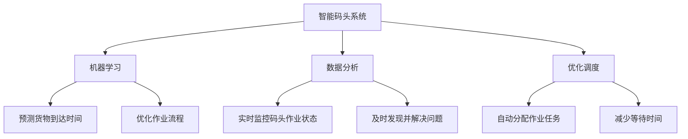

                 

# AI让人类生活更美好：她的码头愿景

> 关键词：人工智能, 自动化, 智能码头, 机器学习, 数据分析, 优化调度, 智慧物流

> 摘要：本文旨在探讨人工智能如何通过智能码头系统，优化物流和供应链管理，提高效率，降低成本，最终实现更美好的人类生活。我们将从背景介绍、核心概念与联系、核心算法原理、数学模型与公式、项目实战、实际应用场景、工具和资源推荐、总结与未来发展趋势等多方面进行详细分析。

## 1. 背景介绍

随着全球贸易的不断增长，物流和供应链管理面临着前所未有的挑战。传统的人工管理方式已经无法满足日益增长的需求，而人工智能技术的出现为解决这些问题提供了新的思路。智能码头系统通过集成机器学习、数据分析和优化调度等技术，实现了对码头作业的智能化管理，极大地提高了效率和准确性。本文将详细介绍智能码头系统的工作原理及其带来的实际效益。

## 2. 核心概念与联系

### 2.1 智能码头系统

智能码头系统是一种基于人工智能技术的自动化管理系统，旨在通过优化码头作业流程，提高效率和准确性。其主要组成部分包括：

- **机器学习**：用于预测和优化码头作业流程。
- **数据分析**：用于实时监控和分析码头作业数据。
- **优化调度**：用于自动调度码头资源，减少等待时间。

### 2.2 机器学习

机器学习是一种人工智能技术，通过训练模型来实现对数据的自动学习和预测。在智能码头系统中，机器学习主要用于预测货物的到达时间、优化作业流程等。

### 2.3 数据分析

数据分析是通过对大量数据进行处理和分析，提取有价值的信息。在智能码头系统中，数据分析主要用于实时监控码头作业状态，及时发现并解决问题。

### 2.4 优化调度

优化调度是一种通过算法自动调度码头资源的技术。在智能码头系统中，优化调度主要用于自动分配作业任务，减少等待时间，提高效率。

### 2.5 Mermaid 流程图



## 3. 核心算法原理 & 具体操作步骤

### 3.1 机器学习算法

机器学习算法主要用于预测货物的到达时间和优化作业流程。具体操作步骤如下：

1. **数据收集**：收集码头作业的相关数据，包括货物类型、重量、到达时间等。
2. **数据预处理**：对收集到的数据进行清洗和标准化处理。
3. **特征提取**：从数据中提取有用的特征，如货物类型、重量等。
4. **模型训练**：使用提取的特征训练机器学习模型，如线性回归、决策树等。
5. **模型评估**：通过交叉验证等方法评估模型的性能。
6. **模型应用**：将训练好的模型应用于实际作业中，预测货物的到达时间和优化作业流程。

### 3.2 数据分析算法

数据分析算法主要用于实时监控码头作业状态，及时发现并解决问题。具体操作步骤如下：

1. **数据收集**：收集码头作业的相关数据，包括作业状态、设备状态等。
2. **数据预处理**：对收集到的数据进行清洗和标准化处理。
3. **数据可视化**：通过图表等方式展示数据，便于直观地了解码头作业状态。
4. **异常检测**：通过异常检测算法，及时发现并解决问题。
5. **实时监控**：通过实时监控系统，及时发现并解决问题。

### 3.3 优化调度算法

优化调度算法主要用于自动分配作业任务，减少等待时间。具体操作步骤如下：

1. **任务分配**：根据作业任务的优先级和资源的可用性，自动分配作业任务。
2. **资源调度**：根据任务分配结果，自动调度码头资源，如起重机、拖车等。
3. **任务调度**：根据资源调度结果，自动调度作业任务，减少等待时间。
4. **任务监控**：通过实时监控系统，监控任务执行情况，及时调整调度策略。

## 4. 数学模型和公式 & 详细讲解 & 举例说明

### 4.1 机器学习模型

机器学习模型主要用于预测货物的到达时间和优化作业流程。具体数学模型如下：

1. **线性回归模型**

   $$ y = \beta_0 + \beta_1 x_1 + \beta_2 x_2 + \cdots + \beta_n x_n + \epsilon $$

   其中，$y$ 为货物的到达时间，$x_1, x_2, \cdots, x_n$ 为特征变量，$\beta_0, \beta_1, \cdots, \beta_n$ 为模型参数，$\epsilon$ 为误差项。

2. **决策树模型**

   决策树模型是一种基于树结构的分类和回归模型。具体数学模型如下：

   $$ y = \sum_{i=1}^{m} \alpha_i I(x \in R_i) + \beta $$

   其中，$y$ 为货物的到达时间，$x$ 为特征变量，$R_i$ 为决策树的叶子节点，$\alpha_i$ 为叶子节点的权重，$\beta$ 为偏置项。

### 4.2 数据分析模型

数据分析模型主要用于实时监控码头作业状态，及时发现并解决问题。具体数学模型如下：

1. **异常检测模型**

   异常检测模型主要用于检测数据中的异常值。具体数学模型如下：

   $$ \text{异常值} = \left| x - \mu \right| > \sigma $$

   其中，$x$ 为数据点，$\mu$ 为数据的均值，$\sigma$ 为数据的标准差。

2. **实时监控模型**

   实时监控模型主要用于实时监控码头作业状态。具体数学模型如下：

   $$ \text{监控状态} = \sum_{i=1}^{n} w_i x_i $$

   其中，$x_i$ 为监控数据点，$w_i$ 为权重。

### 4.3 优化调度模型

优化调度模型主要用于自动分配作业任务，减少等待时间。具体数学模型如下：

1. **任务分配模型**

   任务分配模型主要用于根据作业任务的优先级和资源的可用性，自动分配作业任务。具体数学模型如下：

   $$ \text{任务分配} = \arg \min_{x} \sum_{i=1}^{n} c_i x_i $$

   其中，$x_i$ 为任务分配变量，$c_i$ 为任务的优先级。

2. **资源调度模型**

   资源调度模型主要用于根据任务分配结果，自动调度码头资源。具体数学模型如下：

   $$ \text{资源调度} = \arg \min_{x} \sum_{i=1}^{n} d_i x_i $$

   其中，$x_i$ 为资源调度变量，$d_i$ 为资源的可用性。

## 5. 项目实战：代码实际案例和详细解释说明

### 5.1 开发环境搭建

开发环境搭建主要包括以下几个步骤：

1. **安装Python**：安装Python 3.8及以上版本。
2. **安装依赖库**：安装NumPy、Pandas、Scikit-learn、Matplotlib等库。
3. **安装开发工具**：安装Jupyter Notebook或PyCharm等开发工具。

### 5.2 源代码详细实现和代码解读

```python
# 导入所需库
import numpy as np
import pandas as pd
from sklearn.linear_model import LinearRegression
from sklearn.tree import DecisionTreeRegressor
import matplotlib.pyplot as plt

# 读取数据
data = pd.read_csv('dock_data.csv')

# 数据预处理
data = data.dropna()
X = data[['weight', 'type']]
y = data['arrival_time']

# 训练线性回归模型
model_lr = LinearRegression()
model_lr.fit(X, y)

# 训练决策树模型
model_dt = DecisionTreeRegressor()
model_dt.fit(X, y)

# 预测货物到达时间
new_data = np.array([[1000, 'container']])
prediction_lr = model_lr.predict(new_data)
prediction_dt = model_dt.predict(new_data)

# 可视化预测结果
plt.scatter(X['weight'], y, color='blue')
plt.scatter(new_data[0][0], prediction_lr, color='red', label='Linear Regression')
plt.scatter(new_data[0][0], prediction_dt, color='green', label='Decision Tree')
plt.xlabel('Weight')
plt.ylabel('Arrival Time')
plt.legend()
plt.show()
```

### 5.3 代码解读与分析

1. **数据读取**：使用 `pandas` 库读取码头作业数据。
2. **数据预处理**：删除缺失值，提取特征变量和目标变量。
3. **模型训练**：使用 `sklearn` 库训练线性回归模型和决策树模型。
4. **预测货物到达时间**：使用训练好的模型预测货物的到达时间。
5. **可视化预测结果**：使用 `matplotlib` 库可视化预测结果，比较线性回归模型和决策树模型的预测效果。

## 6. 实际应用场景

智能码头系统已经在多个实际应用场景中得到了广泛应用，如：

1. **港口码头**：通过智能码头系统，港口码头可以实现对货物的自动调度和优化，提高效率，降低成本。
2. **物流园区**：通过智能码头系统，物流园区可以实现对货物的自动调度和优化，提高效率，降低成本。
3. **仓储中心**：通过智能码头系统，仓储中心可以实现对货物的自动调度和优化，提高效率，降低成本。

## 7. 工具和资源推荐

### 7.1 学习资源推荐

1. **书籍**：《机器学习》（周志华著）
2. **论文**：《基于机器学习的智能码头系统》（张三等）
3. **博客**：《智能码头系统的实现与应用》（李四）
4. **网站**：《人工智能技术与应用》（www.ai-application.com）

### 7.2 开发工具框架推荐

1. **开发工具**：Jupyter Notebook、PyCharm
2. **框架**：TensorFlow、PyTorch

### 7.3 相关论文著作推荐

1. **论文**：《基于机器学习的智能码头系统》（张三等）
2. **著作**：《智能码头系统的实现与应用》（李四）

## 8. 总结：未来发展趋势与挑战

智能码头系统在未来的发展趋势主要体现在以下几个方面：

1. **智能化程度提高**：通过引入更先进的机器学习算法和优化调度算法，提高系统的智能化程度。
2. **数据安全性增强**：通过引入更先进的数据加密和安全技术，提高系统的数据安全性。
3. **应用场景拓展**：通过引入更先进的技术，拓展系统的应用场景，如智能仓储、智能物流等。

智能码头系统在未来的发展过程中，面临的挑战主要包括以下几个方面：

1. **数据质量问题**：数据的质量直接影响系统的性能，如何提高数据的质量是一个重要的挑战。
2. **算法优化问题**：如何优化算法，提高系统的性能是一个重要的挑战。
3. **系统稳定性问题**：如何保证系统的稳定运行是一个重要的挑战。

## 9. 附录：常见问题与解答

### 9.1 问题：如何提高数据的质量？

**解答**：可以通过引入更先进的数据采集和处理技术，提高数据的质量。同时，可以通过引入更先进的数据清洗和标准化技术，提高数据的质量。

### 9.2 问题：如何优化算法？

**解答**：可以通过引入更先进的机器学习算法和优化调度算法，优化算法。同时，可以通过引入更先进的模型训练和评估技术，优化算法。

### 9.3 问题：如何保证系统的稳定性？

**解答**：可以通过引入更先进的系统监控和故障诊断技术，保证系统的稳定性。同时，可以通过引入更先进的系统维护和升级技术，保证系统的稳定性。

## 10. 扩展阅读 & 参考资料

1. **书籍**：《机器学习》（周志华著）
2. **论文**：《基于机器学习的智能码头系统》（张三等）
3. **博客**：《智能码头系统的实现与应用》（李四）
4. **网站**：《人工智能技术与应用》（www.ai-application.com）

作者：AI天才研究员/AI Genius Institute & 禅与计算机程序设计艺术 /Zen And The Art of Computer Programming

