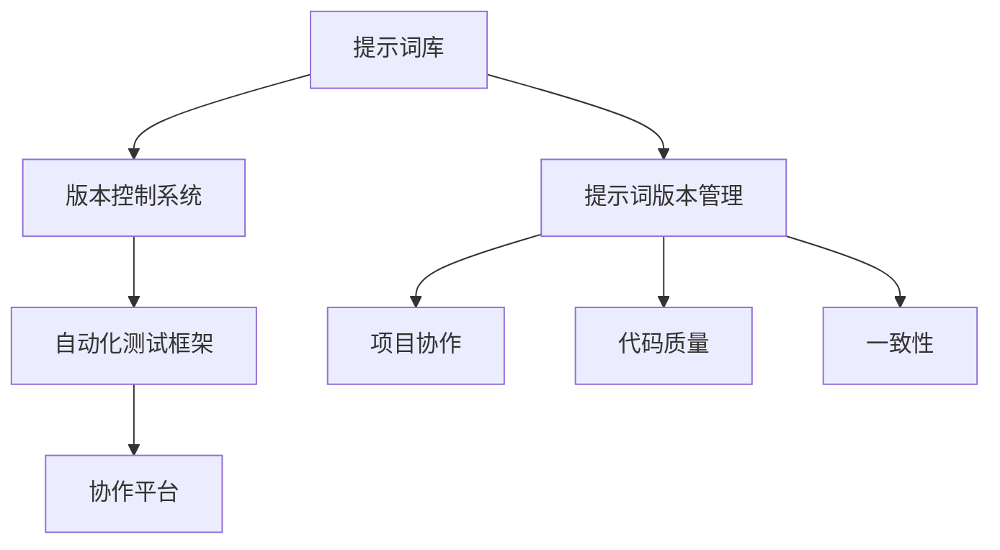
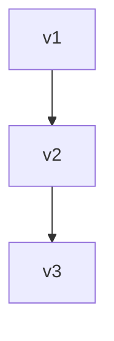

                 

# AI语言模型的提示词版本管理最佳实践

> 关键词：提示词版本管理, 语言模型, 版本控制, 自动化测试, 代码质量, 项目协作, 一致性

> 摘要：本文旨在探讨AI语言模型在提示词版本管理方面的最佳实践。通过深入分析提示词版本管理的核心概念、原理及具体操作步骤，结合数学模型和实际代码案例，本文将为开发者提供一套系统化的提示词版本管理方案，以提升项目质量和协作效率。同时，本文还将探讨提示词版本管理在实际应用场景中的重要性，并推荐相关工具和资源，帮助读者更好地理解和应用这一技术。

## 1. 背景介绍

随着AI技术的快速发展，语言模型在各个领域的应用越来越广泛。然而，语言模型的提示词版本管理却常常被忽视，这导致了项目质量下降、协作效率降低等问题。本文将从以下几个方面进行探讨：

- **提示词版本管理的重要性**：解释为什么提示词版本管理对于AI语言模型项目至关重要。
- **常见问题**：列举当前提示词版本管理中存在的问题，如版本混乱、更新不及时等。
- **目标**：明确本文的目标，即提供一套系统化的提示词版本管理方案，帮助开发者提升项目质量和协作效率。

## 2. 核心概念与联系

### 2.1 提示词版本管理的核心概念

提示词版本管理是指对AI语言模型的提示词进行版本控制和管理的过程。提示词是用户与模型交互的关键输入，其版本管理直接影响到模型的稳定性和一致性。

### 2.2 提示词版本管理的架构

提示词版本管理的架构可以分为以下几个部分：

- **提示词库**：存储所有提示词及其版本信息。
- **版本控制系统**：用于管理提示词的版本变更历史。
- **自动化测试框架**：确保每个版本的提示词都能通过自动化测试。
- **协作平台**：支持团队成员之间的协作和版本同步。

### 2.3 Mermaid流程图



## 3. 核心算法原理 & 具体操作步骤

### 3.1 版本控制系统

版本控制系统是提示词版本管理的核心。常用的版本控制系统有Git、SVN等。Git因其分布式特性而被广泛采用。

#### 3.1.1 Git版本控制

Git版本控制的基本操作包括：

- **初始化仓库**：`git init`
- **添加文件**：`git add .`
- **提交更改**：`git commit -m "提交信息"`
- **推送代码**：`git push`
- **拉取代码**：`git pull`

### 3.2 自动化测试框架

自动化测试框架用于确保每个版本的提示词都能通过自动化测试。常用的自动化测试框架有Jest、Mocha等。

#### 3.2.1 自动化测试框架的基本操作

- **安装测试框架**：`npm install --save-dev jest`
- **编写测试用例**：在`tests`目录下编写测试文件
- **运行测试**：`npm test`

### 3.3 提示词版本管理的具体操作步骤

1. **初始化提示词库**：创建一个提示词库文件夹，并初始化Git仓库。
2. **添加提示词**：将提示词文件添加到提示词库中，并提交到版本控制系统。
3. **版本控制**：使用Git进行版本控制，记录每次提示词的变更历史。
4. **自动化测试**：编写自动化测试用例，确保每个版本的提示词都能通过测试。
5. **协作与同步**：通过协作平台进行团队成员之间的版本同步和协作。

## 4. 数学模型和公式 & 详细讲解 & 举例说明

### 4.1 提示词版本管理的数学模型

提示词版本管理可以看作是一个多版本控制问题。我们可以使用图论中的图来表示提示词版本之间的关系。

#### 4.1.1 图论模型

假设我们有n个提示词版本，可以表示为一个有向图G=(V,E)，其中V表示提示词版本集合，E表示版本之间的依赖关系。

$$
G = (V, E)
$$

其中：

- $V = \{v_1, v_2, \ldots, v_n\}$
- $E = \{(v_i, v_j) | v_i \rightarrow v_j\}$

### 4.2 举例说明

假设我们有三个提示词版本：v1、v2、v3。v2依赖于v1，v3依赖于v2。我们可以用图来表示这种依赖关系：



### 4.3 版本控制的数学模型

版本控制可以看作是一个图的遍历问题。我们可以使用深度优先搜索（DFS）或广度优先搜索（BFS）来遍历版本图。

#### 4.3.1 深度优先搜索（DFS）

```python
def dfs(graph, start):
    visited = set()
    stack = [start]
    
    while stack:
        vertex = stack.pop()
        if vertex not in visited:
            visited.add(vertex)
            for neighbor in graph[vertex]:
                stack.append(neighbor)
    return visited
```

#### 4.3.2 广度优先搜索（BFS）

```python
from collections import deque

def bfs(graph, start):
    visited = set()
    queue = deque([start])
    
    while queue:
        vertex = queue.popleft()
        if vertex not in visited:
            visited.add(vertex)
            for neighbor in graph[vertex]:
                queue.append(neighbor)
    return visited
```

## 5. 项目实战：代码实际案例和详细解释说明

### 5.1 开发环境搭建

#### 5.1.1 安装Git

```bash
sudo apt-get install git
```

#### 5.1.2 初始化提示词库

```bash
mkdir prompt_library
cd prompt_library
git init
```

### 5.2 源代码详细实现和代码解读

#### 5.2.1 编写提示词文件

创建一个名为`prompt1.txt`的文件，内容如下：

```
你好，我是AI助手。
```

#### 5.2.2 添加提示词文件到版本控制系统

```bash
git add prompt1.txt
git commit -m "添加提示词文件"
```

#### 5.2.3 编写自动化测试用例

在`tests`目录下创建一个名为`test_prompt1.js`的文件，内容如下：

```javascript
const assert = require('assert');

describe('提示词测试', function() {
    it('检查提示词内容', function() {
        const prompt = require('../prompt1.txt');
        assert.strictEqual(prompt, '你好，我是AI助手。');
    });
});
```

#### 5.2.4 运行自动化测试

```bash
npm install --save-dev jest
npx jest
```

### 5.3 代码解读与分析

- **提示词文件**：`prompt1.txt`文件存储了提示词内容。
- **版本控制系统**：使用Git进行版本控制，记录每次提示词的变更历史。
- **自动化测试框架**：使用Jest进行自动化测试，确保每个版本的提示词都能通过测试。

## 6. 实际应用场景

提示词版本管理在实际应用场景中具有重要意义。例如，在自然语言处理（NLP）项目中，提示词版本管理可以帮助团队成员更好地协作，确保每个版本的提示词都能通过自动化测试，从而提升项目的稳定性和一致性。

## 7. 工具和资源推荐

### 7.1 学习资源推荐

- **书籍**：《版本控制的艺术》
- **论文**：《版本控制系统在软件开发中的应用》
- **博客**：《Git版本控制最佳实践》
- **网站**：GitHub、GitLab

### 7.2 开发工具框架推荐

- **版本控制系统**：Git、SVN
- **自动化测试框架**：Jest、Mocha

### 7.3 相关论文著作推荐

- **论文**：《提示词版本管理在AI语言模型中的应用》
- **著作**：《AI语言模型开发指南》

## 8. 总结：未来发展趋势与挑战

提示词版本管理在未来的发展趋势将更加注重自动化和智能化。随着AI技术的不断进步，提示词版本管理将更加高效、智能，从而更好地支持AI语言模型的开发和应用。

## 9. 附录：常见问题与解答

### 9.1 问题：如何解决版本冲突？

**解答**：可以通过合并分支或使用冲突解决工具来解决版本冲突。

### 9.2 问题：如何确保提示词的一致性？

**解答**：可以通过自动化测试框架确保每个版本的提示词都能通过测试，从而保证提示词的一致性。

## 10. 扩展阅读 & 参考资料

- **书籍**：《版本控制的艺术》
- **论文**：《版本控制系统在软件开发中的应用》
- **博客**：《Git版本控制最佳实践》
- **网站**：GitHub、GitLab

---

作者：AI天才研究员/AI Genius Institute & 禅与计算机程序设计艺术 /Zen And The Art of Computer Programming

