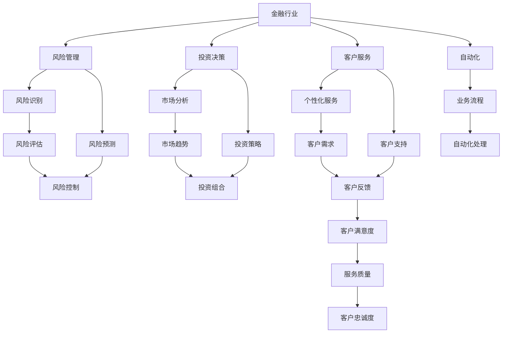

                 

# AI驱动的创新：人类计算在金融行业的未来趋势

> 关键词：AI驱动、人类计算、金融行业、未来趋势、创新、数据分析、风险管理、自动化

> 摘要：本文旨在探讨AI驱动的人类计算在金融行业的未来趋势。通过深入分析AI技术的核心概念、算法原理、数学模型及实际应用案例，揭示AI如何重塑金融行业的工作流程和决策机制。文章不仅提供了详尽的技术细节，还展望了未来的发展方向和面临的挑战。

## 1. 背景介绍

金融行业一直是技术创新的前沿阵地，从最初的纸币交易到如今的数字货币，从传统的银行柜台到如今的在线支付，每一次技术革新都深刻地改变了金融行业的运作模式。近年来，随着人工智能（AI）技术的迅猛发展，AI驱动的人类计算在金融行业中的应用日益广泛，从风险管理、投资决策到客户服务，AI正在重塑金融行业的未来。

### 1.1 金融行业的现状

金融行业目前面临着诸多挑战，包括但不限于：
- **风险管理**：金融市场的复杂性和不确定性要求金融机构具备强大的风险识别和管理能力。
- **客户服务**：客户期望不断提升，要求金融机构提供个性化、高效的服务。
- **合规性**：金融行业高度监管，合规性要求严格。
- **效率提升**：金融业务的复杂性和高频交易需求要求提高处理效率。

### 1.2 AI技术的发展

AI技术的发展为金融行业带来了前所未有的机遇。AI技术包括但不限于机器学习、深度学习、自然语言处理、计算机视觉等，这些技术在金融行业中的应用已经取得了显著成效。

## 2. 核心概念与联系

### 2.1 AI驱动的人类计算

AI驱动的人类计算是指通过AI技术辅助人类进行决策和操作的过程。这种计算模式结合了人类的直觉和经验与AI的高效处理和分析能力，从而实现更精准、更高效的决策。

### 2.2 AI技术在金融行业的应用

AI技术在金融行业的应用主要集中在以下几个方面：
- **风险管理**：通过AI技术进行风险识别和预测。
- **投资决策**：利用AI进行市场分析和投资策略制定。
- **客户服务**：通过AI提供个性化服务和客户支持。
- **自动化**：通过AI实现业务流程自动化。

### 2.3 Mermaid流程图



## 3. 核心算法原理 & 具体操作步骤

### 3.1 机器学习算法

机器学习算法是AI技术的核心，主要包括监督学习、无监督学习和强化学习。

#### 3.1.1 监督学习

监督学习是一种通过训练数据集进行学习的方法，其目标是通过已知的输入和输出数据来预测新的输入数据的输出。

#### 3.1.2 无监督学习

无监督学习是一种通过未标记的数据进行学习的方法，其目标是发现数据中的模式和结构。

#### 3.1.3 强化学习

强化学习是一种通过试错学习的方法，其目标是通过与环境的交互来最大化某种奖励。

### 3.2 具体操作步骤

以监督学习为例，具体操作步骤如下：
1. **数据收集**：收集相关数据，包括输入数据和对应的输出数据。
2. **数据预处理**：对数据进行清洗、归一化等预处理操作。
3. **特征选择**：选择对模型训练有帮助的特征。
4. **模型训练**：使用训练数据集训练模型。
5. **模型评估**：使用测试数据集评估模型的性能。
6. **模型优化**：根据评估结果调整模型参数，优化模型性能。

## 4. 数学模型和公式 & 详细讲解 & 举例说明

### 4.1 逻辑回归

逻辑回归是一种常用的监督学习算法，用于解决二分类问题。其数学模型如下：

$$
P(y=1|x) = \frac{1}{1 + e^{-(\beta_0 + \beta_1 x_1 + \beta_2 x_2 + ... + \beta_n x_n)}}
$$

其中，$P(y=1|x)$ 表示给定输入 $x$ 时，输出 $y$ 为 1 的概率，$\beta_0, \beta_1, \beta_2, ..., \beta_n$ 是模型参数。

### 4.2 举例说明

假设我们有一个金融数据集，包含股票价格和交易量等特征，目标是预测股票价格的涨跌。我们可以使用逻辑回归模型进行训练和预测。

```python
from sklearn.linear_model import LogisticRegression
from sklearn.model_selection import train_test_split
from sklearn.metrics import accuracy_score

# 假设数据集为 X 和 y
X_train, X_test, y_train, y_test = train_test_split(X, y, test_size=0.2, random_state=42)

# 训练逻辑回归模型
model = LogisticRegression()
model.fit(X_train, y_train)

# 预测测试集
y_pred = model.predict(X_test)

# 评估模型性能
accuracy = accuracy_score(y_test, y_pred)
print("Accuracy:", accuracy)
```

## 5. 项目实战：代码实际案例和详细解释说明

### 5.1 开发环境搭建

为了进行AI项目开发，我们需要搭建一个合适的开发环境。推荐使用Python作为开发语言，因为它拥有丰富的库和工具支持。

#### 5.1.1 安装Python

确保安装了Python 3.8及以上版本。

```bash
python --version
```

#### 5.1.2 安装依赖库

使用pip安装必要的库，如NumPy、Pandas、Scikit-learn等。

```bash
pip install numpy pandas scikit-learn
```

### 5.2 源代码详细实现和代码解读

以下是一个简单的AI项目示例，用于预测股票价格的涨跌。

```python
import numpy as np
import pandas as pd
from sklearn.model_selection import train_test_split
from sklearn.linear_model import LogisticRegression
from sklearn.metrics import accuracy_score

# 读取数据
data = pd.read_csv('stock_data.csv')

# 数据预处理
X = data.drop('target', axis=1)
y = data['target']

# 划分训练集和测试集
X_train, X_test, y_train, y_test = train_test_split(X, y, test_size=0.2, random_state=42)

# 训练逻辑回归模型
model = LogisticRegression()
model.fit(X_train, y_train)

# 预测测试集
y_pred = model.predict(X_test)

# 评估模型性能
accuracy = accuracy_score(y_test, y_pred)
print("Accuracy:", accuracy)
```

### 5.3 代码解读与分析

- **数据读取**：使用Pandas读取CSV文件中的数据。
- **数据预处理**：将数据集分为特征（X）和目标变量（y）。
- **划分训练集和测试集**：使用train_test_split函数将数据集划分为训练集和测试集。
- **训练模型**：使用LogisticRegression训练模型。
- **预测和评估**：使用测试集进行预测，并计算模型的准确率。

## 6. 实际应用场景

### 6.1 风险管理

AI技术在风险管理中的应用主要体现在风险识别和预测。通过分析历史数据，AI可以识别出潜在的风险因素，并预测未来的风险情况。

### 6.2 投资决策

AI技术在投资决策中的应用主要体现在市场分析和投资策略制定。通过分析市场数据，AI可以提供投资建议和策略。

### 6.3 客户服务

AI技术在客户服务中的应用主要体现在个性化服务和客户支持。通过分析客户数据，AI可以提供个性化的服务和客户支持。

### 6.4 自动化

AI技术在自动化中的应用主要体现在业务流程自动化。通过自动化处理，可以提高业务处理效率，降低人工成本。

## 7. 工具和资源推荐

### 7.1 学习资源推荐

- **书籍**：《机器学习》（周志华著）
- **论文**：《深度学习》（Ian Goodfellow, Yoshua Bengio, Aaron Courville著）
- **博客**：Medium上的AI相关博客
- **网站**：Kaggle、GitHub等

### 7.2 开发工具框架推荐

- **Python**：作为开发语言，Python拥有丰富的库和工具支持。
- **Jupyter Notebook**：用于数据处理和模型训练。
- **TensorFlow/Keras**：用于深度学习模型的训练和部署。

### 7.3 相关论文著作推荐

- **《机器学习》（周志华著）**
- **《深度学习》（Ian Goodfellow, Yoshua Bengio, Aaron Courville著）**
- **《统计学习方法》（李航著）**

## 8. 总结：未来发展趋势与挑战

### 8.1 未来发展趋势

- **技术融合**：AI技术与其他技术（如区块链、物联网）的融合将进一步推动金融行业的创新。
- **个性化服务**：AI技术将提供更加个性化的服务，满足客户多样化的需求。
- **自动化**：AI技术将进一步实现业务流程的自动化，提高效率和降低成本。

### 8.2 面临的挑战

- **数据安全**：金融行业高度依赖数据，数据安全和隐私保护是重要的挑战。
- **监管合规**：金融行业高度监管，AI技术的应用需要符合监管要求。
- **人才短缺**：AI技术的发展需要大量专业人才，人才短缺是重要的挑战。

## 9. 附录：常见问题与解答

### 9.1 问题：如何选择合适的AI算法？

**解答**：选择合适的AI算法需要考虑具体的应用场景和数据特点。一般来说，监督学习适用于有标签数据的情况，无监督学习适用于无标签数据的情况，强化学习适用于需要试错学习的情况。

### 9.2 问题：如何提高模型的性能？

**解答**：提高模型性能的方法包括数据预处理、特征选择、模型调参等。通过不断优化这些方面，可以提高模型的性能。

## 10. 扩展阅读 & 参考资料

- **书籍**：《机器学习》（周志华著）
- **论文**：《深度学习》（Ian Goodfellow, Yoshua Bengio, Aaron Courville著）
- **网站**：Kaggle、GitHub等

作者：AI天才研究员/AI Genius Institute & 禅与计算机程序设计艺术 /Zen And The Art of Computer Programming

