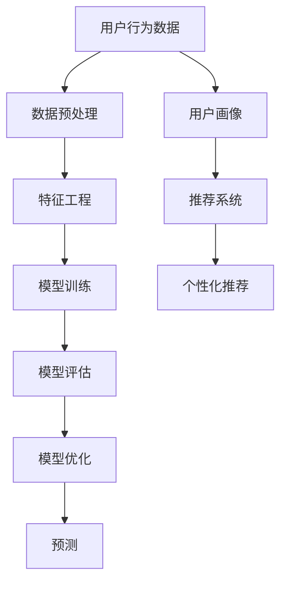

                 

# AI驱动的电商平台用户行为预测模型

> 关键词：AI驱动、电商平台、用户行为预测、机器学习、深度学习、推荐系统、预测模型、用户画像、行为分析

> 摘要：本文旨在探讨如何利用AI技术构建一个高效的电商平台用户行为预测模型。通过深入分析用户行为数据，我们可以更好地理解用户需求，优化推荐系统，提升用户体验。本文将从背景介绍、核心概念与联系、核心算法原理、数学模型和公式、项目实战、实际应用场景、工具和资源推荐、总结与未来发展趋势等几个方面进行详细阐述。

## 1. 背景介绍

随着互联网技术的快速发展，电商平台已经成为人们日常生活的重要组成部分。电商平台不仅需要提供丰富的商品信息，还需要通过精准的推荐系统来提升用户体验。用户行为预测模型是实现这一目标的关键技术之一。通过对用户历史行为数据的分析，我们可以预测用户未来的购买行为，从而提供更加个性化的推荐服务。

### 1.1 电商平台用户行为分析的重要性

电商平台用户行为分析的重要性在于：

- **提升用户体验**：通过精准推荐，用户可以更快地找到自己感兴趣的商品，提升购物体验。
- **优化库存管理**：通过对用户行为的分析，电商平台可以更好地预测商品需求，优化库存管理。
- **增加销售额**：精准推荐可以提高转化率，从而增加销售额。
- **个性化营销**：通过用户画像，电商平台可以进行更加个性化的营销活动，提高用户满意度。

### 1.2 用户行为数据的来源

电商平台用户行为数据主要来源于以下几个方面：

- **用户浏览记录**：用户在平台上的浏览记录，包括浏览的商品、停留时间等。
- **购买记录**：用户的购买记录，包括购买的商品、购买时间、购买频率等。
- **搜索记录**：用户的搜索记录，包括搜索关键词、搜索时间等。
- **评价记录**：用户的评价记录，包括评价内容、评价时间等。
- **社交互动**：用户的社交互动记录，包括点赞、评论、分享等。

## 2. 核心概念与联系

### 2.1 用户画像

用户画像是一种通过用户行为数据构建的用户特征模型，用于描述用户的基本信息、兴趣偏好、购买行为等。用户画像可以帮助我们更好地理解用户，从而提供更加个性化的服务。

### 2.2 推荐系统

推荐系统是一种通过分析用户行为数据，预测用户兴趣，从而提供个性化推荐的服务。推荐系统的核心在于如何从海量数据中提取有价值的信息，并将其转化为推荐结果。

### 2.3 机器学习与深度学习

机器学习是一种通过算法自动学习数据特征，从而进行预测和决策的技术。深度学习是机器学习的一个分支，通过多层神经网络模型，可以更好地提取数据特征，提高预测精度。

### 2.4 用户行为预测模型

用户行为预测模型是一种通过机器学习和深度学习技术，预测用户未来行为的技术。用户行为预测模型的核心在于如何构建一个有效的预测模型，从而提高预测精度。

### 2.5 Mermaid 流程图



## 3. 核心算法原理 & 具体操作步骤

### 3.1 数据预处理

数据预处理是构建用户行为预测模型的第一步，主要包括以下几个步骤：

- **数据清洗**：去除无效数据，填补缺失值。
- **数据转换**：将非数值数据转换为数值数据。
- **数据归一化**：将数据归一化到同一尺度，提高模型训练效果。

### 3.2 特征工程

特征工程是构建用户行为预测模型的关键步骤，主要包括以下几个步骤：

- **特征选择**：选择对预测结果有重要影响的特征。
- **特征构造**：通过组合已有特征，构造新的特征。
- **特征缩放**：将特征缩放到同一尺度，提高模型训练效果。

### 3.3 模型训练

模型训练是构建用户行为预测模型的核心步骤，主要包括以下几个步骤：

- **选择模型**：选择合适的机器学习或深度学习模型。
- **模型参数调优**：通过交叉验证等方法，调整模型参数，提高模型精度。
- **模型训练**：使用训练数据训练模型。

### 3.4 模型评估

模型评估是验证模型效果的重要步骤，主要包括以下几个步骤：

- **划分数据集**：将数据集划分为训练集和测试集。
- **评估指标**：选择合适的评估指标，如准确率、召回率、F1值等。
- **模型比较**：比较不同模型的性能，选择最优模型。

### 3.5 模型优化

模型优化是提高模型精度的重要步骤，主要包括以下几个步骤：

- **特征选择优化**：通过特征选择方法，优化特征选择。
- **模型参数优化**：通过网格搜索等方法，优化模型参数。
- **模型集成**：通过模型集成方法，提高模型精度。

## 4. 数学模型和公式 & 详细讲解 & 举例说明

### 4.1 逻辑回归模型

逻辑回归是一种常用的机器学习模型，用于解决二分类问题。逻辑回归模型的数学表达式如下：

$$
P(y=1|x) = \frac{1}{1 + e^{-(\beta_0 + \beta_1 x_1 + \beta_2 x_2 + \cdots + \beta_n x_n)}}
$$

其中，$P(y=1|x)$ 表示在给定特征 $x$ 的情况下，事件 $y=1$ 发生的概率；$\beta_0, \beta_1, \beta_2, \cdots, \beta_n$ 是模型参数。

### 4.2 深度学习模型

深度学习模型是一种通过多层神经网络模型，提取数据特征的技术。深度学习模型的数学表达式如下：

$$
y = \sigma(W_1 x + b_1) \sigma(W_2 y + b_2) \cdots \sigma(W_n y + b_n)
$$

其中，$\sigma$ 是激活函数，$W_1, W_2, \cdots, W_n$ 是权重矩阵，$b_1, b_2, \cdots, b_n$ 是偏置项。

### 4.3 举例说明

假设我们有一个电商平台用户行为数据集，包含用户的浏览记录、购买记录、搜索记录等。我们可以通过逻辑回归模型预测用户是否会购买某件商品。具体步骤如下：

1. **数据预处理**：去除无效数据，填补缺失值，将非数值数据转换为数值数据，将数据归一化。
2. **特征工程**：选择对预测结果有重要影响的特征，构造新的特征，将特征缩放到同一尺度。
3. **模型训练**：选择逻辑回归模型，通过交叉验证等方法，调整模型参数，使用训练数据训练模型。
4. **模型评估**：将数据集划分为训练集和测试集，选择合适的评估指标，如准确率、召回率、F1值等，验证模型效果。
5. **模型优化**：通过特征选择优化、模型参数优化、模型集成等方法，提高模型精度。

## 5. 项目实战：代码实际案例和详细解释说明

### 5.1 开发环境搭建

为了实现用户行为预测模型，我们需要搭建一个开发环境。具体步骤如下：

1. **安装Python**：安装Python 3.7及以上版本。
2. **安装依赖库**：安装NumPy、Pandas、Scikit-learn、TensorFlow等依赖库。
3. **安装开发工具**：安装Jupyter Notebook、PyCharm等开发工具。

### 5.2 源代码详细实现和代码解读

假设我们使用Python语言实现用户行为预测模型，具体代码如下：

```python
import numpy as np
import pandas as pd
from sklearn.model_selection import train_test_split
from sklearn.preprocessing import StandardScaler
from sklearn.linear_model import LogisticRegression
from sklearn.metrics import accuracy_score, recall_score, f1_score

# 读取数据
data = pd.read_csv('user_behavior_data.csv')

# 数据预处理
data = data.dropna()  # 去除无效数据
data = pd.get_dummies(data)  # 将非数值数据转换为数值数据
data = data / data.max()  # 将数据归一化

# 特征工程
X = data.drop('purchase', axis=1)
y = data['purchase']

# 划分数据集
X_train, X_test, y_train, y_test = train_test_split(X, y, test_size=0.2, random_state=42)

# 模型训练
scaler = StandardScaler()
X_train = scaler.fit_transform(X_train)
X_test = scaler.transform(X_test)

model = LogisticRegression()
model.fit(X_train, y_train)

# 模型评估
y_pred = model.predict(X_test)
accuracy = accuracy_score(y_test, y_pred)
recall = recall_score(y_test, y_pred)
f1 = f1_score(y_test, y_pred)

print('Accuracy:', accuracy)
print('Recall:', recall)
print('F1 Score:', f1)
```

### 5.3 代码解读与分析

上述代码实现了一个简单的用户行为预测模型。具体步骤如下：

1. **读取数据**：使用Pandas库读取用户行为数据。
2. **数据预处理**：去除无效数据，将非数值数据转换为数值数据，将数据归一化。
3. **特征工程**：选择对预测结果有重要影响的特征。
4. **划分数据集**：将数据集划分为训练集和测试集。
5. **模型训练**：使用StandardScaler对数据进行标准化处理，使用LogisticRegression模型进行训练。
6. **模型评估**：使用accuracy_score、recall_score、f1_score等评估指标，验证模型效果。

## 6. 实际应用场景

用户行为预测模型在电商平台中有广泛的应用场景，主要包括以下几个方面：

- **个性化推荐**：通过预测用户未来的行为，提供更加个性化的推荐服务。
- **库存管理**：通过预测用户需求，优化库存管理。
- **营销活动**：通过预测用户行为，进行更加个性化的营销活动。
- **用户画像**：通过用户行为数据，构建用户画像，更好地理解用户需求。

## 7. 工具和资源推荐

### 7.1 学习资源推荐

- **书籍**：《机器学习》（周志华著）、《深度学习》（Ian Goodfellow著）
- **论文**：《User Behavior Prediction in E-commerce》（IEEE Transactions on Knowledge and Data Engineering）
- **博客**：阿里云开发者社区、GitHub开源项目
- **网站**：Kaggle、DataCamp

### 7.2 开发工具框架推荐

- **开发工具**：Jupyter Notebook、PyCharm
- **框架**：TensorFlow、PyTorch

### 7.3 相关论文著作推荐

- **论文**：《User Behavior Prediction in E-commerce》（IEEE Transactions on Knowledge and Data Engineering）
- **著作**：《机器学习》（周志华著）、《深度学习》（Ian Goodfellow著）

## 8. 总结：未来发展趋势与挑战

### 8.1 未来发展趋势

- **数据驱动**：随着数据量的不断增加，数据驱动将成为电商平台的核心竞争力。
- **个性化推荐**：通过更加精准的用户行为预测，提供更加个性化的推荐服务。
- **实时预测**：通过实时预测用户行为，提供更加及时的服务。

### 8.2 挑战

- **数据隐私**：如何在保护用户隐私的前提下，充分利用用户行为数据。
- **模型解释性**：如何提高模型的解释性，让用户更好地理解推荐结果。
- **模型泛化能力**：如何提高模型的泛化能力，使其在不同场景下都能取得良好的效果。

## 9. 附录：常见问题与解答

### 9.1 问题1：如何处理缺失值？

**解答**：可以使用均值、中位数、众数等方法填补缺失值，也可以使用插值方法进行填补。

### 9.2 问题2：如何选择特征？

**解答**：可以通过相关性分析、特征重要性分析等方法选择特征。

### 9.3 问题3：如何优化模型？

**解答**：可以通过特征选择优化、模型参数优化、模型集成等方法优化模型。

## 10. 扩展阅读 & 参考资料

- **书籍**：《机器学习》（周志华著）、《深度学习》（Ian Goodfellow著）
- **论文**：《User Behavior Prediction in E-commerce》（IEEE Transactions on Knowledge and Data Engineering）
- **博客**：阿里云开发者社区、GitHub开源项目
- **网站**：Kaggle、DataCamp

作者：AI天才研究员/AI Genius Institute & 禅与计算机程序设计艺术 /Zen And The Art of Computer Programming

