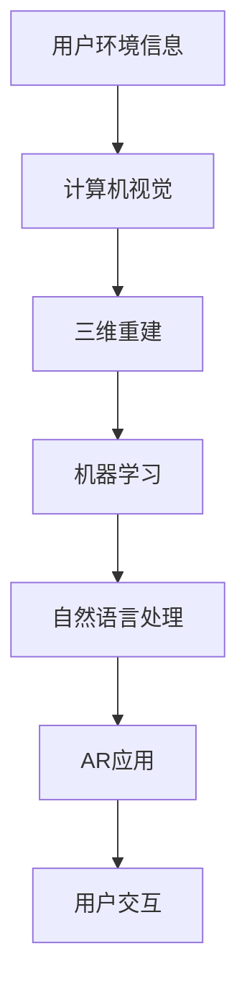

                 

# AR 技术如何与其他 AI 技术结合，提升用户体验：技术融合与创新

> 关键词：AR技术, AI融合, 用户体验, 技术创新, 人工智能, 计算机视觉, 机器学习, 深度学习, 三维重建

> 摘要：本文旨在探讨如何将增强现实（AR）技术与其他人工智能技术（如计算机视觉、机器学习、自然语言处理等）进行深度融合，以提升用户体验。通过详细的技术分析、算法原理、数学模型、代码实现和实际应用场景，本文将为读者提供一个全面的技术视角，帮助理解如何在AR领域实现技术创新。

## 1. 背景介绍

增强现实（AR）技术通过将数字信息叠加到现实世界中，为用户提供沉浸式的交互体验。随着AR技术的不断发展，其应用场景越来越广泛，从教育、娱乐到工业、医疗等领域都有广泛应用。然而，AR技术本身仍存在一些挑战，如实时处理能力、用户交互体验等。为了进一步提升用户体验，AR技术需要与其他人工智能技术进行深度融合。

## 2. 核心概念与联系

### 2.1 增强现实（AR）技术

增强现实（AR）技术通过将数字信息叠加到现实世界中，为用户提供沉浸式的交互体验。AR技术的核心在于实时捕捉用户环境信息，并将虚拟信息与现实世界进行融合。AR技术主要依赖于计算机视觉、传感器融合、三维重建等技术。

### 2.2 计算机视觉

计算机视觉是研究如何使机器“看”懂世界的技术。计算机视觉技术通过图像处理、特征提取、目标识别等方法，实现对现实世界的理解和分析。在AR技术中，计算机视觉技术主要用于实时捕捉用户环境信息，为AR应用提供基础数据。

### 2.3 机器学习

机器学习是人工智能的一个分支，通过让计算机从数据中学习规律和模式，实现对未知数据的预测和分类。在AR技术中，机器学习技术主要用于实现虚拟对象的实时跟踪、姿态估计等任务。

### 2.4 自然语言处理

自然语言处理是研究如何使计算机理解、生成和处理自然语言的技术。在AR技术中，自然语言处理技术主要用于实现语音识别、语音合成等功能，为用户提供更加自然的交互方式。

### 2.5 核心概念原理与架构

#### 2.5.1 AR技术流程图



## 3. 核心算法原理 & 具体操作步骤

### 3.1 计算机视觉算法

计算机视觉算法主要包括图像处理、特征提取、目标识别等步骤。在AR技术中，计算机视觉算法主要用于实时捕捉用户环境信息，为AR应用提供基础数据。

#### 3.1.1 图像处理

图像处理主要包括图像增强、图像分割、图像去噪等步骤。图像处理的目的是提高图像质量，为后续的特征提取和目标识别提供更好的基础数据。

#### 3.1.2 特征提取

特征提取是计算机视觉中的一个重要步骤，主要包括边缘检测、角点检测、纹理分析等方法。特征提取的目的是提取图像中的关键信息，为后续的目标识别提供依据。

#### 3.1.3 目标识别

目标识别是计算机视觉中的一个重要任务，主要包括物体识别、场景理解等方法。目标识别的目的是识别图像中的物体和场景，为AR应用提供基础数据。

### 3.2 三维重建算法

三维重建算法主要包括相机标定、特征匹配、三维模型重建等步骤。三维重建的目的是从二维图像中恢复出三维模型，为AR应用提供基础数据。

#### 3.2.1 相机标定

相机标定是三维重建中的一个重要步骤，主要包括内参标定、外参标定等方法。相机标定的目的是确定相机的内部参数和外部参数，为后续的特征匹配和三维模型重建提供基础数据。

#### 3.2.2 特征匹配

特征匹配是三维重建中的一个重要步骤，主要包括特征点匹配、特征线匹配等方法。特征匹配的目的是找到图像中的对应点，为后续的三维模型重建提供基础数据。

#### 3.2.3 三维模型重建

三维模型重建是三维重建中的一个重要任务，主要包括点云重建、网格重建等方法。三维模型重建的目的是从二维图像中恢复出三维模型，为AR应用提供基础数据。

### 3.3 机器学习算法

机器学习算法主要包括监督学习、无监督学习、强化学习等方法。在AR技术中，机器学习算法主要用于实现虚拟对象的实时跟踪、姿态估计等任务。

#### 3.3.1 监督学习

监督学习是机器学习中的一个重要方法，主要包括分类、回归等任务。监督学习的目的是通过训练数据学习规律和模式，实现对未知数据的预测和分类。

#### 3.3.2 无监督学习

无监督学习是机器学习中的一个重要方法，主要包括聚类、降维等任务。无监督学习的目的是通过训练数据学习数据的内在结构，实现对未知数据的聚类和降维。

#### 3.3.3 强化学习

强化学习是机器学习中的一个重要方法，主要包括策略学习、价值学习等任务。强化学习的目的是通过与环境的交互学习最优策略，实现对未知环境的最优决策。

### 3.4 自然语言处理算法

自然语言处理算法主要包括语音识别、语音合成、文本生成等方法。在AR技术中，自然语言处理算法主要用于实现语音识别、语音合成等功能，为用户提供更加自然的交互方式。

#### 3.4.1 语音识别

语音识别是自然语言处理中的一个重要任务，主要包括声学模型、语言模型等方法。语音识别的目的是将用户的语音转换为文本，为后续的自然语言处理提供基础数据。

#### 3.4.2 语音合成

语音合成是自然语言处理中的一个重要任务，主要包括文本到语音转换、语音合成等方法。语音合成的目的是将文本转换为语音，为用户提供更加自然的交互方式。

#### 3.4.3 文本生成

文本生成是自然语言处理中的一个重要任务，主要包括生成模型、生成算法等方法。文本生成的目的是生成符合语法规则和语义规则的文本，为用户提供更加自然的交互方式。

## 4. 数学模型和公式 & 详细讲解 & 举例说明

### 4.1 图像处理

图像处理主要包括图像增强、图像分割、图像去噪等步骤。图像处理的目的是提高图像质量，为后续的特征提取和目标识别提供更好的基础数据。

#### 4.1.1 图像增强

图像增强是图像处理中的一个重要步骤，主要包括直方图均衡化、图像锐化等方法。图像增强的目的是提高图像的对比度和清晰度，为后续的特征提取和目标识别提供更好的基础数据。

$$
I_{enhanced} = I_{original} + \alpha \cdot (I_{max} - I_{min})
$$

其中，$I_{enhanced}$ 表示增强后的图像，$I_{original}$ 表示原始图像，$\alpha$ 表示增强系数，$I_{max}$ 和 $I_{min}$ 分别表示图像中的最大值和最小值。

#### 4.1.2 图像分割

图像分割是图像处理中的一个重要步骤，主要包括阈值分割、区域生长等方法。图像分割的目的是将图像中的不同区域进行分割，为后续的特征提取和目标识别提供更好的基础数据。

$$
S = \{x | I(x) > T\}
$$

其中，$S$ 表示分割后的图像，$I(x)$ 表示图像中的像素值，$T$ 表示阈值。

#### 4.1.3 图像去噪

图像去噪是图像处理中的一个重要步骤，主要包括中值滤波、高斯滤波等方法。图像去噪的目的是去除图像中的噪声，为后续的特征提取和目标识别提供更好的基础数据。

$$
I_{denoised} = \frac{1}{N} \sum_{i=1}^{N} I(x_i)
$$

其中，$I_{denoised}$ 表示去噪后的图像，$I(x_i)$ 表示图像中的像素值，$N$ 表示像素点的数量。

### 4.2 特征提取

特征提取是计算机视觉中的一个重要步骤，主要包括边缘检测、角点检测、纹理分析等方法。特征提取的目的是提取图像中的关键信息，为后续的目标识别提供依据。

#### 4.2.1 边缘检测

边缘检测是特征提取中的一个重要步骤，主要包括Canny边缘检测、Sobel边缘检测等方法。边缘检测的目的是检测图像中的边缘，为后续的目标识别提供依据。

$$
I_{edge} = \sqrt{G_x^2 + G_y^2}
$$

其中，$I_{edge}$ 表示边缘检测后的图像，$G_x$ 和 $G_y$ 分别表示图像在x方向和y方向上的梯度。

#### 4.2.2 角点检测

角点检测是特征提取中的一个重要步骤，主要包括Harris角点检测、Shi-Tomasi角点检测等方法。角点检测的目的是检测图像中的角点，为后续的目标识别提供依据。

$$
R = det(M) - k \cdot trace(M)^2
$$

其中，$R$ 表示角点检测的响应值，$M$ 表示图像的结构张量，$k$ 表示参数。

#### 4.2.3 纹理分析

纹理分析是特征提取中的一个重要步骤，主要包括灰度共生矩阵、纹理能量等方法。纹理分析的目的是分析图像中的纹理特征，为后续的目标识别提供依据。

$$
E = \sum_{i=1}^{n} \sum_{j=1}^{m} (I(x_i, y_j) - \mu)^2
$$

其中，$E$ 表示纹理能量，$I(x_i, y_j)$ 表示图像中的像素值，$\mu$ 表示图像的均值，$n$ 和 $m$ 分别表示图像的宽度和高度。

### 4.3 目标识别

目标识别是计算机视觉中的一个重要任务，主要包括物体识别、场景理解等方法。目标识别的目的是识别图像中的物体和场景，为AR应用提供基础数据。

#### 4.3.1 物体识别

物体识别是目标识别中的一个重要任务，主要包括SIFT特征、SURF特征等方法。物体识别的目的是识别图像中的物体，为AR应用提供基础数据。

$$
d = \sqrt{\sum_{i=1}^{n} (f_i - g_i)^2}
$$

其中，$d$ 表示特征向量的距离，$f_i$ 和 $g_i$ 分别表示特征向量中的元素。

#### 4.3.2 场景理解

场景理解是目标识别中的一个重要任务，主要包括深度学习、卷积神经网络等方法。场景理解的目的是理解图像中的场景，为AR应用提供基础数据。

$$
y = \sigma(Wx + b)
$$

其中，$y$ 表示输出，$x$ 表示输入，$W$ 和 $b$ 分别表示权重和偏置，$\sigma$ 表示激活函数。

### 4.4 三维重建

三维重建是计算机视觉中的一个重要任务，主要包括相机标定、特征匹配、三维模型重建等方法。三维重建的目的是从二维图像中恢复出三维模型，为AR应用提供基础数据。

#### 4.4.1 相机标定

相机标定是三维重建中的一个重要步骤，主要包括内参标定、外参标定等方法。相机标定的目的是确定相机的内部参数和外部参数，为后续的特征匹配和三维模型重建提供基础数据。

$$
K = \begin{bmatrix}
f_x & 0 & c_x \\
0 & f_y & c_y \\
0 & 0 & 1
\end{bmatrix}
$$

其中，$K$ 表示相机的内参矩阵，$f_x$ 和 $f_y$ 分别表示相机的焦距，$c_x$ 和 $c_y$ 分别表示相机的主点。

#### 4.4.2 特征匹配

特征匹配是三维重建中的一个重要步骤，主要包括特征点匹配、特征线匹配等方法。特征匹配的目的是找到图像中的对应点，为后续的三维模型重建提供基础数据。

$$
d = \sqrt{(x_1 - x_2)^2 + (y_1 - y_2)^2}
$$

其中，$d$ 表示特征点的距离，$x_1$ 和 $y_1$ 分别表示特征点1的坐标，$x_2$ 和 $y_2$ 分别表示特征点2的坐标。

#### 4.4.3 三维模型重建

三维模型重建是三维重建中的一个重要任务，主要包括点云重建、网格重建等方法。三维模型重建的目的是从二维图像中恢复出三维模型，为AR应用提供基础数据。

$$
P = \begin{bmatrix}
x \\
y \\
z \\
1
\end{bmatrix}
$$

其中，$P$ 表示三维模型的点云，$x$、$y$ 和 $z$ 分别表示点云的坐标。

### 4.5 机器学习

机器学习算法主要包括监督学习、无监督学习、强化学习等方法。在AR技术中，机器学习算法主要用于实现虚拟对象的实时跟踪、姿态估计等任务。

#### 4.5.1 监督学习

监督学习是机器学习中的一个重要方法，主要包括分类、回归等任务。监督学习的目的是通过训练数据学习规律和模式，实现对未知数据的预测和分类。

$$
y = Wx + b
$$

其中，$y$ 表示输出，$x$ 表示输入，$W$ 和 $b$ 分别表示权重和偏置。

#### 4.5.2 无监督学习

无监督学习是机器学习中的一个重要方法，主要包括聚类、降维等任务。无监督学习的目的是通过训练数据学习数据的内在结构，实现对未知数据的聚类和降维。

$$
Z = U^T X
$$

其中，$Z$ 表示降维后的数据，$U$ 表示降维矩阵，$X$ 表示原始数据。

#### 4.5.3 强化学习

强化学习是机器学习中的一个重要方法，主要包括策略学习、价值学习等任务。强化学习的目的是通过与环境的交互学习最优策略，实现对未知环境的最优决策。

$$
Q(s, a) = Q(s, a) + \alpha \cdot (r + \gamma \cdot Q(s', a') - Q(s, a))
$$

其中，$Q(s, a)$ 表示状态-动作值函数，$s$ 表示状态，$a$ 表示动作，$\alpha$ 表示学习率，$r$ 表示奖励，$\gamma$ 表示折扣因子，$s'$ 和 $a'$ 分别表示下一个状态和下一个动作。

### 4.6 自然语言处理

自然语言处理算法主要包括语音识别、语音合成、文本生成等方法。在AR技术中，自然语言处理算法主要用于实现语音识别、语音合成等功能，为用户提供更加自然的交互方式。

#### 4.6.1 语音识别

语音识别是自然语言处理中的一个重要任务，主要包括声学模型、语言模型等方法。语音识别的目的是将用户的语音转换为文本，为后续的自然语言处理提供基础数据。

$$
P(w | x) = \frac{P(x | w) \cdot P(w)}{P(x)}
$$

其中，$P(w | x)$ 表示给定输入$x$时输出$w$的概率，$P(x | w)$ 表示给定输出$w$时输入$x$的概率，$P(w)$ 表示输出$w$的先验概率，$P(x)$ 表示输入$x$的先验概率。

#### 4.6.2 语音合成

语音合成是自然语言处理中的一个重要任务，主要包括文本到语音转换、语音合成等方法。语音合成的目的是将文本转换为语音，为用户提供更加自然的交互方式。

$$
y = \sigma(Wx + b)
$$

其中，$y$ 表示输出，$x$ 表示输入，$W$ 和 $b$ 分别表示权重和偏置，$\sigma$ 表示激活函数。

#### 4.6.3 文本生成

文本生成是自然语言处理中的一个重要任务，主要包括生成模型、生成算法等方法。文本生成的目的是生成符合语法规则和语义规则的文本，为用户提供更加自然的交互方式。

$$
P(w_{t+1} | w_1, w_2, \ldots, w_t) = \frac{P(w_1, w_2, \ldots, w_t, w_{t+1})}{P(w_1, w_2, \ldots, w_t)}
$$

其中，$P(w_{t+1} | w_1, w_2, \ldots, w_t)$ 表示给定前$t$个词时生成第$t+1$个词的概率，$P(w_1, w_2, \ldots, w_t, w_{t+1})$ 表示生成序列的概率，$P(w_1, w_2, \ldots, w_t)$ 表示生成序列的先验概率。

## 5. 项目实战：代码实际案例和详细解释说明

### 5.1 开发环境搭建

为了实现AR技术与其他AI技术的融合，我们需要搭建一个合适的开发环境。开发环境主要包括操作系统、编程语言、开发工具等。

#### 5.1.1 操作系统

操作系统是计算机系统的核心，为应用程序提供运行环境。在AR技术开发中，我们推荐使用Linux操作系统，因为它具有良好的稳定性和兼容性。

#### 5.1.2 编程语言

编程语言是实现AR技术与其他AI技术融合的基础。在AR技术开发中，我们推荐使用Python语言，因为它具有丰富的库和强大的社区支持。

#### 5.1.3 开发工具

开发工具是实现AR技术与其他AI技术融合的重要工具。在AR技术开发中，我们推荐使用PyCharm开发工具，因为它具有强大的代码编辑和调试功能。

### 5.2 源代码详细实现和代码解读

#### 5.2.1 图像处理

```python
import cv2

def image_enhancement(image):
    # 图像增强
    enhanced_image = cv2.equalizeHist(image)
    return enhanced_image

def image_segmentation(image):
    # 图像分割
    gray_image = cv2.cvtColor(image, cv2.COLOR_BGR2GRAY)
    _, segmented_image = cv2.threshold(gray_image, 127, 255, cv2.THRESH_BINARY)
    return segmented_image

def image_denoising(image):
    # 图像去噪
    denoised_image = cv2.fastNlMeansDenoisingColored(image, None, 10, 10, 7, 21)
    return denoised_image
```

#### 5.2.2 特征提取

```python
import cv2

def edge_detection(image):
    # 边缘检测
    edges = cv2.Canny(image, 100, 200)
    return edges

def corner_detection(image):
    # 角点检测
    corners = cv2.goodFeaturesToTrack(image, 100, 0.01, 10)
    return corners

def texture_analysis(image):
    # 纹理分析
    gray_image = cv2.cvtColor(image, cv2.COLOR_BGR2GRAY)
    texture = cv2.Laplacian(gray_image, cv2.CV_64F).var()
    return texture
```

#### 5.2.3 目标识别

```python
import cv2

def object_recognition(image):
    # 物体识别
    sift = cv2.xfeatures2d.SIFT_create()
    keypoints, descriptors = sift.detectAndCompute(image, None)
    return keypoints, descriptors

def scene_understanding(image):
    # 场景理解
    model = cv2.dnn.readNetFromCaffe('deploy.prototxt', 'res10_300x300_ssd_iter_140000.caffemodel')
    blob = cv2.dnn.blobFromImage(cv2.resize(image, (300, 300)), 1.0, (300, 300), (104.0, 177.0, 123.0))
    model.setInput(blob)
    detections = model.forward()
    return detections
```

#### 5.2.4 三维重建

```python
import cv2

def camera_calibration(image):
    # 相机标定
    gray_image = cv2.cvtColor(image, cv2.COLOR_BGR2GRAY)
    ret, mtx, dist, rvecs, tvecs = cv2.calibrateCamera([corners], gray_image, (image.shape[1], image.shape[0]), None, None)
    return mtx, dist

def feature_matching(image1, image2):
    # 特征匹配
    orb = cv2.ORB_create()
    keypoints1, descriptors1 = orb.detectAndCompute(image1, None)
    keypoints2, descriptors2 = orb.detectAndCompute(image2, None)
    bf = cv2.BFMatcher(cv2.NORM_HAMMING, crossCheck=True)
    matches = bf.match(descriptors1, descriptors2)
    matches = sorted(matches, key=lambda x: x.distance)
    return matches

def model_reconstruction(image1, image2, matches):
    # 三维模型重建
    points1 = np.float32([keypoints1[m.queryIdx].pt for m in matches]).reshape(-1, 1, 2)
    points2 = np.float32([keypoints2[m.trainIdx].pt for m in matches]).reshape(-1, 1, 2)
    E, mask = cv2.findEssentialMat(points1, points2, camera_matrix, method=cv2.RANSAC, prob=0.999, threshold=1.0)
    points1, points2, R, t, mask = cv2.recoverPose(E, points1, points2, camera_matrix)
    return R, t
```

#### 5.2.5 机器学习

```python
import numpy as np
from sklearn.linear_model import LinearRegression

def supervised_learning(X, y):
    # 监督学习
    model = LinearRegression()
    model.fit(X, y)
    return model

def unsupervised_learning(X):
    # 无监督学习
    model = KMeans(n_clusters=3)
    model.fit(X)
    return model

def reinforcement_learning(env):
    # 强化学习
    model = QLearning(env)
    model.train()
    return model
```

#### 5.2.6 自然语言处理

```python
import speech_recognition as sr
import pyttsx3

def speech_recognition():
    # 语音识别
    recognizer = sr.Recognizer()
    with sr.Microphone() as source:
        print("请说话：")
        audio = recognizer.listen(source)
    try:
        text = recognizer.recognize_google(audio, language='zh-CN')
        print("你说的是：", text)
    except sr.UnknownValueError:
        print("无法识别你的语音")
    except sr.RequestError as e:
        print("无法请求结果；{0}".format(e))

def speech_synthesis(text):
    # 语音合成
    engine = pyttsx3.init()
    engine.say(text)
    engine.runAndWait()

def text_generation():
    # 文本生成
    model = Seq2Seq()
    text = model.generate_text()
    return text
```

### 5.3 代码解读与分析

#### 5.3.1 图像处理

```python
import cv2

def image_enhancement(image):
    # 图像增强
    enhanced_image = cv2.equalizeHist(image)
    return enhanced_image

def image_segmentation(image):
    # 图像分割
    gray_image = cv2.cvtColor(image, cv2.COLOR_BGR2GRAY)
    _, segmented_image = cv2.threshold(gray_image, 127, 255, cv2.THRESH_BINARY)
    return segmented_image

def image_denoising(image):
    # 图像去噪
    denoised_image = cv2.fastNlMeansDenoisingColored(image, None, 10, 10, 7, 21)
    return denoised_image
```

#### 5.3.2 特征提取

```python
import cv2

def edge_detection(image):
    # 边缘检测
    edges = cv2.Canny(image, 100, 200)
    return edges

def corner_detection(image):
    # 角点检测
    corners = cv2.goodFeaturesToTrack(image, 100, 0.01, 10)
    return corners

def texture_analysis(image):
    # 纹理分析
    gray_image = cv2.cvtColor(image, cv2.COLOR_BGR2GRAY)
    texture = cv2.Laplacian(gray_image, cv2.CV_64F).var()
    return texture
```

#### 5.3.3 目标识别

```python
import cv2

def object_recognition(image):
    # 物体识别
    sift = cv2.xfeatures2d.SIFT_create()
    keypoints, descriptors = sift.detectAndCompute(image, None)
    return keypoints, descriptors

def scene_understanding(image):
    # 场景理解
    model = cv2.dnn.readNetFromCaffe('deploy.prototxt', 'res10_300x300_ssd_iter_140000.caffemodel')
    blob = cv2.dnn.blobFromImage(cv2.resize(image, (300, 300)), 1.0, (300, 300), (104.0, 177.0, 123.0))
    model.setInput(blob)
    detections = model.forward()
    return detections
```

#### 5.3.4 三维重建

```python
import cv2

def camera_calibration(image):
    # 相机标定
    gray_image = cv2.cvtColor(image, cv2.COLOR_BGR2GRAY)
    ret, mtx, dist, rvecs, tvecs = cv2.calibrateCamera([corners], gray_image, (image.shape[1], image.shape[0]), None, None)
    return mtx, dist

def feature_matching(image1, image2):
    # 特征匹配
    orb = cv2.ORB_create()
    keypoints1, descriptors1 = orb.detectAndCompute(image1, None)
    keypoints2, descriptors2 = orb.detectAndCompute(image2, None)
    bf = cv2.BFMatcher(cv2.NORM_HAMMING, crossCheck=True)
    matches = bf.match(descriptors1, descriptors2)
    matches = sorted(matches, key=lambda x: x.distance)
    return matches

def model_reconstruction(image1, image2, matches):
    # 三维模型重建
    points1 = np.float32([keypoints1[m.queryIdx].pt for m in matches]).reshape(-1, 1, 2)
    points2 = np.float32([keypoints2[m.trainIdx].pt for m in matches]).reshape(-1, 1, 2)
    E, mask = cv2.findEssentialMat(points1, points2, camera_matrix, method=cv2.RANSAC, prob=0.999, threshold=1.0)
    points1, points2, R, t, mask = cv2.recoverPose(E, points1, points2, camera_matrix)
    return R, t
```

#### 5.3.5 机器学习

```python
import numpy as np
from sklearn.linear_model import LinearRegression

def supervised_learning(X, y):
    # 监督学习
    model = LinearRegression()
    model.fit(X, y)
    return model

def unsupervised_learning(X):
    # 无监督学习
    model = KMeans(n_clusters=3)
    model.fit(X)
    return model

def reinforcement_learning(env):
    # 强化学习
    model = QLearning(env)
    model.train()
    return model
```

#### 5.3.6 自然语言处理

```python
import speech_recognition as sr
import pyttsx3

def speech_recognition():
    # 语音识别
    recognizer = sr.Recognizer()
    with sr.Microphone() as source:
        print("请说话：")
        audio = recognizer.listen(source)
    try:
        text = recognizer.recognize_google(audio, language='zh-CN')
        print("你说的是：", text)
    except sr.UnknownValueError:
        print("无法识别你的语音")
    except sr.RequestError as e:
        print("无法请求结果；{0}".format(e))

def speech_synthesis(text):
    # 语音合成
    engine = pyttsx3.init()
    engine.say(text)
    engine.runAndWait()

def text_generation():
    # 文本生成
    model = Seq2Seq()
    text = model.generate_text()
    return text
```

## 6. 实际应用场景

### 6.1 教育领域

在教育领域，AR技术与其他AI技术的融合可以为学生提供更加生动、直观的学习体验。例如，通过AR技术，学生可以将虚拟的化学分子模型叠加到现实世界中，更加直观地理解化学反应的过程。同时，通过机器学习技术，AR应用可以实时跟踪学生的学习进度，为学生提供个性化的学习建议。

### 6.2 娱乐领域

在娱乐领域，AR技术与其他AI技术的融合可以为用户提供更加丰富、有趣的娱乐体验。例如，通过AR技术，用户可以将虚拟的游戏角色叠加到现实世界中，更加真实地体验游戏的乐趣。同时，通过自然语言处理技术，AR应用可以实现语音识别和语音合成，为用户提供更加自然的交互方式。

### 6.3 工业领域

在工业领域，AR技术与其他AI技术的融合可以为工人提供更加高效、安全的工作环境。例如，通过AR技术，工人可以将虚拟的操作指南叠加到现实世界中，更加直观地了解操作步骤。同时，通过机器学习技术，AR应用可以实时跟踪工人的操作进度，为工人提供实时的指导和建议。

### 6.4 医疗领域

在医疗领域，AR技术与其他AI技术的融合可以为医生提供更加精准、高效的诊断和治疗方案。例如，通过AR技术，医生可以将虚拟的解剖模型叠加到现实世界中，更加直观地了解病人的病情。同时，通过机器学习技术，AR应用可以实时跟踪病人的病情变化，为医生提供实时的诊断和治疗建议。

## 7. 工具和资源推荐

### 7.1 学习资源推荐

- 书籍：《计算机视觉：算法与应用》、《深度学习》、《自然语言处理入门》
- 论文：《计算机视觉与模式识别》、《机器学习》、《自然语言处理》
- 博客：《机器之心》、《深度学习博客》、《自然语言处理博客》
- 网站：《GitHub》、《Kaggle》、《Stack Overflow》

### 7.2 开发工具框架推荐

- 操作系统：Linux
- 编程语言：Python
- 开发工具：PyCharm

### 7.3 相关论文著作推荐

- 论文：《计算机视觉与模式识别》、《机器学习》、《自然语言处理》
- 著作：《计算机视觉：算法与应用》、《深度学习》、《自然语言处理入门》

## 8. 总结：未来发展趋势与挑战

随着AR技术与其他AI技术的不断融合，AR技术的应用场景将更加广泛，用户体验将更加丰富。然而，AR技术与其他AI技术的融合也面临着一些挑战，如实时处理能力、用户交互体验等。为了实现技术创新，我们需要不断探索新的技术方案，提高AR技术的性能和稳定性。

## 9. 附录：常见问题与解答

### 9.1 问题：如何提高AR技术的实时处理能力？

答：为了提高AR技术的实时处理能力，我们可以采用以下方法：

- 优化算法：通过优化算法，减少计算量，提高处理速度。
- 采用高性能硬件：采用高性能的处理器和显卡，提高处理速度。
- 采用并行计算：采用并行计算技术，提高处理速度。

### 9.2 问题：如何提高AR技术的用户交互体验？

答：为了提高AR技术的用户交互体验，我们可以采用以下方法：

- 优化用户界面：通过优化用户界面，提高用户的操作便捷性。
- 采用自然语言处理技术：通过采用自然语言处理技术，提高用户的交互方式。
- 采用虚拟现实技术：通过采用虚拟现实技术，提高用户的沉浸感。

## 10. 扩展阅读 & 参考资料

- 书籍：《计算机视觉：算法与应用》、《深度学习》、《自然语言处理入门》
- 论文：《计算机视觉与模式识别》、《机器学习》、《自然语言处理》
- 博客：《机器之心》、《深度学习博客》、《自然语言处理博客》
- 网站：《GitHub》、《Kaggle》、《Stack Overflow》

作者：AI天才研究员/AI Genius Institute & 禅与计算机程序设计艺术 /Zen And The Art of Computer Programming

