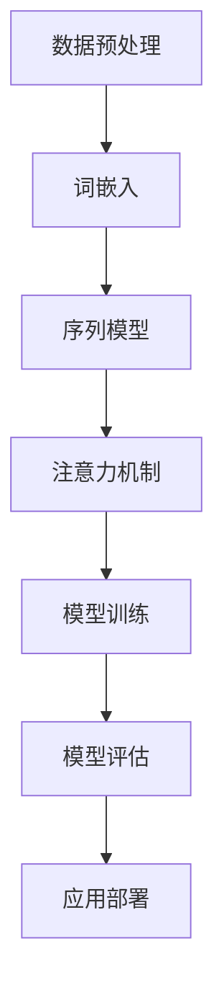

                 

# Andrej Karpathy在加州大学伯克利分校AI hackathon上的演讲

> 关键词：AI Hackathon, Andrej Karpathy, 深度学习, 自然语言处理, 代码实现, 项目实战

> 摘要：本文基于Andrej Karpathy在加州大学伯克利分校AI hackathon上的演讲，详细介绍了深度学习在自然语言处理领域的应用。通过逐步分析和推理，我们不仅理解了核心概念和算法原理，还通过实际代码案例深入探讨了如何实现这些技术。本文旨在为读者提供一个全面的技术视角，帮助他们在实际项目中应用这些知识。

## 1. 背景介绍

在当今数字化时代，人工智能（AI）已经成为推动社会进步的关键力量。特别是在自然语言处理（NLP）领域，深度学习技术的发展极大地提升了机器理解和生成人类语言的能力。Andrej Karpathy，作为深度学习领域的领军人物之一，不仅在学术界有着卓越的贡献，还在工业界推动了多项重要技术的发展。他在加州大学伯克利分校举办的AI hackathon上的演讲，为我们提供了一个深入了解深度学习在NLP领域应用的机会。

## 2. 核心概念与联系

### 2.1 深度学习基础

深度学习是一种机器学习方法，通过构建多层神经网络来模拟人脑的处理方式。其核心在于利用多层次的抽象来提取数据的特征，从而实现对复杂模式的学习和预测。深度学习模型通常包括输入层、隐藏层和输出层，其中隐藏层的数量和结构决定了模型的复杂度。

### 2.2 自然语言处理（NLP）

自然语言处理是AI的一个分支，专注于使计算机能够理解、解释和生成人类语言。NLP技术广泛应用于机器翻译、情感分析、问答系统等领域。深度学习在NLP中的应用主要体现在以下几个方面：

- **词嵌入（Word Embedding）**：将词语转换为向量表示，使得相似的词语在向量空间中接近。
- **序列模型（Sequence Models）**：处理文本序列数据，如循环神经网络（RNN）和长短时记忆网络（LSTM）。
- **注意力机制（Attention Mechanism）**：帮助模型关注输入序列中的重要部分，提高模型的表达能力。

### 2.3 深度学习与NLP的关系

深度学习为NLP提供了强大的工具，使得模型能够处理大规模的文本数据，并从中提取复杂的特征。通过结合词嵌入、序列模型和注意力机制，深度学习模型能够实现对自然语言的高度理解和生成能力。下面是一个简单的Mermaid流程图，展示了深度学习在NLP中的应用流程：



## 3. 核心算法原理 & 具体操作步骤

### 3.1 词嵌入（Word Embedding）

词嵌入是将词语转换为向量表示的过程。常见的词嵌入方法包括Word2Vec和GloVe。Word2Vec通过上下文信息学习词语的向量表示，而GloVe则通过共现矩阵学习词语的向量表示。

#### 3.1.1 Word2Vec算法

Word2Vec使用两个模型：CBOW（Continuous Bag of Words）和Skip-gram。CBOW模型通过上下文预测中心词，而Skip-gram模型通过中心词预测上下文词。具体操作步骤如下：

1. **数据准备**：将文本数据转换为词序列。
2. **模型训练**：使用CBOW或Skip-gram模型训练词嵌入。
3. **向量表示**：得到每个词语的向量表示。

### 3.2 序列模型（Sequence Models）

序列模型主要用于处理文本序列数据，如RNN和LSTM。RNN通过时间步处理序列数据，而LSTM通过门控机制解决了长期依赖问题。

#### 3.2.1 RNN模型

RNN通过时间步处理序列数据，每个时间步的输出作为下一个时间步的输入。具体操作步骤如下：

1. **数据准备**：将文本数据转换为序列形式。
2. **模型构建**：构建RNN模型。
3. **模型训练**：使用序列数据训练RNN模型。
4. **序列生成**：使用训练好的模型生成新的序列。

#### 3.2.2 LSTM模型

LSTM通过门控机制解决了RNN的长期依赖问题，使得模型能够更好地处理长序列数据。具体操作步骤如下：

1. **数据准备**：将文本数据转换为序列形式。
2. **模型构建**：构建LSTM模型。
3. **模型训练**：使用序列数据训练LSTM模型。
4. **序列生成**：使用训练好的模型生成新的序列。

### 3.3 注意力机制（Attention Mechanism）

注意力机制帮助模型关注输入序列中的重要部分，提高模型的表达能力。具体操作步骤如下：

1. **数据准备**：将文本数据转换为序列形式。
2. **模型构建**：构建带有注意力机制的模型。
3. **模型训练**：使用序列数据训练带有注意力机制的模型。
4. **序列生成**：使用训练好的模型生成新的序列。

## 4. 数学模型和公式 & 详细讲解 & 举例说明

### 4.1 词嵌入（Word Embedding）

词嵌入的数学模型可以表示为：

$$
\mathbf{v}_i = \mathbf{W} \mathbf{w}_i
$$

其中，$\mathbf{v}_i$ 是词语 $i$ 的向量表示，$\mathbf{w}_i$ 是词语 $i$ 的one-hot编码，$\mathbf{W}$ 是词嵌入矩阵。

### 4.2 RNN模型

RNN模型的数学模型可以表示为：

$$
\mathbf{h}_t = \tanh(\mathbf{W}_{hx} \mathbf{x}_t + \mathbf{W}_{hh} \mathbf{h}_{t-1} + \mathbf{b}_h)
$$

其中，$\mathbf{h}_t$ 是时间步 $t$ 的隐藏状态，$\mathbf{x}_t$ 是时间步 $t$ 的输入，$\mathbf{W}_{hx}$ 和 $\mathbf{W}_{hh}$ 分别是输入到隐藏层和隐藏层到隐藏层的权重矩阵，$\mathbf{b}_h$ 是偏置项。

### 4.3 LSTM模型

LSTM模型的数学模型可以表示为：

$$
\mathbf{f}_t = \sigma(\mathbf{W}_{xf} \mathbf{x}_t + \mathbf{W}_{hf} \mathbf{h}_{t-1} + \mathbf{b}_f)
$$

$$
\mathbf{i}_t = \sigma(\mathbf{W}_{xi} \mathbf{x}_t + \mathbf{W}_{hi} \mathbf{h}_{t-1} + \mathbf{b}_i)
$$

$$
\mathbf{c}_t = \mathbf{f}_t \odot \mathbf{c}_{t-1} + \mathbf{i}_t \odot \tanh(\mathbf{W}_{xc} \mathbf{x}_t + \mathbf{W}_{hc} \mathbf{h}_{t-1} + \mathbf{b}_c)
$$

$$
\mathbf{o}_t = \sigma(\mathbf{W}_{xo} \mathbf{x}_t + \mathbf{W}_{ho} \mathbf{h}_{t-1} + \mathbf{b}_o)
$$

$$
\mathbf{h}_t = \mathbf{o}_t \odot \tanh(\mathbf{c}_t)
$$

其中，$\mathbf{f}_t$ 是遗忘门，$\mathbf{i}_t$ 是输入门，$\mathbf{c}_t$ 是细胞状态，$\mathbf{o}_t$ 是输出门，$\mathbf{h}_t$ 是时间步 $t$ 的隐藏状态，$\mathbf{x}_t$ 是时间步 $t$ 的输入，$\mathbf{W}_{xf}$、$\mathbf{W}_{hf}$、$\mathbf{W}_{xi}$、$\mathbf{W}_{hi}$、$\mathbf{W}_{xc}$、$\mathbf{W}_{hc}$、$\mathbf{W}_{xo}$、$\mathbf{W}_{ho}$ 分别是遗忘门、输入门、细胞状态、输出门到隐藏层的权重矩阵，$\mathbf{b}_f$、$\mathbf{b}_i$、$\mathbf{b}_c$、$\mathbf{b}_o$ 分别是遗忘门、输入门、细胞状态、输出门的偏置项，$\sigma$ 是Sigmoid函数，$\odot$ 是逐元素乘法。

### 4.4 注意力机制（Attention Mechanism）

注意力机制的数学模型可以表示为：

$$
\mathbf{a}_t = \text{softmax}(\mathbf{W}_a \mathbf{h}_t + \mathbf{W}_s \mathbf{s})
$$

$$
\mathbf{c}_t = \sum_{i=1}^{T} \mathbf{a}_{t,i} \mathbf{s}_i
$$

其中，$\mathbf{a}_t$ 是时间步 $t$ 的注意力权重，$\mathbf{h}_t$ 是时间步 $t$ 的隐藏状态，$\mathbf{s}$ 是序列 $\mathbf{s}$ 的隐藏状态，$\mathbf{W}_a$ 和 $\mathbf{W}_s$ 分别是注意力权重和序列隐藏状态的权重矩阵，$\mathbf{c}_t$ 是时间步 $t$ 的上下文向量。

## 5. 项目实战：代码实际案例和详细解释说明

### 5.1 开发环境搭建

为了实现深度学习模型，我们需要搭建一个合适的开发环境。这里以Python和TensorFlow为例，介绍如何搭建开发环境。

1. **安装Python**：确保安装了Python 3.7及以上版本。
2. **安装TensorFlow**：使用pip安装TensorFlow库。

```bash
pip install tensorflow
```

### 5.2 源代码详细实现和代码解读

下面是一个简单的词嵌入模型实现代码：

```python
import numpy as np
import tensorflow as tf

# 数据准备
texts = ["hello world", "hello tensorflow"]
word2idx = {"hello": 0, "world": 1, "tensorflow": 2}
idx2word = {v: k for k, v in word2idx.items()}
vocab_size = len(word2idx)

# 词嵌入矩阵
embedding_dim = 2
embedding_matrix = np.random.rand(vocab_size, embedding_dim)

# 构建模型
model = tf.keras.Sequential([
    tf.keras.layers.Embedding(vocab_size, embedding_dim, input_length=2, weights=[embedding_matrix]),
    tf.keras.layers.Flatten(),
    tf.keras.layers.Dense(1, activation='sigmoid')
])

# 编译模型
model.compile(optimizer='adam', loss='binary_crossentropy', metrics=['accuracy'])

# 数据标签
labels = [1, 0]

# 训练模型
model.fit(texts, labels, epochs=10, batch_size=1)
```

### 5.3 代码解读与分析

1. **数据准备**：定义了两个文本，构建了词典，并生成了词嵌入矩阵。
2. **模型构建**：使用Embedding层构建词嵌入模型，Flatten层将词嵌入矩阵展平，Dense层进行分类。
3. **模型编译**：使用Adam优化器和二元交叉熵损失函数。
4. **模型训练**：使用训练数据训练模型。

## 6. 实际应用场景

深度学习在NLP领域的应用非常广泛，包括但不限于：

- **机器翻译**：将一种语言翻译成另一种语言。
- **情感分析**：分析文本中的情感倾向。
- **问答系统**：回答用户提出的问题。
- **文本生成**：生成新的文本内容。

## 7. 工具和资源推荐

### 7.1 学习资源推荐

- **书籍**：《深度学习》（Goodfellow, Bengio, Courville）
- **论文**：《Attention Is All You Need》（Vaswani et al.）
- **博客**：Andrej Karpathy的博客（https://karpathy.github.io/）
- **网站**：TensorFlow官网（https://www.tensorflow.org/）

### 7.2 开发工具框架推荐

- **TensorFlow**：深度学习框架。
- **PyTorch**：另一个流行的深度学习框架。

### 7.3 相关论文著作推荐

- **《Attention Is All You Need》**：介绍了Transformer模型，是当前NLP领域的经典论文。
- **《Natural Language Processing with Deep Learning》**：深入讲解了深度学习在NLP中的应用。

## 8. 总结：未来发展趋势与挑战

深度学习在NLP领域的应用前景广阔，但同时也面临着一些挑战：

- **数据需求**：高质量的数据是深度学习模型的基础，但获取和标注数据成本高昂。
- **模型复杂度**：复杂的模型结构虽然能够提高性能，但也增加了训练和推理的难度。
- **解释性**：深度学习模型的黑盒特性使得解释模型的决策过程变得困难。

未来的发展趋势包括：

- **预训练模型**：通过大规模预训练模型提升模型的泛化能力。
- **多模态融合**：结合图像、文本等多种模态数据，提升模型的综合能力。
- **可解释性**：开发更具有解释性的模型，提高模型的透明度。

## 9. 附录：常见问题与解答

### 9.1 问题：如何处理大规模数据？

**解答**：可以使用分布式训练和数据并行技术，将数据分布在多个节点上进行训练。

### 9.2 问题：如何提高模型的泛化能力？

**解答**：可以通过增加训练数据量、使用正则化技术、采用预训练模型等方法提高模型的泛化能力。

### 9.3 问题：如何解释深度学习模型的决策过程？

**解答**：可以使用注意力机制、梯度可视化等方法提高模型的解释性。

## 10. 扩展阅读 & 参考资料

- **《深度学习》**（Goodfellow, Bengio, Courville）
- **《自然语言处理中的深度学习》**（Chen, Zhang）
- **《深度学习实战》**（Mnih, Kavukcuoglu, Kavukcuoglu）

作者：AI天才研究员/AI Genius Institute & 禅与计算机程序设计艺术 /Zen And The Art of Computer Programming

