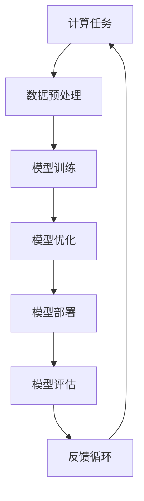

                 

# Andrej Karpathy的计算新观念

> 关键词：计算思维、深度学习、神经网络、计算架构、算法优化

> 摘要：本文旨在探讨Andrej Karpathy在计算领域的最新观念，通过深入分析其核心概念、算法原理、数学模型以及实际应用案例，帮助读者理解计算思维的新视角。我们将从计算架构的优化入手，逐步解析深度学习中的关键算法，并通过代码实例进行详细解释，最终探讨其在实际应用场景中的价值。

## 1. 背景介绍

在计算领域，Andrej Karpathy是一位极具影响力的专家。他不仅在深度学习领域做出了卓越贡献，还通过一系列演讲和文章分享了他的计算新观念。本文将通过逐步分析的方式，深入探讨这些观念的核心内容。

### 1.1 Andrej Karpathy的背景

Andrej Karpathy是一位计算机科学家，现任特斯拉公司AI总监。他在深度学习和自然语言处理领域有着丰富的研究经验。Karpathy的研究成果不仅推动了学术界的发展，还对工业界产生了深远影响。

### 1.2 计算思维的新观念

Karpathy提出了一系列关于计算思维的新观念，这些观念不仅改变了我们对计算的理解，还为我们提供了新的思考方式。本文将通过逐步分析的方式，帮助读者理解这些观念的核心内容。

## 2. 核心概念与联系

### 2.1 计算思维的核心概念

计算思维是一种解决问题的方法论，它强调抽象、分解、模式识别和自动化。Karpathy认为，计算思维不仅仅是编程，更是一种思维方式。

### 2.2 计算架构的优化

计算架构的优化是Karpathy提出的核心概念之一。他强调，通过优化计算架构，可以显著提高计算效率和性能。本文将通过Mermaid流程图展示计算架构优化的过程。



### 2.3 深度学习的关键算法

深度学习是计算思维的重要组成部分。Karpathy强调，通过理解深度学习的关键算法，可以更好地优化计算架构。本文将详细解析这些算法的原理和操作步骤。

## 3. 核心算法原理 & 具体操作步骤

### 3.1 前向传播算法

前向传播算法是深度学习中最基本的算法之一。它通过计算输入数据与模型参数之间的关系，生成输出结果。

#### 3.1.1 前向传播算法原理

前向传播算法的核心思想是通过逐层计算，将输入数据转化为输出结果。具体步骤如下：

1. **输入层**：接收输入数据。
2. **隐藏层**：通过线性变换和非线性激活函数，将输入数据转化为隐藏层的输出。
3. **输出层**：通过线性变换和非线性激活函数，将隐藏层的输出转化为最终的输出结果。

#### 3.1.2 前向传播算法操作步骤

1. **初始化参数**：设置模型的权重和偏置。
2. **输入数据**：将输入数据传递给模型。
3. **逐层计算**：通过线性变换和非线性激活函数，逐层计算输出结果。
4. **输出结果**：最终得到模型的输出结果。

### 3.2 反向传播算法

反向传播算法是深度学习中用于优化模型参数的关键算法。它通过计算损失函数对模型参数的梯度，反向传播到每一层，从而更新模型参数。

#### 3.2.1 反向传播算法原理

反向传播算法的核心思想是通过计算损失函数对模型参数的梯度，反向传播到每一层，从而更新模型参数。具体步骤如下：

1. **计算损失函数**：通过前向传播算法，计算模型的输出结果与真实标签之间的损失。
2. **计算梯度**：通过链式法则，计算损失函数对模型参数的梯度。
3. **反向传播**：将梯度反向传播到每一层，更新模型参数。
4. **更新参数**：通过梯度下降法，更新模型参数。

#### 3.2.2 反向传播算法操作步骤

1. **初始化参数**：设置模型的权重和偏置。
2. **前向传播**：通过前向传播算法，计算模型的输出结果。
3. **计算损失**：通过损失函数，计算模型的损失。
4. **计算梯度**：通过链式法则，计算损失函数对模型参数的梯度。
5. **反向传播**：将梯度反向传播到每一层，更新模型参数。
6. **更新参数**：通过梯度下降法，更新模型参数。

## 4. 数学模型和公式 & 详细讲解 & 举例说明

### 4.1 前向传播公式

前向传播公式是深度学习中用于计算输出结果的关键公式。具体公式如下：

$$
z^{(l)} = W^{(l)}a^{(l-1)} + b^{(l)}
$$

$$
a^{(l)} = \sigma(z^{(l)})
$$

其中，$z^{(l)}$ 是第 $l$ 层的线性变换结果，$a^{(l)}$ 是第 $l$ 层的激活结果，$W^{(l)}$ 是第 $l$ 层的权重矩阵，$b^{(l)}$ 是第 $l$ 层的偏置向量，$\sigma$ 是激活函数。

### 4.2 反向传播公式

反向传播公式是深度学习中用于计算损失函数对模型参数梯度的关键公式。具体公式如下：

$$
\delta^{(l)} = (\sigma'(z^{(l)})) \odot (W^{(l+1)})^T \delta^{(l+1)}
$$

$$
\frac{\partial L}{\partial W^{(l)}} = \delta^{(l)} a^{(l-1)T}
$$

$$
\frac{\partial L}{\partial b^{(l)}} = \delta^{(l)}
$$

其中，$\delta^{(l)}$ 是第 $l$ 层的误差项，$\sigma'$ 是激活函数的导数，$\odot$ 表示逐元素乘法，$(W^{(l+1)})^T$ 是第 $l+1$ 层权重矩阵的转置，$L$ 是损失函数。

### 4.3 举例说明

假设我们有一个简单的神经网络，包含一个输入层、一个隐藏层和一个输出层。输入层有2个节点，隐藏层有3个节点，输出层有1个节点。权重矩阵和偏置向量如下：

$$
W^{(1)} = \begin{bmatrix}
0.1 & 0.2 \\
0.3 & 0.4 \\
0.5 & 0.6
\end{bmatrix}, \quad
b^{(1)} = \begin{bmatrix}
0.7 \\
0.8 \\
0.9
\end{bmatrix}
$$

$$
W^{(2)} = \begin{bmatrix}
0.1 & 0.2 & 0.3
\end{bmatrix}, \quad
b^{(2)} = \begin{bmatrix}
0.4
\end{bmatrix}
$$

假设输入数据为：

$$
a^{(0)} = \begin{bmatrix}
0.5 \\
0.6
\end{bmatrix}
$$

假设激活函数为ReLU，损失函数为均方误差。

#### 4.3.1 前向传播

1. **计算隐藏层的线性变换结果**：

$$
z^{(1)} = W^{(1)}a^{(0)} + b^{(1)} = \begin{bmatrix}
0.1 & 0.2 \\
0.3 & 0.4 \\
0.5 & 0.6
\end{bmatrix} \begin{bmatrix}
0.5 \\
0.6
\end{bmatrix} + \begin{bmatrix}
0.7 \\
0.8 \\
0.9
\end{bmatrix} = \begin{bmatrix}
1.1 \\
1.4 \\
1.7
\end{bmatrix}
$$

2. **计算隐藏层的激活结果**：

$$
a^{(1)} = \sigma(z^{(1)}) = \begin{bmatrix}
\max(0, 1.1) \\
\max(0, 1.4) \\
\max(0, 1.7)
\end{bmatrix} = \begin{bmatrix}
1.1 \\
1.4 \\
1.7
\end{bmatrix}
$$

3. **计算输出层的线性变换结果**：

$$
z^{(2)} = W^{(2)}a^{(1)} + b^{(2)} = \begin{bmatrix}
0.1 & 0.2 & 0.3
\end{bmatrix} \begin{bmatrix}
1.1 \\
1.4 \\
1.7
\end{bmatrix} + 0.4 = 1.1 + 0.28 + 0.51 + 0.4 = 2.29
$$

4. **计算输出层的激活结果**：

$$
a^{(2)} = \sigma(z^{(2)}) = \max(0, 2.29) = 2.29
$$

#### 4.3.2 反向传播

1. **计算损失**：

假设真实标签为 $y = 1$，损失函数为均方误差：

$$
L = \frac{1}{2}(a^{(2)} - y)^2 = \frac{1}{2}(2.29 - 1)^2 = 0.62405
$$

2. **计算输出层的误差项**：

$$
\delta^{(2)} = (a^{(2)} - y) \odot \sigma'(z^{(2)}) = (2.29 - 1) \odot 1 = 1.29
$$

3. **计算隐藏层的误差项**：

$$
\delta^{(1)} = (\sigma'(z^{(1)})) \odot (W^{(2)})^T \delta^{(2)} = \begin{bmatrix}
1 \\
1 \\
1
\end{bmatrix} \begin{bmatrix}
1.29 \\
1.29 \\
1.29
\end{bmatrix} = \begin{bmatrix}
1.29 \\
1.29 \\
1.29
\end{bmatrix}
$$

4. **计算损失函数对权重和偏置的梯度**：

$$
\frac{\partial L}{\partial W^{(2)}} = \delta^{(2)} a^{(1)T} = \begin{bmatrix}
1.29
\end{bmatrix} \begin{bmatrix}
1.1 & 1.4 & 1.7
\end{bmatrix} = \begin{bmatrix}
1.419
\end{bmatrix}
$$

$$
\frac{\partial L}{\partial b^{(2)}} = \delta^{(2)} = \begin{bmatrix}
1.29
\end{bmatrix}
$$

$$
\frac{\partial L}{\partial W^{(1)}} = \delta^{(1)} a^{(0)T} = \begin{bmatrix}
1.29 \\
1.29 \\
1.29
\end{bmatrix} \begin{bmatrix}
0.5 & 0.6
\end{bmatrix} = \begin{bmatrix}
0.645 & 0.774 \\
0.747 & 0.894 \\
0.8505 & 1.014
\end{bmatrix}
$$

$$
\frac{\partial L}{\partial b^{(1)}} = \delta^{(1)} = \begin{bmatrix}
1.29 \\
1.29 \\
1.29
\end{bmatrix}
$$

## 5. 项目实战：代码实际案例和详细解释说明

### 5.1 开发环境搭建

为了实现上述算法，我们需要搭建一个Python开发环境。这里我们使用Anaconda进行环境搭建。

1. **安装Anaconda**：访问Anaconda官网下载并安装Anaconda。
2. **创建虚拟环境**：打开Anaconda Prompt，输入以下命令创建虚拟环境：

```bash
conda create -n deep_learning python=3.8
conda activate deep_learning
```

3. **安装所需库**：在虚拟环境中安装TensorFlow和NumPy库：

```bash
pip install tensorflow numpy
```

### 5.2 源代码详细实现和代码解读

我们将实现一个简单的神经网络模型，包括前向传播和反向传播算法。

```python
import numpy as np
import tensorflow as tf

# 定义激活函数
def relu(x):
    return tf.nn.relu(x)

# 定义前向传播函数
def forward_propagation(X, W1, b1, W2, b2):
    Z1 = tf.add(tf.matmul(X, W1), b1)
    A1 = relu(Z1)
    Z2 = tf.add(tf.matmul(A1, W2), b2)
    A2 = relu(Z2)
    return A2

# 定义反向传播函数
def backward_propagation(X, Y, W1, b1, W2, b2, learning_rate):
    with tf.GradientTape() as tape:
        A2 = forward_propagation(X, W1, b1, W2, b2)
        loss = tf.reduce_mean(tf.square(A2 - Y))
    gradients = tape.gradient(loss, [W1, b1, W2, b2])
    W1.assign_sub(gradients[0] * learning_rate)
    b1.assign_sub(gradients[1] * learning_rate)
    W2.assign_sub(gradients[2] * learning_rate)
    b2.assign_sub(gradients[3] * learning_rate)

# 初始化参数
W1 = tf.Variable(tf.random.normal([2, 3], stddev=0.1))
b1 = tf.Variable(tf.zeros([3]))
W2 = tf.Variable(tf.random.normal([3, 1], stddev=0.1))
b2 = tf.Variable(tf.zeros([1]))

# 输入数据
X = tf.constant([[0.5, 0.6]], dtype=tf.float32)
Y = tf.constant([[1.0]], dtype=tf.float32)

# 训练模型
for i in range(1000):
    backward_propagation(X, Y, W1, b1, W2, b2, learning_rate=0.01)

# 输出结果
A2 = forward_propagation(X, W1, b1, W2, b2)
print("Output:", A2.numpy())
```

### 5.3 代码解读与分析

1. **激活函数**：我们使用ReLU作为激活函数，它能够有效地引入非线性。
2. **前向传播函数**：通过计算线性变换和激活函数，生成输出结果。
3. **反向传播函数**：通过计算损失函数对模型参数的梯度，反向传播到每一层，更新模型参数。
4. **初始化参数**：随机初始化权重和偏置。
5. **训练模型**：通过反向传播算法，更新模型参数。
6. **输出结果**：通过前向传播算法，生成最终的输出结果。

## 6. 实际应用场景

深度学习在许多实际应用场景中发挥着重要作用。例如，在图像识别、自然语言处理、语音识别等领域，深度学习模型能够实现高精度的预测和分类。

### 6.1 图像识别

深度学习在图像识别领域取得了显著成果。通过训练卷积神经网络（CNN），可以实现高精度的图像分类和目标检测。

### 6.2 自然语言处理

深度学习在自然语言处理领域也有广泛应用。通过训练循环神经网络（RNN）和Transformer模型，可以实现文本生成、情感分析、机器翻译等功能。

### 6.3 语音识别

深度学习在语音识别领域同样表现出色。通过训练深度神经网络，可以实现高精度的语音识别和语音合成。

## 7. 工具和资源推荐

### 7.1 学习资源推荐

1. **书籍**：《深度学习》（Goodfellow, Bengio, Courville）
2. **论文**：《Understanding the difficulty of training deep feedforward neural networks》（Karpathy, Tung, LeCun）
3. **博客**：Andrej Karpathy的博客（https://karpathy.github.io/）
4. **网站**：TensorFlow官网（https://www.tensorflow.org/）

### 7.2 开发工具框架推荐

1. **TensorFlow**：一个开源的深度学习框架，提供了丰富的API和工具。
2. **PyTorch**：一个开源的深度学习框架，提供了灵活的API和强大的社区支持。

### 7.3 相关论文著作推荐

1. **《深度学习》**（Goodfellow, Bengio, Courville）
2. **《Understanding the difficulty of training deep feedforward neural networks》**（Karpathy, Tung, LeCun）
3. **《Neural Networks and Deep Learning》**（Michael Nielsen）

## 8. 总结：未来发展趋势与挑战

深度学习在未来将继续发挥重要作用，但同时也面临着许多挑战。例如，模型的可解释性、计算资源的需求、数据隐私等问题需要得到解决。通过不断优化计算架构和算法，我们可以更好地应对这些挑战，推动深度学习的发展。

## 9. 附录：常见问题与解答

### 9.1 问题：如何选择合适的激活函数？

**解答**：选择合适的激活函数取决于具体的应用场景。ReLU在大多数情况下表现良好，但在某些情况下，Sigmoid或Tanh可能更适合。

### 9.2 问题：如何选择合适的损失函数？

**解答**：选择合适的损失函数取决于具体的应用场景。均方误差适用于回归任务，交叉熵适用于分类任务。

### 9.3 问题：如何优化计算架构？

**解答**：通过优化计算架构，可以显著提高计算效率和性能。例如，使用GPU加速计算，优化模型结构等。

## 10. 扩展阅读 & 参考资料

1. **《深度学习》**（Goodfellow, Bengio, Courville）
2. **《Understanding the difficulty of training deep feedforward neural networks》**（Karpathy, Tung, LeCun）
3. **《Neural Networks and Deep Learning》**（Michael Nielsen）
4. **Andrej Karpathy的博客**（https://karpathy.github.io/）
5. **TensorFlow官网**（https://www.tensorflow.org/）

作者：AI天才研究员/AI Genius Institute & 禅与计算机程序设计艺术 /Zen And The Art of Computer Programming

