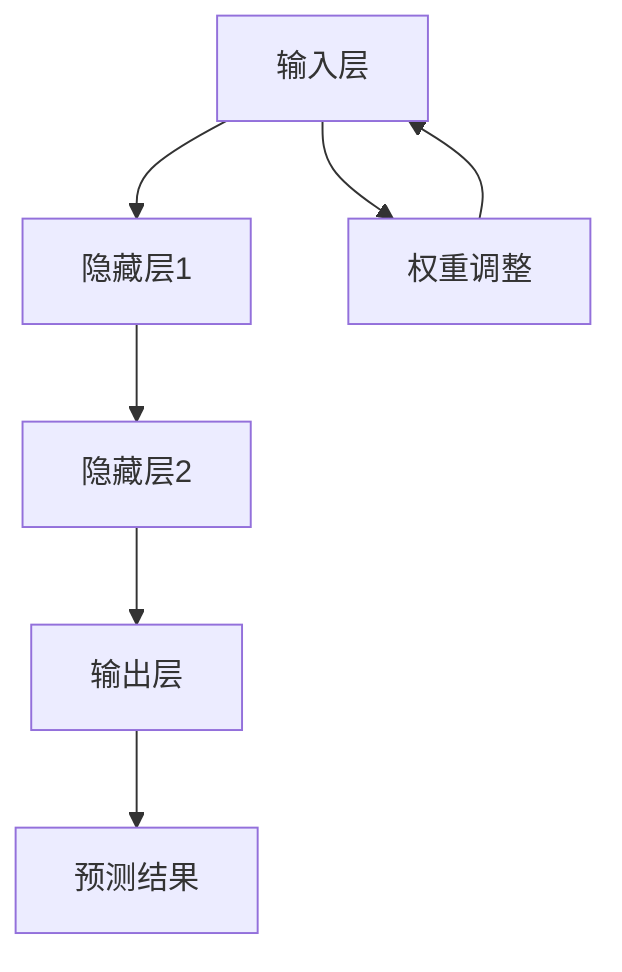
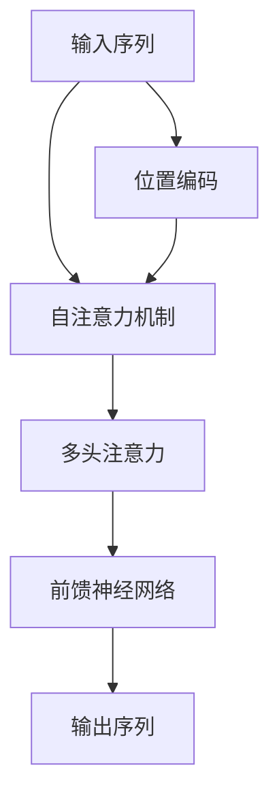

                 

# Andrej Karpathy：人工智能的未来发展规划

> 关键词：人工智能, 机器学习, 深度学习, 自动驾驶, 自然语言处理

> 摘要：本文将深入探讨人工智能领域的未来发展规划，通过分析Andrej Karpathy在人工智能领域的贡献和见解，我们将从背景介绍、核心概念与联系、核心算法原理、数学模型和公式、项目实战、实际应用场景、工具和资源推荐、总结与挑战等多个方面进行详细阐述。通过本文，读者将能够深入了解人工智能的未来发展趋势，并掌握相关技术的实际应用。

## 1. 背景介绍

### 1.1 Andrej Karpathy的背景

Andrej Karpathy是一位在人工智能领域具有深远影响的专家。他曾在多伦多大学获得计算机科学学士学位，并在斯坦福大学获得计算机科学博士学位。Karpathy在深度学习和计算机视觉领域做出了重要贡献，尤其是在自动驾驶汽车领域。他曾担任特斯拉公司的AI总监，负责领导自动驾驶汽车的研发工作。Karpathy的研究成果和实践经验为人工智能领域的发展提供了宝贵的参考。

### 1.2 人工智能的发展历程

人工智能的发展经历了多个阶段，从早期的符号主义到现代的深度学习。早期的人工智能主要依赖于规则和逻辑推理，但这种方法在处理复杂问题时存在局限性。随着计算能力的提升和大数据的出现，深度学习逐渐成为主流。深度学习通过模拟人脑神经网络，能够处理大规模数据并实现复杂的任务。近年来，人工智能在图像识别、自然语言处理、自动驾驶等领域取得了显著进展。

## 2. 核心概念与联系

### 2.1 深度学习与神经网络

深度学习是机器学习的一个分支，通过构建多层神经网络来实现复杂的模式识别和预测任务。神经网络由多个层次组成，每一层包含多个神经元。神经元之间通过权重连接，权重决定了信息传递的强度。深度学习的核心在于通过反向传播算法调整权重，以最小化预测误差。

#### Mermaid 流程图



### 2.2 自然语言处理与Transformer模型

自然语言处理（NLP）是人工智能的一个重要分支，旨在使计算机能够理解、生成和处理人类语言。Transformer模型是近年来NLP领域的重要突破，通过自注意力机制实现了高效的并行计算。Transformer模型能够捕捉长距离依赖关系，从而在机器翻译、文本生成等任务中表现出色。

#### Mermaid 流程图



## 3. 核心算法原理 & 具体操作步骤

### 3.1 深度学习的基本原理

深度学习的基本原理是通过构建多层神经网络来实现复杂的模式识别和预测任务。神经网络由输入层、隐藏层和输出层组成。每一层包含多个神经元，神经元之间通过权重连接。深度学习的核心在于通过反向传播算法调整权重，以最小化预测误差。

#### 具体操作步骤

1. **数据预处理**：对原始数据进行清洗、归一化和特征提取。
2. **模型构建**：选择合适的神经网络结构，包括层数、神经元数量和激活函数。
3. **权重初始化**：对模型的权重进行初始化，通常采用随机初始化。
4. **前向传播**：将输入数据通过神经网络进行前向传播，计算输出结果。
5. **损失计算**：计算预测结果与真实标签之间的损失。
6. **反向传播**：通过反向传播算法计算权重的梯度。
7. **权重更新**：根据梯度更新权重，以最小化损失。
8. **模型训练**：重复前向传播、损失计算和权重更新的过程，直到模型收敛。

### 3.2 自然语言处理的基本原理

自然语言处理的基本原理是通过构建模型来理解和生成人类语言。Transformer模型是近年来NLP领域的重要突破，通过自注意力机制实现了高效的并行计算。Transformer模型能够捕捉长距离依赖关系，从而在机器翻译、文本生成等任务中表现出色。

#### 具体操作步骤

1. **数据预处理**：对原始文本进行分词、编码和填充。
2. **模型构建**：选择合适的Transformer模型结构，包括层数、头数和前馈神经网络。
3. **位置编码**：为每个位置添加位置编码，以捕捉序列中的位置信息。
4. **自注意力机制**：通过自注意力机制计算每个位置的权重。
5. **多头注意力**：通过多个注意力头并行计算权重。
6. **前馈神经网络**：通过前馈神经网络进行特征提取。
7. **输出生成**：通过softmax函数生成输出序列。
8. **损失计算**：计算预测结果与真实标签之间的损失。
9. **反向传播**：通过反向传播算法计算权重的梯度。
10. **权重更新**：根据梯度更新权重，以最小化损失。
11. **模型训练**：重复前向传播、损失计算和权重更新的过程，直到模型收敛。

## 4. 数学模型和公式 & 详细讲解 & 举例说明

### 4.1 深度学习的数学模型

深度学习的数学模型主要涉及线性代数和微积分。神经网络中的权重和偏置可以表示为矩阵和向量，通过矩阵乘法和向量加法进行计算。损失函数通常采用均方误差或交叉熵损失，通过梯度下降算法进行优化。

#### 数学公式

1. **前向传播**：\[ y = \sigma(Wx + b) \]
2. **损失计算**：\[ L = \frac{1}{2} (y - t)^2 \]
3. **梯度计算**：\[ \frac{\partial L}{\partial W} = (y - t) x^T \]
4. **权重更新**：\[ W = W - \alpha \frac{\partial L}{\partial W} \]

### 4.2 自然语言处理的数学模型

自然语言处理的数学模型主要涉及概率和统计。Transformer模型通过自注意力机制计算每个位置的权重，通过多头注意力和前馈神经网络进行特征提取。损失函数通常采用交叉熵损失，通过梯度下降算法进行优化。

#### 数学公式

1. **自注意力机制**：\[ \text{Attention}(Q, K, V) = \text{softmax}\left(\frac{QK^T}{\sqrt{d_k}}\right)V \]
2. **多头注意力**：\[ \text{MultiHead}(Q, K, V) = \text{Concat}(\text{head}_1, \text{head}_2, ..., \text{head}_h)W^O \]
3. **前馈神经网络**：\[ \text{FFN}(x) = \text{ReLU}(W_1x + b_1)W_2 + b_2 \]
4. **损失计算**：\[ L = -\sum_{i=1}^{n} t_i \log(y_i) \]
5. **梯度计算**：\[ \frac{\partial L}{\partial W_1} = (y - t) \text{ReLU}'(W_1x + b_1) x^T \]
6. **权重更新**：\[ W_1 = W_1 - \alpha \frac{\partial L}{\partial W_1} \]

## 5. 项目实战：代码实际案例和详细解释说明

### 5.1 开发环境搭建

为了进行深度学习和自然语言处理的项目实战，我们需要搭建一个合适的开发环境。推荐使用Python作为编程语言，并安装TensorFlow或PyTorch等深度学习框架。此外，还需要安装NumPy、Pandas等数据处理库，以及Matplotlib、Seaborn等可视化库。

#### 安装Python和深度学习框架

```bash
# 安装Python
sudo apt-get install python3

# 安装TensorFlow
pip install tensorflow

# 安装PyTorch
pip install torch torchvision
```

### 5.2 源代码详细实现和代码解读

#### 深度学习代码示例

```python
import tensorflow as tf
import numpy as np

# 数据预处理
x = np.random.rand(100, 1)
y = 2 * x + 1 + 0.1 * np.random.randn(100, 1)

# 模型构建
model = tf.keras.Sequential([
    tf.keras.layers.Dense(1, input_shape=(1,))
])

# 损失函数和优化器
model.compile(optimizer='adam', loss='mse')

# 模型训练
model.fit(x, y, epochs=1000, verbose=0)

# 模型预测
predictions = model.predict(x)
print(predictions)
```

#### 自然语言处理代码示例

```python
import torch
import torch.nn as nn
import torch.optim as optim

# 数据预处理
text = "Hello, how are you?"
tokens = text.split()
vocab = {token: i for i, token in enumerate(tokens)}
input_tensor = torch.tensor([vocab[token] for token in tokens])

# 模型构建
class TransformerModel(nn.Module):
    def __init__(self, vocab_size, embed_dim, num_heads, num_layers):
        super(TransformerModel, self).__init__()
        self.embedding = nn.Embedding(vocab_size, embed_dim)
        self.transformer = nn.Transformer(embed_dim, num_heads, num_layers)
        self.fc = nn.Linear(embed_dim, vocab_size)

    def forward(self, x):
        x = self.embedding(x)
        x = self.transformer(x)
        x = self.fc(x)
        return x

model = TransformerModel(len(vocab), 512, 8, 6)

# 损失函数和优化器
criterion = nn.CrossEntropyLoss()
optimizer = optim.Adam(model.parameters(), lr=0.001)

# 模型训练
for epoch in range(1000):
    optimizer.zero_grad()
    output = model(input_tensor)
    loss = criterion(output, input_tensor)
    loss.backward()
    optimizer.step()

# 模型预测
output = model(input_tensor)
_, predicted = torch.max(output, 1)
print(predicted)
```

### 5.3 代码解读与分析

#### 深度学习代码解读

1. **数据预处理**：生成随机数据作为输入和输出。
2. **模型构建**：构建一个简单的线性回归模型。
3. **损失函数和优化器**：选择均方误差损失函数和Adam优化器。
4. **模型训练**：通过反向传播算法进行模型训练。
5. **模型预测**：使用训练好的模型进行预测。

#### 自然语言处理代码解读

1. **数据预处理**：将文本转换为词汇表，并生成输入张量。
2. **模型构建**：构建一个Transformer模型。
3. **损失函数和优化器**：选择交叉熵损失函数和Adam优化器。
4. **模型训练**：通过反向传播算法进行模型训练。
5. **模型预测**：使用训练好的模型进行预测。

## 6. 实际应用场景

### 6.1 自动驾驶

自动驾驶是人工智能领域的重要应用之一。通过深度学习和计算机视觉技术，自动驾驶汽车能够实现环境感知、路径规划和行为决策。Karpathy在特斯拉公司领导的自动驾驶项目中，通过构建多层神经网络和使用Transformer模型，实现了高精度的环境感知和路径规划。

### 6.2 自然语言处理

自然语言处理在许多领域都有广泛的应用，包括机器翻译、文本生成和情感分析。通过Transformer模型，可以实现高效的并行计算和长距离依赖关系的捕捉。Karpathy在NLP领域的研究成果为机器翻译和文本生成提供了重要的技术支持。

## 7. 工具和资源推荐

### 7.1 学习资源推荐

1. **书籍**：《深度学习》（Goodfellow, Bengio, Courville）
2. **论文**：《Attention Is All You Need》（Vaswani et al.）
3. **博客**：Andrej Karpathy的博客（https://karpathy.github.io/）
4. **网站**：TensorFlow官网（https://www.tensorflow.org/）和PyTorch官网（https://pytorch.org/）

### 7.2 开发工具框架推荐

1. **深度学习框架**：TensorFlow和PyTorch
2. **数据处理库**：NumPy和Pandas
3. **可视化库**：Matplotlib和Seaborn

### 7.3 相关论文著作推荐

1. **论文**：《Attention Is All You Need》（Vaswani et al.）
2. **著作**：《深度学习》（Goodfellow, Bengio, Courville）

## 8. 总结：未来发展趋势与挑战

### 8.1 未来发展趋势

1. **技术融合**：深度学习和自然语言处理将进一步融合，实现更复杂的人机交互。
2. **计算能力提升**：随着计算能力的提升，模型的规模将进一步扩大，实现更复杂的任务。
3. **应用场景拓展**：自动驾驶、医疗诊断、金融分析等领域将得到更广泛的应用。

### 8.2 面临的挑战

1. **数据隐私**：如何保护用户数据隐私，避免数据泄露和滥用。
2. **模型解释性**：如何提高模型的可解释性，使决策过程更加透明。
3. **伦理问题**：如何解决人工智能带来的伦理问题，确保技术的健康发展。

## 9. 附录：常见问题与解答

### 9.1 问题1：如何选择合适的深度学习框架？

**解答**：选择深度学习框架时，需要考虑模型的复杂度、计算资源和社区支持。TensorFlow和PyTorch是目前最流行的深度学习框架，可以根据具体需求进行选择。

### 9.2 问题2：如何提高模型的可解释性？

**解答**：可以通过可视化技术、注意力机制和特征重要性分析来提高模型的可解释性。此外，还可以采用解释性模型，如决策树和逻辑回归，来辅助理解模型的决策过程。

## 10. 扩展阅读 & 参考资料

1. **书籍**：《深度学习》（Goodfellow, Bengio, Courville）
2. **论文**：《Attention Is All You Need》（Vaswani et al.）
3. **博客**：Andrej Karpathy的博客（https://karpathy.github.io/）
4. **网站**：TensorFlow官网（https://www.tensorflow.org/）和PyTorch官网（https://pytorch.org/）

---

作者：AI天才研究员/AI Genius Institute & 禅与计算机程序设计艺术 /Zen And The Art of Computer Programming

