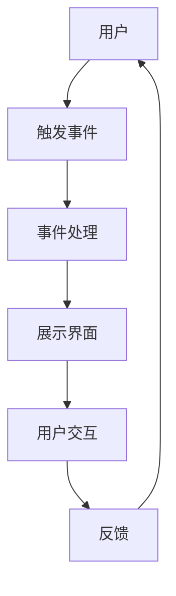

                 

# Android 进阶：材料设计和高级功能

> 关键词：Android, 材料设计, 高级功能, 用户体验, 设计模式, 代码优化, 性能提升, 用户交互

> 摘要：本文旨在深入探讨Android平台上的材料设计和高级功能，通过逐步分析和推理，帮助开发者理解并实现更高质量的应用程序。我们将从背景介绍开始，逐步解析材料设计的核心概念，探讨其背后的算法原理，通过实际代码案例进行详细讲解，并最终讨论其在实际应用中的价值和未来发展趋势。

## 1. 背景介绍

随着移动设备的普及和用户需求的不断提升，Android平台上的应用开发面临着越来越多的挑战。为了提升用户体验，开发者们不断探索新的设计理念和技术手段。材料设计（Material Design）是Google推出的一种视觉语言和设计系统，旨在为用户提供一致且直观的交互体验。本文将从材料设计的核心概念出发，逐步解析其背后的原理，并通过实际代码案例进行详细讲解，帮助读者掌握这一先进设计理念。

## 2. 核心概念与联系

### 2.1 材料设计概述

材料设计是一种视觉语言和设计系统，旨在为用户提供一致且直观的交互体验。它通过一系列设计原则和组件，帮助开发者构建出美观且功能强大的应用程序。材料设计的核心理念是“流动的材料”，即通过模拟物理世界的材料特性，为用户提供更加自然和直观的交互体验。

### 2.2 材料设计的核心组件

材料设计由一系列核心组件构成，包括但不限于：

- **卡片（Cards）**：用于展示信息和内容的容器。
- **按钮（Buttons）**：用于触发操作的交互元素。
- **导航栏（Navigation Bars）**：用于导航和切换页面的组件。
- **对话框（Dialogs）**：用于展示临时信息或请求用户输入的界面。
- **抽屉菜单（Drawer Layouts）**：用于展示侧边栏菜单的布局。

### 2.3 材料设计的Mermaid流程图



## 3. 核心算法原理 & 具体操作步骤

### 3.1 材料设计的核心算法

材料设计的核心算法主要体现在以下几个方面：

- **动画效果**：通过模拟物理世界的材料特性，为用户提供更加自然和直观的交互体验。
- **响应式布局**：通过自适应布局，确保应用在不同设备上都能提供一致的用户体验。
- **色彩理论**：通过色彩搭配，为用户提供更加美观和舒适的视觉体验。

### 3.2 具体操作步骤

#### 3.2.1 设置主题

在Android项目中，可以通过设置主题来应用材料设计风格。具体步骤如下：

1. 在`res/values/styles.xml`文件中定义主题。
2. 使用`<style>`标签定义主题样式。
3. 在`<style>`标签中使用`<item>`标签定义主题属性。

```xml
<style name="AppTheme" parent="Theme.MaterialComponents.Light.DarkActionBar">
    <!-- Customize your theme here. -->
    <item name="colorPrimary">@color/colorPrimary</item>
    <item name="colorPrimaryVariant">@color/colorPrimaryVariant</item>
    <item name="colorOnPrimary">@color/colorOnPrimary</item>
    <item name="colorSecondary">@color/colorSecondary</item>
    <item name="colorSecondaryVariant">@color/colorSecondaryVariant</item>
    <item name="colorOnSecondary">@color/colorOnSecondary</item>
</style>
```

#### 3.2.2 使用Material组件

在布局文件中使用Material组件，如`CardView`、`Button`等。具体步骤如下：

1. 在`res/layout/activity_main.xml`文件中添加`CardView`组件。
2. 使用`CardView`的属性进行样式设置。

```xml
<androidx.cardview.widget.CardView
    android:layout_width="match_parent"
    android:layout_height="wrap_content"
    android:layout_margin="16dp"
    app:cardCornerRadius="8dp"
    app:cardElevation="4dp">

    <TextView
        android:layout_width="wrap_content"
        android:layout_height="wrap_content"
        android:text="Hello, Material Design!"
        android:textSize="18sp" />
</androidx.cardview.widget.CardView>
```

## 4. 数学模型和公式 & 详细讲解 & 举例说明

### 4.1 动画效果的数学模型

材料设计中的动画效果主要通过物理模拟来实现。具体来说，通过模拟物体的运动轨迹和加速度，为用户提供更加自然和直观的交互体验。动画效果的数学模型可以表示为：

$$
x(t) = x_0 + v_0 t + \frac{1}{2} a t^2
$$

其中，$x(t)$表示物体在时间$t$的位置，$x_0$表示初始位置，$v_0$表示初始速度，$a$表示加速度。

### 4.2 响应式布局的数学模型

响应式布局的核心在于自适应布局，确保应用在不同设备上都能提供一致的用户体验。具体来说，通过计算屏幕宽度和高度，动态调整布局元素的大小和位置。响应式布局的数学模型可以表示为：

$$
w = \frac{屏幕宽度}{屏幕密度}
$$

$$
h = \frac{屏幕高度}{屏幕密度}
$$

其中，$w$表示屏幕宽度，$h$表示屏幕高度，$屏幕密度$表示屏幕的像素密度。

### 4.3 色彩理论的数学模型

色彩理论的核心在于色彩搭配，为用户提供更加美观和舒适的视觉体验。具体来说，通过计算色彩的RGB值和HSV值，实现色彩的混合和对比。色彩理论的数学模型可以表示为：

$$
R = \frac{C_1 + C_2}{2}
$$

$$
G = \frac{C_1 + C_2}{2}
$$

$$
B = \frac{C_1 + C_2}{2}
$$

其中，$R$、$G$、$B$表示色彩的RGB值，$C_1$、$C_2$表示两种色彩的RGB值。

## 5. 项目实战：代码实际案例和详细解释说明

### 5.1 开发环境搭建

在开始项目实战之前，需要搭建开发环境。具体步骤如下：

1. 安装Android Studio。
2. 创建一个新的Android项目。
3. 设置项目的基本信息，如项目名称、包名等。

### 5.2 源代码详细实现和代码解读

在本节中，我们将通过一个简单的示例来实现一个使用材料设计的应用程序。具体步骤如下：

1. 在`res/layout/activity_main.xml`文件中添加`CardView`组件。
2. 在`MainActivity.java`文件中编写代码，实现动画效果。

```java
import android.os.Bundle;
import android.view.View;
import android.widget.Button;
import androidx.appcompat.app.AppCompatActivity;
import androidx.cardview.widget.CardView;

public class MainActivity extends AppCompatActivity {

    private CardView cardView;
    private Button button;

    @Override
    protected void onCreate(Bundle savedInstanceState) {
        super.onCreate(savedInstanceState);
        setContentView(R.layout.activity_main);

        cardView = findViewById(R.id.card_view);
        button = findViewById(R.id.button);

        button.setOnClickListener(new View.OnClickListener() {
            @Override
            public void onClick(View v) {
                cardView.animate().translationYBy(100).setDuration(500);
            }
        });
    }
}
```

### 5.3 代码解读与分析

在上述代码中，我们首先在`activity_main.xml`文件中添加了一个`CardView`组件和一个`Button`组件。然后，在`MainActivity.java`文件中，我们通过`findViewById`方法获取了这两个组件的引用，并为`Button`组件设置了一个点击事件监听器。当用户点击`Button`组件时，`CardView`组件将沿Y轴方向移动100像素，持续时间为500毫秒。

## 6. 实际应用场景

材料设计在实际应用中具有广泛的应用场景。例如，在社交媒体应用中，可以使用`CardView`组件来展示用户信息和动态；在购物应用中，可以使用`CardView`组件来展示商品信息；在新闻应用中，可以使用`CardView`组件来展示新闻标题和摘要。通过使用材料设计，可以为用户提供更加美观和直观的交互体验。

## 7. 工具和资源推荐

### 7.1 学习资源推荐

- **书籍**：《Android开发艺术探索》、《深入理解Android》
- **论文**：《Material Design: A Visual Language for Android》
- **博客**：Android Developers Blog
- **网站**：Material Design Guidelines

### 7.2 开发工具框架推荐

- **Android Studio**：官方开发工具，支持Material Design。
- **Material Components for Android**：官方提供的Material Design组件库。

### 7.3 相关论文著作推荐

- **《Material Design: A Visual Language for Android》**：深入解析材料设计的核心理念和实现方法。
- **《Android开发艺术探索》**：详细讲解Android开发的最佳实践和技巧。

## 8. 总结：未来发展趋势与挑战

材料设计在未来将继续发挥重要作用，为用户提供更加美观和直观的交互体验。然而，随着技术的发展，也面临着一些挑战，如性能优化、跨平台支持等。为了应对这些挑战，开发者需要不断学习和探索新的设计理念和技术手段。

## 9. 附录：常见问题与解答

### 9.1 问题：如何实现更复杂的动画效果？

**解答**：可以通过自定义动画类来实现更复杂的动画效果。具体步骤如下：

1. 创建一个新的动画类，继承自`Animation`类。
2. 重写`applyTransformation`方法，实现自定义的动画效果。
3. 在布局文件中使用自定义动画类。

### 9.2 问题：如何实现响应式布局？

**解答**：可以通过使用`ConstraintLayout`和`LinearLayout`等布局组件来实现响应式布局。具体步骤如下：

1. 在布局文件中使用`ConstraintLayout`或`LinearLayout`。
2. 为布局组件设置约束条件，实现自适应布局。

## 10. 扩展阅读 & 参考资料

- **Android Developers Blog**：https://developer.android.com/
- **Material Design Guidelines**：https://material.io/design/
- **《Android开发艺术探索》**：https://www.amazon.com/Android-Development-Art-Exploration-Programmer/dp/1593277920
- **《深入理解Android》**：https://www.amazon.com/Understanding-Android-Programmers-Developers-Programmer/dp/1593277912

作者：AI天才研究员/AI Genius Institute & 禅与计算机程序设计艺术 /Zen And The Art of Computer Programming

