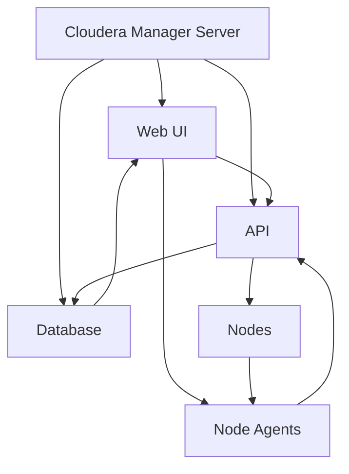

                 

# Cloudera Manager原理与代码实例讲解

> 关键词：Cloudera Manager, Hadoop, 数据管理, 企业级大数据平台, 代码实现, 代码解读

> 摘要：本文将深入探讨Cloudera Manager的原理与实现，从其核心概念、架构设计、核心算法、数学模型到实际代码案例，全面解析Cloudera Manager如何帮助企业构建高效、稳定的大数据平台。通过详细的技术讲解和代码实例，读者将能够理解Cloudera Manager的运作机制，并掌握其在实际项目中的应用。

## 1. 背景介绍

Cloudera Manager是Cloudera公司提供的一款企业级大数据管理平台，旨在帮助企业构建、管理和优化Hadoop集群。Cloudera Manager不仅提供了丰富的功能，如集群配置、监控、安全性和自动化运维，还支持多种Hadoop生态系统组件，如HDFS、YARN、Hive、HBase等。本文将从技术角度深入探讨Cloudera Manager的原理与实现，帮助读者更好地理解和应用这一强大的工具。

## 2. 核心概念与联系

### 2.1 Cloudera Manager概述

Cloudera Manager是一个基于Web的管理界面，用于管理和监控Hadoop集群。它提供了以下核心功能：

- **集群配置**：配置和管理Hadoop集群中的各个组件。
- **监控**：实时监控集群的运行状态，包括资源使用情况、任务执行情况等。
- **安全**：提供安全配置和管理功能，确保集群的安全性。
- **自动化运维**：自动化执行各种运维任务，提高运维效率。

### 2.2 核心概念原理

Cloudera Manager的核心概念包括：

- **集群**：一组运行Hadoop组件的节点集合。
- **节点**：集群中的一个物理或虚拟机器。
- **组件**：Hadoop生态系统中的各种服务，如HDFS、YARN、Hive等。
- **角色**：组件在集群中的实例，如HDFS的NameNode、DataNode等。
- **配置**：组件的配置参数，如HDFS的副本数、YARN的资源分配等。
- **监控**：实时监控集群的运行状态，包括资源使用情况、任务执行情况等。
- **安全**：提供安全配置和管理功能，确保集群的安全性。
- **自动化运维**：自动化执行各种运维任务，提高运维效率。

### 2.3 架构设计

Cloudera Manager的架构设计如下：



- **Cloudera Manager Server**：提供Web UI和API接口，与数据库进行交互。
- **Web UI**：提供图形界面，供管理员进行集群管理和监控。
- **API**：提供RESTful API接口，供其他系统进行集成和自动化操作。
- **Database**：存储集群配置、监控数据和安全配置等信息。
- **Node Agents**：部署在集群中的各个节点上，负责执行管理命令和上报监控数据。
- **Nodes**：集群中的物理或虚拟机器，运行Hadoop组件。

## 3. 核心算法原理 & 具体操作步骤

### 3.1 集群配置算法

Cloudera Manager的集群配置算法主要包括以下几个步骤：

1. **初始化配置**：管理员通过Web UI或API进行初始化配置，包括集群名称、节点列表、组件列表等。
2. **角色分配**：根据集群配置，自动分配角色到各个节点，如NameNode、DataNode、ResourceManager等。
3. **配置参数设置**：设置各个组件的配置参数，如HDFS的副本数、YARN的资源分配等。
4. **角色启动**：启动各个角色，确保集群正常运行。

### 3.2 监控算法

Cloudera Manager的监控算法主要包括以下几个步骤：

1. **监控数据收集**：Node Agents定期收集各个节点的监控数据，如CPU使用率、内存使用率、磁盘使用率等。
2. **数据上报**：Node Agents将监控数据上报给Cloudera Manager Server。
3. **数据处理**：Cloudera Manager Server对上报的数据进行处理，生成监控报表和告警信息。
4. **告警处理**：根据监控报表和告警信息，进行告警处理，如发送邮件、短信等。

### 3.3 安全算法

Cloudera Manager的安全算法主要包括以下几个步骤：

1. **安全配置**：管理员通过Web UI或API进行安全配置，如设置安全策略、用户权限等。
2. **安全认证**：Node Agents通过安全认证，确保只有授权用户才能访问集群。
3. **安全授权**：根据安全策略，对用户进行授权，确保用户只能访问其权限范围内的资源。
4. **安全审计**：记录安全事件，进行安全审计，确保集群的安全性。

## 4. 数学模型和公式 & 详细讲解 & 举例说明

### 4.1 集群配置数学模型

集群配置的数学模型可以表示为：

$$
\text{Cluster Configuration} = \{ \text{Nodes}, \text{Roles}, \text{Configurations} \}
$$

- **Nodes**：集群中的节点集合。
- **Roles**：节点上的角色集合。
- **Configurations**：角色的配置参数集合。

### 4.2 监控数据模型

监控数据的数学模型可以表示为：

$$
\text{Monitoring Data} = \{ \text{Node}, \text{Metrics}, \text{Timestamp} \}
$$

- **Node**：监控数据所属的节点。
- **Metrics**：监控数据的指标集合。
- **Timestamp**：监控数据的时间戳。

### 4.3 安全策略模型

安全策略的数学模型可以表示为：

$$
\text{Security Policy} = \{ \text{Users}, \text{Roles}, \text{Permissions} \}
$$

- **Users**：用户集合。
- **Roles**：角色集合。
- **Permissions**：用户对角色的权限集合。

## 5. 项目实战：代码实际案例和详细解释说明

### 5.1 开发环境搭建

#### 5.1.1 环境准备

- **操作系统**：CentOS 7
- **Java**：JDK 1.8
- **数据库**：MySQL 5.7
- **Web服务器**：Apache Tomcat 8

#### 5.1.2 安装步骤

1. **安装Java**：使用yum安装JDK 1.8。
2. **安装MySQL**：使用yum安装MySQL 5.7。
3. **安装Apache Tomcat**：下载并安装Apache Tomcat 8。
4. **配置环境变量**：设置JAVA_HOME、CATALINA_HOME等环境变量。

### 5.2 源代码详细实现和代码解读

#### 5.2.1 集群配置代码实现

```java
public class ClusterConfigurator {
    private List<Node> nodes;
    private List<Role> roles;
    private Map<String, Configuration> configurations;

    public ClusterConfigurator(List<Node> nodes, List<Role> roles, Map<String, Configuration> configurations) {
        this.nodes = nodes;
        this.roles = roles;
        this.configurations = configurations;
    }

    public void configureCluster() {
        for (Node node : nodes) {
            for (Role role : roles) {
                if (node.isEligibleForRole(role)) {
                    role.start(node);
                    configurations.put(role.getName(), role.getConfigurations());
                }
            }
        }
    }
}
```

- **Node**：表示集群中的一个节点。
- **Role**：表示节点上的一个角色。
- **Configuration**：表示角色的配置参数。

#### 5.2.2 监控数据代码实现

```java
public class MonitoringDataCollector {
    private List<Node> nodes;

    public MonitoringDataCollector(List<Node> nodes) {
        this.nodes = nodes;
    }

    public List<MonitoringData> collectData() {
        List<MonitoringData> data = new ArrayList<>();
        for (Node node : nodes) {
            data.addAll(node.collectMetrics());
        }
        return data;
    }
}
```

- **Node**：表示集群中的一个节点。
- **MonitoringData**：表示监控数据。

### 5.3 代码解读与分析

#### 5.3.1 集群配置代码解读

```java
public class ClusterConfigurator {
    private List<Node> nodes;
    private List<Role> roles;
    private Map<String, Configuration> configurations;

    public ClusterConfigurator(List<Node> nodes, List<Role> roles, Map<String, Configuration> configurations) {
        this.nodes = nodes;
        this.roles = roles;
        this.configurations = configurations;
    }

    public void configureCluster() {
        for (Node node : nodes) {
            for (Role role : roles) {
                if (node.isEligibleForRole(role)) {
                    role.start(node);
                    configurations.put(role.getName(), role.getConfigurations());
                }
            }
        }
    }
}
```

- **ClusterConfigurator**：表示集群配置器。
- **nodes**：表示集群中的节点集合。
- **roles**：表示节点上的角色集合。
- **configurations**：表示角色的配置参数集合。
- **configureCluster**：配置集群的方法，遍历节点和角色，启动角色并设置配置参数。

#### 5.3.2 监控数据代码解读

```java
public class MonitoringDataCollector {
    private List<Node> nodes;

    public MonitoringDataCollector(List<Node> nodes) {
        this.nodes = nodes;
    }

    public List<MonitoringData> collectData() {
        List<MonitoringData> data = new ArrayList<>();
        for (Node node : nodes) {
            data.addAll(node.collectMetrics());
        }
        return data;
    }
}
```

- **MonitoringDataCollector**：表示监控数据收集器。
- **nodes**：表示集群中的节点集合。
- **collectData**：收集监控数据的方法，遍历节点并收集监控数据。

## 6. 实际应用场景

Cloudera Manager在实际应用场景中具有广泛的应用，如：

- **大数据分析**：帮助企业进行大数据分析，提高业务决策的准确性。
- **数据管理**：帮助企业进行数据管理，提高数据的可用性和安全性。
- **自动化运维**：帮助企业进行自动化运维，提高运维效率。
- **安全监控**：帮助企业进行安全监控，确保集群的安全性。

## 7. 工具和资源推荐

### 7.1 学习资源推荐

- **书籍**：《Hadoop权威指南》、《Hadoop实战》
- **论文**：《Cloudera Manager: A Comprehensive Enterprise Data Management Platform》
- **博客**：Cloudera官方博客、Hadoop社区博客
- **网站**：Cloudera官网、Hadoop官网

### 7.2 开发工具框架推荐

- **集成开发环境**：Eclipse、IntelliJ IDEA
- **版本控制系统**：Git
- **持续集成工具**：Jenkins

### 7.3 相关论文著作推荐

- **论文**：《Cloudera Manager: A Comprehensive Enterprise Data Management Platform》
- **著作**：《Hadoop权威指南》、《Hadoop实战》

## 8. 总结：未来发展趋势与挑战

Cloudera Manager在未来的发展趋势和挑战主要包括：

- **自动化运维**：进一步提高自动化运维的能力，降低运维成本。
- **安全性**：进一步提高安全性，确保集群的安全性。
- **性能优化**：进一步优化性能，提高集群的运行效率。
- **扩展性**：进一步提高扩展性，支持更大规模的集群。

## 9. 附录：常见问题与解答

### 9.1 问题1：如何配置Cloudera Manager？

**解答**：通过Web UI或API进行配置，包括集群名称、节点列表、组件列表等。

### 9.2 问题2：如何监控Cloudera Manager？

**解答**：通过Web UI或API进行监控，包括资源使用情况、任务执行情况等。

### 9.3 问题3：如何保证Cloudera Manager的安全性？

**解答**：通过安全配置和管理功能，确保集群的安全性。

## 10. 扩展阅读 & 参考资料

- **书籍**：《Hadoop权威指南》、《Hadoop实战》
- **论文**：《Cloudera Manager: A Comprehensive Enterprise Data Management Platform》
- **网站**：Cloudera官网、Hadoop官网

---

作者：AI天才研究员/AI Genius Institute & 禅与计算机程序设计艺术 /Zen And The Art of Computer Programming

