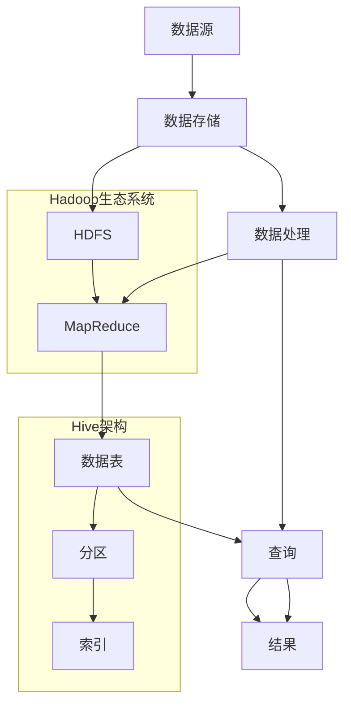

                 

# Hive原理与代码实例讲解

> 关键词：Hive, 数据仓库, MapReduce, SQL, 数据处理, 数据分析, 开源项目, 数据湖

> 摘要：本文旨在深入探讨Hive的数据处理原理，从其核心概念、架构设计、核心算法、数学模型到实际代码实现，通过详细的步骤解析和实例讲解，帮助读者全面理解Hive的工作机制。同时，本文还将介绍Hive在实际项目中的应用案例，并提供学习资源和开发工具推荐，为读者提供一个全面而深入的技术指南。

## 1. 背景介绍

Hive是一个基于Hadoop的数据仓库工具，它允许用户使用类似SQL的查询语言（HiveQL）来处理存储在Hadoop文件系统中的大规模数据集。Hive的设计目标是为了解决Hadoop的复杂性，使得数据分析师和数据科学家能够更方便地进行数据处理和分析。

### 1.1 Hadoop生态系统

Hadoop是一个开源的分布式计算框架，它提供了强大的数据存储和处理能力。Hadoop的核心组件包括HDFS（Hadoop Distributed File System）和MapReduce。HDFS用于存储大规模的数据集，而MapReduce则用于处理这些数据集。

### 1.2 数据仓库与数据湖

数据仓库和数据湖是两种不同的数据存储和处理模型。数据仓库通常用于存储经过清洗和整合的数据，以便进行复杂的分析和报告。数据湖则是一个存储原始数据的仓库，这些数据可以来自各种不同的来源，包括结构化和非结构化数据。

### 1.3 Hive的起源与发展

Hive最初由Facebook开发，目的是为了简化Hadoop的数据处理任务。随着时间的推移，Hive逐渐发展成为一个广泛使用的开源项目，支持多种编程语言和数据处理框架。Hive的出现极大地降低了数据分析师和数据科学家的学习门槛，使得他们能够更方便地进行大规模数据处理和分析。

## 2. 核心概念与联系

### 2.1 HiveQL与SQL

HiveQL是Hive的查询语言，它与SQL非常相似，但有一些重要的区别。HiveQL主要用于查询和处理存储在HDFS中的数据。HiveQL支持常见的SQL操作，如SELECT、JOIN、GROUP BY等，但同时也提供了一些特定于Hive的功能，如分区、桶化等。

### 2.2 数据表与分区

在Hive中，数据表是存储数据的基本单位。Hive支持多种数据表类型，包括内部表、外部表和分区表。分区表是一种特殊的表，它将数据划分为多个分区，每个分区可以独立地进行处理。分区可以显著提高查询性能，因为Hive可以在查询时只处理相关的分区。

### 2.3 MapReduce与Hive

Hive使用MapReduce作为其数据处理引擎。MapReduce是一种分布式计算模型，它将任务分解为多个小任务，这些小任务可以在多个节点上并行执行。Hive将HiveQL查询转换为MapReduce作业，然后提交给Hadoop集群进行执行。

### 2.4 数据存储与索引

Hive将数据存储在HDFS中，并使用列存储格式（如RCFile、ORC等）来优化数据读取性能。Hive还支持创建索引来进一步提高查询性能。索引可以显著减少查询时间，特别是在处理大型数据集时。

### 2.5 Mermaid流程图



## 3. 核心算法原理 & 具体操作步骤

### 3.1 数据导入

数据导入是Hive处理数据的第一步。Hive支持多种数据导入方式，包括直接从HDFS导入、从其他数据源导入（如数据库、文件系统等）以及通过Hive的ETL工具导入。

### 3.2 数据处理

数据处理是Hive的核心功能之一。Hive将HiveQL查询转换为MapReduce作业，然后提交给Hadoop集群进行执行。MapReduce作业分为Map阶段和Reduce阶段。Map阶段负责将数据划分为多个小任务，并对每个小任务进行处理。Reduce阶段负责将Map阶段的结果合并为最终结果。

### 3.3 查询执行

查询执行是Hive处理数据的关键步骤。Hive将HiveQL查询解析为执行计划，并提交给Hadoop集群进行执行。执行计划包括数据读取、数据处理和数据写入等操作。Hive还支持查询优化，以提高查询性能。

### 3.4 结果输出

查询执行完成后，Hive将结果输出到指定的位置。结果可以输出到HDFS、数据库或其他数据源。Hive还支持将结果保存为多种格式，如CSV、JSON等。

## 4. 数学模型和公式 & 详细讲解 & 举例说明

### 4.1 MapReduce模型

MapReduce是一种分布式计算模型，它将任务分解为多个小任务，并在多个节点上并行执行。MapReduce模型可以表示为以下公式：

$$
\text{MapReduce}(T) = \text{Map}(T) + \text{Shuffle} + \text{Reduce}(T)
$$

其中，$T$表示输入数据集，$\text{Map}(T)$表示Map阶段，$\text{Shuffle}$表示数据的重新分配，$\text{Reduce}(T)$表示Reduce阶段。

### 4.2 数据分区模型

数据分区模型可以表示为以下公式：

$$
\text{Partition}(T) = \text{PartitionKey}(T) \times \text{PartitionValue}(T)
$$

其中，$\text{PartitionKey}(T)$表示分区键，$\text{PartitionValue}(T)$表示分区值。

### 4.3 数据索引模型

数据索引模型可以表示为以下公式：

$$
\text{Index}(T) = \text{IndexKey}(T) \times \text{IndexValue}(T)
$$

其中，$\text{IndexKey}(T)$表示索引键，$\text{IndexValue}(T)$表示索引值。

### 4.4 举例说明

假设我们有一个包含用户购买记录的数据集，数据集存储在HDFS中。我们希望查询每个用户的购买记录。我们可以使用以下HiveQL查询：

```sql
SELECT user_id, COUNT(*) AS purchase_count
FROM purchases
GROUP BY user_id
```

该查询将数据划分为多个小任务，并在多个节点上并行执行。Map阶段将数据划分为多个小任务，并对每个小任务进行处理。Reduce阶段将Map阶段的结果合并为最终结果。

## 5. 项目实战：代码实际案例和详细解释说明

### 5.1 开发环境搭建

#### 5.1.1 安装Hadoop

首先，我们需要安装Hadoop。Hadoop的安装步骤如下：

1. 下载Hadoop安装包。
2. 解压安装包。
3. 配置环境变量。
4. 启动Hadoop集群。

#### 5.1.2 安装Hive

接下来，我们需要安装Hive。Hive的安装步骤如下：

1. 下载Hive安装包。
2. 解压安装包。
3. 配置环境变量。
4. 启动Hive服务。

### 5.2 源代码详细实现和代码解读

#### 5.2.1 创建数据表

我们首先创建一个数据表，用于存储用户购买记录。

```sql
CREATE TABLE purchases (
    user_id INT,
    purchase_time TIMESTAMP,
    product_id INT,
    purchase_amount DECIMAL(10, 2)
)
PARTITIONED BY (year INT, month INT);
```

该数据表包含用户ID、购买时间、产品ID和购买金额等字段。我们还使用分区键`year`和`month`对数据进行分区。

#### 5.2.2 导入数据

接下来，我们需要将数据导入到Hive表中。我们可以通过以下命令将数据导入到Hive表中：

```sql
LOAD DATA INPATH '/path/to/purchases.csv' INTO TABLE purchases;
```

该命令将指定路径下的CSV文件导入到Hive表中。

#### 5.2.3 查询数据

最后，我们可以使用HiveQL查询数据。我们可以通过以下命令查询每个用户的购买记录：

```sql
SELECT user_id, COUNT(*) AS purchase_count
FROM purchases
GROUP BY user_id;
```

该查询将数据划分为多个小任务，并在多个节点上并行执行。Map阶段将数据划分为多个小任务，并对每个小任务进行处理。Reduce阶段将Map阶段的结果合并为最终结果。

### 5.3 代码解读与分析

#### 5.3.1 数据导入

数据导入是Hive处理数据的第一步。Hive支持多种数据导入方式，包括直接从HDFS导入、从其他数据源导入（如数据库、文件系统等）以及通过Hive的ETL工具导入。

#### 5.3.2 数据处理

数据处理是Hive的核心功能之一。Hive将HiveQL查询转换为MapReduce作业，然后提交给Hadoop集群进行执行。MapReduce作业分为Map阶段和Reduce阶段。Map阶段负责将数据划分为多个小任务，并对每个小任务进行处理。Reduce阶段负责将Map阶段的结果合并为最终结果。

#### 5.3.3 查询执行

查询执行是Hive处理数据的关键步骤。Hive将HiveQL查询解析为执行计划，并提交给Hadoop集群进行执行。执行计划包括数据读取、数据处理和数据写入等操作。Hive还支持查询优化，以提高查询性能。

#### 5.3.4 结果输出

查询执行完成后，Hive将结果输出到指定的位置。结果可以输出到HDFS、数据库或其他数据源。Hive还支持将结果保存为多种格式，如CSV、JSON等。

## 6. 实际应用场景

Hive在实际项目中有着广泛的应用场景。以下是一些常见的应用场景：

### 6.1 数据分析

Hive可以用于进行大规模数据分析。例如，我们可以使用Hive查询用户行为数据，分析用户的购买行为、点击行为等。

### 6.2 数据挖掘

Hive可以用于进行数据挖掘。例如，我们可以使用Hive查询用户数据，挖掘用户的兴趣爱好、购买偏好等。

### 6.3 数据报告

Hive可以用于生成数据报告。例如，我们可以使用Hive查询用户数据，生成用户购买报告、用户行为报告等。

## 7. 工具和资源推荐

### 7.1 学习资源推荐

- 书籍：《Hive: The Definitive Guide》
- 论文：《Hive: A Data Warehouse Infrastructure for Hadoop》
- 博客：Hive官方博客
- 网站：Hive官方文档

### 7.2 开发工具框架推荐

- IntelliJ IDEA
- Eclipse
- Hive CLI

### 7.3 相关论文著作推荐

- 《Hive: A Data Warehouse Infrastructure for Hadoop》
- 《Hive: The Definitive Guide》

## 8. 总结：未来发展趋势与挑战

Hive在未来的发展中面临着许多挑战。首先，随着数据量的不断增加，Hive需要处理的数据量也在不断增加。这将对Hive的性能提出更高的要求。其次，随着数据类型的多样化，Hive需要支持更多的数据类型和数据处理方式。最后，随着数据安全性的要求不断提高，Hive需要加强数据安全保护措施。

## 9. 附录：常见问题与解答

### 9.1 问题：Hive与Spark的区别

答：Hive和Spark都是用于处理大规模数据集的工具，但它们之间存在一些区别。Hive主要使用MapReduce作为其数据处理引擎，而Spark则使用RDD（弹性分布式数据集）作为其数据处理引擎。Spark具有更高的性能和更好的容错性，但Hive则具有更好的SQL兼容性。

### 9.2 问题：Hive与Impala的区别

答：Hive和Impala都是用于处理大规模数据集的工具，但它们之间存在一些区别。Hive主要使用MapReduce作为其数据处理引擎，而Impala则使用MPP（大规模并行处理）作为其数据处理引擎。Impala具有更高的性能和更好的实时性，但Hive则具有更好的SQL兼容性。

## 10. 扩展阅读 & 参考资料

- 《Hive: The Definitive Guide》
- 《Hive: A Data Warehouse Infrastructure for Hadoop》
- Hive官方文档
- Hive官方博客

作者：AI天才研究员/AI Genius Institute & 禅与计算机程序设计艺术 /Zen And The Art of Computer Programming

