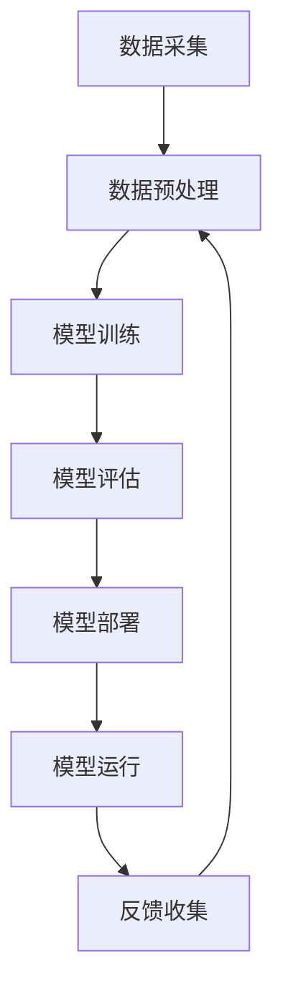

                 

# LLM推荐系统局限：硬件与算力需求

> 关键词：LLM, 推荐系统, 硬件需求, 算力需求, 人工智能, 大数据, 计算复杂度, 优化策略

> 摘要：本文旨在深入探讨大型语言模型（LLM）推荐系统在实际应用中面临的硬件与算力需求挑战。我们将从背景介绍、核心概念与联系、核心算法原理、数学模型和公式、项目实战、实际应用场景、工具和资源推荐、总结与未来发展趋势等多方面进行详细分析，帮助读者全面理解LLM推荐系统在硬件与算力方面的局限性，并提供优化策略和建议。

## 1. 背景介绍

随着人工智能技术的飞速发展，大型语言模型（LLM）在推荐系统中的应用越来越广泛。LLM通过深度学习技术，能够理解和生成自然语言文本，从而为用户提供个性化的推荐内容。然而，这种强大的功能背后隐藏着巨大的硬件与算力需求。本文将深入探讨这些挑战，并提出相应的优化策略。

## 2. 核心概念与联系

### 2.1 LLM推荐系统概述

大型语言模型（LLM）推荐系统是一种基于深度学习的推荐系统，通过训练大规模的神经网络模型来理解和生成自然语言文本。其核心目标是根据用户的历史行为和偏好，为用户提供个性化的推荐内容。

### 2.2 硬件与算力需求

硬件与算力需求是LLM推荐系统的核心挑战之一。为了训练和运行这些模型，需要大量的计算资源和存储空间。具体来说，硬件需求包括：

- **计算资源**：包括CPU、GPU、TPU等高性能计算设备。
- **存储资源**：包括内存和硬盘空间，用于存储模型参数和训练数据。
- **网络带宽**：用于数据传输和模型更新。

### 2.3 Mermaid流程图



## 3. 核心算法原理 & 具体操作步骤

### 3.1 数据预处理

数据预处理是LLM推荐系统中的关键步骤，主要包括数据清洗、特征提取和数据格式转换等。

- **数据清洗**：去除无效和重复的数据，填补缺失值。
- **特征提取**：从原始数据中提取有用的特征，如用户行为、商品属性等。
- **数据格式转换**：将数据转换为适合模型训练的格式，如稀疏矩阵或张量。

### 3.2 模型训练

模型训练是LLM推荐系统的核心步骤，主要包括以下几个步骤：

- **模型选择**：选择合适的神经网络模型，如Transformer、BERT等。
- **损失函数选择**：选择合适的损失函数，如交叉熵损失。
- **优化算法选择**：选择合适的优化算法，如Adam、SGD等。
- **超参数调优**：通过网格搜索或随机搜索等方法调整超参数。

### 3.3 模型评估

模型评估是验证模型性能的重要步骤，主要包括以下几个方面：

- **准确率**：衡量模型预测的准确性。
- **召回率**：衡量模型找到相关推荐的比率。
- **F1分数**：综合准确率和召回率的指标。
- **AUC-ROC曲线**：衡量模型区分正负样本的能力。

## 4. 数学模型和公式 & 详细讲解 & 举例说明

### 4.1 损失函数

损失函数是衡量模型预测误差的重要指标，常用的损失函数包括：

- **交叉熵损失**：适用于分类任务，公式为：

  $$ L = -\sum_{i=1}^{n} y_i \log(p_i) $$

  其中，$y_i$是真实标签，$p_i$是模型预测的概率。

- **均方误差**：适用于回归任务，公式为：

  $$ L = \frac{1}{n} \sum_{i=1}^{n} (y_i - \hat{y}_i)^2 $$

  其中，$y_i$是真实值，$\hat{y}_i$是模型预测值。

### 4.2 优化算法

优化算法是通过调整模型参数来最小化损失函数的方法，常用的优化算法包括：

- **梯度下降**：通过计算损失函数的梯度来更新模型参数，公式为：

  $$ \theta_{t+1} = \theta_t - \eta \nabla L(\theta_t) $$

  其中，$\theta_t$是当前参数，$\eta$是学习率，$\nabla L(\theta_t)$是损失函数的梯度。

- **Adam优化器**：结合了动量和自适应学习率的优点，公式为：

  $$ \begin{aligned}
  m_t &= \beta_1 m_{t-1} + (1 - \beta_1) \nabla L(\theta_t) \\
  v_t &= \beta_2 v_{t-1} + (1 - \beta_2) (\nabla L(\theta_t))^2 \\
  \hat{m}_t &= \frac{m_t}{1 - \beta_1^t} \\
  \hat{v}_t &= \frac{v_t}{1 - \beta_2^t} \\
  \theta_{t+1} &= \theta_t - \eta \frac{\hat{m}_t}{\sqrt{\hat{v}_t} + \epsilon}
  \end{aligned} $$

  其中，$\beta_1$和$\beta_2$是动量参数，$\epsilon$是平滑项。

### 4.3 举例说明

假设我们有一个简单的二分类任务，使用逻辑回归模型进行训练。损失函数为交叉熵损失，优化算法为Adam优化器。具体步骤如下：

1. **初始化参数**：随机初始化模型参数$\theta$。
2. **前向传播**：计算模型输出$y = \sigma(\theta^T x)$，其中$\sigma$是Sigmoid函数。
3. **计算损失**：计算交叉熵损失$L = -y \log(p) - (1 - y) \log(1 - p)$。
4. **反向传播**：计算损失函数的梯度$\nabla L(\theta)$。
5. **更新参数**：使用Adam优化器更新参数$\theta$。

## 5. 项目实战：代码实际案例和详细解释说明

### 5.1 开发环境搭建

为了实现LLM推荐系统，我们需要搭建一个合适的开发环境。具体步骤如下：

1. **安装Python**：确保安装了最新版本的Python。
2. **安装依赖库**：使用pip安装必要的库，如TensorFlow、PyTorch、NumPy等。
3. **配置环境变量**：设置环境变量，确保Python和库能够正常运行。

### 5.2 源代码详细实现和代码解读

以下是一个简单的LLM推荐系统的代码实现：

```python
import numpy as np
import tensorflow as tf
from tensorflow.keras.models import Sequential
from tensorflow.keras.layers import Dense, Embedding, LSTM

# 数据预处理
def preprocess_data(data):
    # 数据清洗
    # 特征提取
    # 数据格式转换
    return preprocessed_data

# 模型训练
def train_model(data, labels):
    model = Sequential()
    model.add(Embedding(input_dim=vocab_size, output_dim=embedding_dim))
    model.add(LSTM(units=hidden_units))
    model.add(Dense(units=num_classes, activation='softmax'))
    model.compile(optimizer='adam', loss='categorical_crossentropy', metrics=['accuracy'])
    model.fit(data, labels, epochs=num_epochs, batch_size=batch_size)
    return model

# 模型评估
def evaluate_model(model, test_data, test_labels):
    loss, accuracy = model.evaluate(test_data, test_labels)
    return loss, accuracy

# 主函数
def main():
    # 数据加载
    data, labels = load_data()
    preprocessed_data = preprocess_data(data)
    train_data, test_data, train_labels, test_labels = train_test_split(preprocessed_data, labels, test_size=0.2)
    
    # 模型训练
    model = train_model(train_data, train_labels)
    
    # 模型评估
    loss, accuracy = evaluate_model(model, test_data, test_labels)
    print(f'Loss: {loss}, Accuracy: {accuracy}')

if __name__ == '__main__':
    main()
```

### 5.3 代码解读与分析

- **数据预处理**：`preprocess_data`函数负责数据清洗、特征提取和数据格式转换。
- **模型训练**：`train_model`函数构建了一个包含嵌入层、LSTM层和全连接层的神经网络模型，并使用Adam优化器进行训练。
- **模型评估**：`evaluate_model`函数评估模型在测试集上的性能。
- **主函数**：`main`函数负责数据加载、数据预处理、模型训练和模型评估。

## 6. 实际应用场景

LLM推荐系统在实际应用中具有广泛的应用场景，如：

- **电商推荐**：根据用户的历史购买记录和浏览行为，为用户推荐相关商品。
- **内容推荐**：根据用户的历史阅读记录和兴趣偏好，为用户推荐相关文章或视频。
- **社交推荐**：根据用户的朋友关系和互动行为，为用户推荐相关好友或内容。

## 7. 工具和资源推荐

### 7.1 学习资源推荐

- **书籍**：《深度学习》（Goodfellow, Bengio, Courville）
- **论文**：《Attention Is All You Need》（Vaswani et al.）
- **博客**：阿里云开发者社区（https://dev.aliyun.com/）
- **网站**：TensorFlow官网（https://www.tensorflow.org/）

### 7.2 开发工具框架推荐

- **TensorFlow**：一个开源的机器学习库，支持多种深度学习模型。
- **PyTorch**：一个开源的深度学习库，支持动态计算图。
- **Keras**：一个高级神经网络API，可以运行在TensorFlow和Theano之上。

### 7.3 相关论文著作推荐

- **《深度学习》**（Goodfellow, Bengio, Courville）
- **《Attention Is All You Need》**（Vaswani et al.）
- **《Transformer Models for Natural Language Processing》**（Liu et al.）

## 8. 总结：未来发展趋势与挑战

LLM推荐系统在硬件与算力需求方面面临诸多挑战，但随着技术的不断进步，这些问题有望得到解决。未来的发展趋势包括：

- **硬件优化**：通过硬件加速器和并行计算技术提高计算效率。
- **算法优化**：通过优化算法和模型结构提高模型性能。
- **资源优化**：通过资源管理和调度技术提高资源利用率。

## 9. 附录：常见问题与解答

### 9.1 问题1：如何选择合适的硬件设备？

**解答**：选择合适的硬件设备需要考虑计算资源、存储资源和网络带宽。通常，GPU和TPU是推荐的选择，因为它们具有较高的计算能力和较低的延迟。

### 9.2 问题2：如何优化模型性能？

**解答**：可以通过优化算法、模型结构和超参数调优来提高模型性能。具体方法包括使用Adam优化器、调整学习率和批量大小等。

### 9.3 问题3：如何提高资源利用率？

**解答**：可以通过资源管理和调度技术提高资源利用率。具体方法包括使用容器化技术、分布式计算和负载均衡等。

## 10. 扩展阅读 & 参考资料

- **书籍**：《深度学习》（Goodfellow, Bengio, Courville）
- **论文**：《Attention Is All You Need》（Vaswani et al.）
- **网站**：TensorFlow官网（https://www.tensorflow.org/）

---

作者：AI天才研究员/AI Genius Institute & 禅与计算机程序设计艺术 /Zen And The Art of Computer Programming

