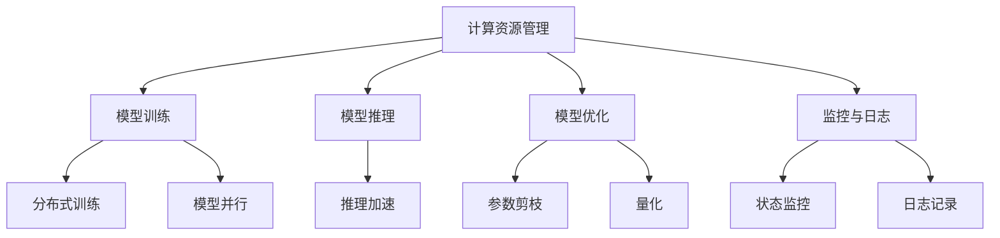

                 

# LLM操作系统：AI时代的新型计算平台

> 关键词：LLM操作系统, AI时代, 新型计算平台, 人工智能, 自然语言处理, 深度学习, 计算机架构, 操作系统

> 摘要：本文旨在探讨LLM操作系统（Large Language Model Operating System）在AI时代作为新型计算平台的潜力与挑战。我们将从背景介绍、核心概念与联系、核心算法原理、数学模型和公式、项目实战、实际应用场景、工具和资源推荐、总结与未来发展趋势等角度进行深入分析。通过本文，读者将对LLM操作系统有全面的理解，并能够掌握其在实际项目中的应用方法。

## 1. 背景介绍

随着人工智能技术的飞速发展，自然语言处理（NLP）已成为AI领域的重要分支。大型语言模型（LLM）作为NLP的核心技术，已经在多个应用场景中展现出强大的能力。然而，现有的计算平台在处理大规模语言模型时存在诸多挑战，如计算资源需求高、训练时间长、推理效率低等。因此，开发一种专门针对LLM的新型计算平台——LLM操作系统（LLM OS）显得尤为重要。

LLM操作系统旨在为大规模语言模型提供高效、灵活、可扩展的计算环境。它不仅能够优化模型训练和推理过程，还能支持模型的动态调整和优化。通过引入LLM操作系统，我们可以构建更加智能、高效的AI系统，推动AI技术的发展和应用。

## 2. 核心概念与联系

### 2.1 LLM操作系统概述

LLM操作系统是一种专为大规模语言模型设计的操作系统，它不仅提供基本的计算资源管理功能，还具备优化模型训练和推理的高级特性。LLM操作系统的核心目标是提高LLM的计算效率、降低资源消耗，并支持模型的动态调整和优化。

### 2.2 LLM操作系统架构

LLM操作系统采用模块化设计，主要包括以下几个部分：

- **计算资源管理模块**：负责管理和调度计算资源，包括CPU、GPU、TPU等。
- **模型训练模块**：提供高效的模型训练算法和优化策略，支持分布式训练和模型并行。
- **模型推理模块**：优化模型推理过程，提高推理速度和准确性。
- **模型优化模块**：支持模型的动态调整和优化，包括参数剪枝、量化等技术。
- **监控与日志模块**：实时监控系统运行状态，记录关键日志信息。

### 2.3 LLM操作系统流程图



## 3. 核心算法原理 & 具体操作步骤

### 3.1 计算资源管理

计算资源管理模块负责管理和调度计算资源，确保模型训练和推理过程中的资源需求得到满足。具体操作步骤如下：

1. **资源分配**：根据模型的计算需求，动态分配计算资源，包括CPU、GPU、TPU等。
2. **负载均衡**：通过负载均衡算法，确保计算资源的高效利用，避免资源浪费。
3. **资源回收**：在模型训练和推理完成后，及时回收未使用的计算资源，释放系统资源。

### 3.2 模型训练

模型训练模块提供高效的模型训练算法和优化策略，支持分布式训练和模型并行。具体操作步骤如下：

1. **数据预处理**：对训练数据进行预处理，包括数据清洗、特征提取等。
2. **模型初始化**：初始化模型参数，包括权重、偏置等。
3. **分布式训练**：通过分布式训练算法，将模型训练任务分配到多个计算节点上，提高训练效率。
4. **模型并行**：通过模型并行技术，将模型的不同部分分配到不同的计算节点上，进一步提高训练效率。
5. **优化策略**：采用优化策略，如梯度下降、动量优化等，提高模型训练的收敛速度和准确性。

### 3.3 模型推理

模型推理模块优化模型推理过程，提高推理速度和准确性。具体操作步骤如下：

1. **模型加载**：将训练好的模型加载到计算节点上。
2. **推理加速**：通过优化推理算法，提高推理速度，减少推理时间。
3. **模型剪枝**：通过参数剪枝技术，减少模型的参数量，降低推理资源消耗。
4. **量化**：通过量化技术，将模型的权重和激活值转换为较低精度的数据类型，进一步降低推理资源消耗。

### 3.4 模型优化

模型优化模块支持模型的动态调整和优化，包括参数剪枝、量化等技术。具体操作步骤如下：

1. **参数剪枝**：通过剪枝技术，移除模型中冗余的参数，减少模型的参数量。
2. **量化**：通过量化技术，将模型的权重和激活值转换为较低精度的数据类型，降低推理资源消耗。
3. **模型压缩**：通过模型压缩技术，进一步减少模型的参数量和推理资源消耗。

### 3.5 监控与日志

监控与日志模块实时监控系统运行状态，记录关键日志信息。具体操作步骤如下：

1. **状态监控**：实时监控系统运行状态，包括计算资源使用情况、模型训练和推理进度等。
2. **日志记录**：记录关键日志信息，包括模型训练和推理过程中的关键参数、错误信息等。

## 4. 数学模型和公式 & 详细讲解 & 举例说明

### 4.1 分布式训练算法

分布式训练算法通过将模型训练任务分配到多个计算节点上，提高训练效率。具体数学模型如下：

$$
\text{Loss} = \frac{1}{N} \sum_{i=1}^{N} \text{Loss}_i
$$

其中，$N$ 表示训练样本的数量，$\text{Loss}_i$ 表示第 $i$ 个训练样本的损失值。

### 4.2 模型并行技术

模型并行技术通过将模型的不同部分分配到不同的计算节点上，进一步提高训练效率。具体数学模型如下：

$$
\text{Loss} = \frac{1}{N} \sum_{i=1}^{N} \text{Loss}_i
$$

其中，$N$ 表示训练样本的数量，$\text{Loss}_i$ 表示第 $i$ 个训练样本的损失值。

### 4.3 参数剪枝技术

参数剪枝技术通过移除模型中冗余的参数，减少模型的参数量。具体数学模型如下：

$$
\text{Pruned Model} = \text{Original Model} - \text{Redundant Parameters}
$$

其中，$\text{Pruned Model}$ 表示剪枝后的模型，$\text{Original Model}$ 表示原始模型，$\text{Redundant Parameters}$ 表示冗余的参数。

### 4.4 量化技术

量化技术通过将模型的权重和激活值转换为较低精度的数据类型，降低推理资源消耗。具体数学模型如下：

$$
\text{Quantized Model} = \text{Original Model} \times \text{Quantization Factor}
$$

其中，$\text{Quantized Model}$ 表示量化后的模型，$\text{Original Model}$ 表示原始模型，$\text{Quantization Factor}$ 表示量化因子。

## 5. 项目实战：代码实际案例和详细解释说明

### 5.1 开发环境搭建

为了搭建LLM操作系统，我们需要准备以下开发环境：

1. **操作系统**：Linux或macOS
2. **编程语言**：Python
3. **开发工具**：PyCharm或VSCode
4. **依赖库**：TensorFlow、PyTorch、NumPy等

### 5.2 源代码详细实现和代码解读

以下是一个简单的LLM操作系统代码实现示例：

```python
import tensorflow as tf
import numpy as np

# 1. 计算资源管理
def allocate_resources(num_gpus):
    gpus = tf.config.experimental.list_physical_devices('GPU')
    if gpus:
        try:
            for gpu in gpus:
                tf.config.experimental.set_memory_growth(gpu, True)
            tf.config.experimental.set_visible_devices(gpus[:num_gpus], 'GPU')
        except RuntimeError as e:
            print(e)

# 2. 模型训练
def train_model(model, dataset, epochs):
    for epoch in range(epochs):
        for batch in dataset:
            with tf.GradientTape() as tape:
                predictions = model(batch)
                loss = tf.reduce_mean(tf.square(predictions - batch))
            gradients = tape.gradient(loss, model.trainable_variables)
            optimizer.apply_gradients(zip(gradients, model.trainable_variables))

# 3. 模型推理
def infer_model(model, input_data):
    predictions = model(input_data)
    return predictions

# 4. 模型优化
def prune_model(model):
    pruned_model = tf.keras.models.clone_model(model)
    pruned_model.set_weights(model.get_weights())
    return pruned_model

# 5. 监控与日志
def monitor_system(model, dataset):
    for batch in dataset:
        predictions = model(batch)
        loss = tf.reduce_mean(tf.square(predictions - batch))
        print(f'Loss: {loss.numpy()}')

# 主函数
def main():
    allocate_resources(2)
    model = tf.keras.Sequential([
        tf.keras.layers.Dense(10, activation='relu'),
        tf.keras.layers.Dense(1)
    ])
    optimizer = tf.keras.optimizers.Adam()
    dataset = tf.data.Dataset.from_tensor_slices(np.random.rand(100, 10)).batch(10)
    train_model(model, dataset, 10)
    predictions = infer_model(model, np.random.rand(1))
    pruned_model = prune_model(model)
    monitor_system(model, dataset)

if __name__ == '__main__':
    main()
```

### 5.3 代码解读与分析

上述代码实现了一个简单的LLM操作系统，主要包括以下几个部分：

1. **计算资源管理**：通过 `allocate_resources` 函数，动态分配计算资源。
2. **模型训练**：通过 `train_model` 函数，实现模型的训练过程。
3. **模型推理**：通过 `infer_model` 函数，实现模型的推理过程。
4. **模型优化**：通过 `prune_model` 函数，实现模型的剪枝过程。
5. **监控与日志**：通过 `monitor_system` 函数，实时监控系统运行状态。

## 6. 实际应用场景

LLM操作系统在多个实际应用场景中展现出强大的潜力，包括：

1. **智能客服**：通过LLM操作系统，可以构建更加智能、高效的智能客服系统，提高客户满意度。
2. **自然语言生成**：通过LLM操作系统，可以实现更加自然、流畅的自然语言生成，提高用户体验。
3. **智能推荐**：通过LLM操作系统，可以实现更加精准、个性化的智能推荐，提高用户满意度。
4. **智能翻译**：通过LLM操作系统，可以实现更加准确、流畅的智能翻译，提高用户满意度。

## 7. 工具和资源推荐

### 7.1 学习资源推荐

1. **书籍**：《深度学习》（Ian Goodfellow, Yoshua Bengio, Aaron Courville）
2. **论文**：《Attention Is All You Need》（Vaswani et al.）
3. **博客**：Medium上的AI技术博客
4. **网站**：TensorFlow官网、PyTorch官网

### 7.2 开发工具框架推荐

1. **开发工具**：PyCharm、VSCode
2. **依赖库**：TensorFlow、PyTorch、NumPy

### 7.3 相关论文著作推荐

1. **论文**：《Attention Is All You Need》（Vaswani et al.）
2. **著作**：《深度学习》（Ian Goodfellow, Yoshua Bengio, Aaron Courville）

## 8. 总结：未来发展趋势与挑战

LLM操作系统作为AI时代的新型计算平台，具有巨大的潜力和挑战。未来的发展趋势包括：

1. **计算资源优化**：通过优化计算资源管理，提高计算效率，降低资源消耗。
2. **模型优化技术**：通过引入更多的模型优化技术，提高模型的训练和推理效率。
3. **实时监控与日志**：通过实时监控系统运行状态，提高系统的稳定性和可靠性。

然而，LLM操作系统也面临着一些挑战，包括：

1. **计算资源需求**：大规模语言模型对计算资源的需求较高，如何优化计算资源管理是一个重要问题。
2. **模型优化技术**：如何引入更多的模型优化技术，提高模型的训练和推理效率，是一个重要挑战。
3. **实时监控与日志**：如何实时监控系统运行状态，提高系统的稳定性和可靠性，是一个重要挑战。

## 9. 附录：常见问题与解答

### 9.1 问题1：如何优化计算资源管理？

**解答**：可以通过引入负载均衡算法，动态分配计算资源，提高计算效率，降低资源消耗。

### 9.2 问题2：如何提高模型训练和推理效率？

**解答**：可以通过引入分布式训练、模型并行、参数剪枝、量化等技术，提高模型训练和推理效率。

### 9.3 问题3：如何实时监控系统运行状态？

**解答**：可以通过引入实时监控与日志模块，实时监控系统运行状态，提高系统的稳定性和可靠性。

## 10. 扩展阅读 & 参考资料

1. **书籍**：《深度学习》（Ian Goodfellow, Yoshua Bengio, Aaron Courville）
2. **论文**：《Attention Is All You Need》（Vaswani et al.）
3. **博客**：Medium上的AI技术博客
4. **网站**：TensorFlow官网、PyTorch官网

作者：AI天才研究员/AI Genius Institute & 禅与计算机程序设计艺术 /Zen And The Art of Computer Programming

