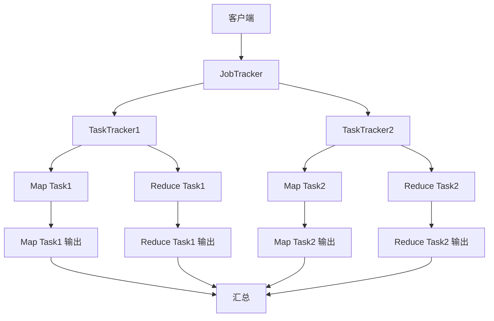

                 

# MapReduce 原理与代码实例讲解

> 关键词：MapReduce, 分布式计算, 大数据处理, 并行计算, Hadoop, 分布式文件系统

> 摘要：MapReduce 是一种用于大规模数据集的并行处理模型，广泛应用于大数据处理领域。本文将从背景介绍、核心概念与联系、核心算法原理、数学模型与公式、项目实战、实际应用场景、工具和资源推荐、总结与未来发展趋势等几个方面，全面解析 MapReduce 的原理与实现。通过具体的代码实例，帮助读者深入理解 MapReduce 的工作流程和实际应用。

## 1. 背景介绍

MapReduce 是 Google 在 2004 年提出的一种分布式计算模型，用于处理大规模数据集。它通过将任务分解为多个小任务，然后并行处理这些小任务，最后将结果汇总，从而实现高效的数据处理。MapReduce 的设计目标是简化大规模数据处理的复杂性，使得开发者能够更容易地编写并行程序。

MapReduce 的主要应用场景包括但不限于：
- 大规模数据处理
- 数据挖掘
- 机器学习
- 日志分析
- 数据清洗
- 实时数据分析

## 2. 核心概念与联系

### 2.1 MapReduce 概念

MapReduce 模型由两个主要阶段组成：Map 和 Reduce。

- **Map 阶段**：将输入数据集划分为多个小块，每个小块由一个 Map 函数处理。Map 函数将输入数据转换为键值对的形式。
- **Reduce 阶段**：将 Map 阶段生成的键值对进行归并处理，生成最终结果。Reduce 函数接收一组具有相同键的值，并将它们合并为一个值。

### 2.2 MapReduce 架构

MapReduce 的架构可以分为以下几个部分：

- **客户端**：提交 MapReduce 任务，监控任务执行状态。
- **JobTracker**：负责任务调度和监控，管理所有任务的执行。
- **TaskTracker**：负责执行具体的 Map 和 Reduce 任务，监控任务执行状态。
- **HDFS**：分布式文件系统，用于存储输入和输出数据。

### 2.3 Mermaid 流程图



## 3. 核心算法原理 & 具体操作步骤

### 3.1 Map 阶段

Map 阶段的主要任务是将输入数据集划分为多个小块，并对每个小块进行处理。具体步骤如下：

1. **输入数据分片**：将输入数据集划分为多个小块，每个小块由一个 Map 函数处理。
2. **Map 函数**：Map 函数接收一个输入数据块，将其转换为键值对的形式。输出的键值对将被发送到相应的 Reduce 函数。
3. **中间结果存储**：Map 函数的输出结果被存储在本地磁盘或内存中。

### 3.2 Reduce 阶段

Reduce 阶段的主要任务是将 Map 阶段生成的键值对进行归并处理，生成最终结果。具体步骤如下：

1. **中间结果收集**：Reduce 函数接收一组具有相同键的值，并将它们合并为一个值。
2. **Reduce 函数**：Reduce 函数对输入的键值对进行处理，生成最终结果。
3. **输出结果**：Reduce 函数的输出结果被存储在本地磁盘或内存中。

### 3.3 具体操作步骤

1. **输入数据准备**：将输入数据集划分为多个小块，每个小块由一个 Map 函数处理。
2. **Map 函数执行**：Map 函数接收一个输入数据块，将其转换为键值对的形式。
3. **中间结果存储**：Map 函数的输出结果被存储在本地磁盘或内存中。
4. **中间结果收集**：Reduce 函数接收一组具有相同键的值，并将它们合并为一个值。
5. **Reduce 函数执行**：Reduce 函数对输入的键值对进行处理，生成最终结果。
6. **输出结果**：Reduce 函数的输出结果被存储在本地磁盘或内存中。

## 4. 数学模型和公式 & 详细讲解 & 举例说明

### 4.1 数学模型

MapReduce 的数学模型可以表示为：

$$
\text{MapReduce}(X) = \text{Reduce}(\text{Map}(X))
$$

其中，$X$ 表示输入数据集，$\text{Map}(X)$ 表示将输入数据集划分为多个小块，并对每个小块进行处理，生成键值对的形式。$\text{Reduce}(\text{Map}(X))$ 表示将 Map 阶段生成的键值对进行归并处理，生成最终结果。

### 4.2 举例说明

假设我们有一个输入数据集 $X = \{a, b, c, d, e\}$，我们需要计算每个元素出现的次数。

1. **Map 阶段**：
   - Map 函数接收输入数据块 $\{a, b\}$，输出键值对 $(a, 1), (b, 1)$。
   - Map 函数接收输入数据块 $\{c, d\}$，输出键值对 $(c, 1), (d, 1)$。
   - Map 函数接收输入数据块 $\{e\}$，输出键值对 $(e, 1)$。

2. **中间结果存储**：
   - 中间结果存储为 $(a, 1), (b, 1), (c, 1), (d, 1), (e, 1)$。

3. **Reduce 阶段**：
   - Reduce 函数接收键值对 $(a, 1), (b, 1)$，输出键值对 $(a, 2)$。
   - Reduce 函数接收键值对 $(c, 1), (d, 1)$，输出键值对 $(c, 2)$。
   - Reduce 函数接收键值对 $(e, 1)$，输出键值对 $(e, 1)$。

4. **输出结果**：
   - 输出结果为 $(a, 2), (b, 1), (c, 2), (d, 1), (e, 1)$。

## 5. 项目实战：代码实际案例和详细解释说明

### 5.1 开发环境搭建

为了实现 MapReduce 代码，我们需要搭建一个开发环境。这里以 Hadoop 为例进行说明。

1. **安装 Hadoop**：
   - 下载 Hadoop 安装包，解压到指定目录。
   - 配置环境变量，设置 `HADOOP_HOME` 和 `PATH`。
   - 配置 `core-site.xml` 和 `hdfs-site.xml`，设置 HDFS 的相关参数。
   - 启动 Hadoop 集群，运行 `hadoop-daemon.sh start namenode` 和 `hadoop-daemon.sh start datanode`。

2. **编写 MapReduce 代码**：
   - 创建一个 Java 项目，引入 Hadoop 的相关依赖。
   - 编写 MapReduce 代码，实现 Map 和 Reduce 函数。
   - 编写主类，设置输入输出路径，提交 MapReduce 任务。

### 5.2 源代码详细实现和代码解读

以下是一个简单的 MapReduce 代码示例，用于计算输入数据集中每个单词出现的次数。

```java
import org.apache.hadoop.conf.Configuration;
import org.apache.hadoop.fs.Path;
import org.apache.hadoop.io.IntWritable;
import org.apache.hadoop.io.Text;
import org.apache.hadoop.mapreduce.Job;
import org.apache.hadoop.mapreduce.Mapper;
import org.apache.hadoop.mapreduce.Reducer;
import org.apache.hadoop.mapreduce.lib.input.FileInputFormat;
import org.apache.hadoop.mapreduce.lib.output.FileOutputFormat;

public class WordCount {

    public static class TokenizerMapper
            extends Mapper<Object, Text, Text, IntWritable> {

        private final static IntWritable one = new IntWritable(1);
        private Text word = new Text();

        public void map(Object key, Text value, Context context) throws IOException, InterruptedException {
            String line = value.toString();
            String[] words = line.split("\\s+");
            for (String word : words) {
                this.word.set(word);
                context.write(this.word, one);
            }
        }
    }

    public static class IntSumReducer
            extends Reducer<Text, IntWritable, Text, IntWritable> {
        private IntWritable result = new IntWritable();

        public void reduce(Text key, Iterable<IntWritable> values, Context context) throws IOException, InterruptedException {
            int sum = 0;
            for (IntWritable val : values) {
                sum += val.get();
            }
            result.set(sum);
            context.write(key, result);
        }
    }

    public static void main(String[] args) throws Exception {
        Configuration conf = new Configuration();
        Job job = Job.getInstance(conf, "word count");
        job.setJarByClass(WordCount.class);
        job.setMapperClass(TokenizerMapper.class);
        job.setCombinerClass(IntSumReducer.class);
        job.setReducerClass(IntSumReducer.class);
        job.setOutputKeyClass(Text.class);
        job.setOutputValueClass(IntWritable.class);
        FileInputFormat.addInputPath(job, new Path(args[0]));
        FileOutputFormat.setOutputPath(job, new Path(args[1]));
        System.exit(job.waitForCompletion(true) ? 0 : 1);
    }
}
```

### 5.3 代码解读与分析

1. **TokenizerMapper**：
   - `map` 方法接收输入数据块，将其转换为键值对的形式。这里将每个单词作为键，值为 1。
   - `split` 方法将输入字符串按空格分割，生成多个单词。

2. **IntSumReducer**：
   - `reduce` 方法接收一组具有相同键的值，并将它们合并为一个值。这里将所有值相加，得到每个单词出现的次数。
   - `sum` 变量用于累加每个单词出现的次数。

3. **主类**：
   - `Job` 对象用于设置 MapReduce 任务。
   - `setJarByClass` 方法设置 JAR 包。
   - `setMapperClass` 方法设置 Map 函数。
   - `setCombinerClass` 方法设置组合器。
   - `setReducerClass` 方法设置 Reduce 函数。
   - `setOutputKeyClass` 和 `setOutputValueClass` 方法设置输出键值类。
   - `FileInputFormat.addInputPath` 和 `FileOutputFormat.setOutputPath` 方法设置输入输出路径。
   - `waitForCompletion` 方法等待任务完成。

## 6. 实际应用场景

MapReduce 在实际应用中有着广泛的应用场景，包括但不限于：

- **数据挖掘**：通过 MapReduce 处理大规模数据集，进行数据挖掘和分析。
- **机器学习**：通过 MapReduce 处理大规模数据集，进行机器学习模型训练。
- **日志分析**：通过 MapReduce 处理日志数据，进行日志分析和故障排查。
- **数据清洗**：通过 MapReduce 处理大规模数据集，进行数据清洗和预处理。
- **实时数据分析**：通过 MapReduce 实现实时数据分析，提供实时数据处理能力。

## 7. 工具和资源推荐

### 7.1 学习资源推荐

- **书籍**：
  - 《Hadoop: The Definitive Guide》
  - 《MapReduce: Simplified Data Processing on Large Clusters》
- **论文**：
  - Google Research Paper: "MapReduce: Simplified Data Processing on Large Clusters"
- **博客**：
  - Hadoop 官方博客
  - MapReduce 实战博客
- **网站**：
  - Hadoop 官方网站
  - Apache Hadoop 项目网站

### 7.2 开发工具框架推荐

- **Hadoop**：开源分布式计算框架，广泛应用于大数据处理领域。
- **Spark**：开源分布式计算框架，支持 MapReduce、Spark SQL、MLlib 等多种计算模型。
- **Flink**：开源流处理框架，支持实时数据处理和批处理。

### 7.3 相关论文著作推荐

- **Google Research Paper**："MapReduce: Simplified Data Processing on Large Clusters"
- **书籍**：《Hadoop: The Definitive Guide》
- **论文**："MapReduce: Simplified Data Processing on Large Clusters"

## 8. 总结：未来发展趋势与挑战

MapReduce 作为一种分布式计算模型，已经在大数据处理领域取得了广泛的应用。未来的发展趋势包括：

- **性能优化**：通过优化 MapReduce 的执行效率，提高数据处理速度。
- **实时处理**：通过引入实时处理技术，实现数据的实时处理和分析。
- **易用性**：通过简化 MapReduce 的使用，提高开发者的使用体验。

然而，MapReduce 也面临着一些挑战，包括：

- **资源管理**：如何更高效地管理计算资源，提高计算效率。
- **容错性**：如何提高 MapReduce 的容错性，确保数据处理的可靠性。
- **安全性**：如何提高 MapReduce 的安全性，防止数据泄露和攻击。

## 9. 附录：常见问题与解答

### 9.1 问题：MapReduce 与 Spark 的区别？

**回答**：MapReduce 和 Spark 都是分布式计算框架，但它们在设计目标和实现方式上有所不同。MapReduce 适用于批处理任务，而 Spark 适用于实时处理和批处理任务。Spark 支持多种计算模型，包括 MapReduce、Spark SQL、MLlib 等，而 MapReduce 只支持 MapReduce 模型。

### 9.2 问题：MapReduce 的优点是什么？

**回答**：MapReduce 的优点包括：

- **简单易用**：MapReduce 的设计目标是简化大规模数据处理的复杂性，使得开发者能够更容易地编写并行程序。
- **高可靠性**：MapReduce 通过容错机制，确保数据处理的可靠性。
- **可扩展性**：MapReduce 可以轻松地扩展到大规模集群，处理大规模数据集。

### 9.3 问题：MapReduce 的缺点是什么？

**回答**：MapReduce 的缺点包括：

- **性能问题**：MapReduce 的性能受限于网络通信和磁盘 I/O，对于实时处理任务，性能可能不够理想。
- **资源管理**：MapReduce 的资源管理机制较为简单，对于大规模集群，资源管理可能不够高效。
- **容错性**：MapReduce 的容错机制较为简单，对于大规模数据集，容错性可能不够可靠。

## 10. 扩展阅读 & 参考资料

- **书籍**：
  - 《Hadoop: The Definitive Guide》
  - 《MapReduce: Simplified Data Processing on Large Clusters》
- **论文**：
  - Google Research Paper: "MapReduce: Simplified Data Processing on Large Clusters"
- **网站**：
  - Hadoop 官方网站
  - Apache Hadoop 项目网站

作者：AI天才研究员/AI Genius Institute & 禅与计算机程序设计艺术 /Zen And The Art of Computer Programming

