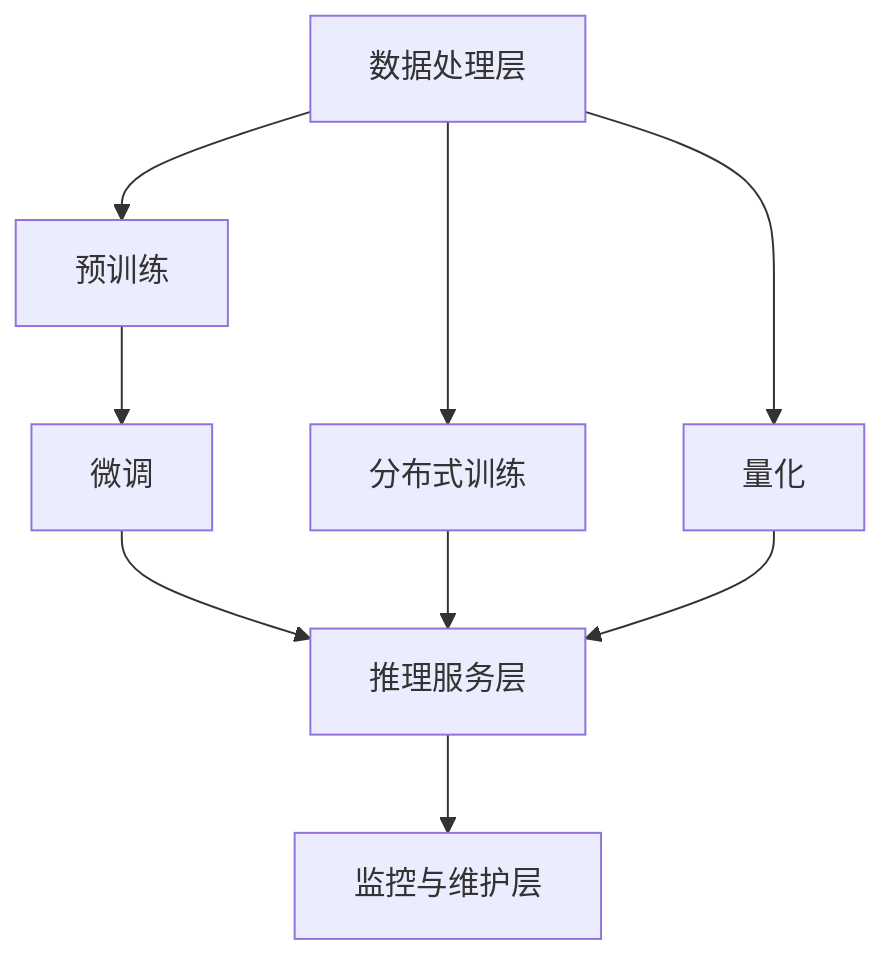

                 

# OpenAI的成功经验对大模型企业的借鉴

> 关键词：大模型、OpenAI、成功经验、企业借鉴、技术架构、算法原理、数学模型、实战案例、应用场景、发展趋势

> 摘要：本文旨在通过分析OpenAI的成功经验，为大模型企业提供有价值的借鉴。我们将从技术架构、算法原理、数学模型、实战案例等多个维度进行深入探讨，帮助读者理解如何构建高效的大模型系统，并在实际应用中取得成功。

## 1. 背景介绍

OpenAI是一家致力于研究和开发安全的人工智能技术的非营利组织。自成立以来，OpenAI在多个领域取得了显著成就，尤其是在大模型领域。本文将从OpenAI的成功经验出发，探讨其在技术架构、算法原理、数学模型等方面的经验，并为大模型企业提供有价值的借鉴。

## 2. 核心概念与联系

### 2.1 技术架构

OpenAI的技术架构主要包括以下几个部分：

- **数据处理层**：负责数据的收集、清洗和预处理。
- **模型训练层**：负责模型的训练和优化。
- **推理服务层**：负责模型的推理和部署。
- **监控与维护层**：负责模型的监控、维护和更新。

### 2.2 核心概念

- **大模型**：指参数量巨大、能够处理复杂任务的模型。
- **预训练**：在大规模数据集上进行的无监督训练。
- **微调**：在特定任务数据集上进行的有监督训练。
- **分布式训练**：通过多台机器协同训练模型。
- **量化**：通过减少模型参数和计算量来提高效率。

### 2.3 Mermaid流程图



## 3. 核心算法原理 & 具体操作步骤

### 3.1 预训练算法

预训练是大模型训练的重要步骤，OpenAI常用的预训练方法包括：

- **自回归预训练**：通过自回归的方式生成文本，如GPT系列。
- **掩码语言模型**：通过掩码部分输入数据，预测被掩码的词，如BERT。

### 3.2 微调算法

微调是针对特定任务进行的有监督训练，OpenAI常用的微调方法包括：

- **微调策略**：使用少量标注数据进行微调，如finetuning。
- **迁移学习**：利用预训练模型的特征进行迁移学习。

### 3.3 分布式训练

分布式训练是提高训练效率的关键技术，OpenAI常用的分布式训练方法包括：

- **数据并行**：将数据分布在多台机器上，每台机器训练模型的一部分。
- **模型并行**：将模型分布在多台机器上，每台机器训练模型的一部分。

### 3.4 量化技术

量化技术是提高模型效率的重要手段，OpenAI常用的量化方法包括：

- **权重量化**：将权重从浮点数转换为定点数。
- **激活量化**：将激活值从浮点数转换为定点数。

## 4. 数学模型和公式 & 详细讲解 & 举例说明

### 4.1 自回归预训练

自回归预训练的目标是生成文本，其数学模型可以表示为：

$$
P(x_1, x_2, \ldots, x_n) = \prod_{i=1}^{n} P(x_i | x_1, x_2, \ldots, x_{i-1})
$$

其中，$x_i$ 表示第 $i$ 个词，$P(x_i | x_1, x_2, \ldots, x_{i-1})$ 表示在给定前 $i-1$ 个词的情况下生成第 $i$ 个词的概率。

### 4.2 掩码语言模型

掩码语言模型的目标是预测被掩码的词，其数学模型可以表示为：

$$
P(x_i | x_1, x_2, \ldots, x_{i-1}, x_{i+1}, \ldots, x_n) = \sigma(W \cdot [x_1, x_2, \ldots, x_{i-1}, \hat{x}_i, x_{i+1}, \ldots, x_n] + b)
$$

其中，$\sigma$ 表示激活函数，$W$ 和 $b$ 分别表示权重和偏置。

### 4.3 微调策略

微调策略的目标是利用少量标注数据进行训练，其数学模型可以表示为：

$$
L(\theta) = \frac{1}{N} \sum_{i=1}^{N} \ell(f(x_i, \theta), y_i)
$$

其中，$\theta$ 表示模型参数，$\ell$ 表示损失函数，$f(x_i, \theta)$ 表示模型在输入 $x_i$ 上的预测，$y_i$ 表示真实标签。

### 4.4 分布式训练

分布式训练的目标是提高训练效率，其数学模型可以表示为：

$$
L(\theta) = \frac{1}{N} \sum_{i=1}^{N} \ell(f(x_i, \theta), y_i)
$$

其中，$N$ 表示数据量，$\theta$ 表示模型参数，$\ell$ 表示损失函数，$f(x_i, \theta)$ 表示模型在输入 $x_i$ 上的预测，$y_i$ 表示真实标签。

### 4.5 量化技术

量化技术的目标是提高模型效率，其数学模型可以表示为：

$$
Q(x) = \text{round}(x / \Delta) \cdot \Delta
$$

其中，$Q(x)$ 表示量化后的值，$\Delta$ 表示量化步长。

## 5. 项目实战：代码实际案例和详细解释说明

### 5.1 开发环境搭建

#### 5.1.1 环境准备

- **操作系统**：Ubuntu 20.04
- **Python版本**：3.8
- **深度学习框架**：PyTorch 1.9

#### 5.1.2 安装依赖

```bash
pip install torch torchvision
```

### 5.2 源代码详细实现和代码解读

#### 5.2.1 数据预处理

```python
import torch
from torch.utils.data import Dataset, DataLoader

class TextDataset(Dataset):
    def __init__(self, text, block_size):
        self.block_size = block_size
        self.tokens = self.tokenize(text)
        self.data = self.create_sequences(self.tokens)

    def tokenize(self, text):
        # 分词处理
        return [token for token in text.split()]

    def create_sequences(self, tokens):
        # 创建序列
        sequences = []
        for i in range(len(tokens) - self.block_size):
            sequences.append(tokens[i:i + self.block_size + 1])
        return sequences

    def __len__(self):
        return len(self.data)

    def __getitem__(self, idx):
        return torch.tensor(self.data[idx], dtype=torch.long)
```

#### 5.2.2 模型定义

```python
import torch.nn as nn

class TransformerModel(nn.Module):
    def __init__(self, vocab_size, embed_dim, nhead, num_layers, hidden_dim, dropout):
        super(TransformerModel, self).__init__()
        self.embedding = nn.Embedding(vocab_size, embed_dim)
        self.transformer = nn.TransformerEncoder(nn.TransformerEncoderLayer(embed_dim, nhead, hidden_dim, dropout), num_layers)
        self.fc = nn.Linear(embed_dim, vocab_size)

    def forward(self, x):
        x = self.embedding(x)
        x = self.transformer(x)
        x = self.fc(x)
        return x
```

#### 5.2.3 训练代码

```python
import torch.optim as optim

def train(model, data_loader, optimizer, criterion):
    model.train()
    total_loss = 0
    for batch in data_loader:
        optimizer.zero_grad()
        inputs, targets = batch[:-1], batch[1:]
        outputs = model(inputs)
        loss = criterion(outputs.view(-1, outputs.size(-1)), targets.view(-1))
        loss.backward()
        optimizer.step()
        total_loss += loss.item()
    return total_loss / len(data_loader)
```

### 5.3 代码解读与分析

- **数据预处理**：通过分词和创建序列的方式，将文本数据转换为模型可以处理的形式。
- **模型定义**：定义了一个基于Transformer的模型，包括嵌入层、Transformer编码器和全连接层。
- **训练代码**：通过反向传播和优化器更新模型参数，实现模型的训练。

## 6. 实际应用场景

OpenAI的大模型在多个领域取得了显著成就，包括但不限于：

- **自然语言处理**：如GPT系列、BERT等。
- **图像识别**：如DALL-E等。
- **游戏AI**：如AlphaGo等。

## 7. 工具和资源推荐

### 7.1 学习资源推荐

- **书籍**：《深度学习》、《自然语言处理实战》
- **论文**：《Attention Is All You Need》、《BERT: Pre-training of Deep Bidirectional Transformers for Language Understanding》
- **博客**：Medium、Towards Data Science
- **网站**：PyTorch官网、TensorFlow官网

### 7.2 开发工具框架推荐

- **深度学习框架**：PyTorch、TensorFlow
- **数据处理工具**：Pandas、NumPy
- **可视化工具**：Matplotlib、Seaborn

### 7.3 相关论文著作推荐

- **论文**：《Attention Is All You Need》、《BERT: Pre-training of Deep Bidirectional Transformers for Language Understanding》
- **著作**：《深度学习》、《自然语言处理实战》

## 8. 总结：未来发展趋势与挑战

### 8.1 未来发展趋势

- **模型规模**：模型规模将继续扩大，以提高性能。
- **训练效率**：分布式训练和量化技术将进一步提高训练效率。
- **应用场景**：大模型将在更多领域得到应用，如医疗、金融等。

### 8.2 挑战

- **计算资源**：大规模模型训练需要大量的计算资源。
- **数据隐私**：大规模数据集的使用可能涉及数据隐私问题。
- **模型解释性**：大模型的解释性较差，需要进一步研究。

## 9. 附录：常见问题与解答

### 9.1 问题1：如何选择合适的模型架构？

- **答案**：根据任务需求选择合适的模型架构，如自然语言处理任务可以选择Transformer模型。

### 9.2 问题2：如何提高模型训练效率？

- **答案**：通过分布式训练和量化技术提高模型训练效率。

### 9.3 问题3：如何处理大规模数据集？

- **答案**：通过数据并行和模型并行技术处理大规模数据集。

## 10. 扩展阅读 & 参考资料

- **论文**：《Attention Is All You Need》、《BERT: Pre-training of Deep Bidirectional Transformers for Language Understanding》
- **书籍**：《深度学习》、《自然语言处理实战》
- **网站**：PyTorch官网、TensorFlow官网

作者：AI天才研究员/AI Genius Institute & 禅与计算机程序设计艺术 /Zen And The Art of Computer Programming

