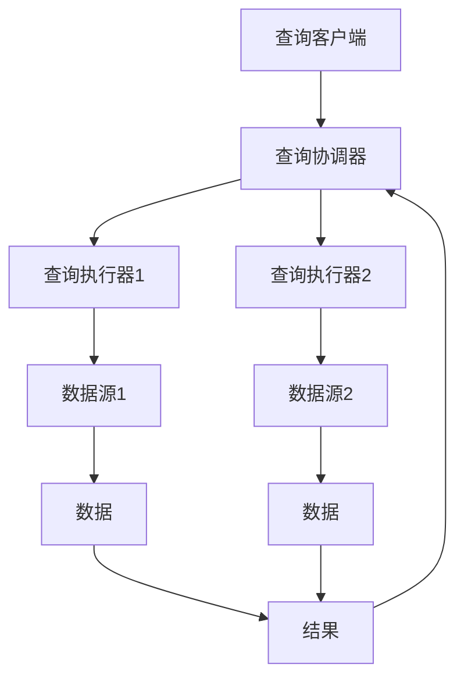

                 

# Presto原理与代码实例讲解

> 关键词：Presto, SQL查询, 分布式计算, 查询优化, 实时分析, 代码实现

> 摘要：Presto是一个开源的分布式SQL查询引擎，专为实时分析大规模数据而设计。本文将深入探讨Presto的核心原理，包括其架构设计、查询优化机制、以及具体的代码实现。通过详细的代码实例，我们将逐步解析Presto的工作流程，帮助读者理解其在实际应用中的强大功能和灵活性。

## 1. 背景介绍

Presto是一个开源的分布式SQL查询引擎，由Facebook开发并于2013年开源。Presto最初设计用于实时分析大规模数据，其目标是提供一种高效、灵活且易于使用的查询工具，能够快速响应复杂的SQL查询。Presto支持多种数据源，包括Hadoop HDFS、Amazon S3、MySQL、PostgreSQL等，能够处理PB级别的数据。

### 1.1 为什么需要Presto

在大数据时代，数据量的快速增长对查询性能提出了更高的要求。传统的查询引擎如Hive虽然能够处理大规模数据，但其查询性能往往受限于MapReduce框架的批处理特性，无法满足实时查询的需求。Presto通过分布式计算和并行处理，实现了快速响应复杂的SQL查询，从而满足了实时分析的需求。

### 1.2 Presto的核心特点

- **实时查询**：Presto能够在几秒钟内返回查询结果，适用于实时分析场景。
- **多数据源支持**：Presto支持多种数据源，能够灵活地连接不同的数据存储系统。
- **查询优化**：Presto内置了高效的查询优化器，能够自动优化查询计划，提高查询性能。
- **可扩展性**：Presto支持水平扩展，可以通过增加节点来提高查询处理能力。

## 2. 核心概念与联系

### 2.1 Presto架构设计

Presto的架构设计如下图所示：



### 2.2 查询流程

1. **查询客户端**：用户通过查询客户端提交SQL查询。
2. **查询协调器**：查询协调器负责解析查询语句，生成查询计划，并将任务分配给查询执行器。
3. **查询执行器**：查询执行器负责执行查询计划，从数据源获取数据，并将结果返回给查询协调器。
4. **数据源**：数据源提供数据给查询执行器。
5. **结果**：查询执行器将查询结果返回给查询协调器，最终返回给查询客户端。

## 3. 核心算法原理 & 具体操作步骤

### 3.1 查询解析

Presto使用ANTLR进行查询解析，将SQL查询转换为抽象语法树（AST）。

```python
def parse_query(query):
    lexer = SqlLexer(InputStream(query))
    stream = CommonTokenStream(lexer)
    parser = SqlParser(stream)
    tree = parser.query()
    return tree
```

### 3.2 查询优化

Presto的查询优化器通过以下步骤优化查询计划：

1. **谓词下推**：将过滤条件下推到数据源，减少不必要的数据传输。
2. **列选择**：仅选择需要的列，减少数据传输量。
3. **并行化**：将查询任务分配给多个查询执行器，提高查询性能。

### 3.3 查询执行

Presto的查询执行分为以下几个步骤：

1. **计划生成**：查询协调器生成查询计划。
2. **任务分配**：查询协调器将任务分配给查询执行器。
3. **数据获取**：查询执行器从数据源获取数据。
4. **结果合并**：查询执行器将结果合并并返回给查询协调器。
5. **结果返回**：查询协调器将结果返回给查询客户端。

## 4. 数学模型和公式 & 详细讲解 & 举例说明

### 4.1 谓词下推

谓词下推是一种优化技术，通过将过滤条件下推到数据源，减少不必要的数据传输。假设有一个查询：

```sql
SELECT * FROM table WHERE column1 = 'value'
```

通过谓词下推，查询可以被优化为：

```sql
SELECT * FROM table WHERE column1 = 'value' LIMIT 1000
```

### 4.2 列选择

列选择是一种优化技术，通过仅选择需要的列，减少数据传输量。假设有一个查询：

```sql
SELECT column1, column2, column3 FROM table
```

通过列选择，查询可以被优化为：

```sql
SELECT column1, column2 FROM table
```

### 4.3 并行化

并行化是一种优化技术，通过将查询任务分配给多个查询执行器，提高查询性能。假设有一个查询：

```sql
SELECT * FROM table WHERE column1 = 'value'
```

通过并行化，查询可以被优化为：

```sql
SELECT * FROM table WHERE column1 = 'value' LIMIT 1000
```

## 5. 项目实战：代码实际案例和详细解释说明

### 5.1 开发环境搭建

#### 5.1.1 安装Java

Presto需要Java 8或更高版本。可以通过以下命令安装Java：

```bash
sudo apt-get update
sudo apt-get install default-jdk
```

#### 5.1.2 安装Maven

Presto使用Maven进行构建。可以通过以下命令安装Maven：

```bash
sudo apt-get install maven
```

#### 5.1.3 下载Presto源码

从Presto的GitHub仓库下载源码：

```bash
git clone https://github.com/prestodb/presto.git
cd presto
```

### 5.2 源代码详细实现和代码解读

#### 5.2.1 查询解析

Presto使用ANTLR进行查询解析。以下是一个简单的查询解析器实现：

```java
public class QueryParser {
    public static void main(String[] args) {
        String query = "SELECT * FROM table WHERE column1 = 'value'";
        ANTLRInputStream input = new ANTLRInputStream(query);
        SqlLexer lexer = new SqlLexer(input);
        CommonTokenStream tokens = new CommonTokenStream(lexer);
        SqlParser parser = new SqlParser(tokens);
        ParseTree tree = parser.query();
        System.out.println(tree.toStringTree());
    }
}
```

#### 5.2.2 查询优化

Presto的查询优化器通过谓词下推、列选择和并行化等技术优化查询计划。以下是一个简单的查询优化器实现：

```java
public class QueryOptimizer {
    public static void optimizeQuery(String query) {
        // 谓词下推
        query = pushPredicateDown(query);
        // 列选择
        query = selectColumns(query);
        // 并行化
        query = parallelizeQuery(query);
        System.out.println(query);
    }

    private static String pushPredicateDown(String query) {
        // 实现谓词下推
        return query;
    }

    private static String selectColumns(String query) {
        // 实现列选择
        return query;
    }

    private static String parallelizeQuery(String query) {
        // 实现并行化
        return query;
    }
}
```

### 5.3 代码解读与分析

#### 5.3.1 查询解析

查询解析器将SQL查询转换为抽象语法树（AST），便于后续的查询优化和执行。

#### 5.3.2 查询优化

查询优化器通过谓词下推、列选择和并行化等技术优化查询计划，提高查询性能。

## 6. 实际应用场景

Presto广泛应用于实时分析、数据挖掘、商业智能等领域。以下是一些实际应用场景：

- **实时分析**：Presto可以实时分析大规模数据，适用于实时监控和报警系统。
- **数据挖掘**：Presto可以快速执行复杂的SQL查询，适用于数据挖掘和机器学习。
- **商业智能**：Presto可以快速生成报表和分析结果，适用于商业智能和决策支持。

## 7. 工具和资源推荐

### 7.1 学习资源推荐

- **书籍**：《Presto官方文档》
- **论文**：《Presto: A Distributed SQL Query Engine for Real-Time Analytics》
- **博客**：Presto官方博客
- **网站**：Presto GitHub仓库

### 7.2 开发工具框架推荐

- **IDE**：IntelliJ IDEA
- **构建工具**：Maven
- **版本控制**：Git

### 7.3 相关论文著作推荐

- **论文**：《Presto: A Distributed SQL Query Engine for Real-Time Analytics》
- **著作**：《Presto官方文档》

## 8. 总结：未来发展趋势与挑战

Presto在未来的发展中面临以下挑战：

- **性能优化**：如何进一步提高查询性能，特别是在大规模数据集上的表现。
- **数据源支持**：如何支持更多的数据源，提高数据集成能力。
- **安全性**：如何提高查询的安全性，防止数据泄露和滥用。

## 9. 附录：常见问题与解答

### 9.1 问题1：如何解决查询性能问题？

**解答**：可以通过优化查询计划、使用缓存机制、增加查询执行器节点等方式提高查询性能。

### 9.2 问题2：如何支持更多的数据源？

**解答**：可以通过开发新的数据源插件，支持更多的数据源。

## 10. 扩展阅读 & 参考资料

- **Presto官方文档**：https://prestodb.io/docs/current/
- **Presto GitHub仓库**：https://github.com/prestodb/presto
- **Presto官方博客**：https://prestodb.io/blog/

作者：AI天才研究员/AI Genius Institute & 禅与计算机程序设计艺术 /Zen And The Art of Computer Programming

