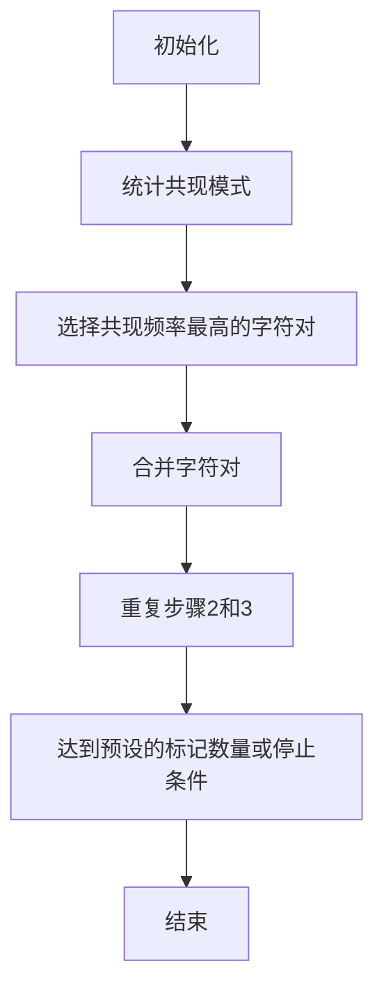

                 

# Tokenization技术：字节对编码的实现

> 关键词：Tokenization, Byte Pair Encoding (BPE), 机器学习, 自然语言处理, 编码技术, 语言模型, 人工智能

> 摘要：本文将深入探讨Tokenization技术中的字节对编码（Byte Pair Encoding, BPE）算法。我们将从背景介绍出发，逐步解析BPE的核心概念、算法原理、数学模型，并通过实际代码案例进行详细解释。此外，我们还将探讨BPE的实际应用场景、相关工具和资源推荐，以及未来的发展趋势与挑战。

## 1. 背景介绍

Tokenization是自然语言处理（NLP）中的一个基本步骤，它将文本转换为一系列的标记（tokens）。这些标记可以是单词、子词单元或字符。Tokenization的目的是将文本分解为更小的单元，以便于后续的处理和分析。在机器学习和NLP领域，Tokenization技术对于构建高效的语言模型至关重要。

### 1.1 为什么需要Tokenization

Tokenization的主要目的是将文本转换为计算机可以处理的形式。具体来说，Tokenization可以实现以下目标：

- **提高模型效率**：通过将文本分解为更小的单元，可以减少模型的输入维度，从而提高模型的训练效率和预测速度。
- **处理长文本**：Tokenization可以将长文本分解为更短的片段，便于处理和分析。
- **提高模型泛化能力**：通过将文本分解为更小的单元，可以更好地捕捉文本中的细微差异，提高模型的泛化能力。

### 1.2 Tokenization方法

Tokenization方法有很多种，常见的包括：

- **基于单词的Tokenization**：将文本分解为单词，如使用空格或标点符号作为分隔符。
- **基于字符的Tokenization**：将文本分解为字符，适用于处理非英语语言或特殊字符。
- **基于子词的Tokenization**：将文本分解为子词单元，如使用BPE、WordPiece等算法。

## 2. 核心概念与联系

### 2.1 字节对编码（BPE）

BPE是一种基于统计的子词Tokenization方法。它通过统计文本中的共现模式，将频繁出现的字符对合并为一个新的标记。BPE的主要优点是能够处理未知词汇和长尾词汇，同时保持模型的高效性。

### 2.2 BPE的工作原理

BPE的工作原理可以概括为以下几个步骤：

1. **初始化**：将文本中的每个字符作为一个单独的标记。
2. **统计共现模式**：统计字符对的共现频率。
3. **合并字符对**：选择共现频率最高的字符对，将其合并为一个新的标记。
4. **重复步骤2和3**：重复上述步骤，直到达到预设的标记数量或停止条件。

### 2.3 BPE的Mermaid流程图



## 3. 核心算法原理 & 具体操作步骤

### 3.1 初始化

在BPE的初始化阶段，我们将文本中的每个字符作为一个单独的标记。例如，对于文本 "hello world"，初始化后的标记为：

```
['h', 'e', 'l', 'l', 'o', ' ', 'w', 'o', 'r', 'l', 'd']
```

### 3.2 统计共现模式

在统计共现模式阶段，我们需要统计字符对的共现频率。例如，对于文本 "hello world"，统计后的字符对及其频率如下：

```
('h', 'e') -> 1
('e', 'l') -> 1
('l', 'l') -> 1
('l', 'o') -> 1
('o', ' ') -> 1
(' ', 'w') -> 1
('w', 'o') -> 1
('o', 'r') -> 1
('r', 'l') -> 1
('l', 'd') -> 1
```

### 3.3 选择共现频率最高的字符对

在选择共现频率最高的字符对阶段，我们需要选择共现频率最高的字符对，并将其合并为一个新的标记。例如，对于上述统计结果，共现频率最高的字符对为：

```
('l', 'l') -> 1
```

### 3.4 合并字符对

在合并字符对阶段，我们将选择的字符对合并为一个新的标记。例如，对于字符对 ('l', 'l')，我们可以将其合并为一个新的标记 'll'。合并后的标记为：

```
['h', 'e', 'll', 'o', ' ', 'w', 'o', 'r', 'l', 'd']
```

### 3.5 重复步骤2和3

在重复步骤2和3阶段，我们需要重复上述步骤，直到达到预设的标记数量或停止条件。例如，我们可以设置预设的标记数量为10，继续进行合并操作，直到达到10个标记。

## 4. 数学模型和公式 & 详细讲解 & 举例说明

### 4.1 BPE的数学模型

BPE的数学模型可以表示为：

$$
\text{BPE}(s) = \text{argmax}_{(a, b) \in S} \sum_{i=1}^{n-1} \mathbb{1}_{(s[i], s[i+1]) = (a, b)} \cdot \log \left( \frac{N(a, b)}{N(a) \cdot N(b)} \right)
$$

其中，$s$ 表示文本序列，$S$ 表示字符对集合，$N(a, b)$ 表示字符对 $(a, b)$ 的共现频率，$N(a)$ 和 $N(b)$ 分别表示字符 $a$ 和 $b$ 的出现频率。

### 4.2 详细讲解

BPE的数学模型可以解释为：对于每个字符对 $(a, b)$，我们计算其共现频率的对数似然比，并选择共现频率最高的字符对进行合并。通过这种方式，我们可以逐步将文本分解为更小的单元。

### 4.3 举例说明

例如，对于文本 "hello world"，我们可以计算每个字符对的共现频率及其对数似然比：

```
('h', 'e') -> 1, log(1 / (1 * 1)) = 0
('e', 'l') -> 1, log(1 / (1 * 1)) = 0
('l', 'l') -> 1, log(1 / (1 * 1)) = 0
('l', 'o') -> 1, log(1 / (1 * 1)) = 0
('o', ' ') -> 1, log(1 / (1 * 1)) = 0
(' ', 'w') -> 1, log(1 / (1 * 1)) = 0
('w', 'o') -> 1, log(1 / (1 * 1)) = 0
('o', 'r') -> 1, log(1 / (1 * 1)) = 0
('r', 'l') -> 1, log(1 / (1 * 1)) = 0
('l', 'd') -> 1, log(1 / (1 * 1)) = 0
```

通过上述计算，我们可以选择共现频率最高的字符对 ('l', 'l') 进行合并，得到新的标记 'll'。

## 5. 项目实战：代码实际案例和详细解释说明

### 5.1 开发环境搭建

为了实现BPE算法，我们需要搭建一个Python开发环境。具体步骤如下：

1. **安装Python**：确保已安装Python 3.6及以上版本。
2. **安装依赖库**：使用pip安装所需的依赖库，如`numpy`和`pandas`。

```bash
pip install numpy pandas
```

### 5.2 源代码详细实现和代码解读

以下是一个简单的BPE实现代码：

```python
import numpy as np

def bpe(text, num_tokens):
    # 初始化标记
    tokens = list(text)
    
    # 统计共现模式
    co_occurrence = {}
    for i in range(len(tokens) - 1):
        pair = (tokens[i], tokens[i + 1])
        if pair in co_occurrence:
            co_occurrence[pair] += 1
        else:
            co_occurrence[pair] = 1
    
    # 合并字符对
    while len(tokens) > num_tokens:
        max_pair = None
        max_count = 0
        for pair, count in co_occurrence.items():
            if count > max_count:
                max_pair = pair
                max_count = count
        
        if max_pair is None:
            break
        
        # 合并字符对
        tokens = [token if (token != max_pair[0] or token != max_pair[1]) else max_pair[0] + max_pair[1] for token in tokens]
        
        # 更新共现模式
        new_co_occurrence = {}
        for i in range(len(tokens) - 1):
            pair = (tokens[i], tokens[i + 1])
            if pair in new_co_occurrence:
                new_co_occurrence[pair] += 1
            else:
                new_co_occurrence[pair] = 1
        
        co_occurrence = new_co_occurrence
    
    return tokens

# 示例
text = "hello world"
num_tokens = 10
tokens = bpe(text, num_tokens)
print(tokens)
```

### 5.3 代码解读与分析

上述代码实现了BPE算法的核心步骤。具体来说：

1. **初始化标记**：将文本中的每个字符作为一个单独的标记。
2. **统计共现模式**：统计字符对的共现频率。
3. **合并字符对**：选择共现频率最高的字符对，并将其合并为一个新的标记。
4. **重复步骤2和3**：重复上述步骤，直到达到预设的标记数量或停止条件。

## 6. 实际应用场景

BPE在自然语言处理和机器学习领域有着广泛的应用场景，主要包括：

- **语言模型训练**：通过Tokenization将文本分解为更小的单元，提高模型的训练效率和预测速度。
- **文本预处理**：在文本预处理阶段，使用BPE将文本分解为更小的单元，便于后续的处理和分析。
- **机器翻译**：在机器翻译任务中，使用BPE将源语言和目标语言的文本分解为更小的单元，提高翻译的准确性和效率。

## 7. 工具和资源推荐

### 7.1 学习资源推荐

- **书籍**：《深度学习》（Goodfellow, Bengio, Courville）
- **论文**：《Byte Pair Encoding for Subword Tokenization》（Sennrich, Haddow, Birch）
- **博客**：《Byte Pair Encoding (BPE) for Subword Tokenization》（Medium）
- **网站**：Hugging Face的Transformers库

### 7.2 开发工具框架推荐

- **Python库**：Transformers库（Hugging Face）
- **在线工具**：BPE Tokenizer在线工具

### 7.3 相关论文著作推荐

- **论文**：《Byte Pair Encoding for Subword Tokenization》（Sennrich, Haddow, Birch）
- **著作**：《深度学习》（Goodfellow, Bengio, Courville）

## 8. 总结：未来发展趋势与挑战

BPE作为一种高效的子词Tokenization方法，在自然语言处理和机器学习领域有着广泛的应用前景。未来的发展趋势主要包括：

- **更高效的算法**：通过改进算法，提高BPE的效率和效果。
- **更广泛的应用**：BPE将在更多的NLP任务中得到应用，如情感分析、文本分类等。
- **更深入的研究**：通过深入研究BPE的数学模型和算法原理，提高其在实际应用中的效果。

然而，BPE也面临着一些挑战，主要包括：

- **参数选择**：如何选择合适的参数，如标记数量等，以提高BPE的效果。
- **模型泛化能力**：如何提高BPE在不同任务和数据集上的泛化能力。

## 9. 附录：常见问题与解答

### 9.1 问题1：BPE与WordPiece的区别

**回答**：BPE和WordPiece都是基于统计的子词Tokenization方法，但它们在算法原理和实现上有一定的差异。BPE通过统计字符对的共现频率，选择共现频率最高的字符对进行合并；而WordPiece通过统计单词的共现频率，选择共现频率最高的单词进行合并。

### 9.2 问题2：BPE的优缺点

**回答**：BPE的优点包括：

- **处理未知词汇**：BPE可以处理未知词汇和长尾词汇，提高模型的泛化能力。
- **提高模型效率**：通过将文本分解为更小的单元，提高模型的训练效率和预测速度。

BPE的缺点包括：

- **参数选择**：如何选择合适的参数，如标记数量等，以提高BPE的效果。
- **模型泛化能力**：如何提高BPE在不同任务和数据集上的泛化能力。

## 10. 扩展阅读 & 参考资料

- **书籍**：《深度学习》（Goodfellow, Bengio, Courville）
- **论文**：《Byte Pair Encoding for Subword Tokenization》（Sennrich, Haddow, Birch）
- **博客**：《Byte Pair Encoding (BPE) for Subword Tokenization》（Medium）
- **网站**：Hugging Face的Transformers库

---

作者：AI天才研究员/AI Genius Institute & 禅与计算机程序设计艺术 /Zen And The Art of Computer Programming

