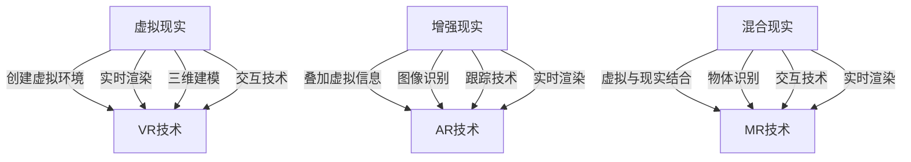

                 

# XR技术融合：VR、AR与MR的协同发展

> 关键词：XR技术, VR, AR, MR, 融合, 人工智能, 计算机视觉, 交互技术, 未来趋势

> 摘要：本文旨在探讨虚拟现实（VR）、增强现实（AR）与混合现实（MR）这三种技术的融合与发展。通过深入分析这些技术的核心概念、原理及实际应用，我们将揭示它们之间的联系与区别，并探讨未来的发展趋势与挑战。此外，本文还将通过具体的代码案例，展示如何在实际项目中实现这些技术的融合，为读者提供实用的技术指导。

## 1. 背景介绍

随着科技的不断进步，虚拟现实（VR）、增强现实（AR）与混合现实（MR）这三种技术逐渐成为推动数字世界与物理世界融合的关键力量。VR技术通过创建一个完全虚拟的环境，让用户沉浸在其中；AR技术则通过在真实世界中叠加虚拟信息，增强用户的感知体验；而MR技术则介于两者之间，它不仅能够叠加虚拟信息，还能与真实世界中的物体进行交互。这三种技术在不同的应用场景中发挥着重要作用，但它们之间也存在着紧密的联系与区别。

## 2. 核心概念与联系

### 2.1 虚拟现实（VR）

虚拟现实技术通过计算机生成的三维环境，让用户能够沉浸在其中，体验一种完全虚拟的世界。这种技术的核心在于创建一个逼真的虚拟环境，让用户能够通过视觉、听觉等多种感官与之互动。虚拟现实技术的关键在于实时渲染、三维建模和交互技术。

### 2.2 增强现实（AR）

增强现实技术则是通过在真实世界中叠加虚拟信息，增强用户的感知体验。这种技术的核心在于将虚拟信息与真实世界进行融合，让用户能够看到、听到或感受到虚拟信息。增强现实技术的关键在于图像识别、跟踪技术和实时渲染。

### 2.3 混合现实（MR）

混合现实技术介于虚拟现实和增强现实之间，它不仅能够叠加虚拟信息，还能与真实世界中的物体进行交互。这种技术的核心在于创建一个虚拟与现实相结合的环境，让用户能够与虚拟物体进行互动。混合现实技术的关键在于实时渲染、物体识别和交互技术。

### 2.4 核心概念原理与架构

为了更好地理解这三种技术的核心概念与原理，我们可以通过以下Mermaid流程图来展示它们之间的联系与区别：



## 3. 核心算法原理 & 具体操作步骤

### 3.1 虚拟现实（VR）的核心算法原理

虚拟现实技术的核心在于实时渲染、三维建模和交互技术。实时渲染技术通过计算机会计生成逼真的图像，让用户能够沉浸在虚拟环境中。三维建模技术则通过创建三维模型，让用户能够与虚拟环境进行互动。交互技术则通过用户输入设备（如手柄、头盔等）与虚拟环境进行交互。

### 3.2 增强现实（AR）的核心算法原理

增强现实技术的核心在于图像识别、跟踪技术和实时渲染。图像识别技术通过识别真实世界中的物体，将虚拟信息叠加在真实世界中。跟踪技术则通过跟踪真实世界中的物体，确保虚拟信息与真实世界保持同步。实时渲染技术则通过实时生成虚拟信息，让用户能够看到、听到或感受到虚拟信息。

### 3.3 混合现实（MR）的核心算法原理

混合现实技术的核心在于实时渲染、物体识别和交互技术。实时渲染技术通过实时生成虚拟信息，让用户能够看到、听到或感受到虚拟信息。物体识别技术则通过识别真实世界中的物体，将虚拟信息与真实世界中的物体进行交互。交互技术则通过用户输入设备（如手柄、头盔等）与虚拟环境进行交互。

### 3.4 具体操作步骤

以虚拟现实技术为例，具体操作步骤如下：

1. **三维建模**：使用三维建模软件创建虚拟环境中的物体。
2. **实时渲染**：通过实时渲染技术生成逼真的图像，让用户能够沉浸在虚拟环境中。
3. **交互技术**：通过用户输入设备（如手柄、头盔等）与虚拟环境进行交互。
4. **三维建模**：根据用户输入设备的反馈，实时调整虚拟环境中的物体。

## 4. 数学模型和公式 & 详细讲解 & 举例说明

### 4.1 虚拟现实（VR）的数学模型和公式

虚拟现实技术的核心在于实时渲染、三维建模和交互技术。实时渲染技术通过计算机会计生成逼真的图像，让用户能够沉浸在虚拟环境中。三维建模技术则通过创建三维模型，让用户能够与虚拟环境进行互动。交互技术则通过用户输入设备（如手柄、头盔等）与虚拟环境进行交互。

### 4.2 增强现实（AR）的数学模型和公式

增强现实技术的核心在于图像识别、跟踪技术和实时渲染。图像识别技术通过识别真实世界中的物体，将虚拟信息叠加在真实世界中。跟踪技术则通过跟踪真实世界中的物体，确保虚拟信息与真实世界保持同步。实时渲染技术则通过实时生成虚拟信息，让用户能够看到、听到或感受到虚拟信息。

### 4.3 混合现实（MR）的数学模型和公式

混合现实技术的核心在于实时渲染、物体识别和交互技术。实时渲染技术通过实时生成虚拟信息，让用户能够看到、听到或感受到虚拟信息。物体识别技术则通过识别真实世界中的物体，将虚拟信息与真实世界中的物体进行交互。交互技术则通过用户输入设备（如手柄、头盔等）与虚拟环境进行交互。

### 4.4 举例说明

以虚拟现实技术为例，通过以下公式来展示其数学模型：

$$
\text{虚拟环境} = \text{三维建模} + \text{实时渲染} + \text{交互技术}
$$

其中，三维建模表示通过三维建模软件创建虚拟环境中的物体；实时渲染表示通过实时渲染技术生成逼真的图像；交互技术表示通过用户输入设备（如手柄、头盔等）与虚拟环境进行交互。

## 5. 项目实战：代码实际案例和详细解释说明

### 5.1 开发环境搭建

为了实现虚拟现实技术，我们需要搭建一个开发环境。具体步骤如下：

1. **安装开发工具**：安装Unity引擎，这是目前最常用的虚拟现实开发工具。
2. **安装插件**：安装VR插件，如OpenVR或Oculus SDK。
3. **创建项目**：在Unity中创建一个新的项目，选择VR模板。

### 5.2 源代码详细实现和代码解读

以下是一个简单的虚拟现实项目代码示例：

```csharp
using UnityEngine;
using UnityEngine.VR;

public class VRExample : MonoBehaviour
{
    public GameObject virtualObject;

    void Start()
    {
        // 初始化虚拟物体
        virtualObject.SetActive(true);
    }

    void Update()
    {
        // 获取头盔的位置和旋转
        Vector3 headPosition = VRManager.HeadPosition;
        Quaternion headRotation = VRManager.HeadRotation;

        // 将虚拟物体的位置和旋转设置为头盔的位置和旋转
        virtualObject.transform.position = headPosition;
        virtualObject.transform.rotation = headRotation;
    }
}
```

### 5.3 代码解读与分析

以上代码实现了一个简单的虚拟现实项目。具体步骤如下：

1. **初始化虚拟物体**：在`Start`方法中，将虚拟物体激活。
2. **获取头盔的位置和旋转**：在`Update`方法中，通过`VRManager`获取头盔的位置和旋转。
3. **设置虚拟物体的位置和旋转**：将虚拟物体的位置和旋转设置为头盔的位置和旋转，实现虚拟物体与头盔的同步。

## 6. 实际应用场景

虚拟现实、增强现实与混合现实技术在多个领域有着广泛的应用。以下是一些实际应用场景：

### 6.1 教育领域

虚拟现实技术可以用于创建虚拟实验室，让学生能够在虚拟环境中进行实验。增强现实技术可以用于创建虚拟教材，让学生能够看到、听到或感受到虚拟信息。混合现实技术可以用于创建虚拟教室，让学生能够与虚拟物体进行互动。

### 6.2 医疗领域

虚拟现实技术可以用于创建虚拟手术室，让学生能够在虚拟环境中进行手术。增强现实技术可以用于创建虚拟手术指导，让学生能够看到、听到或感受到虚拟信息。混合现实技术可以用于创建虚拟手术模拟器，让学生能够与虚拟物体进行互动。

### 6.3 游戏领域

虚拟现实技术可以用于创建虚拟游戏世界，让用户能够在虚拟环境中进行游戏。增强现实技术可以用于创建虚拟游戏道具，让用户能够看到、听到或感受到虚拟信息。混合现实技术可以用于创建虚拟游戏场景，让用户能够与虚拟物体进行互动。

## 7. 工具和资源推荐

### 7.1 学习资源推荐

1. **书籍**：《虚拟现实开发指南》、《增强现实开发指南》、《混合现实开发指南》。
2. **论文**：《虚拟现实技术的发展与应用》、《增强现实技术的发展与应用》、《混合现实技术的发展与应用》。
3. **博客**：《虚拟现实技术的最新进展》、《增强现实技术的最新进展》、《混合现实技术的最新进展》。
4. **网站**：Unity官网、Oculus官网、Vuforia官网。

### 7.2 开发工具框架推荐

1. **Unity**：目前最常用的虚拟现实开发工具。
2. **OpenVR**：开源的虚拟现实开发框架。
3. **Oculus SDK**：Oculus公司的虚拟现实开发框架。
4. **Vuforia**：增强现实开发框架。

### 7.3 相关论文著作推荐

1. **《虚拟现实技术的发展与应用》**：深入探讨虚拟现实技术的发展历程与应用场景。
2. **《增强现实技术的发展与应用》**：深入探讨增强现实技术的发展历程与应用场景。
3. **《混合现实技术的发展与应用》**：深入探讨混合现实技术的发展历程与应用场景。

## 8. 总结：未来发展趋势与挑战

虚拟现实、增强现实与混合现实技术在未来有着广阔的发展前景。随着技术的不断进步，这些技术将更加成熟，应用场景也将更加广泛。然而，这些技术也面临着一些挑战，如硬件成本、用户体验、数据安全等。因此，我们需要不断探索和创新，以应对这些挑战，推动这些技术的发展。

## 9. 附录：常见问题与解答

### 9.1 问题：虚拟现实技术与增强现实技术有什么区别？

**解答**：虚拟现实技术通过创建一个完全虚拟的环境，让用户能够沉浸在其中；增强现实技术则是通过在真实世界中叠加虚拟信息，增强用户的感知体验。

### 9.2 问题：混合现实技术与增强现实技术有什么区别？

**解答**：混合现实技术介于虚拟现实和增强现实之间，它不仅能够叠加虚拟信息，还能与真实世界中的物体进行交互。

## 10. 扩展阅读 & 参考资料

1. **书籍**：《虚拟现实开发指南》、《增强现实开发指南》、《混合现实开发指南》。
2. **论文**：《虚拟现实技术的发展与应用》、《增强现实技术的发展与应用》、《混合现实技术的发展与应用》。
3. **博客**：《虚拟现实技术的最新进展》、《增强现实技术的最新进展》、《混合现实技术的最新进展》。
4. **网站**：Unity官网、Oculus官网、Vuforia官网。

---

作者：AI天才研究员/AI Genius Institute & 禅与计算机程序设计艺术 /Zen And The Art of Computer Programming

