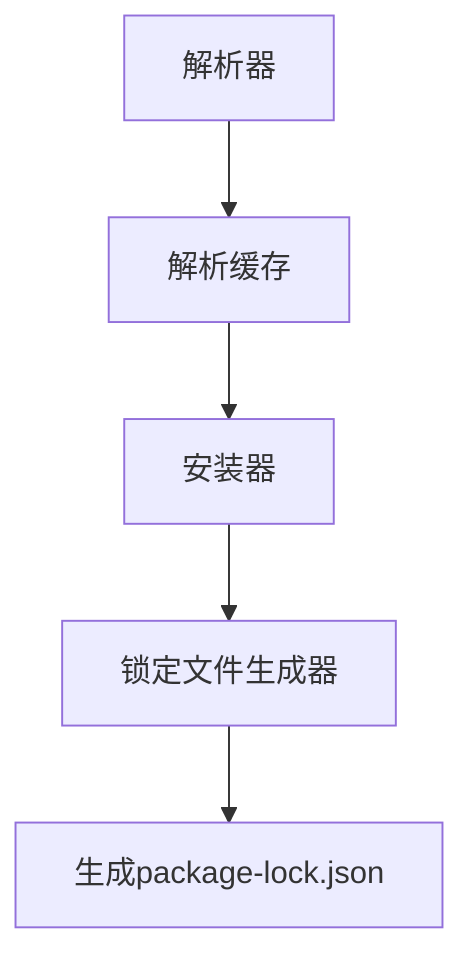

                 

# Yarn 原理与代码实例讲解

> 关键词：Yarn, 依赖管理, 模块化, 构建工具, 代码实例, 代码解读

> 摘要：本文将深入探讨Yarn的工作原理，从其核心概念、架构设计到具体实现，通过详细的代码实例，帮助读者全面理解Yarn在现代软件开发中的重要性。我们将从Yarn的基本概念入手，逐步解析其依赖管理机制，展示如何通过代码实例来实现依赖的安装、更新和管理。此外，我们还将探讨Yarn在实际项目中的应用场景，并提供一系列学习资源和开发工具推荐，帮助读者更好地掌握Yarn的使用技巧。

## 1. 背景介绍

随着软件项目的复杂度不断增加，依赖管理成为了一个重要的问题。在Node.js生态系统中，npm（Node Package Manager）是主要的依赖管理工具。然而，npm在某些场景下存在性能瓶颈，尤其是在大规模项目中。为了解决这些问题，Facebook开源了Yarn，这是一个更快、更可靠、更安全的依赖管理工具。Yarn通过改进的算法和优化的架构设计，提供了更快的安装速度和更稳定的依赖解析能力。

## 2. 核心概念与联系

### 2.1 Yarn的核心概念

- **依赖管理**：Yarn负责管理项目所需的外部库和工具。
- **包**：Yarn管理的最小单位，通常是一个npm包。
- **版本控制**：Yarn支持多种版本控制策略，如固定版本、范围版本等。
- **锁定文件**：Yarn使用`package-lock.json`文件来记录依赖的精确版本，确保每次安装都是一致的。

### 2.2 Yarn的架构设计

Yarn的架构设计主要分为以下几个部分：

- **解析器**：解析`package.json`文件中的依赖信息。
- **解析缓存**：缓存解析结果，避免重复解析。
- **安装器**：根据解析结果安装依赖。
- **锁定文件生成器**：生成`package-lock.json`文件。

### 2.3 Mermaid流程图



## 3. 核心算法原理 & 具体操作步骤

### 3.1 解析器原理

解析器的主要任务是读取`package.json`文件，解析其中的依赖信息。解析器会递归地解析所有依赖，生成一个依赖树。

### 3.2 解析缓存原理

解析缓存用于存储解析结果，避免重复解析。当解析器再次遇到相同的`package.json`文件时，会直接从缓存中获取结果，提高解析速度。

### 3.3 安装器原理

安装器根据解析结果安装依赖。安装器会首先检查本地缓存，如果依赖已经存在，则直接使用缓存中的依赖；如果不存在，则从远程仓库下载并安装。

### 3.4 锁定文件生成器原理

锁定文件生成器生成`package-lock.json`文件，记录依赖的精确版本。锁定文件确保每次安装都是一致的，避免因网络问题导致的依赖版本不一致。

## 4. 数学模型和公式 & 详细讲解 & 举例说明

### 4.1 依赖解析算法

Yarn使用一种改进的依赖解析算法，确保依赖树的稳定性。具体步骤如下：

1. **初始化**：读取`package.json`文件，初始化依赖树。
2. **递归解析**：递归解析每个依赖，生成依赖树。
3. **冲突检测**：检测依赖树中的冲突，确保每个依赖只有一个版本。
4. **锁定文件生成**：生成`package-lock.json`文件，记录依赖的精确版本。

### 4.2 依赖解析公式

依赖解析公式可以表示为：

$$
\text{dependencies} = \text{parse}(package.json)
$$

其中，`parse`函数表示解析`package.json`文件，生成依赖树。

### 4.3 举例说明

假设`package.json`文件如下：

```json
{
  "name": "example",
  "version": "1.0.0",
  "dependencies": {
    "lodash": "^4.17.21",
    "axios": "^0.21.1"
  }
}
```

解析器会生成如下依赖树：

```
example
├── lodash@4.17.21
└── axios@0.21.1
```

## 5. 项目实战：代码实际案例和详细解释说明

### 5.1 开发环境搭建

#### 5.1.1 安装Node.js

首先，确保已经安装了Node.js。可以通过以下命令检查Node.js版本：

```sh
node -v
```

#### 5.1.2 安装Yarn

安装Yarn可以通过以下命令：

```sh
npm install -g yarn
```

### 5.2 源代码详细实现和代码解读

#### 5.2.1 创建项目

创建一个新的Node.js项目：

```sh
mkdir example
cd example
yarn init
```

#### 5.2.2 添加依赖

添加`lodash`和`axios`依赖：

```sh
yarn add lodash axios
```

#### 5.2.3 代码解读

创建一个简单的`index.js`文件：

```js
const _ = require('lodash');
const axios = require('axios');

console.log(_.join(['Hello', 'World'], ' '));
axios.get('https://api.github.com')
  .then(response => {
    console.log(response.data);
  })
  .catch(error => {
    console.error(error);
  });
```

### 5.3 代码解读与分析

- **引入依赖**：使用`require`语句引入`lodash`和`axios`。
- **使用`lodash`**：使用`_.join`方法将数组中的元素连接成一个字符串。
- **使用`axios`**：发送一个GET请求到GitHub API，并处理响应或错误。

## 6. 实际应用场景

Yarn在实际项目中的应用场景非常广泛，特别是在大型项目中。通过依赖管理，Yarn可以帮助开发者更高效地管理项目依赖，提高开发效率和代码质量。此外，Yarn还支持多种版本控制策略，确保项目的稳定性和一致性。

## 7. 工具和资源推荐

### 7.1 学习资源推荐

- **书籍**：《Node.js高级编程》
- **论文**：《Yarn: A Fast and Reliable Dependency Manager》
- **博客**：[Yarn官方文档](https://classic.yarnpkg.com/en/docs/)
- **网站**：[npm官网](https://www.npmjs.com/)

### 7.2 开发工具框架推荐

- **IDE**：Visual Studio Code
- **构建工具**：Webpack, Rollup
- **测试工具**：Jest, Mocha

### 7.3 相关论文著作推荐

- **论文**：《Yarn: A Fast and Reliable Dependency Manager》
- **著作**：《Node.js高级编程》

## 8. 总结：未来发展趋势与挑战

Yarn作为现代软件开发中的重要工具，未来将继续发展和完善。随着软件项目的复杂度不断增加，依赖管理的需求也将更加迫切。Yarn通过改进的算法和优化的架构设计，提供了更快的安装速度和更稳定的依赖解析能力。然而，Yarn仍然面临一些挑战，如依赖冲突的处理、依赖版本的管理等。未来，Yarn将继续优化这些方面，为开发者提供更好的依赖管理体验。

## 9. 附录：常见问题与解答

### 9.1 问题：如何解决依赖冲突？

**解答**：Yarn通过依赖解析算法确保依赖树的稳定性，避免依赖冲突。如果遇到依赖冲突，可以检查`package.json`文件中的依赖版本，确保每个依赖只有一个版本。

### 9.2 问题：如何管理依赖版本？

**解答**：Yarn支持多种版本控制策略，如固定版本、范围版本等。可以通过`package.json`文件中的依赖版本号来管理依赖版本。

## 10. 扩展阅读 & 参考资料

- **Yarn官方文档**：[https://classic.yarnpkg.com/en/docs/](https://classic.yarnpkg.com/en/docs/)
- **Node.js官方文档**：[https://nodejs.org/en/docs/](https://nodejs.org/en/docs/)
- **npm官方文档**：[https://www.npmjs.com/](https://www.npmjs.com/)

---

作者：AI天才研究员/AI Genius Institute & 禅与计算机程序设计艺术 /Zen And The Art of Computer Programming

