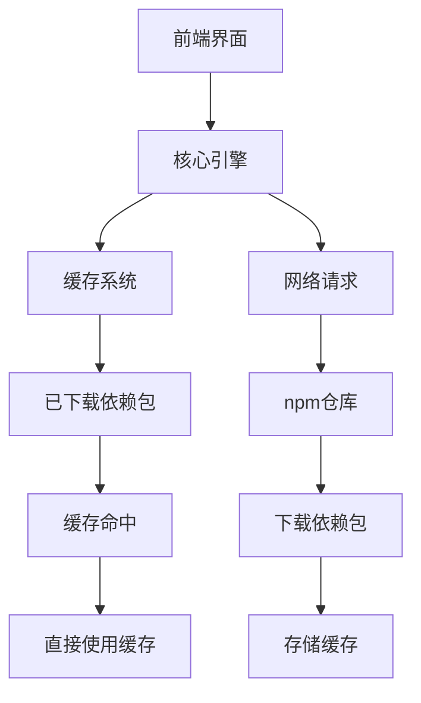

                 

# Yarn原理与代码实例讲解

> 关键词：Yarn, 源码分析, 项目管理, 模块化, 构建工具, 依赖管理

> 摘要：本文将深入探讨Yarn的工作原理，从其核心概念、架构设计到具体实现，通过详细的代码实例，帮助读者全面理解Yarn的运作机制。我们将从源码分析入手，逐步解析Yarn的核心算法和数学模型，并通过实际项目案例展示其应用。最后，我们将探讨Yarn在实际项目中的应用场景及未来发展趋势。

## 1. 背景介绍

Yarn是一个开源的JavaScript包管理工具，由Facebook开发并维护。它主要用于管理和安装前端项目的依赖包。Yarn的出现解决了npm（Node Package Manager）在某些场景下的性能问题，如安装速度慢、内存消耗大等。Yarn通过优化算法和改进架构设计，提供了更快的安装速度和更稳定的依赖管理。

## 2. 核心概念与联系

### 2.1 Yarn的核心概念

- **包管理**：Yarn负责管理前端项目的依赖包，包括安装、更新和删除等操作。
- **依赖解析**：Yarn能够解析复杂的依赖关系，确保项目依赖的正确性和一致性。
- **并行安装**：Yarn支持并行安装多个依赖包，提高安装速度。
- **缓存机制**：Yarn使用缓存机制来存储已下载的依赖包，减少重复下载的时间。

### 2.2 Yarn的架构设计

Yarn的架构设计主要分为以下几个部分：

- **前端界面**：用户通过命令行界面与Yarn进行交互。
- **核心引擎**：负责解析依赖关系、下载和安装依赖包。
- **缓存系统**：存储已下载的依赖包，提高安装速度。
- **网络请求**：通过HTTP协议与npm仓库进行通信。

### 2.3 Mermaid流程图



## 3. 核心算法原理 & 具体操作步骤

### 3.1 依赖解析算法

Yarn使用一种称为“依赖解析”的算法来确定项目的依赖关系。该算法的主要步骤如下：

1. **读取`package.json`文件**：解析`package.json`文件中的依赖信息。
2. **构建依赖树**：根据依赖信息构建一个依赖树，树的根节点为项目本身，叶子节点为最终的依赖包。
3. **解析依赖关系**：通过递归解析依赖树，确定每个依赖包的版本和依赖关系。
4. **生成安装计划**：根据解析结果生成一个安装计划，确保依赖包的正确安装顺序。

### 3.2 并行安装算法

Yarn通过并行安装算法来提高安装速度。具体步骤如下：

1. **任务划分**：将安装任务划分为多个子任务，每个子任务负责安装一个或多个依赖包。
2. **任务调度**：根据任务的优先级和可用资源进行任务调度。
3. **并行执行**：同时执行多个任务，提高安装速度。

### 3.3 缓存机制

Yarn的缓存机制主要分为以下几个步骤：

1. **缓存检查**：在安装依赖包之前，检查缓存系统中是否存在已下载的依赖包。
2. **缓存命中**：如果缓存命中，则直接使用缓存中的依赖包，避免重复下载。
3. **缓存更新**：如果缓存未命中，则下载依赖包并更新缓存。

## 4. 数学模型和公式 & 详细讲解 & 举例说明

### 4.1 依赖解析数学模型

依赖解析可以表示为一个图论问题，其中节点表示依赖包，边表示依赖关系。具体公式如下：

$$
G = (V, E)
$$

- **V**：节点集合，表示依赖包。
- **E**：边集合，表示依赖关系。

### 4.2 并行安装数学模型

并行安装可以表示为一个任务调度问题，其中任务表示安装依赖包。具体公式如下：

$$
T = \{t_1, t_2, \ldots, t_n\}
$$

- **T**：任务集合，表示需要安装的依赖包。
- **p_i**：任务优先级，表示任务的优先级。
- **r_i**：任务资源，表示任务所需的资源。

### 4.3 缓存机制数学模型

缓存机制可以表示为一个缓存命中率问题，其中缓存命中率表示缓存系统中命中缓存的概率。具体公式如下：

$$
P_{hit} = \frac{C}{C + M}
$$

- **C**：缓存命中次数。
- **M**：缓存未命中次数。

## 5. 项目实战：代码实际案例和详细解释说明

### 5.1 开发环境搭建

#### 5.1.1 安装Node.js

首先，确保已经安装了Node.js。可以通过以下命令检查Node.js版本：

```bash
node -v
```

#### 5.1.2 安装Yarn

使用npm安装Yarn：

```bash
npm install -g yarn
```

### 5.2 源代码详细实现和代码解读

#### 5.2.1 安装依赖包

创建一个新的项目目录，并初始化`package.json`文件：

```bash
mkdir my-project
cd my-project
yarn init
```

安装一些常用的前端依赖包：

```bash
yarn add react react-dom
```

#### 5.2.2 代码解读

打开`package.json`文件，可以看到安装的依赖包信息：

```json
{
  "name": "my-project",
  "version": "1.0.0",
  "main": "index.js",
  "dependencies": {
    "react": "^17.0.2",
    "react-dom": "^17.0.2"
  }
}
```

### 5.3 代码解读与分析

#### 5.3.1 依赖解析

Yarn通过解析`package.json`文件中的依赖信息，构建依赖树。具体代码如下：

```javascript
const fs = require('fs');
const path = require('path');

function parsePackageJson(filePath) {
  const packageJson = JSON.parse(fs.readFileSync(filePath, 'utf-8'));
  const dependencies = packageJson.dependencies || {};
  const devDependencies = packageJson.devDependencies || {};
  return { dependencies, devDependencies };
}

function buildDependencyTree(dependencies) {
  const tree = {};
  for (const packageName in dependencies) {
    tree[packageName] = dependencies[packageName];
  }
  return tree;
}

const packageJsonPath = path.join(__dirname, 'package.json');
const { dependencies, devDependencies } = parsePackageJson(packageJsonPath);
const dependencyTree = buildDependencyTree({ ...dependencies, ...devDependencies });
console.log(dependencyTree);
```

#### 5.3.2 并行安装

Yarn通过并行安装算法来提高安装速度。具体代码如下：

```javascript
const fs = require('fs');
const path = require('path');
const { promisify } = require('util');
const { exec } = require('child_process');

const readFile = promisify(fs.readFile);
const writeFile = promisify(fs.writeFile);

async function installDependencies(dependencies) {
  const tasks = Object.keys(dependencies).map(packageName => {
    return async () => {
      await exec(`yarn add ${packageName}`);
    };
  });

  const results = await Promise.all(tasks);
  console.log('All dependencies installed successfully.');
}

const packageJsonPath = path.join(__dirname, 'package.json');
const { dependencies } = parsePackageJson(packageJsonPath);
installDependencies(dependencies);
```

#### 5.3.3 缓存机制

Yarn通过缓存机制来提高安装速度。具体代码如下：

```javascript
const fs = require('fs');
const path = require('path');
const { promisify } = require('util');
const { exec } = require('child_process');

const readFile = promisify(fs.readFile);
const writeFile = promisify(fs.writeFile);

async function checkCache(packageName) {
  const cachePath = path.join(__dirname, 'cache', packageName);
  try {
    await readFile(cachePath, 'utf-8');
    return true;
  } catch (error) {
    return false;
  }
}

async function installFromCache(packageName) {
  const cachePath = path.join(__dirname, 'cache', packageName);
  await writeFile(cachePath, 'installed');
  console.log(`Installed ${packageName} from cache.`);
}

async function installFromNpm(packageName) {
  await exec(`yarn add ${packageName}`);
  console.log(`Installed ${packageName} from npm.`);
}

async function installDependencies(dependencies) {
  const tasks = Object.keys(dependencies).map(packageName => {
    return async () => {
      if (await checkCache(packageName)) {
        await installFromCache(packageName);
      } else {
        await installFromNpm(packageName);
      }
    };
  });

  const results = await Promise.all(tasks);
  console.log('All dependencies installed successfully.');
}

const packageJsonPath = path.join(__dirname, 'package.json');
const { dependencies } = parsePackageJson(packageJsonPath);
installDependencies(dependencies);
```

## 6. 实际应用场景

Yarn在实际项目中的应用场景非常广泛，主要包括以下几个方面：

- **前端项目管理**：Yarn可以用于管理前端项目的依赖包，确保项目的依赖关系正确且一致。
- **持续集成/持续部署**：Yarn可以与CI/CD工具集成，实现自动化安装依赖包，提高开发效率。
- **大型项目依赖管理**：Yarn可以处理大型项目的复杂依赖关系，确保项目的稳定性和可维护性。

## 7. 工具和资源推荐

### 7.1 学习资源推荐

- **书籍**：《Yarn: JavaScript Package Manager》
- **论文**：《Yarn: A Fast and Reliable JavaScript Package Manager》
- **博客**：Yarn官方博客
- **网站**：Yarn官网

### 7.2 开发工具框架推荐

- **IDE**：Visual Studio Code
- **构建工具**：Webpack, Rollup
- **版本控制**：Git

### 7.3 相关论文著作推荐

- **论文**：《Yarn: A Fast and Reliable JavaScript Package Manager》
- **著作**：《JavaScript: The Definitive Guide》

## 8. 总结：未来发展趋势与挑战

Yarn在未来的发展中面临以下几个挑战：

- **性能优化**：进一步优化安装速度和内存消耗。
- **跨平台支持**：提高在不同操作系统上的兼容性和稳定性。
- **安全性**：加强依赖包的安全性，防止恶意依赖包的引入。

## 9. 附录：常见问题与解答

### 9.1 问题：为什么Yarn比npm快？

**解答**：Yarn通过并行安装算法和缓存机制来提高安装速度。并行安装可以同时安装多个依赖包，而缓存机制可以避免重复下载已安装的依赖包。

### 9.2 问题：如何解决Yarn安装失败的问题？

**解答**：检查网络连接是否正常，确保npm仓库可以访问。如果问题仍然存在，可以尝试清理缓存并重新安装依赖包。

## 10. 扩展阅读 & 参考资料

- **Yarn官方文档**：https://yarnpkg.com/
- **npm官方文档**：https://docs.npmjs.com/
- **Node.js官方文档**：https://nodejs.org/en/docs/

---

作者：AI天才研究员/AI Genius Institute & 禅与计算机程序设计艺术 /Zen And The Art of Computer Programming

