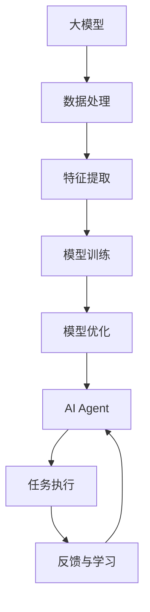

                 

# 【大模型应用开发 动手做AI Agent】Agent带来新的商业模式和变革

> 关键词：大模型、AI Agent、商业模式、变革、开发实践、技术原理、应用场景

> 摘要：本文旨在探讨如何利用大模型开发AI Agent，并通过实际案例展示其在商业模式和变革中的应用。我们将从背景介绍、核心概念与联系、核心算法原理、数学模型和公式、项目实战、实际应用场景、工具和资源推荐、总结与未来展望等多方面进行详细阐述，帮助读者深入了解AI Agent的开发过程及其商业价值。

## 1. 背景介绍

随着人工智能技术的飞速发展，大模型（如Transformer、BERT等）已经成为推动AI领域创新的关键技术。这些模型不仅在自然语言处理、图像识别等领域取得了显著成果，还为构建智能代理（AI Agent）提供了强大的基础。AI Agent是一种能够自主执行任务、学习和适应环境的智能系统，它们在众多领域展现出巨大的潜力，如客户服务、智能推荐、自动化运维等。本文将详细介绍如何利用大模型开发AI Agent，并探讨其带来的商业模式和变革。

## 2. 核心概念与联系

### 2.1 大模型概述

大模型通常指的是参数量巨大、训练数据量丰富、计算资源需求高的机器学习模型。这些模型通过深度学习技术，能够在复杂任务中实现高精度的预测和决策。大模型的核心在于其强大的泛化能力和对大规模数据的处理能力，使得它们能够捕捉到数据中的深层次特征和模式。

### 2.2 AI Agent定义

AI Agent是一种能够自主执行任务、学习和适应环境的智能系统。它通常具备以下特点：
- **自主性**：能够独立完成任务，无需人工干预。
- **学习能力**：能够通过经验不断优化自身行为。
- **适应性**：能够根据环境变化调整策略。
- **交互性**：能够与用户或其他系统进行有效沟通。

### 2.3 大模型与AI Agent的关系

大模型为AI Agent提供了强大的计算能力和学习能力，使得它们能够处理复杂任务并实现高效学习。通过结合大模型和AI Agent，可以构建出更加智能、灵活的系统，从而在多个领域实现创新和变革。

### 2.4 Mermaid流程图



## 3. 核心算法原理 & 具体操作步骤

### 3.1 大模型训练流程

大模型的训练过程主要包括数据预处理、特征提取、模型构建和优化等步骤。

#### 3.1.1 数据预处理

数据预处理是大模型训练的基础，主要包括数据清洗、格式转换和特征工程等步骤。具体操作如下：
1. **数据清洗**：去除无效数据、处理缺失值和异常值。
2. **格式转换**：将数据转换为模型可接受的格式。
3. **特征工程**：提取和选择有用的特征，提高模型性能。

#### 3.1.2 特征提取

特征提取是将原始数据转换为模型能够理解的形式。常用的方法包括：
- **词嵌入**：将文本转换为向量表示。
- **图像特征提取**：使用卷积神经网络（CNN）提取图像特征。
- **时间序列特征提取**：使用循环神经网络（RNN）提取时间序列特征。

#### 3.1.3 模型构建

模型构建是根据任务需求选择合适的模型架构。常见的模型架构包括：
- **Transformer**：适用于自然语言处理任务。
- **BERT**：适用于文本分类、命名实体识别等任务。
- **CNN**：适用于图像识别任务。
- **RNN**：适用于时间序列预测任务。

#### 3.1.4 模型优化

模型优化是通过调整超参数和使用正则化技术提高模型性能。具体操作如下：
1. **超参数调整**：通过网格搜索或随机搜索选择最佳超参数。
2. **正则化**：使用L1、L2正则化防止过拟合。
3. **早停策略**：在验证集上监控性能，防止过拟合。

### 3.2 AI Agent开发流程

AI Agent的开发流程主要包括需求分析、系统设计、编码实现和测试验证等步骤。

#### 3.2.1 需求分析

需求分析是确定AI Agent的功能和性能要求。具体操作如下：
1. **任务定义**：明确AI Agent需要完成的任务。
2. **性能要求**：确定AI Agent的响应时间、准确率等性能指标。
3. **用户需求**：了解用户的具体需求和期望。

#### 3.2.2 系统设计

系统设计是根据需求分析结果设计AI Agent的架构。具体操作如下：
1. **模块划分**：将AI Agent划分为多个模块，如数据处理模块、特征提取模块、模型推理模块等。
2. **接口设计**：定义模块之间的接口，确保模块之间的通信和协作。
3. **系统架构**：选择合适的系统架构，如微服务架构、单体架构等。

#### 3.2.3 编码实现

编码实现是将系统设计转化为实际代码。具体操作如下：
1. **代码编写**：编写实现各模块功能的代码。
2. **模块集成**：将各模块集成到一起，形成完整的系统。
3. **代码测试**：进行单元测试、集成测试和系统测试，确保代码质量。

#### 3.2.4 测试验证

测试验证是确保AI Agent满足需求和性能要求。具体操作如下：
1. **功能测试**：验证AI Agent的功能是否正确实现。
2. **性能测试**：测试AI Agent的响应时间和准确率等性能指标。
3. **用户测试**：邀请用户进行实际使用，收集反馈并优化系统。

## 4. 数学模型和公式 & 详细讲解 & 举例说明

### 4.1 Transformer模型

Transformer模型是大模型中的一种经典架构，适用于自然语言处理任务。其核心思想是通过自注意力机制捕捉输入序列中的长距离依赖关系。

#### 4.1.1 自注意力机制

自注意力机制的核心公式如下：
$$
\text{Attention}(Q, K, V) = \text{softmax}\left(\frac{QK^T}{\sqrt{d_k}}\right)V
$$
其中，$Q$、$K$、$V$分别是查询向量、键向量和值向量，$d_k$是键向量的维度。

#### 4.1.2 Transformer模型结构

Transformer模型由多层编码器和解码器组成，具体结构如下：
- **编码器**：由多个编码器层组成，每个编码器层包含自注意力机制和前馈神经网络。
- **解码器**：由多个解码器层组成，每个解码器层包含自注意力机制、编码器-解码器注意力机制和前馈神经网络。

### 4.2 BERT模型

BERT模型是大模型中的一种经典架构，适用于文本分类、命名实体识别等任务。其核心思想是通过双向自注意力机制捕捉输入序列中的上下文信息。

#### 4.2.1 双向自注意力机制

双向自注意力机制的核心公式如下：
$$
\text{Attention}(Q, K, V) = \text{softmax}\left(\frac{QK^T}{\sqrt{d_k}}\right)V
$$
其中，$Q$、$K$、$V$分别是查询向量、键向量和值向量，$d_k$是键向量的维度。

#### 4.2.2 BERT模型结构

BERT模型由多层编码器组成，具体结构如下：
- **编码器**：由多个编码器层组成，每个编码器层包含双向自注意力机制和前馈神经网络。

### 4.3 举例说明

假设我们需要开发一个基于BERT的文本分类系统，具体步骤如下：
1. **数据预处理**：清洗文本数据，去除停用词和标点符号。
2. **特征提取**：使用BERT模型提取文本特征。
3. **模型训练**：使用交叉熵损失函数训练分类模型。
4. **模型优化**：通过调整超参数和使用正则化技术提高模型性能。
5. **系统设计**：设计文本分类系统的架构，包括数据处理模块、特征提取模块和模型推理模块。
6. **编码实现**：编写实现各模块功能的代码。
7. **测试验证**：进行功能测试、性能测试和用户测试，确保系统满足需求和性能要求。

## 5. 项目实战：代码实际案例和详细解释说明

### 5.1 开发环境搭建

为了开发AI Agent，我们需要搭建一个合适的开发环境。具体步骤如下：
1. **安装Python**：确保安装最新版本的Python。
2. **安装依赖库**：安装TensorFlow、PyTorch等深度学习库。
3. **安装开发工具**：安装Jupyter Notebook、VS Code等开发工具。

### 5.2 源代码详细实现和代码解读

假设我们需要开发一个基于BERT的文本分类系统，具体代码如下：

```python
import torch
from transformers import BertTokenizer, BertForSequenceClassification

# 1. 数据预处理
tokenizer = BertTokenizer.from_pretrained('bert-base-uncased')
def preprocess(text):
    return tokenizer(text, padding='max_length', truncation=True, max_length=128, return_tensors='pt')

# 2. 特征提取
model = BertForSequenceClassification.from_pretrained('bert-base-uncased', num_labels=2)
def extract_features(text):
    inputs = preprocess(text)
    outputs = model(**inputs)
    return outputs.logits

# 3. 模型训练
def train_model(train_data, val_data):
    # 数据预处理
    train_inputs = [preprocess(text) for text, label in train_data]
    train_labels = [label for text, label in train_data]
    val_inputs = [preprocess(text) for text, label in val_data]
    val_labels = [label for text, label in val_data]

    # 模型训练
    model.train()
    optimizer = torch.optim.Adam(model.parameters(), lr=1e-5)
    for epoch in range(10):
        for inputs, labels in zip(train_inputs, train_labels):
            optimizer.zero_grad()
            outputs = model(**inputs)
            loss = torch.nn.functional.cross_entropy(outputs.logits, torch.tensor([labels]))
            loss.backward()
            optimizer.step()

    # 模型评估
    model.eval()
    with torch.no_grad():
        val_outputs = model(**val_inputs)
        val_loss = torch.nn.functional.cross_entropy(val_outputs.logits, torch.tensor(val_labels))
        print(f'Epoch {epoch+1}, Val Loss: {val_loss.item()}')

# 4. 代码解读与分析
# 代码中首先定义了数据预处理函数和特征提取函数，然后定义了模型训练函数。在训练过程中，我们使用交叉熵损失函数和Adam优化器进行模型训练。最后，我们使用评估函数对模型进行评估。
```

### 5.3 代码解读与分析

代码中首先定义了数据预处理函数和特征提取函数，然后定义了模型训练函数。在训练过程中，我们使用交叉熵损失函数和Adam优化器进行模型训练。最后，我们使用评估函数对模型进行评估。

## 6. 实际应用场景

AI Agent在多个领域展现出巨大的潜力，如客户服务、智能推荐、自动化运维等。具体应用场景如下：
- **客户服务**：通过AI Agent提供24/7的客户服务，提高客户满意度。
- **智能推荐**：通过AI Agent分析用户行为，提供个性化推荐。
- **自动化运维**：通过AI Agent监控系统状态，自动处理故障。

## 7. 工具和资源推荐

### 7.1 学习资源推荐

- **书籍**：《深度学习》、《自然语言处理实战》
- **论文**：《Attention Is All You Need》、《BERT: Pre-training of Deep Bidirectional Transformers for Language Understanding》
- **博客**：阿里云开发者社区、GitHub开源项目
- **网站**：TensorFlow官网、PyTorch官网

### 7.2 开发工具框架推荐

- **开发工具**：Jupyter Notebook、VS Code
- **框架**：TensorFlow、PyTorch

### 7.3 相关论文著作推荐

- **论文**：《Attention Is All You Need》、《BERT: Pre-training of Deep Bidirectional Transformers for Language Understanding》
- **著作**：《深度学习》、《自然语言处理实战》

## 8. 总结：未来发展趋势与挑战

AI Agent的发展前景广阔，未来将朝着更加智能化、个性化和自动化的方向发展。然而，也面临着数据安全、隐私保护和伦理道德等方面的挑战。我们需要不断探索和创新，以应对这些挑战，推动AI Agent的发展。

## 9. 附录：常见问题与解答

### 9.1 问题：如何选择合适的模型架构？

**解答**：选择合适的模型架构需要根据具体任务需求进行。对于自然语言处理任务，可以考虑使用Transformer或BERT模型；对于图像识别任务，可以考虑使用CNN模型；对于时间序列预测任务，可以考虑使用RNN模型。

### 9.2 问题：如何提高模型性能？

**解答**：提高模型性能的方法包括超参数调整、正则化技术、早停策略等。具体操作如下：
1. **超参数调整**：通过网格搜索或随机搜索选择最佳超参数。
2. **正则化**：使用L1、L2正则化防止过拟合。
3. **早停策略**：在验证集上监控性能，防止过拟合。

## 10. 扩展阅读 & 参考资料

- **书籍**：《深度学习》、《自然语言处理实战》
- **论文**：《Attention Is All You Need》、《BERT: Pre-training of Deep Bidirectional Transformers for Language Understanding》
- **网站**：TensorFlow官网、PyTorch官网

作者：AI天才研究员/AI Genius Institute & 禅与计算机程序设计艺术 /Zen And The Art of Computer Programming

