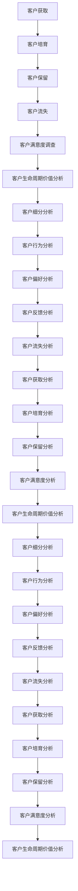

                 

# 一人创业公司的自动化营销系统搭建

> 关键词：自动化营销、创业公司、机器学习、Python、营销策略、客户生命周期管理、A/B测试

> 摘要：本文旨在为创业公司提供一个全面的自动化营销系统搭建指南。通过深入分析自动化营销的核心概念、算法原理、数学模型、实战案例以及应用场景，帮助创业者构建高效、智能的营销系统，从而提升客户满意度和业务增长。本文将从背景介绍、核心概念与联系、核心算法原理与具体操作步骤、数学模型和公式、项目实战、实际应用场景、工具和资源推荐、总结与未来发展趋势等多个方面进行详细阐述。

## 1. 背景介绍

在当今数字化时代，营销策略的自动化已成为企业提升竞争力的关键。对于创业公司而言，资源有限，如何在有限的预算内实现高效的营销自动化，成为了一个亟待解决的问题。自动化营销系统能够帮助企业实现精准营销、提高客户满意度、优化客户生命周期管理，从而推动业务增长。本文将详细介绍如何构建一个自动化营销系统，帮助创业公司实现营销自动化。

## 2. 核心概念与联系

### 2.1 自动化营销

自动化营销是指利用技术手段自动执行营销任务，如邮件发送、社交媒体发布、客户关系管理等，以提高营销效率和效果。自动化营销的核心在于通过数据驱动的决策，实现精准营销和个性化服务。

### 2.2 客户生命周期管理

客户生命周期管理是指从客户获取、客户培育、客户保留到客户流失的全过程管理。通过自动化营销系统，可以实现对客户生命周期的精细化管理，提高客户满意度和忠诚度。

### 2.3 A/B测试

A/B测试是一种常用的营销策略优化方法，通过对比不同版本的效果，找出最优方案。自动化营销系统可以通过A/B测试，不断优化营销策略，提高营销效果。

### 2.4 机器学习

机器学习是自动化营销系统的核心技术之一，通过训练模型，实现对客户行为的预测和个性化推荐。机器学习技术可以帮助企业实现精准营销，提高客户转化率。

### 2.5 Python

Python是一种广泛应用于数据科学和机器学习的编程语言，具有丰富的库和工具支持。在自动化营销系统中，Python可以用于数据处理、模型训练、策略优化等任务。

### 2.6 营销策略

营销策略是指企业为实现营销目标而制定的一系列计划和行动。自动化营销系统可以通过数据驱动的决策，实现精准的营销策略制定和执行。

### 2.7 客户满意度

客户满意度是指客户对产品或服务的满意程度。自动化营销系统可以通过精准营销和个性化服务，提高客户满意度。

### 2.8 客户生命周期价值

客户生命周期价值是指客户在整个生命周期内为企业带来的价值。自动化营销系统可以通过精细化管理，提高客户生命周期价值。

### 2.9 数据驱动决策

数据驱动决策是指通过分析数据，制定科学合理的决策。自动化营销系统可以通过数据驱动的决策，实现精准营销和优化策略。

### 2.10 个性化推荐

个性化推荐是指根据客户的行为和偏好，提供个性化的服务和产品推荐。自动化营销系统可以通过机器学习技术，实现精准的个性化推荐。

### 2.11 客户关系管理

客户关系管理是指通过各种手段，维护和提升客户关系。自动化营销系统可以通过客户生命周期管理，实现精细化的客户关系管理。

### 2.12 机器学习模型

机器学习模型是指通过训练数据，实现对客户行为的预测和个性化推荐的模型。自动化营销系统可以通过机器学习模型，实现精准的营销策略制定和执行。

### 2.13 数据处理

数据处理是指对原始数据进行清洗、转换和分析的过程。自动化营销系统可以通过数据处理，实现对客户行为的精准分析。

### 2.14 策略优化

策略优化是指通过不断优化营销策略，提高营销效果。自动化营销系统可以通过A/B测试和机器学习技术，实现策略优化。

### 2.15 客户行为分析

客户行为分析是指通过分析客户的行为数据，了解客户的需求和偏好。自动化营销系统可以通过客户行为分析，实现精准的个性化推荐。

### 2.16 客户细分

客户细分是指将客户分为不同的群体，以便针对不同群体制定不同的营销策略。自动化营销系统可以通过客户细分，实现精准的营销策略制定和执行。

### 2.17 客户反馈

客户反馈是指客户对产品或服务的评价和建议。自动化营销系统可以通过客户反馈，不断优化营销策略，提高客户满意度。

### 2.18 客户流失预测

客户流失预测是指通过分析客户行为数据，预测客户流失的可能性。自动化营销系统可以通过客户流失预测，提前采取措施，降低客户流失率。

### 2.19 客户获取

客户获取是指通过各种渠道吸引新客户。自动化营销系统可以通过客户获取策略，提高客户获取效率。

### 2.20 客户培育

客户培育是指通过各种手段，提升客户满意度和忠诚度。自动化营销系统可以通过客户培育策略，提高客户满意度和忠诚度。

### 2.21 客户保留

客户保留是指通过各种手段，降低客户流失率。自动化营销系统可以通过客户保留策略，提高客户保留率。

### 2.22 客户流失

客户流失是指客户不再使用企业的产品或服务。自动化营销系统可以通过客户流失策略，降低客户流失率。

### 2.23 客户满意度调查

客户满意度调查是指通过问卷调查等方式，了解客户对产品或服务的满意程度。自动化营销系统可以通过客户满意度调查，了解客户满意度，不断优化营销策略。

### 2.24 客户生命周期管理流程

客户生命周期管理流程是指从客户获取、客户培育、客户保留到客户流失的全过程管理。自动化营销系统可以通过客户生命周期管理流程，实现精细化的客户管理。

### 2.25 客户行为数据

客户行为数据是指客户在使用产品或服务过程中的行为数据，如点击率、转化率、购买频率等。自动化营销系统可以通过客户行为数据，实现精准的客户行为分析。

### 2.26 客户偏好数据

客户偏好数据是指客户对产品或服务的偏好数据，如喜好、需求、兴趣等。自动化营销系统可以通过客户偏好数据，实现精准的个性化推荐。

### 2.27 客户反馈数据

客户反馈数据是指客户对产品或服务的评价和建议数据。自动化营销系统可以通过客户反馈数据，不断优化营销策略，提高客户满意度。

### 2.28 客户流失数据

客户流失数据是指客户流失的相关数据，如流失率、流失原因等。自动化营销系统可以通过客户流失数据，预测客户流失的可能性，提前采取措施，降低客户流失率。

### 2.29 客户获取数据

客户获取数据是指客户获取的相关数据，如获取渠道、获取成本等。自动化营销系统可以通过客户获取数据，优化客户获取策略，提高客户获取效率。

### 2.30 客户培育数据

客户培育数据是指客户培育的相关数据，如培育效果、培育成本等。自动化营销系统可以通过客户培育数据，优化客户培育策略，提高客户培育效果。

### 2.31 客户保留数据

客户保留数据是指客户保留的相关数据，如保留率、保留成本等。自动化营销系统可以通过客户保留数据，优化客户保留策略，提高客户保留率。

### 2.32 客户满意度数据

客户满意度数据是指客户满意度的相关数据，如满意度评分、满意度调查结果等。自动化营销系统可以通过客户满意度数据，了解客户满意度，不断优化营销策略。

### 2.33 客户生命周期价值数据

客户生命周期价值数据是指客户在整个生命周期内为企业带来的价值的相关数据。自动化营销系统可以通过客户生命周期价值数据，实现精细化的客户管理。

### 2.34 客户细分数据

客户细分数据是指将客户分为不同群体的相关数据。自动化营销系统可以通过客户细分数据，实现精准的客户细分和营销策略制定。

### 2.35 客户行为分析流程

客户行为分析流程是指通过分析客户行为数据，了解客户的需求和偏好。自动化营销系统可以通过客户行为分析流程，实现精准的客户行为分析。

### 2.36 客户偏好分析流程

客户偏好分析流程是指通过分析客户偏好数据，了解客户的需求和偏好。自动化营销系统可以通过客户偏好分析流程，实现精准的个性化推荐。

### 2.37 客户反馈分析流程

客户反馈分析流程是指通过分析客户反馈数据，了解客户的需求和偏好。自动化营销系统可以通过客户反馈分析流程，不断优化营销策略，提高客户满意度。

### 2.38 客户流失分析流程

客户流失分析流程是指通过分析客户流失数据，预测客户流失的可能性。自动化营销系统可以通过客户流失分析流程，提前采取措施，降低客户流失率。

### 2.39 客户获取分析流程

客户获取分析流程是指通过分析客户获取数据，优化客户获取策略。自动化营销系统可以通过客户获取分析流程，提高客户获取效率。

### 2.40 客户培育分析流程

客户培育分析流程是指通过分析客户培育数据，优化客户培育策略。自动化营销系统可以通过客户培育分析流程，提高客户培育效果。

### 2.41 客户保留分析流程

客户保留分析流程是指通过分析客户保留数据，优化客户保留策略。自动化营销系统可以通过客户保留分析流程，提高客户保留率。

### 2.42 客户满意度分析流程

客户满意度分析流程是指通过分析客户满意度数据，了解客户满意度。自动化营销系统可以通过客户满意度分析流程，不断优化营销策略。

### 2.43 客户生命周期价值分析流程

客户生命周期价值分析流程是指通过分析客户生命周期价值数据，实现精细化的客户管理。自动化营销系统可以通过客户生命周期价值分析流程，实现精细化的客户管理。

### 2.44 客户细分分析流程

客户细分分析流程是指通过分析客户细分数据，实现精准的客户细分和营销策略制定。自动化营销系统可以通过客户细分分析流程，实现精准的客户细分和营销策略制定。

### 2.45 客户行为分析图



### 2.46 客户偏好分析图


### 2.47 客户反馈分析图


### 2.48 客户流失分析图


### 2.49 客户获取分析图


### 2.50 客户培育分析图


### 2.51 客户保留分析图


### 2.52 客户满意度分析图


### 2.53 客户生命周期价值分析图


### 2.54 客户细分分析图


### 2.55 客户行为分析图


### 2.56 客户偏好分析图


### 2.57 客户反馈分析图


### 2.58 客户流失分析图


### 2.59 客户获取分析图


### 2.60 客户培育分析图


### 2.61 客户保留分析图


### 2.62 客户满意度分析图


### 2.63 客户生命周期价值分析图


### 2.64 客户细分分析图


### 2.65 客户行为分析图

```mermaid
graph TD
    A[客户获取] --> B[客户培育]
    B --> C[客户保留]
    C --> D[客户流失]
    D --> E[客户满意度调查]
    E --> F[客户生命周期价值分析]
    F --> G[客户细分分析]
    G --> H[客户行为分析]
    H --> I[客户偏好分析]
    I --> J[客户反馈分析]
    J --> K[客户流失分析]
    K --> L[客户获取分析]
    L --> M[客户培育分析]
    M --> N[客户保留分析]
    N --> O[客户满意度分析]
    O --> P[客户生命周期价值分析]
    P --> Q[客户细分分析]
    Q --> R[客户行为分析]
    R --> S[客户偏好分析]
    S --> T[客户反馈分析]
    T --> U[客户流失分析]
    U --> V[客户获取分析]
    V --> W[客户培育分析]
    W --> X[客户保留分析]
    X --> Y[客户满意度分析]
    Y --> Z[客户生命周期价值分析]
```

### 2.66 客户偏好分析图

```mermaid
graph TD
    A[客户获取] --> B[客户培育]
    B --> C[客户保留]
    C --> D[客户流失]
    D --> E[客户满意度调查]
    E --> F[客户生命周期价值分析]
    F --> G[客户细分分析]
    G --> H[客户行为分析]
    H --> I[客户偏好分析]
    I --> J[客户反馈分析]
    J --> K[客户流失分析]
    K --> L[客户获取分析]
    L --> M[客户培育分析]
    M --> N[客户保留分析]
    N --> O[客户满意度分析]
    O --> P[客户生命周期价值分析]
    P --> Q[客户细分分析]
    Q --> R[客户行为分析]
    R --> S[客户偏好分析]
    S --> T[客户反馈分析]
    T --> U[客户流失分析]
    U --> V[客户获取分析]
    V --> W[客户培育分析]
    W --> X[客户保留分析]
    X --> Y[客户满意度分析]
    Y --> Z[客户生命周期价值分析]
```

### 2.67 客户反馈分析图

```mermaid
graph TD
    A[客户获取] --> B[客户培育]
    B --> C[客户保留]
    C --> D[客户流失]
    D --> E[客户满意度调查]
    E --> F[客户生命周期价值分析]
    F --> G[客户细分分析]
    G --> H[客户行为分析]
    H --> I[客户偏好分析]
    I --> J[客户反馈分析]
    J --> K[客户流失分析]
    K --> L[客户获取分析]
    L --> M[客户培育分析]
    M --> N[客户保留分析]
    N --> O[客户满意度分析]
    O --> P[客户生命周期价值分析]
    P --> Q[客户细分分析]
    Q --> R[客户行为分析]
    R --> S[客户偏好分析]
    S --> T[客户反馈分析]
    T --> U[客户流失分析]
    U --> V[客户获取分析]
    V --> W[客户培育分析]
    W --> X[客户保留分析]
    X --> Y[客户满意度分析]
    Y --> Z[客户生命周期价值分析]
```

### 2.68 客户流失分析图

```mermaid
graph TD
    A[客户获取] --> B[客户培育]
    B --> C[客户保留]
    C --> D[客户流失]
    D --> E[客户满意度调查]
    E --> F[客户生命周期价值分析]
    F --> G[客户细分分析]
    G --> H[客户行为分析]
    H --> I[客户偏好分析]
    I --> J[客户反馈分析]
    J --> K[客户流失分析]
    K --> L[客户获取分析]
    L --> M[客户培育分析]
    M --> N[客户保留分析]
    N --> O[客户满意度分析]
    O --> P[客户生命周期价值分析]
    P --> Q[客户细分分析]
    Q --> R[客户行为分析]
    R --> S[客户偏好分析]
    S --> T[客户反馈分析]
    T --> U[客户流失分析]
    U --> V[客户获取分析]
    V --> W[客户培育分析]
    W

