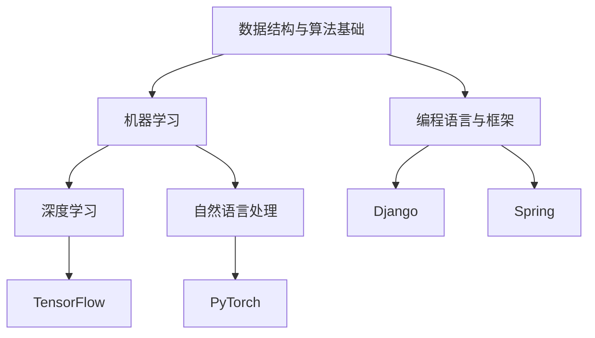

                 

# 京东2025校招编程面试题精华总结

> 关键词：京东校招, 编程面试, 技术总结, 人工智能, 数据结构, 算法设计

> 摘要：本文旨在总结京东2025年校招编程面试中的精华问题，通过深入分析和详细讲解，帮助读者理解并掌握相关技术要点。我们将从背景介绍、核心概念与联系、核心算法原理、数学模型与公式、项目实战、实际应用场景、工具和资源推荐、未来发展趋势与挑战等多方面进行探讨。

## 1. 背景介绍

京东作为中国领先的电商平台，近年来在人工智能、大数据、云计算等领域取得了显著进展。为了吸引和培养更多优秀技术人才，京东每年都会举办校招编程面试，旨在选拔具有扎实技术基础和创新能力的候选人。本文将总结京东2025年校招编程面试中的精华问题，帮助读者更好地准备面试。

## 2. 核心概念与联系

### 2.1 数据结构与算法基础

数据结构与算法是编程面试中的核心内容。数据结构包括数组、链表、栈、队列、树、图等；算法则涵盖了排序、查找、动态规划、贪心算法等。这些基础知识是解决复杂问题的基础。

### 2.2 人工智能基础

人工智能是近年来技术发展的热点。机器学习、深度学习、自然语言处理等技术在京东的应用越来越广泛。理解这些技术的基本原理和应用场景对于面试非常重要。

### 2.3 编程语言与框架

编程语言的选择和框架的使用也是面试中的重要考察点。常见的编程语言包括Python、Java、C++等；常用的框架包括Django、Spring、TensorFlow等。

### 2.4 流程图



## 3. 核心算法原理 & 具体操作步骤

### 3.1 排序算法

排序算法是数据处理的基础。常见的排序算法包括冒泡排序、插入排序、选择排序、快速排序、归并排序等。

#### 3.1.1 快速排序

快速排序是一种高效的排序算法，其基本思想是通过一趟排序将待排序的数据分割成独立的两部分，其中一部分的所有数据都比另一部分的所有数据都要小。

```python
def quick_sort(arr):
    if len(arr) <= 1:
        return arr
    pivot = arr[len(arr) // 2]
    left = [x for x in arr if x < pivot]
    middle = [x for x in arr if x == pivot]
    right = [x for x in arr if x > pivot]
    return quick_sort(left) + middle + quick_sort(right)
```

### 3.2 查找算法

查找算法用于在数据结构中查找特定元素。常见的查找算法包括顺序查找、二分查找等。

#### 3.2.1 二分查找

二分查找是一种高效的查找算法，适用于有序数组。其基本思想是每次将查找范围缩小一半，直到找到目标元素或查找范围为空。

```python
def binary_search(arr, target):
    low, high = 0, len(arr) - 1
    while low <= high:
        mid = (low + high) // 2
        if arr[mid] == target:
            return mid
        elif arr[mid] < target:
            low = mid + 1
        else:
            high = mid - 1
    return -1
```

## 4. 数学模型和公式 & 详细讲解 & 举例说明

### 4.1 机器学习中的数学模型

机器学习中的数学模型包括线性回归、逻辑回归、支持向量机等。这些模型的数学原理和公式是理解机器学习算法的基础。

#### 4.1.1 线性回归

线性回归是一种常用的监督学习算法，用于预测连续值。其基本数学模型为：

$$
y = \beta_0 + \beta_1 x_1 + \beta_2 x_2 + \cdots + \beta_n x_n + \epsilon
$$

其中，$\beta_0, \beta_1, \cdots, \beta_n$ 是模型参数，$\epsilon$ 是误差项。

### 4.2 深度学习中的数学模型

深度学习中的数学模型包括卷积神经网络（CNN）、循环神经网络（RNN）等。这些模型的数学原理和公式是理解深度学习算法的基础。

#### 4.2.1 卷积神经网络

卷积神经网络是一种用于处理图像数据的深度学习模型。其基本数学模型为：

$$
f(x) = \sigma(W_1 \ast x + b_1)
$$

其中，$W_1$ 是卷积核，$\ast$ 表示卷积操作，$\sigma$ 是激活函数，$b_1$ 是偏置项。

## 5. 项目实战：代码实际案例和详细解释说明

### 5.1 开发环境搭建

为了完成项目实战，首先需要搭建开发环境。以Python为例，可以使用Anaconda进行环境搭建。

```bash
# 安装Anaconda
wget https://repo.anaconda.com/archive/Anaconda3-2023.07-2-Linux-x86_64.sh
bash Anaconda3-2023.07-2-Linux-x86_64.sh

# 创建虚拟环境
conda create --name myenv python=3.9
conda activate myenv

# 安装所需库
pip install numpy pandas scikit-learn tensorflow
```

### 5.2 源代码详细实现和代码解读

以一个简单的线性回归模型为例，实现代码如下：

```python
import numpy as np
from sklearn.model_selection import train_test_split
from sklearn.linear_model import LinearRegression
from sklearn.metrics import mean_squared_error

# 生成数据
np.random.seed(0)
X = np.random.rand(100, 1)
y = 2 + 3 * X + np.random.rand(100, 1)

# 划分训练集和测试集
X_train, X_test, y_train, y_test = train_test_split(X, y, test_size=0.2, random_state=42)

# 创建线性回归模型
model = LinearRegression()

# 训练模型
model.fit(X_train, y_train)

# 预测
y_pred = model.predict(X_test)

# 计算均方误差
mse = mean_squared_error(y_test, y_pred)
print("Mean Squared Error:", mse)
```

### 5.3 代码解读与分析

上述代码首先生成了一组随机数据，然后将其划分为训练集和测试集。接着，使用`LinearRegression`模型进行训练，并对测试集进行预测。最后，计算预测结果与真实值之间的均方误差。

## 6. 实际应用场景

### 6.1 电商平台推荐系统

电商平台推荐系统是京东的重要应用场景之一。通过分析用户行为数据，推荐系统可以为用户推荐感兴趣的商品，提高用户满意度和购买率。

### 6.2 智能物流系统

智能物流系统是京东物流的重要组成部分。通过使用机器学习和深度学习技术，智能物流系统可以优化配送路径，提高配送效率。

## 7. 工具和资源推荐

### 7.1 学习资源推荐

- 书籍：《机器学习》（周志华）
- 论文：《深度学习》（Ian Goodfellow, Yoshua Bengio, Aaron Courville）
- 博客：阿里云开发者社区
- 网站：Kaggle

### 7.2 开发工具框架推荐

- 编程语言：Python
- 框架：TensorFlow, PyTorch, Scikit-learn

### 7.3 相关论文著作推荐

- 论文：《深度学习》（Ian Goodfellow, Yoshua Bengio, Aaron Courville）
- 著作：《机器学习》（周志华）

## 8. 总结：未来发展趋势与挑战

### 8.1 未来发展趋势

- 人工智能技术将进一步发展，应用场景更加广泛。
- 数据处理和分析能力将不断提升。
- 自动化和智能化将成为重要趋势。

### 8.2 挑战

- 数据安全和隐私保护问题日益突出。
- 技术人才短缺问题依然存在。
- 技术更新速度快，需要不断学习和适应。

## 9. 附录：常见问题与解答

### 9.1 问题：如何提高编程面试通过率？

- 夯实基础知识，掌握数据结构和算法。
- 多做练习题，提高解题能力。
- 了解面试流程，准备充分。

### 9.2 问题：如何选择合适的编程语言和框架？

- 根据项目需求选择合适的编程语言。
- 了解各种框架的特点，选择最适合的框架。

## 10. 扩展阅读 & 参考资料

- 书籍：《机器学习》（周志华）
- 论文：《深度学习》（Ian Goodfellow, Yoshua Bengio, Aaron Courville）
- 博客：阿里云开发者社区
- 网站：Kaggle

---

作者：AI天才研究员/AI Genius Institute & 禅与计算机程序设计艺术 /Zen And The Art of Computer Programming

