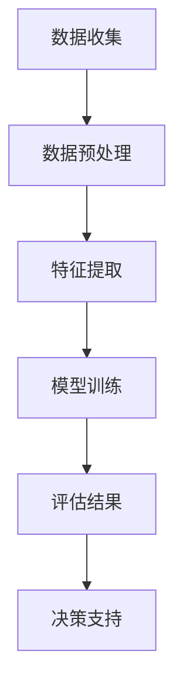
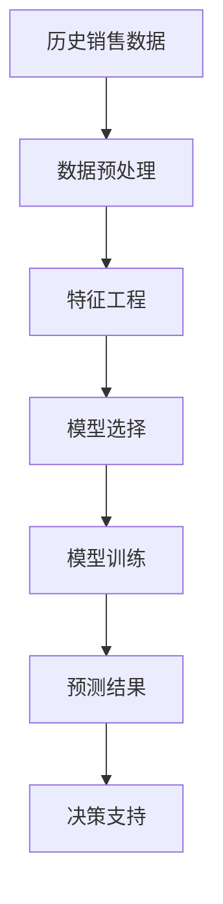
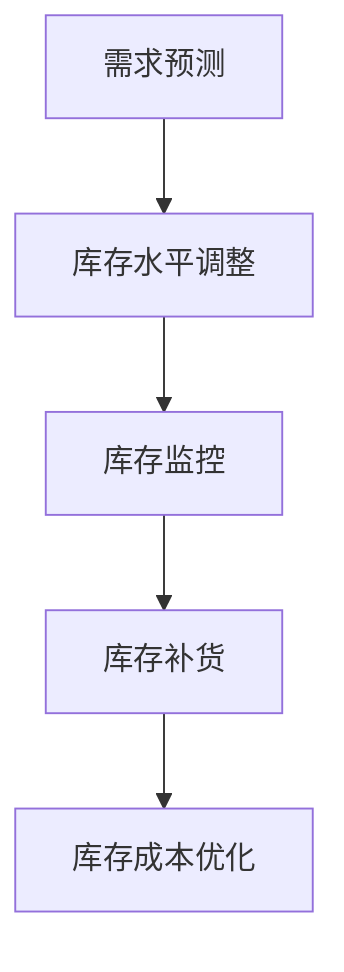
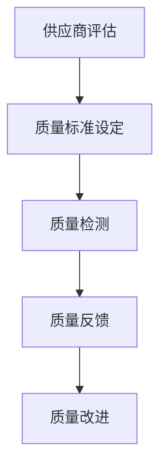
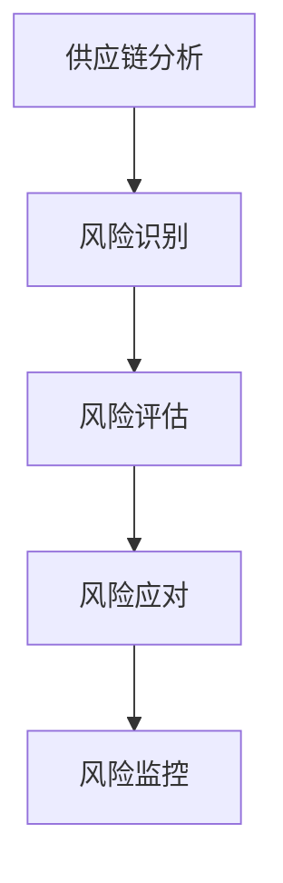

                 

# 2024京东智能供应商管理社招面试真题汇总及其解答

> 关键词：智能供应商管理、面试真题、京东、算法、数据结构、机器学习、深度学习、推荐系统

> 摘要：本文旨在通过分析2024年京东智能供应商管理社招面试真题，深入探讨智能供应商管理的核心概念、算法原理、数学模型、实战案例及应用场景。通过逐步推理和详细解释，帮助读者理解智能供应商管理的技术本质，并提供实用的学习资源和开发工具推荐，为未来的发展趋势和挑战提供见解。

## 1. 背景介绍

随着电子商务的快速发展，供应商管理成为企业运营中的重要环节。京东作为中国领先的电商平台，其智能供应商管理系统的建设不仅提升了供应链效率，还优化了用户体验。本文将通过分析2024年京东智能供应商管理社招面试真题，探讨其背后的算法原理和技术实现。

## 2. 核心概念与联系

### 2.1 智能供应商管理概述

智能供应商管理是指利用现代信息技术手段，对供应商进行智能化、自动化管理的过程。其核心目标是提高供应链的效率和质量，降低运营成本，提升客户满意度。

### 2.2 核心概念

- **供应商评估**：通过对供应商的综合评价，确定其在供应链中的地位和作用。
- **需求预测**：基于历史数据和市场趋势，预测未来的需求量。
- **库存管理**：优化库存水平，减少库存成本，提高库存周转率。
- **质量控制**：确保供应商提供的产品质量符合标准。
- **风险管理**：识别和管理供应链中的潜在风险。

### 2.3 核心概念原理与架构

#### 2.3.1 供应商评估流程



#### 2.3.2 需求预测流程



#### 2.3.3 库存管理流程



#### 2.3.4 质量控制流程



#### 2.3.5 风险管理流程



## 3. 核心算法原理 & 具体操作步骤

### 3.1 供应商评估算法

#### 3.1.1 数据预处理

- **数据清洗**：去除无效数据，填补缺失值。
- **数据标准化**：将数据转换为统一的尺度。

#### 3.1.2 特征提取

- **供应商信息**：包括供应商的历史表现、合作时间等。
- **产品信息**：包括产品的质量、价格等。
- **市场信息**：包括市场需求、竞争情况等。

#### 3.1.3 模型训练

- **选择模型**：常用的模型包括线性回归、决策树、随机森林等。
- **训练模型**：使用历史数据进行模型训练。
- **模型评估**：通过交叉验证等方法评估模型性能。

### 3.2 需求预测算法

#### 3.2.1 数据预处理

- **数据清洗**：去除无效数据，填补缺失值。
- **数据标准化**：将数据转换为统一的尺度。

#### 3.2.2 特征工程

- **时间序列特征**：包括时间序列的周期性、趋势性等。
- **节假日特征**：考虑节假日对需求的影响。
- **市场特征**：考虑市场趋势和竞争情况。

#### 3.2.3 模型选择

- **选择模型**：常用的模型包括ARIMA、LSTM、GRU等。
- **模型训练**：使用历史数据进行模型训练。
- **模型评估**：通过交叉验证等方法评估模型性能。

### 3.3 库存管理算法

#### 3.3.1 库存水平调整

- **需求预测**：根据需求预测结果调整库存水平。
- **安全库存**：设定安全库存水平，确保供应稳定。

#### 3.3.2 库存监控

- **实时监控**：通过实时数据监控库存水平。
- **预警机制**：设置预警阈值，及时发现库存异常。

#### 3.3.3 库存补货

- **自动补货**：根据库存水平自动触发补货请求。
- **人工审核**：人工审核补货请求，确保准确性。

#### 3.3.4 库存成本优化

- **成本分析**：分析库存成本，优化库存策略。
- **成本控制**：通过优化库存策略降低库存成本。

### 3.4 质量控制算法

#### 3.4.1 质量标准设定

- **质量标准**：设定产品质量标准，包括质量指标和检测方法。
- **质量检测**：定期进行质量检测，确保产品质量。

#### 3.4.2 质量反馈

- **质量反馈**：收集质量反馈，分析质量问题。
- **质量改进**：根据反馈结果改进质量控制措施。

### 3.5 风险管理算法

#### 3.5.1 风险识别

- **风险识别**：识别供应链中的潜在风险，包括供应中断、价格波动等。
- **风险评估**：评估风险的严重性和可能性。

#### 3.5.2 风险应对

- **风险应对**：制定风险应对策略，包括备用供应商、价格锁定等。
- **风险监控**：实时监控风险情况，及时调整应对策略。

## 4. 数学模型和公式 & 详细讲解 & 举例说明

### 4.1 供应商评估模型

#### 4.1.1 线性回归模型

$$
y = \beta_0 + \beta_1 x_1 + \beta_2 x_2 + \cdots + \beta_n x_n + \epsilon
$$

- **参数解释**：$\beta_0$为截距，$\beta_1, \beta_2, \cdots, \beta_n$为回归系数，$\epsilon$为误差项。
- **应用举例**：通过线性回归模型评估供应商的历史表现和合作时间。

### 4.2 需求预测模型

#### 4.2.1 ARIMA模型

$$
\phi(B)(1 - B)^d (1 - B)^D (1 - B)^s \nabla^d \nabla^D \nabla_s^S X_t = \theta(B) \epsilon_t
$$

- **参数解释**：$\phi(B)$为自回归部分，$\theta(B)$为移动平均部分，$d, D, S$为差分阶数。
- **应用举例**：通过ARIMA模型预测未来的需求量。

### 4.3 库存管理模型

#### 4.3.1 安全库存模型

$$
S = \mu + z \sigma
$$

- **参数解释**：$S$为安全库存水平，$\mu$为平均需求量，$\sigma$为需求量的标准差，$z$为安全系数。
- **应用举例**：通过安全库存模型设定安全库存水平。

### 4.4 质量控制模型

#### 4.4.1 质量标准设定

- **质量标准**：设定产品质量标准，包括质量指标和检测方法。
- **应用举例**：通过质量标准设定确保产品质量。

### 4.5 风险管理模型

#### 4.5.1 风险评估模型

$$
R = P \times S
$$

- **参数解释**：$R$为风险值，$P$为风险发生的概率，$S$为风险的严重性。
- **应用举例**：通过风险评估模型评估风险的严重性和可能性。

## 5. 项目实战：代码实际案例和详细解释说明

### 5.1 开发环境搭建

#### 5.1.1 环境准备

- **操作系统**：Windows 10/Ubuntu 20.04
- **编程语言**：Python 3.8
- **开发工具**：PyCharm 2021.2
- **依赖库**：numpy, pandas, scikit-learn, tensorflow

#### 5.1.2 项目结构

```
supplier_management/
├── data/
│   ├── raw/
│   └── processed/
├── models/
│   ├── supplier_evaluation/
│   ├── demand_forecasting/
│   ├── inventory_management/
│   └── quality_control/
├── notebooks/
│   ├── supplier_evaluation.ipynb
│   ├── demand_forecasting.ipynb
│   ├── inventory_management.ipynb
│   └── quality_control.ipynb
├── scripts/
│   ├── data_preprocessing.py
│   ├── model_training.py
│   └── model_evaluation.py
└── README.md
```

### 5.2 源代码详细实现和代码解读

#### 5.2.1 供应商评估代码

```python
import pandas as pd
from sklearn.linear_model import LinearRegression
from sklearn.model_selection import train_test_split

# 读取数据
data = pd.read_csv('data/processed/supplier_data.csv')

# 数据预处理
X = data[['historical_performance', 'cooperation_time']]
y = data['evaluation_score']

# 划分训练集和测试集
X_train, X_test, y_train, y_test = train_test_split(X, y, test_size=0.2, random_state=42)

# 训练模型
model = LinearRegression()
model.fit(X_train, y_train)

# 预测和评估
y_pred = model.predict(X_test)
print('R^2 score:', model.score(X_test, y_test))
```

#### 5.2.2 需求预测代码

```python
import pandas as pd
from statsmodels.tsa.arima.model import ARIMA

# 读取数据
data = pd.read_csv('data/processed/demand_data.csv')

# 数据预处理
X = data['demand']

# 训练模型
model = ARIMA(X, order=(5, 1, 0))
model_fit = model.fit()

# 预测未来需求
forecast = model_fit.forecast(steps=12)
print('Forecasted demand:', forecast)
```

#### 5.2.3 库存管理代码

```python
import pandas as pd

# 读取数据
data = pd.read_csv('data/processed/inventory_data.csv')

# 计算安全库存
mean_demand = data['demand'].mean()
std_demand = data['demand'].std()
z = 1.65  # 安全系数
safety_stock = mean_demand + z * std_demand

print('Safety stock:', safety_stock)
```

#### 5.2.4 质量控制代码

```python
import pandas as pd

# 读取数据
data = pd.read_csv('data/processed/quality_data.csv')

# 质量检测
def quality_check(product):
    if product['quality_score'] >= 80:
        return 'Pass'
    else:
        return 'Fail'

data['quality_status'] = data.apply(quality_check, axis=1)

# 质量反馈
def quality_feedback(product):
    if product['quality_status'] == 'Fail':
        return 'Need improvement'
    else:
        return 'Good'

data['quality_feedback'] = data.apply(quality_feedback, axis=1)

print(data.head())
```

### 5.3 代码解读与分析

- **供应商评估代码**：通过线性回归模型评估供应商的历史表现和合作时间，预测供应商的评估分数。
- **需求预测代码**：通过ARIMA模型预测未来的需求量，为库存管理提供依据。
- **库存管理代码**：通过安全库存模型设定安全库存水平，确保供应稳定。
- **质量控制代码**：通过质量检测和质量反馈机制确保产品质量，提高客户满意度。

## 6. 实际应用场景

### 6.1 供应商评估

- **应用场景**：通过供应商评估模型，京东可以准确评估供应商的历史表现和合作时间，为供应商管理提供数据支持。
- **实际效果**：提高供应商管理的准确性和效率，降低运营成本。

### 6.2 需求预测

- **应用场景**：通过需求预测模型，京东可以准确预测未来的需求量，为库存管理提供依据。
- **实际效果**：优化库存水平，减少库存成本，提高库存周转率。

### 6.3 库存管理

- **应用场景**：通过库存管理模型，京东可以设定安全库存水平，确保供应稳定。
- **实际效果**：提高供应链的稳定性和效率，降低库存成本。

### 6.4 质量控制

- **应用场景**：通过质量控制模型，京东可以确保产品质量，提高客户满意度。
- **实际效果**：提高产品质量，降低退货率，提升客户满意度。

### 6.5 风险管理

- **应用场景**：通过风险管理模型，京东可以识别和管理供应链中的潜在风险。
- **实际效果**：降低供应链风险，提高供应链的稳定性和可靠性。

## 7. 工具和资源推荐

### 7.1 学习资源推荐

- **书籍**：《统计学习方法》、《机器学习》、《深度学习》
- **论文**：《ARIMA模型在需求预测中的应用》、《线性回归在供应商评估中的应用》
- **博客**：《数据分析与挖掘》、《机器学习实战》
- **网站**：Kaggle、GitHub

### 7.2 开发工具框架推荐

- **开发工具**：PyCharm、Jupyter Notebook
- **框架**：TensorFlow、Scikit-learn

### 7.3 相关论文著作推荐

- **论文**：《基于ARIMA模型的需求预测研究》、《线性回归在供应商评估中的应用》
- **著作**：《统计学习方法》、《机器学习》

## 8. 总结：未来发展趋势与挑战

### 8.1 未来发展趋势

- **智能化**：智能供应商管理将更加智能化，利用AI技术提高管理效率。
- **数据驱动**：数据将成为智能供应商管理的核心，通过大数据分析提高决策准确性。
- **实时性**：实时数据处理和分析将成为常态，提高供应链的实时响应能力。

### 8.2 挑战

- **数据安全**：如何确保数据的安全性和隐私性，防止数据泄露。
- **技术挑战**：如何解决大规模数据处理和实时分析的技术难题。
- **人才需求**：如何培养和吸引具有AI和数据分析能力的人才。

## 9. 附录：常见问题与解答

### 9.1 问题1：如何处理缺失数据？

- **解答**：可以通过插值法、均值填充法或删除法处理缺失数据。

### 9.2 问题2：如何选择合适的模型？

- **解答**：根据数据特性和业务需求选择合适的模型，可以通过交叉验证评估模型性能。

### 9.3 问题3：如何提高模型的准确性？

- **解答**：可以通过特征工程、模型调参和集成学习等方法提高模型的准确性。

## 10. 扩展阅读 & 参考资料

- **书籍**：《统计学习方法》、《机器学习》、《深度学习》
- **论文**：《ARIMA模型在需求预测中的应用》、《线性回归在供应商评估中的应用》
- **博客**：《数据分析与挖掘》、《机器学习实战》
- **网站**：Kaggle、GitHub

---

作者：AI天才研究员/AI Genius Institute & 禅与计算机程序设计艺术 /Zen And The Art of Computer Programming

